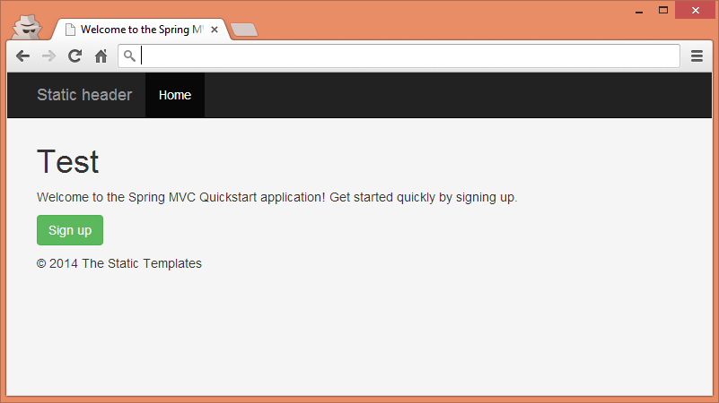
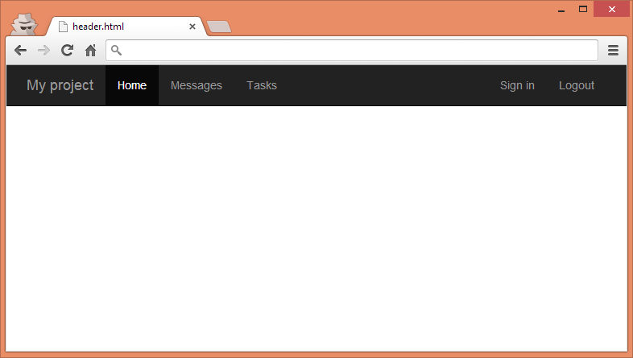
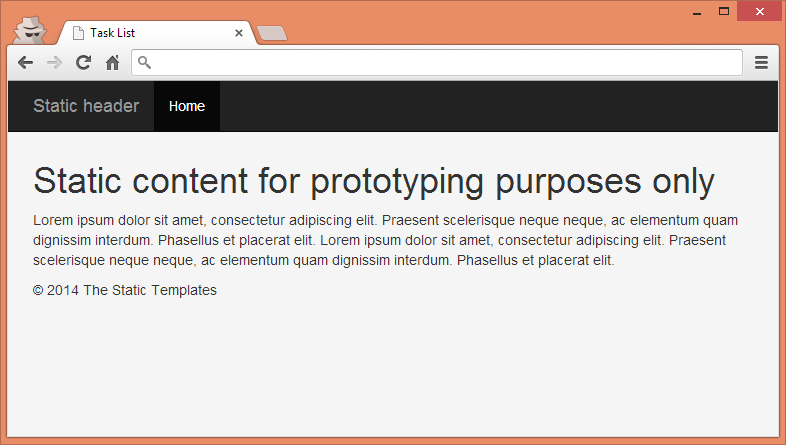
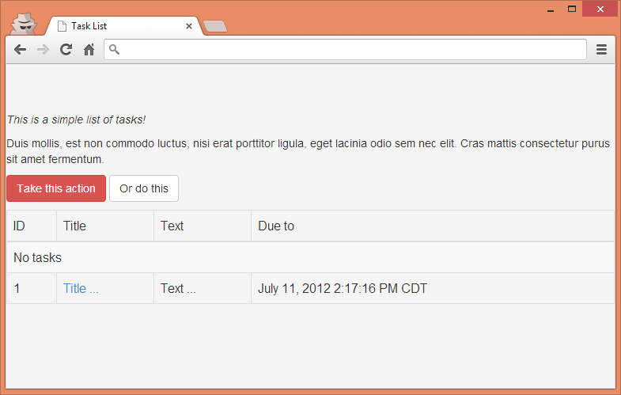

**Note**: this article refers to an older version of Thymeleaf (Thymeleaf 2.1).

Introduction
------------

Usually websites share common page components like the header, footer,
menu and possibly many more. These page components can be used by the
same or different layouts. There are two main styles of organizing
layouts in projects: *include* style and *hierarchical* style. Both
styles can be easily utilized with Thymeleaf without losing its biggest
value: **natural templating**.

### Include-style layouts

In this style pages are built by embedding common page component code
directly within each view to generate the final result. In Thymeleaf
this can be done using **Thymeleaf Standard Layout System**:

```xml
<body>
    <div th:insert="footer :: copy">...</div>
</body>
```

The include-style layouts are pretty simple to understand and implement
and in fact they offer flexibility in developing views, which is their
biggest advantage. The main disadvantage of this solution, though, is
that some code duplication is introduced so modifying the layout of a
large number of views in big applications can become a bit cumbersome.

### Hierarchical-style layouts

In hierarchical style, the templates are usually created with a
parent-child relation, from the more general part (layout) to the most
specific ones (subviews; e.g. page content). Each component of the
template may be included dynamically based on the inclusion and
substitution of template fragments. In Thymeleaf this can be done using
**Thymeleaf Layout Dialect**.

The main advantages of this solution are the reuse of atomic portions of
the view and modular design, whereas the main disadvantage is that much
more configuration is needed in order to use them, so the complexity of
the views is bigger than with Include Style Layouts which are more
"natural" to use.


Example Application
-------------------

All the samples and code fragments presented in this article are
available on GitHub at
[https://github.com/thymeleaf/thymeleafexamples-layouts](https://github.com/thymeleaf/thymeleafexamples-layouts)


Thymeleaf Standard Layout System
--------------------------------

Thymeleaf Standard Layout System offers page fragment inclusion that is
similar to *JSP includes*, with some important improvements over them.

### Basic inclusion with `th:insert` and `th:replace`

Thymeleaf can include parts of other pages as fragments (whereas JSP only includes complete pages) using `th:insert` (it will simply insert the specified fragment as the body of its host tag) or `th:replace` (will actually substitute the host tag by the fragment's). This allows the grouping of fragments into one or several pages. Look at the example.

The `home/homeNotSignedIn.html` template is rendered when the anonymous
user enters the home page of our application.

Class `thymeleafexamples.layouts.home.HomeController`

```java
@Controller
class HomeController {

    @GetMapping("/")
    String index(Principal principal) {
        return principal != null ? "home/homeSignedIn" : "home/homeNotSignedIn";
    }

}
```

Template `home/homeNotSignedIn.html`

```xml
<!DOCTYPE html>
<html>
  <head>
    ...
  </head>
  <body>
    ...
    <div th:replace="fragments/header :: header">
      <!-- ============================================================================ -->
      <!-- This content is only used for static prototyping purposes (natural templates)-->
      <!-- and is therefore entirely optional, as this markup fragment will be included -->
      <!-- from "fragments/header.html" at runtime.                                     -->
      <!-- ============================================================================ -->
      <div class="navbar navbar-inverse navbar-fixed-top">
        <div class="container">
          <div class="navbar-header">
            <a class="navbar-brand" href="#">Static header</a>
          </div>
          <div class="navbar-collapse collapse">
            <ul class="nav navbar-nav">
              <li class="active"><a href="#">Home</a></li>
            </ul>
          </div>
        </div>
      </div>
    </div>
    <div class="container">
      <div class="hero-unit">
        <h1>Test</h1>
        <p>
          Welcome to the Spring MVC Quickstart application!
          Get started quickly by signing up.
        </p>
        <p>
          <a href="/signup" th:href="@{/signup}" class="btn btn-large btn-success">Sign up</a>
        </p>
      </div>
      <div th:replace="fragments/footer :: footer">&copy; 2016 The Static Templates</div>
    </div>
    ...
  </body>
</html>
```

You can open the file directly in a browser:



In the above example, we are building a page that consists of page
header and page footer. In Thymeleaf all fragments can be defined in a
single file (e.g. `fragments.html`) or in a separate files, like in this
particular case.

Let's shortly analyze the inclusion statement:

```xml
<div th:replace="fragments/header :: header">...</div>
```

The first part of the statement, `fragments/header`, is a template name
that we are referencing. This can be a file (like in this example) or it
can reference to the same file either by using the `this` keyword (e.g.
`this :: header`) or without any keyword (e.g. `:: header`). The
expression after double colon is a fragment selector (either fragment
name or *Markup Selector*). As you can also see, the header fragment
contains a markup that is used for static prototyping only.

Header and footer are defined in the following files:

Template `fragments/header.html`

```xml
<!DOCTYPE html>
<html>
  <head>
    ...
  </head>
  <body>
    <div class="navbar navbar-inverse navbar-fixed-top" th:fragment="header">
      <div class="container">
        <div class="navbar-header">
          <button type="button" class="navbar-toggle" data-toggle="collapse" data-target=".nav-collapse">
            <span class="icon-bar"></span>
            <span class="icon-bar"></span>
            <span class="icon-bar"></span>
          </button>
          <a class="navbar-brand" href="#">My project</a>
        </div>
        <div class="navbar-collapse collapse">
          <ul class="nav navbar-nav">
            <li th:classappend="${module == 'home' ? 'active' : ''}">
              <a href="#" th:href="@{/}">Home</a>
            </li>
            <li th:classappend="${module == 'tasks' ? 'active' : ''}">
              <a href="#" th:href="@{/task}">Tasks</a>
            </li>
          </ul>
          <ul class="nav navbar-nav navbar-right">
            <li th:if="${#authorization.expression('!isAuthenticated()')}">
              <a href="/signin" th:href="@{/signin}">
                <span class="glyphicon glyphicon-log-in" aria-hidden="true"></span>&nbsp;Sign in
              </a>
            </li>
            <li th:if="${#authorization.expression('isAuthenticated()')}">
              <a href="/logout" th:href="@{#}" onclick="$('#form').submit();">
                <span class="glyphicon glyphicon-log-out" aria-hidden="true"></span>&nbsp;Logout
              </a>
             <form style="visibility: hidden" id="form" method="post" action="#" th:action="@{/logout}"></form>
            </li>
          </ul>
        </div>
      </div>
    </div>
  </body>
</html>
```

...which we can open directly in a browser:



And template `fragments/footer.html`

```xml
<!DOCTYPE html>
<html>
  <head>
    ...
  </head>
  <body>
    <div th:fragment="footer">
      &copy; 2016 Footer
    </div>
  </body>
</html>
```

Note how that the referenced fragments are specified with `th:fragment`
attributes. This way we can define multiple fragments in one template
file, as it was mentioned earlier.

What is important here, is that all the templates can still be natural
templates and can be viewed in a browser without a running server.

### Including with Markup Selectors

In Thymeleaf, fragments don't need to be explicitly specified using
`th:fragment` at the page they are extracted from. Thymeleaf can select
an arbitrary section of a page as a fragment (even a page living on an
external server) by means of its Markup Selector syntax, similar to XPath
expressions, CSS or jQuery selectors.

```xml
<p th:insert="http://www.thymeleaf.org :: section.description" >...</p>
```

The above code will include a `section` with `class="description"` from
`thymeleaf.org`. 

In order to make it happen, the template engine must be configured with `UrlTemplateResolver`:

```java
@Bean
public SpringTemplateEngine templateEngine() {
    SpringTemplateEngine templateEngine = new SpringTemplateEngine();    
    templateEngine.addTemplateResolver(new UrlTemplateResolver());
    ...
    return templateEngine;
}
```

For the Markup Selector syntax reference checkout this section in Thymeleaf
documentation: [Markup Selector syntax](http://www.thymeleaf.org/doc/tutorials/3.0/usingthymeleaf.html#appendix-c-markup-selector-syntax).

### Using expressions

In `templatename :: selector`, both `templatename` and `selector`
can be fully-featured expressions. In the below example we want to
include different fragments depending on a condition. If the
authenticated user is an Admin, we will show a different footer than for
a regular user:

```xml
<div th:replace="fragments/footer :: ${#authentication.principal.isAdmin()} ? 'footer-admin' : 'footer'">
  &copy; 2016 The Static Templates
</div>
```

`fragments/footer.html` has slightly changed, as we need to have two footers defined:

```xml
<!DOCTYPE html>
<html>
  <head>
    ...
  </head>
  <body>
    <!-- /*  Multiple fragments may be defined in one file */-->
    <div th:fragment="footer">
      &copy; 2016 Footer
    </div>
    <div th:fragment="footer-admin">
      &copy; 2016 Admin Footer
    </div>
  </body>
</html>
```

### Parameterized inclusion

Fragments can specify arguments, just like methods. Whenever they are
explicitly specified with a `th:fragment` attribute, they can provide an
argument signature that can then be filled in with arguments from the
calling `th:insert` or `th:replace` attributes.

Examples talk best. We can use parameterized inclusion in many contexts
but one real life context is displaying messages on different pages of
our application after successful form submission. Let's look at the
signup process in the application:

```java
@PostMapping("signup")
String signup(@Valid @ModelAttribute SignupForm signupForm,
        Errors errors, RedirectAttributes ra) {
    
    if (errors.hasErrors()) {
        return SIGNUP_VIEW_NAME;
    }
    Account account = accountRepository.save(signupForm.createAccount());
    userService.signin(account);
    // see /WEB-INF/i18n/messages.properties and /WEB-INF/views/homeSignedIn.html
    MessageHelper.addSuccessAttribute(ra, "signup.success");
    
    return "redirect:/";
    
}
```

As you can see, after a successful signup the user will be redirected to
the home page with a flash attribute filled in. We want to create a
reusable and parameterized fragment. This can be done as follows:

```xml
<!DOCTYPE html>
<html>
  <head>
    ...
  </head>
  <body>
    <div class="alert alert-dismissable" th:fragment="alert (type, message)" th:assert="${!#strings.isEmpty(type) && !#strings.isEmpty(message)}" th:classappend="'alert-' + ${type}">      
      <button type="button" class="close" data-dismiss="alert" aria-hidden="true">&times;</button>
      <span th:text="${message}">Test</span>
    </div>
  </body>
</html>
```

The above `alert` fragment takes two arguments: `type` and `message`.
The `type` is the message type used for styling a message whereas the
`message` is a text that will be shown to the user. We
ensure that arguments exist and are not empty by using a `th:assert` attribute.

In order to include `alert` in any template we may write the following
code (please note, that the value of a variable can be an expression):

```xml
<div th:replace="fragments/alert :: alert (type='danger', message=${errorMessage})">...</div>
```

Parameterized fragments let developers create functional-like fragments
that are easier to reuse. Read more about parameterized fragments in the
Thymeleaf documentation: [Parameterizable fragment
signatures](http://www.thymeleaf.org/doc/tutorials/3.0/usingthymeleaf.html#parameterizable-fragment-signatures).

### Fragment Expressions

Thymeleaf 3.0 introduced a new type of expression as a part of the general Thymeleaf Standard Expression system: **Fragment Expressions**: 

```xml
    <div th:insert="~{fragments/footer :: footer}">...</div>
```

The idea of this syntax is to be able to use resolved fragments as any other kind of objects in the template execution context for later use:

```xml
<div th:replace="${#authentication.principal.isAdmin()} ? ~{fragments/footer :: footer-admin} : ~{fragments/footer :: footer-admin}">
  &copy; 2016 The Static Templates
</div>
```

Fragment expression allows creating fragments in a way such that they can be enriched with markup coming from the calling templates, resulting in a layout mechanism that is far more flexible than `th:insert` and `th:replace`only.

#### Creating a layout - a container for reusable fragments

The `layout.html` file defines all the fragments that will be used by calling templates:

```xml

```

#### Composing a page from fragments

Having the layout elements of pages defined it is time to include them in some of the pages:

```xml

```

#### Empty fragments

What if we have no additional links or scripts to be passed to the included fragment from a calling template?

```xml

```

#### Including fragments with its current value

No-operation token.

```xml

```

Fragment Expression enables the customization of fragments in ways that until now were only possible using the 3rd party Layout Dialect. See more: [Flexible layouts: beyond mere fragment insertion](http://www.thymeleaf.org/doc/tutorials/3.0/usingthymeleaf.html#flexible-layouts-beyond-mere-fragment-insertion)

### Fragment inclusion from Spring `@Controller`

Fragments can be directly specified from a Spring MVC controller, i.e.
`signup :: signupForm`; which can be useful for AJAX controllers that
return only a small fragment of HTML to the browser. In the example
below, the signup form fragment will be loaded upon AJAX request and the
whole signup view - on regular request:

```java
@RequestMapping(value = "signup")
public String signup(Model model,
        @RequestHeader("X-Requested-With") String requestedWith) {
        
    model.addAttribute(new SignupForm());
    if (AjaxUtils.isAjaxRequest(requestedWith)) {
        return SIGNUP_VIEW_NAME.concat(" :: signupForm");
    }
    return SIGNUP_VIEW_NAME;
    
}
```

The fragment is defined in `signup/signup.html`:

```xml
<!DOCTYPE html>
<html>
  <head>
    ...
  </head>
  <body>
    <form method="post"
          th:action="@{/signup}" th:object="${signupForm}" th:fragment="signupForm">
      ...
    </form>
  </body>
</html>
```

The above fragment is loaded when a new user wants to signup from a home
page. The modal dialog will be shown upon clicking `Signup` button and
the content will be loaded via AJAX call (see
`home/homeNotSignedIn.html`).

### References

Please check Thymeleaf documentation that describes this topic very
thoroughly.

* [Template Layout](http://www.thymeleaf.org/doc/tutorials/3.0/usingthymeleaf.html#template-layout).
* [Fragment Expressions](http://www.thymeleaf.org/doc/tutorials/3.0/usingthymeleaf.html#fragment-specification-syntax)

### Thymol

When a Thymeleaf template is used as a static prototype, we cannot see
the fragments we are including using the `th:insert/th:replace` host
tags. We can only see the fragments aside, opening their own template
documents.

However, there is a way to see the real fragments included into our
pages while prototyping. This can be done using
[Thymol](http://www.thymeleaf.org/ecosystem.html#thymol), an unofficial
JavaScript library that is an implementation of Thymeleaf's standard
fragment inclusion functionality, providing static support for some
Thymeleaf attributes like `th:insert` or `th:replace`, conditional
display with `th:if`/`th:unless`, etc.

As Thymol's author states: *Thymol was created in order to provide a
more accurate static representation of Thymeleaf's dynamic templating
capabilities by offering support for Thymeleaf attributes through a
statically accessible javascript library*

Thymol documentation and examples can be found on the official project
site here: [Thymol](http://www.thymoljs.org/).

Thymeleaf Layout Dialect
------------------------

[Layout Dialect](https://github.com/ultraq/thymeleaf-layout-dialect)
gives people the possibility of using hierarchical approach, but from a
Thymeleaf-only perspective and without the need to use external
libraries, like Apache Tiles. Thymeleaf Layout Dialect uses
layout/decorator templates to style the content, as well as it can pass
entire fragment elements to included pages. Concepts of this library are
similar to [SiteMesh](http://wiki.sitemesh.org) or JSF with Facelets.

### Configuration

To get started with Layout Dialect we need to include it into the
`pom.xml`. The dependency is:

```xml
<dependency>
  <groupId>nz.net.ultraq.thymeleaf</groupId>
  <artifactId>thymeleaf-layout-dialect</artifactId>
  <version>2.0.5</version>
</dependency>
```

We will also need to configure the integration by adding an additional
dialect to our template engine:

```java
@Bean
public SpringTemplateEngine templateEngine() {
    SpringTemplateEngine templateEngine = new SpringTemplateEngine();
    ...
    templateEngine.addDialect(new LayoutDialect());
    return templateEngine;
}
```

No other changes are required.

### Creating a layout

The layout file is defined in `/WEB-INF/views/task/layout.html`:

```xml
<!DOCTYPE html>
<html>
  <head>
    <!--/*  Each token will be replaced by their respective titles in the resulting page. */-->
    <title layout:title-pattern="$LAYOUT_TITLE - $CONTENT_TITLE">Task List</title>
    ...
  </head>
  <body>
    <!--/* Standard layout can be mixed with Layout Dialect */-->
    <div th:replace="fragments/header :: header">
      ...
    </div>
    <div class="container">
      <div layout:fragment="content">
        <!-- ============================================================================ -->
        <!-- This content is only used for static prototyping purposes (natural templates)-->
        <!-- and is therefore entirely optional, as this markup fragment will be included -->
        <!-- from "fragments/header.html" at runtime.                                     -->
        <!-- ============================================================================ -->
        <h1>Static content for prototyping purposes only</h1>
        <p>
          Lorem ipsum dolor sit amet, consectetur adipiscing elit.
          Praesent scelerisque neque neque, ac elementum quam dignissim interdum.
          Phasellus et placerat elit. Lorem ipsum dolor sit amet, consectetur adipiscing elit.
          Praesent scelerisque neque neque, ac elementum quam dignissim interdum.
          Phasellus et placerat elit.
        </p>
      </div>
      <div th:replace="fragments/footer :: footer">&copy; 2014 The Static Templates</div>
    </div>
  </body>
</html>
```

We can open the file directly in a browser:



The above file is our decorator for content pages we will be creating in
the application. The most important thing about the above example is
`layout:fragment="content"`. This is the *heart* of the decorator page
(layout). You can also notice, that header and footer are included using
Standard Thymeleaf Layout System.

The content page looks as follows (`WEB-INF/views/task/list.html`):

```xml
<!DOCTYPE html>
<html layout:decorate="~{task/layout}">
  <head>
    <title>Task List</title>
    ...
  </head>
  <body>
    <!-- /* Content of this page will be decorated by the elements of layout.html (task/layout) */ -->
    <div layout:fragment="content">
      <table class="table table-bordered table-striped">
        <thead>
          <tr>
            <td>ID</td>
            <td>Title</td>
            <td>Text</td>
            <td>Due to</td>
          </tr>
        </thead>
        <tbody>
          <tr th:if="${tasks.empty}">
            <td colspan="4">No tasks</td>
          </tr>
          <tr th:each="task : ${tasks}">
            <td th:text="${task.id}">1</td>
            <td><a href="view.html" th:href="@{'/' + ${task.id}}" th:text="${task.title}">Title ...</a></td>
            <td th:text="${task.text}">Text ...</td>
            <td th:text="${#calendars.format(task.dueTo)}">July 11, 2012 2:17:16 PM CDT</td>
          </tr>
        </tbody>
      </table>
    </div>
  </body>
</html>
```

And in the browser it looks like this:



Content of this `task/list` view will be decorated by the elements of
`task/layout` view. Please note `layout:decorate="~{task/layout}"`
attribute in `<html>` element. This attribute signals to the Layout
Dialect which layout should be used to decorate given view. 
And please note it is using Thymeleaf Fragment Expression syntax.

And what about *Natural Templates* using the Layout Dialect? Again,
possible! You simply need to
add some prototyping-only markup around the fragments being included in
your templates and that's it!

### Include style approach with Layout Dialect

Layout Dialect supports not only hierarchical approach -- it also
provides a way to use it in an include-style way (`layout:include`).
Comparing with standard Thymeleaf includes, with Layout Dialect you can
pass HTML elements to the included page. Useful if you have some HTML
that you want to reuse, but whose contents are too complex to pass by
means of parameterized inclusion in standard Thymeleaf dialect.

This is an example of a reusable alert fragment using `layout:fragment`
(`task/alert.html`):

```xml
<!DOCTYPE html>
<html>
  <body>
    <th:block layout:fragment="alert-content">
        <p>Duis mollis, est non commodo luctus, nisi erat porttitor ligula...</p>
        <p>
            <button type="button" class="btn btn-danger">Take this action</button>
            <button type="button" class="btn btn-default">Or do this</button>
        </p>
    </th:block>
  </body>
</html>
```

The calling of the above fragment may look as follows
(`task/list.html`):

```xml
    <div layout:insert="~{task/alert :: alert}" th:with="type='info', header='Info'" th:remove="tag">
        <!--/* Implements alert content fragment with simple content */-->
        <th:block layout:fragment="alert-content">
            <p><em>This is a simple list of tasks!</em></p>
        </th:block>
    </div>
```

Or:

```xml
    <div layout:insert="~{task/alert :: alert}" th:with="type='danger', header='Oh snap! You got an error!'" th:remove="tag">
        <!--/* Implements alert content fragment with full-blown HTML content */-->
        <th:block layout:fragment="alert-content">
           <p>Duis mollis, est non commodo luctus, nisi erat porttitor ligula...</p>
            <p>
                <button type="button" class="btn btn-danger">Take this action</button>
                <button type="button" class="btn btn-default">Or do this</button>
            </p>
        </th:block>
    </div>
```

In this case, the entire `alert-content` of `task/alert`
(`/WEB-INF/views/task/alert.html`) template will be replaced by custom
HTML above.

### References

Please check out the Layout Dialect documentation that describes this
topic very thoroughly. You will definitively find some more advanced
examples than in this article. 

You can find the documentation here:
[Layout Dialect](https://github.com/ultraq/thymeleaf-layout-dialect).


Other Layout Options
--------------------

For some of the developers neither of the solutions presented before is
sufficient. Thymeleaf Standard Layout System is not enough and using
external libraries is not an option. In that case, the custom solution
may be the way to go.

### Thymeleaf Custom Layout

One of such a solutions is well described in this blog post: [Thymeleaf
template layouts in Spring MVC application with no
extensions](http://blog.codeleak.pl/2013/11/thymeleaf-template-layouts-in-spring.html).
The idea of this solution is really simple. Let's visualize that with an
example:

Example view file (1):

```xml
<!DOCTYPE html>
<html>
  <head>
    ...
  </head>
  <body>
    <div class="container" th:fragment="content">
      <p>
        Hello <span th:text="${#authentication.name}">User</span>!
        Welcome to the Spring MVC Quickstart application!
      </p>
    </div>
  </body>
</html>
```

And the layout file (2):

```xml
<!DOCTYPE html>
<html>
  <head>
    ...
  </head>
  <body>
    <div th:replace="fragments/header :: header">Header</div>
    <div th:replace="${view} :: content">Page Content</div>
    <div th:replace="fragments/footer :: footer">Footer</div>
  </body>
</html>
```

What will happen?

-   Controllers return view names, that translate to single Thymeleaf
    view file (1)
-   Before rendering the view, the original `viewName` attribute in
    `ModelAndView` object is replaced with with the name of the layout
    view and the original `viewName` becomes an attribute in
    `ModelAndView`.
-   The layout view (2) contains several include elements:
    `<div th:replace="${view} :: content">Page Content</div>`
-   The actual view file contains fragments, *pulled* by the template
    which embeds the actual view

The project can be found on
[GitHub](https://github.com/kolorobot/thymeleaf-custom-layout).

Summary
-------

In this article, we described many ways of achieving the same:
**layouts**. You can build layouts using Thymeleaf Standard Layout
System that is based on include-style approach. You also have powerful Layout Dialect, that uses
decorator pattern for working with layout files. Finally, you can easily
create your own solution. 

Hopefully, this article gives you some more insights on the topic and you will find your preferred approach 
depending on your needs.
