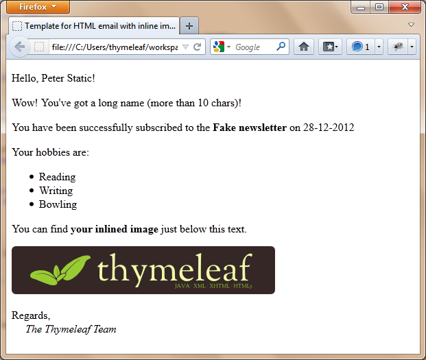

In this article we will show how to use Thymeleaf templates for
composing email messages of several kinds, and we will integrate this
with Spring's email utilities in order to configure a simple but
powerful email system.

Note that, although this article --and the corresponding example app--
uses the Spring Framework, Thymeleaf can also be used for processing
email templates in an application without Spring. Also note that the
example application is a web application, but there is no need for an
app to be web-enabled in order to send email with Thymeleaf.


Prerequisites
-------------

This article assumes you are familiar with both Thymeleaf and Spring 4.
We will not dive into Spring Mail details, for further information
please take a look at the [Email chapter at the Spring
Documentation](http://docs.spring.io/spring/docs/4.3.x/spring-framework-reference/html/mail.html).


Example application
-------------------

All the code in this article comes from a working example application.  You can
view or download the source from [its GitHub repo](https://github.com/thymeleaf/thymeleafexamples-springmail).
Downloading this application, executing it and exploring its source code is
highly recommended *(note that you will have to configure your SMTP user name
and password (and your SMTP server if you are not using GMail) at 
`src/main/resources/configuration.properties`)*.


Sending email with Spring
-------------------------

First, you need to configure a **Mail Sender** object in your Spring
configuration, as in the following code (your specific configuration
needs might differ):

```java
@Configuration
@PropertySource("classpath:mail/emailconfig.properties")
public class SpringMailConfig implements ApplicationContextAware, EnvironmentAware {

    private static final String JAVA_MAIL_FILE = "classpath:mail/javamail.properties";

    private ApplicationContext applicationContext;
    private Environment environment;

    ...

    @Bean
    public JavaMailSender mailSender() throws IOException {

        final JavaMailSenderImpl mailSender = new JavaMailSenderImpl();

        // Basic mail sender configuration, based on emailconfig.properties
        mailSender.setHost(this.environment.getProperty(HOST));
        mailSender.setPort(Integer.parseInt(this.environment.getProperty(PORT)));
        mailSender.setProtocol(this.environment.getProperty(PROTOCOL));
        mailSender.setUsername(this.environment.getProperty(USERNAME));
        mailSender.setPassword(this.environment.getProperty(PASSWORD));

        // JavaMail-specific mail sender configuration, based on javamail.properties
        final Properties javaMailProperties = new Properties();
        javaMailProperties.load(this.applicationContext.getResource(JAVA_MAIL_FILE).getInputStream());
        mailSender.setJavaMailProperties(javaMailProperties);

        return mailSender;

    }

    ...

}
```

Note that the previous code is getting the configuration from the properties
files `mail/emailconfig.properties` and `mail/javamail.properties` on your classpath.

Spring provides a class called `MimeMessageHelper` to ease the creation
of email messages. Let's see how to use it together with our
`mailSender`.

```java
final MimeMessage mimeMessage = this.mailSender.createMimeMessage();
final MimeMessageHelper message = new MimeMessageHelper(mimeMessage, "UTF-8");
message.setFrom("sender@example.com");
message.setTo("recipient@example.com");
message.setSubject("This is the message subject");
message.setText("This is the message body");
this.mailSender.send(mimeMessage);
```


Thymeleaf email templates
-------------------------

Using Thymeleaf for processing our email templates would allow us to use
some interesting features:

-   **Expressions** in Spring EL.
-   Flow control: **iterations**, **conditionals**, ...
-   **Utility functions**: date/number formatting, dealing with lists,
    arrays...
-   Easy **i18n**, integrated with our application's Spring
    internationalization infrastructure.
-   **Natural templating**: our email templates can be static
    prototypes, written by UI designers.
-   etc...

Also, given the fact that Thymeleaf has no required dependencies on the servlet
API, there would be **no need at all to create or send email
from a web application**. The techniques explained here could be used
with little or no change in a standalone application with no web UI.

### Our goals

Our example application will be sending four types of emails:

1.  Text (non-HTML) email.
2.  Simple HTML (with internationalized greeting).
3.  HTML text with an attachment.
4.  HTML text with an inline image.
5.  HTML text edited by the user.

### Spring configuration

In order to process our templates, we will configure a `TemplateEngine` especially
configured for email processing, in our Spring Email configuration:

```java
@Configuration
@PropertySource("classpath:mail/emailconfig.properties")
public class SpringMailConfig implements ApplicationContextAware, EnvironmentAware {

    ...

    @Bean
    public ResourceBundleMessageSource emailMessageSource() {
        final ResourceBundleMessageSource messageSource = new ResourceBundleMessageSource();
        messageSource.setBasename("mail/MailMessages");
        return messageSource;
    }

    ...

    @Bean
    public TemplateEngine emailTemplateEngine() {
        final SpringTemplateEngine templateEngine = new SpringTemplateEngine();
        // Resolver for TEXT emails
        templateEngine.addTemplateResolver(textTemplateResolver());
        // Resolver for HTML emails (except the editable one)
        templateEngine.addTemplateResolver(htmlTemplateResolver());
        // Resolver for HTML editable emails (which will be treated as a String)
        templateEngine.addTemplateResolver(stringTemplateResolver());
        // Message source, internationalization specific to emails
        templateEngine.setTemplateEngineMessageSource(emailMessageSource());
        return templateEngine;
    }

    private ITemplateResolver textTemplateResolver() {
        final ClassLoaderTemplateResolver templateResolver = new ClassLoaderTemplateResolver();
        templateResolver.setOrder(Integer.valueOf(1));
        templateResolver.setResolvablePatterns(Collections.singleton("text/*"));
        templateResolver.setPrefix("/mail/");
        templateResolver.setSuffix(".txt");
        templateResolver.setTemplateMode(TemplateMode.TEXT);
        templateResolver.setCharacterEncoding(EMAIL_TEMPLATE_ENCODING);
        templateResolver.setCacheable(false);
        return templateResolver;
    }

    private ITemplateResolver htmlTemplateResolver() {
        final ClassLoaderTemplateResolver templateResolver = new ClassLoaderTemplateResolver();
        templateResolver.setOrder(Integer.valueOf(2));
        templateResolver.setResolvablePatterns(Collections.singleton("html/*"));
        templateResolver.setPrefix("/mail/");
        templateResolver.setSuffix(".html");
        templateResolver.setTemplateMode(TemplateMode.HTML);
        templateResolver.setCharacterEncoding(EMAIL_TEMPLATE_ENCODING);
        templateResolver.setCacheable(false);
        return templateResolver;
    }

    private ITemplateResolver stringTemplateResolver() {
        final StringTemplateResolver templateResolver = new StringTemplateResolver();
        templateResolver.setOrder(Integer.valueOf(3));
        // No resolvable pattern, will simply process as a String template everything not previously matched
        templateResolver.setTemplateMode("HTML5");
        templateResolver.setCacheable(false);
        return templateResolver;
    }

    ...

}
```

Note that we have configured three *template resolvers* for our email-specific engine:
one for the TEXT templates, another one for HTML templates, and a third one
for editable HTML templates, which we will give the user the opportunity to modify
and will reach the template engine as a mere `String` once modified.

All three template resolvers are ordered so that they execute in sequence, trying to match
their *resolvable patterns* against the name of the template and only 
resolving the specified template if its name matches.

Also note how this `TemplateEngine` is specific to email processing, and completely
separate to the one used for the web interface. This `TemplateEngine` for the web 
interface, which will be integrated with Spring MVC by means of a `ThymeleafViewResolver`
is in fact defined in a different `@Configuration` file extending `WebMvcConfigurerAdapter`
(and which we will not show here in order to focus on email processing).

### Executing the Template Engine

At some point in our code, we will need to execute our template engine
in order to create the text of our messages. We have chosen to do this
in an `EmailService` class, so that it stays clear that we consider this
a responsibility of our *business layer* (and not the *web layer*).

As usual in Thymeleaf, before executing we will need to populate a
*context* containing all the variables we want to use during template
execution. Given the fact that our email processing is not
web-dependent, an instance of `Context` will do:

```java
final Context ctx = new Context(locale);
ctx.setVariable("name", recipientName);
ctx.setVariable("subscriptionDate", new Date());
ctx.setVariable("hobbies", Arrays.asList("Cinema", "Sports", "Music"));
ctx.setVariable("imageResourceName", imageResourceName); // so that we can reference it from HTML

final String htmlContent = this.templateEngine.process("html/email-inlineimage.html", ctx);
```

Our `email-inlineimage.html` is the template file we will use for
sending emails with an inlined image, and it looks like:

```html
<!DOCTYPE html>
<html xmlns:th="http://www.thymeleaf.org">
  <head>
    <title th:remove="all">Template for HTML email with inline image</title>
    <meta http-equiv="Content-Type" content="text/html; charset=UTF-8" />
  </head>
  <body>
    <p th:text="#{greeting(${name})}">
      Hello, Peter Static!
    </p>
    <p th:if="${name.length() > 10}">
      Wow! You've got a long name (more than 10 chars)!
    </p>
    <p>
      You have been successfully subscribed to the <b>Fake newsletter</b> on
      <span th:text="${#dates.format(subscriptionDate)}">28-12-2012</span>
    </p>
    <p>Your hobbies are:</p>
    <ul th:remove="all-but-first">
      <li th:each="hobby : ${hobbies}" th:text="${hobby}">Reading</li>
      <li>Writing</li>
      <li>Bowling</li>
    </ul>
    <p>
      You can find <b>your inlined image</b> just below this text.
    </p>
    <p>
      
    </p>
    <p>
      Regards, <br />
      <em>The Thymeleaf Team</em>
    </p>
  </body>
</html>
```

Let's remark some points:

-   The former template is fully WYSIWYG; you can check how it looks
    just by opening it with your browser. That's much better than
    sending an email to see the result, isn't it?



-   We can use all Thymeleaf features. Here for example we have used
    i18n with a parameterized `#{...}` expression, `th:each` to iterate
    over a list, `#dates` to format a date...
-   The `img` element has a hardcoded `src` value ---nice for
    prototyping---, which will be substituted at runtime by something like
    `cid:image.jpg` matching the attached image filename.


### Text (non-HTML) email

And what about text email? Well, we have already configured a template resolver for textual
email templates, so all we would have to do is create template using Thymeleaf's
textual syntax, just like:

```
[[ #{greeting(${name})} ]]

[# th:if="${name.length() gt 10}"]Wow! You've got a long name (more than 10 chars)![/]

You have been successfully subscribed to the Fake newsletter on [[ ${#dates.format(subscriptionDate)} ]].

Your hobbies are:
[# th:each="hobby : ${hobbies}"]
 - [[ ${hobby} ]]
[/]

Regards,
    The Thymeleaf Team
```


Putting it all together
-----------------------

### The service class

Finally, let's see how the method executing this email template at our
`EmailService` service class would look like:

```java
public void sendMailWithInline(
  final String recipientName, final String recipientEmail, final String imageResourceName,
  final byte[] imageBytes, final String imageContentType, final Locale locale)
  throws MessagingException {

    // Prepare the evaluation context
    final Context ctx = new Context(locale);
    ctx.setVariable("name", recipientName);
    ctx.setVariable("subscriptionDate", new Date());
    ctx.setVariable("hobbies", Arrays.asList("Cinema", "Sports", "Music"));
    ctx.setVariable("imageResourceName", imageResourceName); // so that we can reference it from HTML

    // Prepare message using a Spring helper
    final MimeMessage mimeMessage = this.mailSender.createMimeMessage();
    final MimeMessageHelper message =
        new MimeMessageHelper(mimeMessage, true, "UTF-8"); // true = multipart
    message.setSubject("Example HTML email with inline image");
    message.setFrom("thymeleaf@example.com");
    message.setTo(recipientEmail);

    // Create the HTML body using Thymeleaf
    final String htmlContent = this.templateEngine.process("email-inlineimage.html", ctx);
    message.setText(htmlContent, true); // true = isHtml

    // Add the inline image, referenced from the HTML code as "cid:${imageResourceName}"
    final InputStreamSource imageSource = new ByteArrayResource(imageBytes);
    message.addInline(imageResourceName, imageSource, imageContentType);

    // Send mail
    this.mailSender.send(mimeMessage);

}
```

Note that we have used an
`org.springframework.core.io.ByteArrayResource` object to attach the
image uploaded by the user, which we previously converted into a
`byte[]`.

You could also make use of `FileSystemResource` to attach a file
directly from the filesystem ---thus avoiding loading it into memory---, or
`UrlResource` to attach a remote file.

### The controller

Now for the controller method that calls our service:

```java
/*
* Send HTML mail with inline image
*/
@RequestMapping(value = "/sendMailWithInlineImage", method = RequestMethod.POST)
public String sendMailWithInline(
  @RequestParam("recipientName") final String recipientName,
  @RequestParam("recipientEmail") final String recipientEmail,
  @RequestParam("image") final MultipartFile image,
  final Locale locale)
  throws MessagingException, IOException {

    this.emailService.sendMailWithInline(
        recipientName, recipientEmail, image.getName(),
        image.getBytes(), image.getContentType(), locale);
    return "redirect:sent.html";

}
```

Cannot be easier. Note how we use a Spring MVC `MultipartFile` object to
model the uploaded file and pass its contents on to the service.


More examples
-------------

For the sake of brevity, we have only detailed one of the five types of
email our application is able to send. However, you can see the source
code required for creating all four types of emails at the `springmail`
example application you can download from the [documentation
page](/documentation.html).
