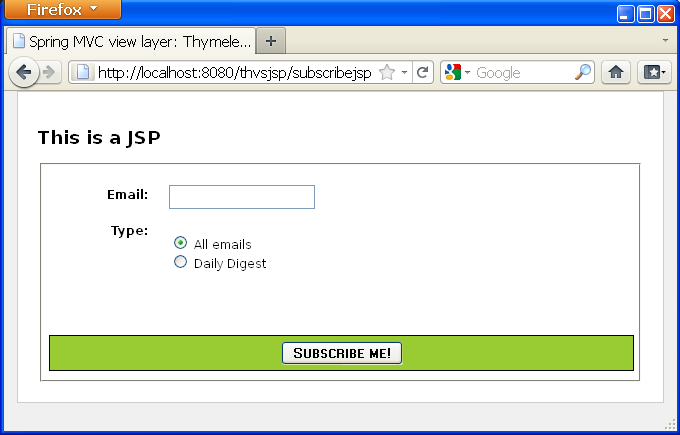
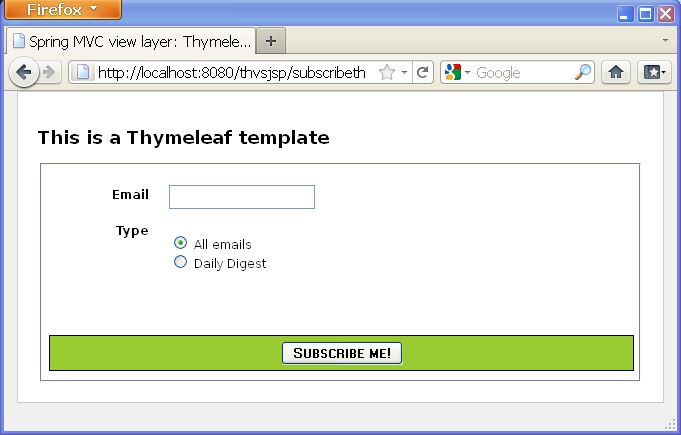
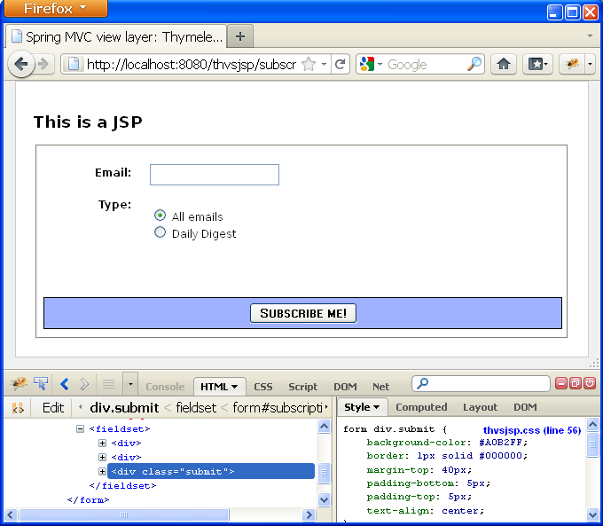
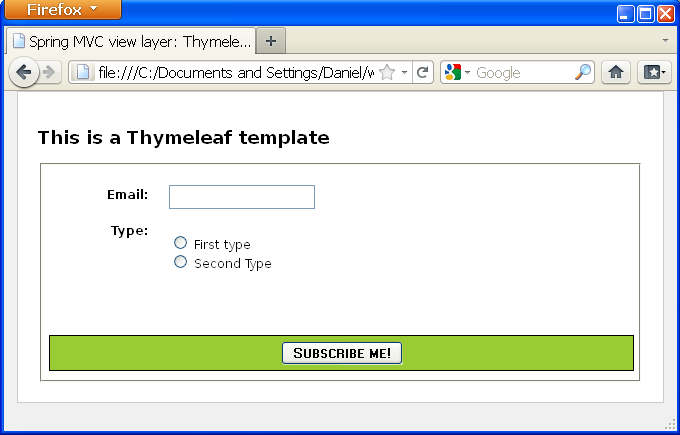
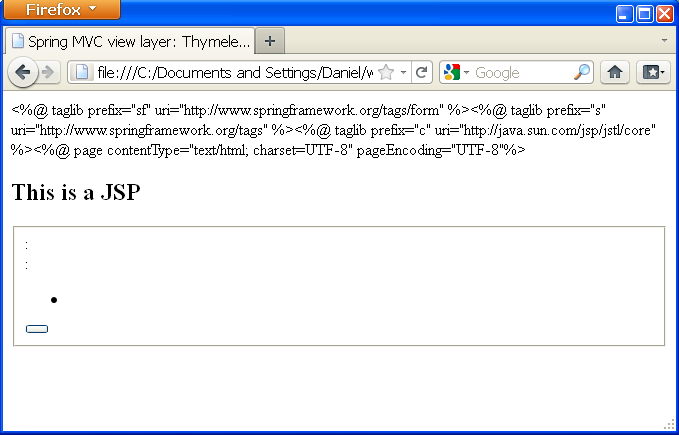
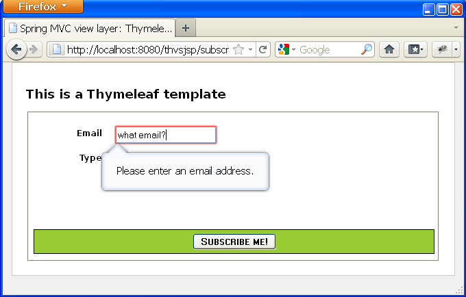

In this article we will compare the same page (a subscription form)
created twice for the same Spring MVC application: once using Thymeleaf
and another time using JSP, JSTL and the Spring tag libraries.

All the code seen here comes from a working application.  You can view or
download the source code from [its GitHub repo](https://github.com/thymeleaf/thymeleafexamples-thvsjsp).


Common requirements
-------------------

Our customers need a form for subscribing new members to a message list,
with two fields:

-   Email address
-   Type of subscription (receive all emails, daily digest)

We will also need this page to be HTML5 and completely
internationalizable, extracting all texts and messages from resource
files already configured in our `MessageSource` objects in our Spring
infrastructure.

Our application will have two `@Controller`s, which will contain exactly
the same code but will forward to different view names:

-   `SubscribeJsp` for the JSP page (the `subscribejsp` view).
-   `SubscribeTh` for the Thymeleaf page (the `subscribeth` view).

We will have the following classes in our model:

-   `Subscription` form-backing bean with two fields: `String email` and
    `SubscriptionType subscriptionType`.
-   `SubscriptionType` an enum modeling the `subscriptionType` field of
    the form, with values `ALL_EMAILS` and `DAILY_DIGEST`.

*(In this article we will just focus on the JSP/Thymeleaf template code.
If you want to know implementation details for the controller code or
Spring configuration, check the source code in the downloadable
package)*


Doing it with JSP
-----------------

This is our page:



And this is our JSP code, making use of both JSTL (`core`) and Spring
(`tags` and `form`) JSP tag libraries:

```html
<%@ taglib prefix="sf" uri="http://www.springframework.org/tags/form" %>
<%@ taglib prefix="s" uri="http://www.springframework.org/tags" %>
<%@ taglib prefix="c" uri="http://java.sun.com/jsp/jstl/core" %>
<%@ page contentType="text/html; charset=UTF-8" pageEncoding="UTF-8"%>
<!DOCTYPE html>

<html>

  <head>
    <title>Spring MVC view layer: Thymeleaf vs. JSP</title>
    <meta http-equiv="Content-Type" content="text/html; charset=UTF-8" />
    <link rel="stylesheet" type="text/css" media="all" href="<s:url value='/css/thvsjsp.css' />"/>
  </head>

  <body>

    <h2>This is a JSP</h2>

    <s:url var="formUrl" value="/subscribejsp" />
    <sf:form modelAttribute="subscription" action="${formUrl}">

      <fieldset>

        <div>
          <label for="email"><s:message code="subscription.email" />: </label>
          <sf:input path="email" />
        </div>
        <div>
          <label><s:message code="subscription.type" />: </label>
          <ul>
            <c:forEach var="type" items="${allTypes}" varStatus="typeStatus">
              <li>
                <sf:radiobutton path="subscriptionType" value="${type}" />
                <label for="subscriptionType${typeStatus.count}">
                  <s:message code="subscriptionType.${type}" />
                </label>
              </li>
            </c:forEach>
          </ul>
        </div>

        <div class="submit">
          <button type="submit" name="save"><s:message code="subscription.submit" /></button>
        </div>

      </fieldset>

    </sf:form>

  </body>

</html>
```


Doing it with Thymeleaf
-----------------------

Now, let's do the same with Thymeleaf. This is our page:



And this is our Thymeleaf code:

```html
<!DOCTYPE html>

<html xmlns:th="http://www.thymeleaf.org">

  <head>
    <title>Spring MVC view layer: Thymeleaf vs. JSP</title>
    <meta http-equiv="Content-Type" content="text/html; charset=UTF-8" />
    <link rel="stylesheet" type="text/css" media="all"
      href="../../css/thvsjsp.css" th:href="@{/css/thvsjsp.css}"/>
  </head>

  <body>

    <h2>This is a Thymeleaf template</h2>

    <form action="#" th:object="${subscription}" th:action="@{/subscribeth}">

      <fieldset>

        <div>
          <label for="email" th:text="#{subscription.email}">Email: </label>
          <input type="text" th:field="*{email}" />
        </div>
        <div>
          <label th:text="#{subscription.type}">Type: </label>
          <ul>
            <li th:each="type : ${allTypes}">
              <input type="radio" th:field="*{subscriptionType}" th:value="${type}" />
              <label th:for="${#ids.prev('subscriptionType')}"
                th:text="#{|subscriptionType.${type}|}">First type</label>
            </li>
            <li th:remove="all"><input type="radio" /> <label>Second Type</label></li>
          </ul>
        </div>

        <div class="submit">
          <button type="submit" name="save" th:text="#{subscription.submit}">Subscribe me!</button>
        </div>

      </fieldset>

    </form>

  </body>

</html>
```

Things to notice here:

-   This looks much more HTML-ish than the JSP version -- no strange
    tags, just some meaningful attributes.
-   Variable expressions (`${...}`) are Spring EL and execute on model
    attributes, asterisk expressions (`*{...}`) execute on the form
    backing bean, hash expressions (`#{...}`) are for
    internationalization and link expressions (`@{...}`) rewrite URLs.
    (*If you want to know more about this, have a look at the ["Getting
    started with the Standard Dialect in 5
    minutes"](standarddialect5minutes.html) guide*).
-   We are allowed to have prototype code there: for example, we can set
    an `Email:` text in the label for the first field, knowing that
    Thymeleaf will substitute it with the internationalized text with
    key `subscription.email` when it executes the page.
-   We have even been able to add an `<li>` for a second radiobutton
    just for prototyping pleasure. It will be removed when Thymeleaf
    executes our page.


Let's change the page style!
----------------------------

Imagine that now our pages are written we suddenly decide that we do not
want green anymore for that region around the submit button, but rather
a pale blue. Anyway we're not sure about the exact tone of blue that
will fit better, so we will have to try some combinations before
deciding on a specific one.

Let's see the steps we would have to take with each technology:

### Changing the page style using JSP

**Step 1**: *Deploy the application into our development server and
start it up*. Our JSP page will not render without starting the server,
so this will be a requirement.

**Step 2**: *Navigate through the pages until we find the one to
change*. Normally, the page to change will be one among several dozen
pages in our application, and it is quite possible that in order to
reach it we will need to click links, submit forms and/or query
databases.

**Step 3**: *Fire up firebug, dragonfly, or our favourite in-browser web
development tool*. This will allow us to modify our styles acting
directly on the browser's DOM, and thus see immediate results.

**Step 4**: *Make the colour changes*. Probably trying a couple of
different tones of blue before deciding on the one we like.



**Step 5**: *Copy-paste the changes into our CSS files*.

Done!

### Changing the page style using Thymeleaf

**Step 1**: *Double-click on the `.html` template file itself and let
our browser open it*. Being a Thymeleaf template, it will show just
fine, only with template/prototype data (note the subscription type
options):



**Step 2**: *Open the `.css` file with our favourite text editor*. The
template file statically links to the CSS in its
`<link rel="stylesheet" ...>` tag (with an `href` that Thymeleaf
substitutes when executing the template by the one generated by
`th:href`). So any changes we make to that CSS will be applied to the
static page our browser is displaying.

**Step 3**: *Make the colour changes*. As was the case with JSP, we will
probably have to try several colour combinations, which will be
refreshed in our browser just by pressing F5.

Done!

### That was a big difference!

The difference in the number of steps is not really important here (we
could also have used firebug with the Thymeleaf template). What is
really important is the complexity, the effort and the time required by
each of the steps required for JSP. Having to deploy and start the whole
application made JSP just lose.

What's more: think of how this difference would evolve if:

-   Our development server was not local but remote.
-   Changes didn't involve only CSS but also adding/removing some HTML
    code.
-   We still hadn't implemented the required logic in our application to
    actually *reach that page* once deployed.

This last point is an important one: what if our application was still
being developed, the Java logic needed to show this or other previous
pages wasn't still working alright, and we had to show the new colour to
our customer? (or even let him/her choose on the fly!)...

### And what about trying to use the JSP as a static prototype?

OK, you can say now, *but why did we start the application to modify the
JSP instead of just opening it like you did with the Thymeleaf one?
Can't we just do that?*.

The short answer is NO.

But let's try anyway: of course, we will have to rename our file so that
its name ends in `.html` instead of `.jsp`, but let's see what happens
when we open our browser:



*WHAT? Where's our page gone?* Well, it's still there, but in order to
make our page work as JSP we had to add lots of JSP tags and features
that made it work wondefully when executed by our web server... but at
the same time made it be HTML no more. And therefore made it
undisplayable for a browser.

Again, let's remind ourselves what the Thymeleaf template looked like
when we double-clicked on it:


Definitely not in the same league, right?


Got HTML5?
----------

But hey -- we said at the beginning that our page was going to be HTML5,
so... why don't we use some of the cool new HTML5 form-related features?

For example, there is now an `<input type="email" ...>`, which will make
our browser check that the text input by users has the shape of an email
address. And also, there is a new property for all inputs called
`placeholder` which shows a text in the field that automatically
dissapears when the input gains focus (usually by the user clicking on
it).

Sounds good, doesn't it? Unfortunately not all browsers support this yet
(as of 2011, Opera 11 and Firefox 4 do), but we are safe using these
features anyway because all browsers will treat an input of a type they
do not understand (`email`) as a `text` input, and will silently ignore
the `placeholder` attribute in the same way they ignore Thymeleaf's
`th:*` ones.

### Doing HTML5 with JSP

#### Before Spring 3.1

Spring MVC's JSP tag libraries didn't offer complete support for HTML5
until Spring 3.1, so before this version there was no way to write an
*email type* input tag other than do it in plain HTML, like:

```html
<input type="email" id="email" name="email" placeholder="your@email" value="" />
```

But this was not correct! In Spring MVC we should never write a JSP
input field like that, because we wouldn't be correctly *binding* our
input to the `email` property of the form-backing bean. In order to do
so, we would need to use an `<s:eval/>` tag, which will apply all the
required transformations (like *property editors*) and make our
plain-HTML tag work as if an `<sf:email/>` tag existed:

```html
<input type="email" id="email" name="email" placeholder="your@email"
       value="<s:eval expression='subscription.email' />" />
```

#### Since Spring 3.1

In Spring 3.1 there still is no `<sf:email ...>` tag, but the existing
`<sf:input ...>` allows us to specify a `type` attribute with value
`email`, which will work just fine:

```html
<sf:input path="email" type="email" />
```

And this will correctly perform our *form bindings* :-).

### Doing HTML5 with Thymeleaf

Thymeleaf has complete support for HTML5 (even with Spring 3.0), so we
will only have to change the `type` of our input and add a
`placeholder`, and it will work out of the box, correctly binding our
property and integrating with Spring MVCs *property editors* and more
importantly, being displayed as a usual `input` box when displayed as a
prototype ---something the `sf:input` tag won't---:

```html
<input type="email" th:field="*{email}" placeholder="your@email" />
```

Done!


