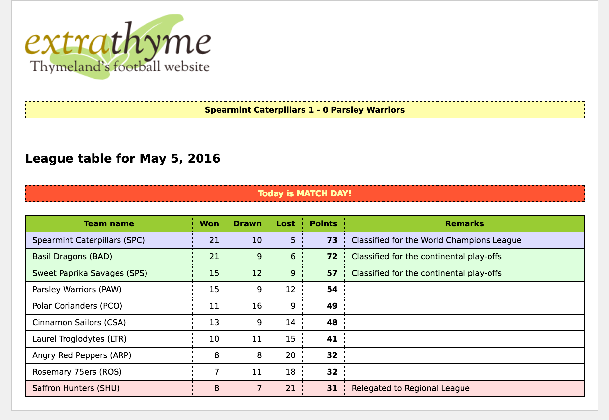

1 Some Reasons to Extend Thymeleaf
==================================

Thymeleaf is an extremely extensible library. The key to it is that most of its
user-oriented features are not directly built into its core, but rather just
packaged and componentized into feature sets called _dialects_.

The library offers you two dialects out-of-the-box: the _Standard_ and the _SpringStandard_
dialects, but you can easily create your own. Let's explore some of the reasons
for doing this:


1.1. Scenario 1: adding features to the Standard dialects
---------------------------------------------------------

Say your application uses the _SpringStandard_ dialect and that it needs to show
an alert text box in blue or red background depending on the user's role (admin
or non-admin) from Monday to Saturday, but always in green on Sundays. You can
compute this with conditional expressions on your template, but too many
conditions could render your code a little bit hard to read...

Solution: create a new attribute called `alertclass` and an attribute processor
for it (Java code that will compute the right CSS class), and package it into
your own `MyOwnDialect` dialect. Add this dialect to your template engine with
the `th` prefix (same as the _SpringStandard_ one) and you'll now be able to use
`th:alertclass="${user.role}"`!


1.2. Scenario 2: view-layer components
--------------------------------------

Let's say your company uses Thymeleaf extensively, and you want to create a
repository of common functionalities (tags and/or attributes) that you can use
in several applications without having to copy-paste them from one application
to the next. This is, you want to create view-layer components in a similar way
to JSPs _taglibs_.

Solution: create a Thymeleaf dialect for each set of related functionalities,
and add these dialects to your applications as needed. Note that if the tags or
attributes in these dialects make use of externalized (internationalized)
messages, you will be able to package these messages along with your dialects
(in the shape of _processor messages_) instead of requiring that all of your
applications include them in their messages `.properties` files as you would
with JSP.


1.3. Scenario 3: creating your own template system
--------------------------------------------------

Now imagine your are creating a public website that allows users to create their
own design templates for showing their content. Of course, you don't want your
users to be able to do absolutely everything in their templates, not even all that
the Standard Dialect allows (for example, execute OGNL expressions). So you need
to offer your users the ability to add to their templates only a very specific
set of features that are under your control (like showing a profile photo, a
blog entry text, etc).

Solution: create a Thymeleaf dialect with the tags or attributes you want your
users to be able to use, like `<mysite:profilePhoto />` or `<mysite:blogentries fromDate="23/4/2011" />`.
Then allow your users to create their own templates using these features and
just let Thymeleaf execute them, being sure nobody will be doing what they're
not allowed to.


2 Dialects and Processors
=========================

2.1. Dialects
-------------

If you've read the _Using Thymeleaf_ tutorial before getting here ---which you
should have done---, you should know that what you've been learning all this time
was not exactly _Thymeleaf_, but rather its _Standard Dialect_ (or the _SpringStandard Dialect_,
if you've also read the _Thymeleaf + Spring_ tutorial).

What does that mean? It means that all those `th:x` attributes you learned to
use are only a standard, out-of-the-box set of features, but you can define your
own set of attributes (or tags) with the names you wish and use them in
Thymeleaf to process your templates. *You can define your own dialects.*

Dialects are objects implementing the `org.thymeleaf.dialect.IDialect` interface,
which cannot be any simpler:

```java
public interface IDialect {

    public String getName();

}
```

The only core requirement of a dialect is to have a name that can be used for its
identification. But there are of course several kinds of dialects depending
on what they provide to the Thymeleaf engine, and each of them should implement
at least one of a set of different subinterface of `IDialect`:

  * `IProcessorDialect` for dialects that provide *processors*.
  * `IPreProcessorDialect` for dialects that provide *pre-processors*.
  * `IPostProcessorDialect` for dialects that provide *post-processors*.
  * `IExpressionObjectDialect` for dialects that provide *expression objects*.
  * `IExecutionAttributeDialect` for dialects that provide *execution attributes*.


### Processor dialects: `IProcessorDialect`

The `IProcessorDialect` interface looks like this:

```java
public interface IProcessorDialect extends IDialect {

    public String getPrefix();
    public int getDialectProcessorPrecedence();
    public Set<IProcessor> getProcessors(final String dialectPrefix);

}
```

**Processors** are the objects in charge of executing most of the logic
in Thymeleaf templates, and possibly the most important Thymeleaf extension
artifact. We will cover processors in more detail in next sections.

This dialect only defines three artifacts:

  * The *prefix*, which is the prefix or namespace that should be applied
    *by default* to the elements and attributes matched by the dialect's
    processors. So a dialect with prefix `th` like e.g. the *Standard
    Dialect* will be able to define processors matching attributes like
    `th:text`, `th:if` or `th:whatever` (or `data-th-text`, `data-th-if`
    and `data-th-whatever` if we prefer *pure HTML5* syntax). Note however
    that the prefix returned here by a dialect is **only the default one**
    to be used for that dialect, but such prefix can be changed during
    template engine configuration. Also note that prefix can be `null` if
    we want our processors to execute on unprefixed tags/attributes.

  * The *dialect precedence* allows the sorting of processors across 
    dialects. Processors define their own *precedence* value, but these
    processor precedences are considered *relative to 
    dialect precedence*, so every processor in a specific dialect can be 
    configured to be executed before all processors
    from a different dialect just by setting the correct values for this
    *dialect precedence*.

  * The *processors* are, as its name implies, the set of *processors* provided
    by the dialect. Note the `getProcessors(...)` method is passed the
    `dialectPrefix` as an argument in case the dialect has been configured
    at the Template Engine with a prefix different to the default one. Most probably
    the `IProcessor` instances will need this information during their
    initialization.


### Pre-processor dialects: `IPreProcessorDialect`

**Pre-processors** and **post-processors** are different to *processors* in 
that instead of executing on a single event or on an event model (a fragment of
a template), they apply to the entire template execution process as an additional step in
the engine's processing chain. Therefore they follow an API completely
different to that of processors, much more event-oriented, defined by the 
lower-level `ITemplateHandler` interface.

In the specific case of the pre-processors, they apply **before** the Thymeleaf engine
starts executing processors for a specific template.

The `IPreProcessorDialect` interface looks like:

```java
public interface IPreProcessorDialect extends IDialect {

    public int getDialectPreProcessorPrecedence();
    public Set<IPreProcessor> getPreProcessors();

}
```

Which is very similar to the `IProcessorDialect` above –including its own 
dialect-level precedence for pre-processors– but lacks a *prefix*, as 
pre-processors don't need it at all (they don't *match* on specific 
events – instead they handle all of them).


### Post-processor dialects: `IPostProcessorDialect`

As stated above, **post-processors** are an additional step in the template execution
chain, but this time they execute **after** the Thymeleaf engine has applied
all the needed processors. This means post-processors apply just before
template output happens (and can therefore modify what is being output).

The `IPostProcessorDialect` interface looks like:

```java
public interface IPostProcessorDialect extends IDialect {

    public int getDialectPostProcessorPrecedence();
    public Set<IPostProcessor> getPostProcessors();

}
```

...which is completely analogous to the `IPreProcessorDialect` interface, but of 
course for post-processors in this case.


### Expression Object dialects: `IExpressionObjectDialect`

Dialects implementing this interface provide new *expression objects* or *expression 
utility objects* that can be used in expressions anywhere in templates, such as 
the `#strings`, `#numbers`, `#dates`, etc. provided by the Standard Dialect.

The `IExpressionObjectDialect` interface looks like this:

```java
public interface IExpressionObjectDialect extends IDialect {

    public IExpressionObjectFactory getExpressionObjectFactory();

}
```

Which, as we can see, does not return the expression objects themselves, 
but only a *factory*. The reason for this is some *expression objects* might 
require data from the processing context in order to being built, so it won't 
be possible to build them until we really are processing the template... and 
besides, most expressions don't need *expression objects* at all, so it's 
just better to build them *on demand*, only when they are really needed 
for specific expressions (and build only those that are needed).

This is the `IExpressionObjectFactory` interface:

```java
public interface IExpressionObjectFactory {

    public Map<String,ExpressionObjectDefinition> getObjectDefinitions();

    public Object buildObject(final IProcessingContext processingContext, final String expressionObjectName);

}
```

### Execution Attribute dialects: `IExecutionAttributeDialect`

Dialects implementing this interface are allowed to provide *execution attributes*, 
i.e. objects that are available to every processor being executed during template 
processing.

For example, the Standard Dialect implements this interface in order to provide to 
every processor:

   * The *Thymeleaf Standard Expression parser* so that Standard Expressions in 
     any attribute can be parsed and executed.
   * The *Variable Expression Evaluator* so that `${...}` expressions are executed 
     either in OGNL or SpringEL (depending on whether we are using the Spring 
     integration module or not).
   * The *Conversion Service* that performs conversion operations in `${{...}}` expressions.

Note that these objects are not available at the context, so
they cannot be used from template expressions. Their availability is limited to
implementations of extension points such as processors, pre-processors, etc.

The `IExecutionAttributeDialect` interface is very simple:

```java
public interface IExecutionAttributeDialect extends IDialect {

    public Map<String,Object> getExecutionAttributes();

}
```


2.2. Processors
---------------

Processors are objects implementing the `org.thymeleaf.processor.IProcessor`
interface, and they contain the real logic to be applied on the different parts
of a template (which we will call **events**). This
interface looks like this:

```java
public interface IProcessor {

    public TemplateMode getTemplateMode();
    public int getPrecedence();

}
```

As with dialects, this is a very simple interface that only specified the template
mode in which the processor can be applied and its precedence.

But there are several types of *events*, and there is actually one type of processor
for each type of event:

  * Template start/end
  * Element Tags
  * Texts
  * Comments
  * CDATA Sections
  * DOCTYPE Clauses
  * XML Declarations
  * Processing Instructions

And also for **models**: sequences of events representing an *entire element*, i.e. 
an element with its entire body, including any nested elements or any other 
kind of artifacts that might appear inside. If the modelled element is a 
*standalone element*, the model will only contain its corresponding event; 
but if the modelled element has a body, the model will contain every event 
from its *open tag* to its *close tag*, both included.

All these types of processors are created by implementing a specific interface, or 
by extending one of the available *abstract implementations*. All these artifacts 
conforming the Thymeleaf 3.0 Processor API live at the `org.thymeleaf.processor` 
package.


### Element Processors

Element processors are those that are executed on the *open element* (`IOpenElementTag`) 
or *standalone element* (`IStandaloneElementTag`) events, normally by means of matching 
the name of the element (and/or one of its attributes) with a matching configuration 
specified by the processor. This is what the `IElementProcessor` interface looks like:

```java
public interface IElementProcessor extends IProcessor {

    public MatchingElementName getMatchingElementName();
    public MatchingAttributeName getMatchingAttributeName();

}
```

Note however that element processor implementations are not meant to directly implement 
this interface. Instead, element processors should fall into one of two categories, 
already mentioned above:

  * **Element Tag Processors**, implementing the `IElementTagProcessor` interface. 
    These processors execute on *open/standalone tag events only* (no processors 
    can be applied to *close tags*), and have no (direct) access to the element body.
  * **Element Model Processors**, implementing the `IElementModelProcessor` interface. 
    These processors execute on *complete elements*, including their bodies, in the 
    form of `IModel` objects.

We should have a look at each of these interfaces separately:


#### Element Tag Processors: `IElementTagProcessor`

Element Tag Processors, as explained, execute on the single *open element* or 
*standalone element* tag that matches its matching configuration (seen in 
`IElementProcessor`). The interface to be implemented is `IElementTagProcessor`, 
which looks like this:

```java
public interface IElementTagProcessor extends IElementProcessor {

    public void process(
            final ITemplateContext context, 
            final IProcessableElementTag tag,
            final IElementTagStructureHandler structureHandler);

}
```

As we can see, besides extending `IElementProcessor` it only specifies a 
`process(...)` method that will be executed when the *matching configuration* 
matches (and in the order established by its *precedence*, established at the 
`IProcessor` superinterface). The `process(...)` signature is quite compact, 
and follows a pattern found in every Thymeleaf processor interface:

   * The `process(...)` method returns `void`. Any actions will be performed 
     via the `structureHandler`.
   * The `context` argument contains the context with which the template is 
     being executed: variables, template data, etc.
   * The `tag` argument is the event on which the processor is being fired. 
     It contains both the name of the element and its attributes.
   * The `structureHandler` is a special object that allows the processor to 
     give instructions to the engine about actions that it should perform as 
     a consequence of the execution of the processor.

**Using the `structureHandler`**

The `tag` argument passed to `process(...)` is an **immutable** object. So there is 
no way to, for example, directly modify the attributes of a tag on the `tag` object 
itself. Instead, the `structureHandler` should be used.

For example, let's see how we would read the value of a specific `tag` attribute, 
unescape it and keep it in a variable, and then remove the attribute from the tag:

```java
// Obtain the attribute value
String attributeValue = tag.getAttributeValue(attributeName);

// Unescape the attribute value
attributeValue = 
    EscapedAttributeUtils.unescapeAttribute(context.getTemplateMode(), attributeValue);

// Instruct the structureHandler to remove the attribute from the tag
structureHandler.removeAttribute(attributeName);

... // do something with that attributeValue
```

*Note that the code above is only meant to showcase some attribute management 
concepts -- in most processors we won't need to do this "get value + unescape + remove" 
operation manually as it will all be handled by an extended superclass such as 
`AbstractAttributeTagProcessor`*.

Above we've seen only one of the *operations* offered by the `structureHandler`. There is 
a *structure handler* for each type of processor in Thymeleaf, and the one 
for *element tag* processors implements the `IElementTagStructureHandler` interface, which 
looks like this:

```java
public interface IElementTagStructureHandler {

    public void reset();

    public void setLocalVariable(final String name, final Object value);
    public void removeLocalVariable(final String name);

    public void setAttribute(final String attributeName, final String attributeValue);
    public void setAttribute(final String attributeName, final String attributeValue, 
                             final AttributeValueQuotes attributeValueQuotes);

    public void replaceAttribute(final AttributeName oldAttributeName, 
                                 final String attributeName, final String attributeValue);
    public void replaceAttribute(final AttributeName oldAttributeName, 
                                 final String attributeName, final String attributeValue, 
                                 final AttributeValueQuotes attributeValueQuotes);

    public void removeAttribute(final String attributeName);
    public void removeAttribute(final String prefix, final String name);
    public void removeAttribute(final AttributeName attributeName);

    public void setSelectionTarget(final Object selectionTarget);

    public void setInliner(final IInliner inliner);

    public void setTemplateData(final TemplateData templateData);

    public void setBody(final String text, final boolean processable);
    public void setBody(final IModel model, final boolean processable);

    public void insertBefore(final IModel model); // cannot be processable
    public void insertImmediatelyAfter(final IModel model, final boolean processable);

    public void replaceWith(final String text, final boolean processable);
    public void replaceWith(final IModel model, final boolean processable);


    public void removeElement();
    public void removeTags();
    public void removeBody();
    public void removeAllButFirstChild();

    public void iterateElement(final String iterVariableName, 
                               final String iterStatusVariableName, 
                               final Object iteratedObject);

}
```

There we can see all the actions that a processor can ask the template engine to do as 
a result of its execution. The method names are quite self-explanatory (and there is 
javadoc for them), but very briefly:

  * `setLocalVariable(...)`/`removeLocalVariable(...)` will add a local variable to the 
    template execution. This *local variable* will be accessible during the rest of the 
    execution of the current event, and also during all its *body* (i.e. until its 
    corresponding *close tag*)
  * `setAttribute(...)` adds a new attribute to the tag with a specified value (and 
    maybe also type of surrounding quotes). If the attribute already exists, its value 
    will be replaced.
  * `replaceAttribute(...)` replaces an existing attribute with a new one, taking its 
    place in the attribute (including its surrounding white space, for example).
  * `removeAttribute(...)` removes an attribute from the tag.
  * `setSelectionTarget(...)` modifies the object that is to be considered the 
    *selection target*, i.e. the object on which *selection expressions* (`*{...}`) will 
    be executed. In the Standard Dialect, this *selection target* is usually modified by 
    means of the `th:object` attribute, but custom processors can do it too. Note the 
    *selection target* has the same scope as a local variable, and will therefore be 
    accessible only inside the body of the element being processed.
  * `setInliner(...)` modifies the *inliner* to be used for processing all text nodes 
    (`IText` events) appearing in the body of the element being processed. This is the 
    mechanism used by the `th:inline` attribute to enable *inlining* in any of the 
    specified modes (`text`, `javascript`, etc).
  * `setTemplateData(...)` modifies the metadata about the template that is actually 
    being processed. When inserting fragments, this allows the engine to know data about 
    the specific fragment being processed, and also the complete stack of fragments being 
    nested.
  * `setBody(...)` replaces all the body of the element being processed with the passed 
    text or model (sequence of events = fragment of markup). This is the way e.g. that 
    `th:text`/`th:utext` work. Note that the specified replacement text or model can be 
    set as *processable* or not, depending on whether we want to execute any processors 
    that might be associated with them. In the case of `th:utext="${var}"`, for example, 
    the replacement is set as *non-processable* in order to avoid executing any markup 
    that might be returned by `${var}` as a part of the template.
  * `insertBefore(...)`/`insertImmediatelyAfter(...)` allow the specification of a model 
    (fragment of markup) that should appear before or *immediately* after the tag being 
    processed. Note that `insertImmediatelyAfter` means *after the tag being processed* 
    (and therefore as the first part of the element's body) and not *after the entire 
    element that opens here, and closes in a close tag somewhere*.
  * `replaceWith(...)` allows the current *element* (entire element) to be replaced with 
    the text or model specified as argument.
  * `removeElement()`/`removeTags()`/`removeBody()`/`removeAllButFirstChild()` allow the 
    processor to remove, respectively, the entire element including its body, only the 
    executed tags (open + close) but not the body, only the body but not the wrapping tags, 
    and lastly all the tag's children except the first child element. Note all these options 
    basically mirror the different values that can be used at the `th:remove` attribute.
  * `iterateElement(...)` allows the current element (body included) to be iterated as many 
    times as elements exist in the `iteratedObject` (which will usually be a `Collection`, 
    `Map`, `Iterator` or an array). The other two arguments will be used for specifying the 
    names of the variables used for the iterated elements and the status variable.


**Abstract implementations for `IElementTagProcessor`**

Thymeleaf offers two basic implementations of `IElementTagProcessor` that processors might 
implement for convenience:

  * `org.thymeleaf.processor.element.AbstractElementTagProcessor`, meant for processors that 
    match element events by their element name (i.e. without looking at attributes). Similar 
    to *element processors* in Thymeleaf 2.1.
  * `org.thymeleaf.processor.element.AbstractAttributeTagProcessor`, meant for processors that 
    match element events by one of their attributes (and optionally also the element name). 
    Similar to *attribute processors* in Thymeleaf 2.1.


#### Element Model Processors: `IElementModelProcessor`

Element Model Processors execute on the entire elements they match –including their bodies–, 
in the form of an `IModel` object that contains the complete sequence of events that models 
such element and its contents. The `IElementModelProcessor` is very similar to the one seen 
above for *tag processors*:

```java
public interface IElementModelProcessor extends IElementProcessor {

    public void process(
            final ITemplateContext context, 
            final IModel model,
            final IElementModelStructureHandler structureHandler);

}
```

Note how this interface also extends `IElementProcessor`, and how the `process(...)` method 
it contains follows the same structure as the one in tag processors, replacing `tag` with 
`model` of course:

   * `process(...)` returns `void`. Actions will be performed on `model` or `structureHandler`, 
     not by returning anything.
   * `context` contains the execution context: variables, etc.
   * `model` is the sequence of events modelling the entire element on which the processor is 
     being executed. This model can be directly modified from the processor.
   * `structureHandler` allows instructing the engine to perform actions beyond model 
     modification (e.g. setting local variables).


**Reading and modifying the model**

The `IModel` object passed as a parameter to the `process()` method is a **mutable** model, so 
it allows any modifications to be done on it (*models* are mutable, *events* such as *tags* are 
immutable). For example, we might want to modify it so that we replace every text node from its 
body with a comment with the same contents:

```java
final IModelFactory modelFactory =  context.getModelFactory();

int n = model.size();
while (n-- != 0) {
    final ITemplateEvent event = model.get(n);
    if (event instanceof IText) {
        final IComment comment =
                modelFactory.createComment(((IText)event).getText());
        model.insert(n, comment);
        model.remove(n + 1);
    }
}
```

Note also that the `IModel` interface includes an `accept(IModelVisitor visitor)` method, useful 
for traversing an entire model looking for specific nodes or relevant data the *Visitor* pattern.


**Using the `structureHandler`**

Similarly to *tag processors*, model processors are passed a *structure handler* object that allows 
them to instruct the engine to take any actions that cannot be done by directly acting on the 
`IModel model` object itself. The interface these structure handlers implement, much smaller than 
the one for tag processors, is `IElementModelStructureHandler`:

```java
public interface IElementModelStructureHandler {

    public void reset();

    public void setLocalVariable(final String name, final Object value);
    public void removeLocalVariable(final String name);

    public void setSelectionTarget(final Object selectionTarget);

    public void setInliner(final IInliner inliner);

    public void setTemplateData(final TemplateData templateData);

}
```

It's easy to see this is a subset of the one for tag processors. The few methods there work the 
same way:

  * `setLocalVariable(...)`/`removeLocalVariable(...)` for adding/removing local variables that will 
    be available during the model's execution (after the current processor's execution).
  * `setSelectionTarget(...)` for modifying the *selection target* applied during the model's execution.
  * `setInliner(...)` for setting an inliner.
  * `setTemplateData(...)` for setting metadata about the template being processed.


**Abstract implementations for `IElementModelProcessor`**

Thymeleaf offers two basic implementations of `IElementModelProcessor` that processors might implement 
for convenience:

  * `org.thymeleaf.processor.element.AbstractElementModelProcessor`, meant for processors that match 
    element events by their element name (i.e. without looking at attributes). Similar to *element 
    processors* in Thymeleaf 2.1.
  * `org.thymeleaf.processor.element.AbstractAttributeModelProcessor`, meant for processors that match 
    element events by one of their attributes (and optionally also the element name). Similar to 
    *attribute processors* in Thymeleaf 2.1.


### Template start/end Processors: `ITemplateBoundariesProcessor`

Template Boundaries Processors are a kind of processors that execute on the *template start* and 
*template end* events fired during template processing. They allow to perform any kind of initialization 
or disposal of resources at beginning or end of the template processing operation. Note that these events 
are **only fired for the first-level template**, and not for each of the fragments that might be parsed 
and/or included into the template being processed.

The `ITemplateBoundariesProcessor` interface looks like this:

```java
public interface ITemplateBoundariesProcessor extends IProcessor {

    public void processTemplateStart(
            final ITemplateContext context,
            final ITemplateStart templateStart,
            final ITemplateBoundariesStructureHandler structureHandler);

    public void processTemplateEnd(
            final ITemplateContext context,
            final ITemplateEnd templateEnd,
            final ITemplateBoundariesStructureHandler structureHandler);

}
```

This time the interface offers two `process*(...)` methods, one for the *template start* and another one for 
the *template end* events. Their signature follows the same patter as the other `process(...)` methods we 
saw before, receiving the context, the event object, and the structure handler. Structure handler that, in 
this case, implements a quite simple `ITemplateBoundariesStructureHandler` interface:

```java
public interface ITemplateBoundariesStructureHandler {

    public void reset();

    public void setLocalVariable(final String name, final Object value);
    public void removeLocalVariable(final String name);

    public void setSelectionTarget(final Object selectionTarget);

    public void setInliner(final IInliner inliner);

    public void insert(final String text, final boolean processable);
    public void insert(final IModel model, final boolean processable);

}
```

We can see how, besides the usual methods for managing local variables, selection target and inliner, we can also 
use the structure handler for inserting text or a model, which in this case will appear at the very beginning or 
the very end of the result (depending on the event being processed).


### Other processors

There are other events for which Thymeleaf 3.0 allows processors to be declared, each of them implementing 
their corresponding interface:

   * **Text** events: interface `ITextProcessor`
   * **Comment** events: interface `ICommentProcessor`
   * **CDATA Section** events: interface `ICDATASectionProcessor`
   * **DOCTYPE Clause** events: interface `IDocTypeProcessor`
   * **XML Declaration** events: interface `IXMLDeclarationProcessor`
   * **Processing Instruction** events: interface `IProcessingInstructionProcessor`

All of them look pretty much like this (which is the one for text events):

```java
public interface ITextProcessor extends IProcessor {

    public void process(
            final ITemplateContext context, 
            final IText text,
            final ITextStructureHandler structureHandler);

}
```

Same pattern as all other `process(...)` methods: context, event, structure handler. And these structure 
handlers are very simple, just like this (again, the one for text events):

```java
public interface ITextStructureHandler {

    public void reset();

    public void setText(final CharSequence text);

    public void replaceWith(final IModel model, final boolean processable);

    public void removeText();

}
```


3 Creating our own Dialect
==========================

The source code for the examples shown in this and future chapters of this guide
can be found in the [ExtraThyme GitHub repository](https://github.com/thymeleaf/thymeleafexamples-extrathyme).


3.1. ExtraThyme: a website for Thymeland's football league
----------------------------------------------------------

Football is a popular sport in Thymeland^[European football, of course ;-)].
There is a 10-team league going on
there each season, and its organizers have just asked us to create a website for
it called "Extrathyme".

This website will be very simple: just a table with:

 * The team names.
 * How many matches they won, drew or lost, as well as the total points earned.
 * A remark explaining whether their position in the table qualifies them for
   higher-level competitions next year or else mean their relegation to regional
   leagues.

Also, above the league table, a banner will be displaying headlines with the
results of recent matches.



We will use HTML5, Spring MVC and the SpringStandard dialect for our application,
and we will be extending Thymeleaf by creating a `score` dialect that includes:

 * A `score:remarkforposition` attribute that outputs an internationalized text
   for the Remarks column in the table. This text should explain whether the
   team's position in the table qualifies it for the World Champions League, the
   Continental Play-Offs, or relegates it to the Regional League.
 * A `score:classforposition` attribute that establishes a CSS class for the
   table rows depending on the team's remarks: blue background for the World
   Champions League, green for the Continental Play-Offs, and red for relegation.
 * A `score:headlines` tag for drawing the yellow box at the top with the
   results of recent matches. This tag should support an order attribute with
   values random (for showing a randomly selected match) and `latest` (default,
   for showing only the last match).

Our markup will therefore look like this, making use of both `th` and `score`
attributes:

```html
<!DOCTYPE html>

<html xmlns:th="http://www.thymeleaf.org" xmlns:score="http://thymeleafexamples">

  <head>
    <title>extraThyme: Thymeland's football website</title>
    <meta http-equiv="Content-Type" content="text/html; charset=UTF-8" />
    <link rel="stylesheet" type="text/css" media="all"
          href="../../css/extrathyme.css" th:href="@{/css/extrathyme.css}"/>
  </head>

  <body>

    <div>
      
    </div>

    <score:headlines order="random" />

    <div class="leaguetable">

      <h2 th:text="#{title.leaguetable(${execInfo.now.time})}">
        League table for 07 July 2011
      </h2>
      
      <table>
        <thead>
          <tr>
            <th th:text="#{team.name}">Team</th>
            <th th:text="#{team.won}" class="matches">Won</th>
            <th th:text="#{team.drawn}" class="matches">Drawn</th>
            <th th:text="#{team.lost}" class="matches">Lost</th>
            <th th:text="#{team.points}" class="points">Points</th>
            <th th:text="#{team.remarks}">Remarks</th>
          </tr>
        </thead>
        <tbody>
          <tr th:each="t : ${teams}" score:classforposition="${tStat.count}">
            <td th:text="|${t.name} (${t.code})|">The Winners (TWN)</td>
            <td th:text="${t.won}" class="matches">1</td>
            <td th:text="${t.drawn}" class="matches">0</td>
            <td th:text="${t.lost}" class="matches">0</td>
            <td th:text="${t.points}" class="points">3</td>
            <td score:remarkforposition="${tStat.count}">Great winner!</td>
          </tr>
          <!--/*-->
          <tr>
            <td>The First Losers (TFL)</td>
            <td class="matches">0</td>
            <td class="matches">1</td>
            <td class="matches">0</td>
            <td class="points">1</td>
            <td>Little loser!</td>
          </tr>
          <tr>
            <td>The Last Losers (TLL)</td>
            <td class="matches">0</td>
            <td class="matches">0</td>
            <td class="matches">1</td>
            <td class="points">0</td>
            <td>Big loooooser</td>
          </tr>
          <!--*/-->
        </tbody>
      </table>

    </div>

  </body>

</html>
```      

_(Note that we've added a second and third rows to our table, surrounded by parser-level comments `<!--/* ... */-->` so that our template shows nicely as a prototype when directly opened in a browser.)_


3.2. Changing the CSS class by team position
--------------------------------------------

The first attribute processor we will develop will be `ClassForPositionAttrProcessor`, which we will implement as a subclass of a convenience abstract class provided by Thymeleaf called `AbstractAttributeModifierAttrProcessor`.

This abstract class is already oriented towards creating attribute processors
that set or modify the value of attributes in their host tags, which is exactly
what we need (we will set a value to the `<tr>`'s `class` attribute.

Let's have a look at our code:

```java
public class ClassForPositionAttrProcessor
        extends AbstractAttributeModifierAttrProcessor {

    public ClassForPositionAttrProcessor() {
        super("classforposition");
    }

    public int getPrecedence() {
        return 12000;
    }

    @Override
    protected Map<String, String> getModifiedAttributeValues(
            final Arguments arguments, final Element element, final String attributeName) {

        final Configuration configuration = arguments.getConfiguration();

        /*
         * Obtain the attribute value
         */
        final String attributeValue = element.getAttributeValue(attributeName);

        /*
         * Obtain the Thymeleaf Standard Expression parser
         */
        final IStandardExpressionParser parser =
                StandardExpressions.getExpressionParser(configuration);

        /*
         * Parse the attribute value as a Thymeleaf Standard Expression
         */
        final IStandardExpression expression =
                parser.parseExpression(configuration, arguments, attributeValue);

        /*
         * Execute the expression just parsed
         */
        final Integer position =
                (Integer) expression.execute(configuration, arguments);

        /*
         * Obtain the remark corresponding to this position in the league table.
         */
        final Remark remark = RemarkUtil.getRemarkForPosition(position);

        /*
         * Apply the corresponding CSS class to the element.
         */
        final Map<String,String> values = new HashMap<String, String>();
        if (remark != null) {
            switch (remark) {
                case WORLD_CHAMPIONS_LEAGUE:
                    values.put("class", "wcl");
                    break;
                case CONTINENTAL_PLAYOFFS:
                    values.put("class", "cpo");
                    break;
                case RELEGATION:
                    values.put("class", "rel");
                    break;
            }
        }

        return values;
    }

    @Override
    protected ModificationType getModificationType(final Arguments arguments, 
            final Element element, final String attributeName, 
            final String newAttributeName) {

        // Just in case there already is a value set for the 'class' attribute in the
        // tag, we will append our new value (using a whitespace separator) instead
        // of simply substituting it.
        return ModificationType.APPEND_WITH_SPACE;
    }

    @Override
    protected boolean removeAttributeIfEmpty(final Arguments arguments,
            final Element element, final String attributeName, 
            final String newAttributeName) {

        // If the resulting 'class' attribute is empty, do not show it at all.
        return true;
    }

    @Override
    protected boolean recomputeProcessorsAfterExecution(final Arguments arguments,
            final Element element, final String attributeName) {

        // There is no need to recompute the element after this processor has executed
        return false;
    }
}
```

As you can see, in this case the convenience abstract class we are using
abstracts from us any direct modification on the DOM object tree, and instead we
just have to create and return a Map with all the new attribute values to be set
in the tag.

It is important to note that we are creating this attribute with the ability of
executing expressions written in the Standard Syntax (used by both the _Standard_
and the _SpringStandard_ dialects). This is, the ability to be set values like `${var}`,
`#{messageKey}`, conditionals, etc. See how we use this in our template:

```html
<tr th:each="t : ${teams}" score:classforposition="${tStat.count}">
```

In order to evaluate these expressions (also called _Thymeleaf Standard Expressions_) we need to first obtain the Standard Expression Parser, then parse the attribute value, and finally execute the parsed expresion:

```java
final IStandardExpressionParser parser =
        StandardExpressions.getExpressionParser(configuration);

final IStandardExpression expression =
        parser.parseExpression(configuration, arguments, attributeValue);

final Integer position =
        (Integer) expression.execute(configuration, arguments);
```


3.3. Displaying an internationalized remark
-------------------------------------------

The next thing to do is creating an attribute processor able to display the remark text. This will be very similar to the `ClassForPositionAttrProcessor`, but with a couple of important differences:

 * We will not be setting a value for an attribute in the host tag, but rather the text body (content) of the tag, in the same way a `th:text` attribute does.
 * We need to access the message externalization (internationalization) system from our code so that we can display the text corresponding to the selected locale.

This time we will be using a different convenience abstract class ---one especially designed for setting the tag's text content---, `AbstractTextChildModifierAttrProcessor`. And this will be our code:

```java
public class RemarkForPositionAttrProcessor
        extends AbstractTextChildModifierAttrProcessor {

    public RemarkForPositionAttrProcessor() {
        super("remarkforposition");
    }

    public int getPrecedence() {
        return 12000;
    }

    @Override
    protected String getText(
            final Arguments arguments, final Element element, final String attributeName) {

        final Configuration configuration = arguments.getConfiguration();

        /*
         * Obtain the attribute value
         */
        final String attributeValue = element.getAttributeValue(attributeName);

        /*
         * Obtain the Thymeleaf Standard Expression parser
         */
        final IStandardExpressionParser parser =
                StandardExpressions.getExpressionParser(configuration);

        /*
         * Parse the attribute value as a Thymeleaf Standard Expression
         */
        final IStandardExpression expression =
                parser.parseExpression(configuration, arguments, attributeValue);

        /*
         * Execute the expression just parsed
         */
        final Integer position =
                (Integer) expression.execute(configuration, arguments);

        /*
         * Obtain the remark corresponding to this position in the leaguh table.
         */
        final Remark remark = RemarkUtil.getRemarkForPosition(position);

        /*
         * If no remark is to be applied, just return an empty message
         */
        if (remark == null) {
            return "";
        }

        /*
         * Message should be internationalized, so we ask the engine to resolve the message
         * 'remarks.{REMARK}' (e.g. 'remarks.RELEGATION'). No parameters are needed for this
         * message.
         */
        return getMessage(arguments, "remarks." + remark.toString(), new Object[0]);

    }

}
```

Note that we are accessing the message externalization system with:

```java
return getMessage(arguments, "remarks." + remark.toString(), new Object[0]);
```

But this in fact is not the only way. As previously mentioned in this guide, the
`AbstractProcessor` class offers three methods for obtaining externalized
messages from attribute processors. The first two make a difference between _template messages_
and _processor messages_:

```java
protected String getMessageForTemplate(
        final Arguments arguments, final TemplateResolution templateResolution,
        final String messageKey, final Object[] messageParameters);

protected String getMessageForProcessor(
        final Arguments arguments, final String messageKey,
        final Object[] messageParameters);
```

`getMessageForTemplate(...)` uses the Template Engine's currently registered
externalization mechanisms to look for the desired message. For example:

 * In a Spring application, we will probably be using specific Message Resolvers
   that query the Spring MessageSource objects registered for the application.
 * When not in a Spring application, we will probably be using Thymeleaf's
   Standard Message Resolver that looks for `.properties` files with the same
   name as the template being processed.

`getMessageForProcessor(...)` uses a message resolution mechanism created for
allowing the componentization -or, if you prefer, encapsulation- of dialects.
This mechanism consists in allowing tag and attribute processors to specify
their own messages, whichever the application their dialects are used on. These
are read from `.properties` files with the same name and living in the same
package as the processor class (or any of its superclasses). For example, the
`thymeleafexamples.extrathyme.dialects.score` package in our example could
contain:

 * `RemarkForPositionAttrProcessor.java`: the attribute processor.
 * `RemarkForPositionAttrProcessor_en_GB.properties`: externalized messages for
   English (UK) language.
 * `RemarkForPositionAttrProcessor_en.properties`: externalized messages for
   English (rest of countries) language.
 * `RemarkForPositionAttrProcessor.properties`: default externalized messages.

Finally, there is a third method, the one we used in our code:

```java
protected String getMessage(
        final Arguments arguments, final TemplateResolution templateResolution,
        final String messageKey, final Object[] messageParameters);
```

This `getMessage(...)` acts as a combination of the other two: first it tries to
resolve the required message as a template message (defined in the application
messages files) and if it doesn't exist tries to resolve it as a processor
message. This way, applications can override ---if needed--- any messages
 stablished by its dialects' processors.


3.4. An element processor for our headlines
-------------------------------------------

The third and last processor we will have to write is an element (tag) processor.
As their name implies, element processors are triggered by element names instead
of attribute names, and they have one advantage and also one disadvantage with
respect to attribute processors:

 * Advantage: elements can contain multiple attributes, and so your element processors can receive a richer and more complex set of configuration parameters.
 * Disadvantage: custom elements/tags are unknown to browsers, and so if you are developing a web application using custom tags you might have to sacrifice one of the most interesting features of Thymeleaf: the ability to statically display templates as prototypes (something called _natural templating_)

This processor will extend `org.thymeleaf.processor.element.AbstractElementProcessor`,
but as we did with our attribute processors, instead of extending it directly, we will use a more specialized abstract convenience class as a base for our processor class: `AbstractMarkupSubstitutionElementProcessor`. This is a base element processor that simply expects you to generate the DOM nodes that will
substitute the host tag when the template is processed.

And this is our code:

```java
public class HeadlinesElementProcessor extends AbstractMarkupSubstitutionElementProcessor {

    private final Random rand = new Random(System.currentTimeMillis());

    public HeadlinesElementProcessor() {
        super("headlines");
    }

    public int getPrecedence() {
        return 1000;
    }

    @Override
    protected List<Node> getMarkupSubstitutes(
            final Arguments arguments, final Element element) {

        /*
         * Obtain the Spring application context. Being a SpringMVC-based
         * application, we know that the IContext implementation being
         * used is SpringWebContext, and so we can directly cast and ask it
         * to return the AppCtx.
         */
        final ApplicationContext appCtx =
            ((SpringWebContext)arguments.getContext()).getApplicationContext();

        /*
         * Obtain the HeadlineRepository bean from the application context, and ask
         * it for the current list of headlines.
         */
        final HeadlineRepository headlineRepository = 
                appCtx.getBean(HeadlineRepository.class);
        final List<Headline> headlines = headlineRepository.findAllHeadlines();

        /*
         * Read the 'order' attribute from the tag. This optional attribute in our tag
         * will allow us to determine whether we want to show a random headline or
         * only the latest one ('latest' is default).
         */
        final String order = element.getAttributeValue("order");

        String headlineText = null;
        if (order != null && order.trim().toLowerCase().equals("random")) {
            // Order is random
            final int r = this.rand.nextInt(headlines.size());
            headlineText = headlines.get(r).getText();
        } else {
            // Order is "latest", only the latest headline will be shown
            Collections.sort(headlines); headlineText = 
                    headlines.get(headlines.size() - 1).getText();
        }

        /*
         * Create the DOM structure that will be substituting our custom tag.
         * The headline will be shown inside a '<div>' tag, and so this must
         * be created first and then a Text node must be added to it.
         */
        final Element container = new Element("div");
        container.setAttribute("class", "headlines");

        final Text text = new Text(headlineText);
        container.addChild(text);

        /*
         * The abstract IAttrProcessor implementation we are using defines
         * that a list of nodes will be returned, and that these nodes
         * will substitute the tag we are processing.
         */
        final List<Node> nodes = new ArrayList<Node>();
        nodes.add(container); return nodes;

    }

}
```

Not much new to see here, except for the fact that we are accessing Spring's `ApplicationContext`
in order to obtain one of our beans from it (the `HeadlineRepository`).

Note also how we can access the custom tag's order attribute as we would with
any other DOM element:

```java
final String order = element.getAttributeValue("order");
```


3.5. Declaring it all: the Dialect
----------------------------------

The last step we need to take in order to complete our dialect is, of course,
the dialect class itself.

Dialect classes must implement the `org.thymeleaf.dialect.IDialect` interface,
but again we will here use an abstract convenience implementation that allows us
to only implement the methods we need, returning a default (empty) value for the
rest of them.

Here's the code, quite easy to follow by now:

```java
public class ScoreDialect extends AbstractDialect {

    /*
     * Default prefix: this is the prefix that will be used for this dialect
     * unless a different one is specified when adding the dialect to
     * the Template Engine.
     */
    public String getPrefix() {
        return "score";
    }

    /*
     * Two attribute processors are declared: 'classforposition' and
     * 'remarkforposition'. Also one element processor: the 'headlines'
     * tag.
     */
    @Override
    public Set<IProcessor> getProcessors() {
        final Set<IProcessor> processors = new HashSet<IProcessor>();
        processors.add(new ClassForPositionAttrProcessor());
        processors.add(new RemarkForPositionAttrProcessor());
        processors.add(new HeadlinesElementProcessor());
        return processors;
    }

}
```

Once our dialect is created, we will need to declare it for use from our Template Engine. We will use the `additionalDialects` property in the template engine so that we add our dialect to the Spring Standard one (declared by default). 

Let's see how we'd configure this in our Spring bean configuration files:

```xml
<bean id="templateEngine"
      class="org.thymeleaf.spring4.SpringTemplateEngine">
  <property name="templateResolver" ref="templateResolver" />
  <property name="additionalDialects">
    <set>
      <bean class="thymeleafexamples.extrathyme.dialects.score.ScoreDialect" />
    </set>
  </property>
</bean>
```

And that's it! Our dialect is ready to run now, and our league table will
display in exactly the way we wanted.
