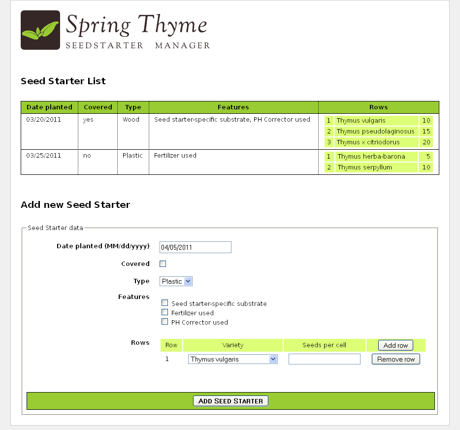

Preface
=======

This tutorial explains how Thymeleaf can be integrated with the Spring Framework, especially (but not only) Spring MVC.

Note that Thymeleaf has integrations for both versions 3.x and 4.x of the Spring Framework, provided by two
separate libraries called `thymeleaf-spring3` and `thymeleaf-spring4`. These libraries are packaged in separate
`.jar` files (`thymeleaf-spring3-{version}.jar` and `thymeleaf-spring4-{version}.jar`) and need to be added to your
classpath in order to use Thymeleaf's Spring integrations in your application.

The code samples and example application in this tutorial make use of **Spring 4.x** and its corresponding
Thymeleaf integrations, but the contents of this text are valid also for Spring 3.x. If your application uses
Spring 3.x, all you have to do is replace the `org.thymeleaf.spring4` package with `org.thymeleaf.spring3` in the
code samples. 


1 Integrating Thymeleaf with Spring
===================================

Thymeleaf offers a set of Spring integrations that allow you to use it as a
fully-featured substitute for JSP in Spring MVC applications.

These integrations will allow you to:

 * Make the mapped methods in your Spring MVC `@Controller` objects forward to
   templates managed by Thymeleaf, exactly like you do with JSPs.
 * Use **Spring Expression Language** (Spring EL) instead of OGNL in your
   templates.
 * Create forms in your templates that are completely integrated with your
   form-backing beans and result bindings, including the use of property editors, conversion services and validation error handling.
 * Display internationalization messages from message files managed by Spring
   (through the usual `MessageSource` objects).
 * Resolve your templates using Spring's own resource resolution mechanisms.

Note that in order to fully understand this tutorial, you should have first gone
through the _"Using Thymeleaf"_ tutorial, which explains the Standard Dialect in depth.


2 The SpringStandard Dialect
============================

In order to achieve an easier and better integration, Thymeleaf provides a
dialect which specifically implements all the needed features for it to work
correctly with Spring.

This specific dialect is based on the Thymeleaf Standard Dialect and is
implemented in a class called `org.thymeleaf.spring4.dialect.SpringStandardDialect`,
which in fact extends from `org.thymeleaf.standard.StandardDialect`.

Besides all the features already present in the Standard Dialect --and therefore
inherited--, the SpringStandard Dialect introduces the following specific
features:

 * Use Spring Expression Language (Spring EL or SpEL) as a variable expression
   language, instead of OGNL. Consequently, all `${...}` and `*{...}`
   expressions will be evaluated by Spring's Expression Language engine. Note also
   that support for the Spring EL compiler is available (Spring 4.2.4+).
 * Access any beans in your application context using SpringEL's syntax: `${@myBean.doSomething()}`
 * New attributes for form processing: `th:field`, `th:errors` and `th:errorclass`, besides a new
   implementation of `th:object` that allows it to be used for form command
   selection.
 * An expression object and method, `#themes.code(...)`, which is equivalent
   to the `spring:theme` JSP custom tag.
 * An expression object and method, `#mvc.uri(...)`, which is equivalent to 
   the `spring:mvcUrl(...)` JSP custom function (only in Spring 4.1+). 

Note that most of the times _you shouldn't be using this dialect directly in a normal 
`TemplateEngine` object_ as a part of its configuration. Unless you have very specific
Spring integration needs, you should instead be creating an instance of a new template
engine class that performs all the required configuration steps automatically: 
`org.thymeleaf.spring4.SpringTemplateEngine`.

An example bean configuration:

```java
@Bean
public SpringResourceTemplateResolver templateResolver(){
    // SpringResourceTemplateResolver automatically integrates with Spring's own
    // resource resolution infrastructure, which is highly recommended.
    SpringResourceTemplateResolver templateResolver = new SpringResourceTemplateResolver();
    templateResolver.setApplicationContext(this.applicationContext);
    templateResolver.setPrefix("/WEB-INF/templates/");
    templateResolver.setSuffix(".html");
    // HTML is the default value, added here for the sake of clarity.
    templateResolver.setTemplateMode(TemplateMode.HTML);
    // Template cache is true by default. Set to false if you want
    // templates to be automatically updated when modified.
    templateResolver.setCacheable(true);
    return templateResolver;
}

@Bean
public SpringTemplateEngine templateEngine(){
    // SpringTemplateEngine automatically applies SpringStandardDialect and
    // enables Spring's own MessageSource message resolution mechanisms.
    SpringTemplateEngine templateEngine = new SpringTemplateEngine();
    templateEngine.setTemplateResolver(templateResolver());
    // Enabling the SpringEL compiler with Spring 4.2.4 or newer can
    // speed up execution in most scenarios, but might be incompatible
    // with specific cases when expressions in one template are reused
    // across different data types, so this flag is "false" by default
    // for safer backwards compatibility.
    templateEngine.setEnableSpringELCompiler(true);
    return templateEngine;
}
```

Or, using Spring's XML-based configuration:

```xml
<!-- SpringResourceTemplateResolver automatically integrates with Spring's own -->
<!-- resource resolution infrastructure, which is highly recommended.          -->
<bean id="templateResolver"
       class="org.thymeleaf.spring4.templateresolver.SpringResourceTemplateResolver">
  <property name="prefix" value="/WEB-INF/templates/" />
  <property name="suffix" value=".html" />
  <!-- HTML is the default value, added here for the sake of clarity.          -->
  <property name="templateMode" value="HTML" />
  <!-- Template cache is true by default. Set to false if you want             -->
  <!-- templates to be automatically updated when modified.                    -->
  <property name="cacheable" value="true" />
</bean>
    
<!-- SpringTemplateEngine automatically applies SpringStandardDialect and      -->
<!-- enables Spring's own MessageSource message resolution mechanisms.         -->
<bean id="templateEngine"
      class="org.thymeleaf.spring4.SpringTemplateEngine">
  <property name="templateResolver" ref="templateResolver" />
  <!-- Enabling the SpringEL compiler with Spring 4.2.4 or newer can speed up  -->
  <!-- execution in most scenarios, but might be incompatible with specific    -->
  <!-- cases when expressions in one template are reused across different data -->
  <!-- ypes, so this flag is "false" by default for safer backwards            -->
  <!-- compatibility.                                                          -->
  <property name="enableSpringELCompiler" value="true" />
</bean>
```


3 Views and View Resolvers
==========================


3.1 Views and View Resolvers in Spring MVC
------------------------------------------

There are two interfaces in Spring MVC that conform the core of its templating
system:

 * `org.springframework.web.servlet.View`
 * `org.springframework.web.servlet.ViewResolver`

Views model pages in our applications and allow us to modify and predefine their
behaviour by defining them as beans. Views are in charge of rendering the actual
HTML interface, usually by the execution of some template engine like Thymeleaf.

ViewResolvers are the objects in charge of obtaining View objects for a specific
operation and locale. Typically, controllers ask ViewResolvers to forward to a
view with a specific name (a String returned by the controller method), and then
all the view resolvers in the application execute in ordered chain until one of
them is able to resolve that view, in which case a View object is returned and
control is passed to it for the renderization of HTML.

> Note that not all pages in our applications have to be defined as Views, but
> only those which behaviour we wish to be non-standard or configured in a
> specific way (for example, by wiring some special beans to it). If a
> ViewResolver is asked a view that has no corresponding bean --which is the
> common case--, a new View object is created ad hoc and returned.

A typical configuration for a JSP+JSTL ViewResolver in a Spring MVC application
from the past looked like this:

```xml
<bean class="org.springframework.web.servlet.view.InternalResourceViewResolver">
  <property name="viewClass" value="org.springframework.web.servlet.view.JstlView" />
  <property name="prefix" value="/WEB-INF/jsps/" />
  <property name="suffix" value=".jsp" />
  <property name="order" value="2" />
  <property name="viewNames" value="*jsp" />
</bean>
```

A quick look at its properties is enough to know about how it was configured:

 * `viewClass` establishes the class of the View instances. This is needed for a
   JSP resolver, but it will not be needed at all when we're working with Thymeleaf.
 * `prefix` and `suffix` work in a similar way to the attributes of the same
   names in Thymeleaf's TemplateResolver objects.
 * `order` establishes the order in which the ViewResolver will be queried in
   the chain.
 * `viewNames` allows the definition (with wildcards) of the view names that
   will be resolved by this ViewResolver.


3.2 Views and View Resolvers in Thymeleaf
-----------------------------------------

Thymeleaf offers implementations for the two interfaces mentioned above:

 * `org.thymeleaf.spring4.view.ThymeleafView`
 * `org.thymeleaf.spring4.view.ThymeleafViewResolver`

These two classes will be in charge of processing Thymeleaf templates as a
result of the execution of controllers.

Configuration of the Thymeleaf View Resolver is very similar to that of JSP:

```java
@Bean
public ThymeleafViewResolver viewResolver(){
    ThymeleafViewResolver viewResolver = new ThymeleafViewResolver();
    viewResolver.setTemplateEngine(templateEngine());
    // NOTE 'order' and 'viewNames' are optional
    viewResolver.setOrder(1);
    viewResolver.setViewNames(new String[] {".html", ".xhtml"});
    return viewResolver;
}
```

...or in XML:

```xml
<bean class="org.thymeleaf.spring4.view.ThymeleafViewResolver">
  <property name="templateEngine" ref="templateEngine" />
  <!-- NOTE 'order' and 'viewNames' are optional -->
  <property name="order" value="1" />
  <property name="viewNames" value="*.html,*.xhtml" />
</bean>
```

The `templateEngine` parameter is, of course, the `SpringTemplateEngine` object
we defined in the previous chapter. The other two (`order` and `viewNames`) are
both optional, and have the same meaning as in the JSP ViewResolver we saw
before.

Note that we do not need `prefix` or `suffix` parameters, because these are
already specified at the Template Resolver (which in turn is passed to the
Template Engine).

And what if we wanted to define a `View` bean and add some static variables to
it? Easy, just define a *prototype* bean for it:

```java
@Bean
@Scope("prototype")
public ThymeleafView mainView() {
    ThymeleafView view = new ThymeleafView("main"); // templateName = 'main'
    view.setStaticVariables(
        Collections.singletonMap("footer", "The ACME Fruit Company"));
    return view;
}
```

By doing this, you will be able to execute specifically this view bean
selecting it by bean name (`mainView`, in this case).


4 Spring Thyme Seed Starter Manager
===================================

The source code for the examples shown in this and future chapters of this guide
can be found in the [Spring Thyme Seed Starter Manager GitHub repository](https://github.com/thymeleaf/thymeleafexamples-stsm).


4.1 The Concept
---------------

At Thymeleaf we're huge fans of thyme, and every spring we prepare our seed
starting kits with good soil and our favourite seeds, place them under the
Spanish sun and patiently wait for our new plants to grow.

But this year we got fed up with sticking labels to the seed starter containers
for knowing which seed was in each cell of the container, so we decided to
prepare an application using Spring MVC and Thymeleaf to help us catalogue our
starters: _The Spring Thyme SeedStarter Manager_.



In a similar way to the Good Thymes Virtual Grocery application we developed in
the _Using Thymeleaf_ tutorial, the STSM will allow us to exemplify the most
important aspects of the integration of Thymeleaf as a template engine for
Spring MVC.


4.2 Business Layer
------------------

We will need a very simple business layer for our application. First of all,
let's have a look at our model entities:


A couple of very simple service classes will provide the required business
methods. Like:

```java
@Service
public class SeedStarterService {

    @Autowired
    private SeedStarterRepository seedstarterRepository; 

    public List<SeedStarter> findAll() {
        return this.seedstarterRepository.findAll();
    }

    public void add(final SeedStarter seedStarter) {
        this.seedstarterRepository.add(seedStarter);
    }

}
```

And:

```java
@Service
public class VarietyService {

    @Autowired
    private VarietyRepository varietyRepository; 

    public List<Variety> findAll() {
        return this.varietyRepository.findAll();
    }

    public Variety findById(final Integer id) {
        return this.varietyRepository.findById(id);
    }

}
```


4.3 Spring MVC configuration
----------------------------

Next we need to set up the Spring MVC configuration for the application, which
will include not only the standard Spring MVC artifacts like resource handling
or annotation scanning, but also the creation of the Template Engine and View
Resolver instances.

```java
@Configuration
@EnableWebMvc
@ComponentScan
public class SpringWebConfig
        extends WebMvcConfigurerAdapter implements ApplicationContextAware {

    private ApplicationContext applicationContext;


    public SpringWebConfig() {
        super();
    }


    public void setApplicationContext(final ApplicationContext applicationContext)
            throws BeansException {
        this.applicationContext = applicationContext;
    }


    /* ******************************************************************* */
    /*  GENERAL CONFIGURATION ARTIFACTS                                    */
    /*  Static Resources, i18n Messages, Formatters (Conversion Service)   */
    /* ******************************************************************* */

    @Override
    public void addResourceHandlers(final ResourceHandlerRegistry registry) {
        super.addResourceHandlers(registry);
        registry.addResourceHandler("/images/**").addResourceLocations("/images/");
        registry.addResourceHandler("/css/**").addResourceLocations("/css/");
        registry.addResourceHandler("/js/**").addResourceLocations("/js/");
    }

    @Bean
    public ResourceBundleMessageSource messageSource() {
        ResourceBundleMessageSource messageSource = new ResourceBundleMessageSource();
        messageSource.setBasename("Messages");
        return messageSource;
    }

    @Override
    public void addFormatters(final FormatterRegistry registry) {
        super.addFormatters(registry);
        registry.addFormatter(varietyFormatter());
        registry.addFormatter(dateFormatter());
    }

    @Bean
    public VarietyFormatter varietyFormatter() {
        return new VarietyFormatter();
    }

    @Bean
    public DateFormatter dateFormatter() {
        return new DateFormatter();
    }


    /* **************************************************************** */
    /*  THYMELEAF-SPECIFIC ARTIFACTS                                    */
    /*  TemplateResolver <- TemplateEngine <- ViewResolver              */
    /* **************************************************************** */

    @Bean
    public SpringResourceTemplateResolver templateResolver(){
        // SpringResourceTemplateResolver automatically integrates with Spring's own
        // resource resolution infrastructure, which is highly recommended.
        SpringResourceTemplateResolver templateResolver = new SpringResourceTemplateResolver();
        templateResolver.setApplicationContext(this.applicationContext);
        templateResolver.setPrefix("/WEB-INF/templates/");
        templateResolver.setSuffix(".html");
        // HTML is the default value, added here for the sake of clarity.
        templateResolver.setTemplateMode(TemplateMode.HTML);
        // Template cache is true by default. Set to false if you want
        // templates to be automatically updated when modified.
        templateResolver.setCacheable(true);
        return templateResolver;
    }

    @Bean
    public SpringTemplateEngine templateEngine(){
        // SpringTemplateEngine automatically applies SpringStandardDialect and
        // enables Spring's own MessageSource message resolution mechanisms.
        SpringTemplateEngine templateEngine = new SpringTemplateEngine();
        templateEngine.setTemplateResolver(templateResolver());
        // Enabling the SpringEL compiler with Spring 4.2.4 or newer can
        // speed up execution in most scenarios, but might be incompatible
        // with specific cases when expressions in one template are reused
        // across different data types, so this flag is "false" by default
        // for safer backwards compatibility.
        templateEngine.setEnableSpringELCompiler(true);
        return templateEngine;
    }

    @Bean
    public ThymeleafViewResolver viewResolver(){
        ThymeleafViewResolver viewResolver = new ThymeleafViewResolver();
        viewResolver.setTemplateEngine(templateEngine());
        return viewResolver;
    }

}
```


4.4 The Controller
------------------

Of course, we will also need a controller for our application. As the STSM will
only contain one web page with a list of seed starters and a form for adding new
ones, we will write only one controller class for all the server interactions:

```java
@Controller
public class SeedStarterMngController {

    @Autowired
    private VarietyService varietyService;
    
    @Autowired
    private SeedStarterService seedStarterService;

    ...

}
```

Now let's see what we can add to this controller class.


### Model Attributes

First we will add some model attributes that we will need in the page:

```java
@ModelAttribute("allTypes")
public List<Type> populateTypes() {
    return Arrays.asList(Type.ALL);
}
    
@ModelAttribute("allFeatures")
public List<Feature> populateFeatures() {
    return Arrays.asList(Feature.ALL);
}
    
@ModelAttribute("allVarieties")
public List<Variety> populateVarieties() {
    return this.varietyService.findAll();
}
    
@ModelAttribute("allSeedStarters")
public List<SeedStarter> populateSeedStarters() {
    return this.seedStarterService.findAll();
}
```


### Mapped methods

And now the most important part of a controller, the mapped methods: one for
showing the form page, and another one for processing the addition of new `SeedStarter`
objects.

```java
@RequestMapping({"/","/seedstartermng"})
public String showSeedstarters(final SeedStarter seedStarter) {
    seedStarter.setDatePlanted(Calendar.getInstance().getTime());
    return "seedstartermng";
}

@RequestMapping(value="/seedstartermng", params={"save"})
public String saveSeedstarter(
        final SeedStarter seedStarter, final BindingResult bindingResult, final ModelMap model) {
    if (bindingResult.hasErrors()) {
        return "seedstartermng";
    }
    this.seedStarterService.add(seedStarter);
    model.clear();
    return "redirect:/seedstartermng";
}
```


4.5 Configuring a Conversion Service
------------------------------------

In order to allow easy formatting of `Date` and also `Variety` objects in our view layer, we 
configured our application so that a Spring `ConversionService` object was created and
initialized (by the `WebMvcConfigurerAdapter` we extend) with a couple of *formatter*
objects we will need. See it again:

```java
@Override
public void addFormatters(final FormatterRegistry registry) {
    super.addFormatters(registry);
    registry.addFormatter(varietyFormatter());
    registry.addFormatter(dateFormatter());
}

@Bean
public VarietyFormatter varietyFormatter() {
    return new VarietyFormatter();
}

@Bean
public DateFormatter dateFormatter() {
    return new DateFormatter();
}
```

Spring *formatters* are implementations of the `org.springframework.format.Formatter` 
interface. For more information on how the Spring conversion infrastructure works, 
see the docs at [spring.io](http://docs.spring.io/spring/docs/4.3.x/spring-framework-reference/html/validation.html#core-convert).

Let's have a look at the `DateFormatter`, which formats dates according to a format 
string present at the `date.format` message key of our `Messages.properties`:

```java
public class DateFormatter implements Formatter<Date> {

    @Autowired
    private MessageSource messageSource;


    public DateFormatter() {
        super();
    }

    public Date parse(final String text, final Locale locale) throws ParseException {
        final SimpleDateFormat dateFormat = createDateFormat(locale);
        return dateFormat.parse(text);
    }

    public String print(final Date object, final Locale locale) {
        final SimpleDateFormat dateFormat = createDateFormat(locale);
        return dateFormat.format(object);
    }

    private SimpleDateFormat createDateFormat(final Locale locale) {
        final String format = this.messageSource.getMessage("date.format", null, locale);
        final SimpleDateFormat dateFormat = new SimpleDateFormat(format);
        dateFormat.setLenient(false);
        return dateFormat;
    }

}
```

The `VarietyFormatter` automatically converts between our `Variety` entities and the way we want to use them in our forms (basically, by their `id` field values):

```java
public class VarietyFormatter implements Formatter<Variety> {

    @Autowired
    private VarietyService varietyService;


    public VarietyFormatter() {
        super();
    }

    public Variety parse(final String text, final Locale locale) throws ParseException {
        final Integer varietyId = Integer.valueOf(text);
        return this.varietyService.findById(varietyId);
    }


    public String print(final Variety object, final Locale locale) {
        return (object != null ? object.getId().toString() : "");
    }

}
```

We will learn more on how these formatters affect the way our data is displayed later on. 


5 Listing Seed Starter Data
===========================

The first thing that our `/WEB-INF/templates/seedstartermng.html` page will show
is a listing with the seed starters currently stored. For this we will need some
externalized messages and also some expression evaluation on model attributes.
Like this:

```html
<div class="seedstarterlist" th:unless="${#lists.isEmpty(allSeedStarters)}">
    
  <h2 th:text="#{title.list}">List of Seed Starters</h2>
  
  <table>
    <thead>
      <tr>
        <th th:text="#{seedstarter.datePlanted}">Date Planted</th>
        <th th:text="#{seedstarter.covered}">Covered</th>
        <th th:text="#{seedstarter.type}">Type</th>
        <th th:text="#{seedstarter.features}">Features</th>
        <th th:text="#{seedstarter.rows}">Rows</th>
      </tr>
    </thead>
    <tbody>
      <tr th:each="sb : ${allSeedStarters}">
        <td th:text="${{sb.datePlanted}}">13/01/2011</td>
        <td th:text="#{|bool.${sb.covered}|}">yes</td>
        <td th:text="#{|seedstarter.type.${sb.type}|}">Wireframe</td>
        <td th:text="${#strings.arrayJoin(
                           #messages.arrayMsg(
                               #strings.arrayPrepend(sb.features,'seedstarter.feature.')),
                           ', ')}">Electric Heating, Turf</td>
        <td>
          <table>
            <tbody>
              <tr th:each="row,rowStat : ${sb.rows}">
                <td th:text="${rowStat.count}">1</td>
                <td th:text="${row.variety.name}">Thymus Thymi</td>
                <td th:text="${row.seedsPerCell}">12</td>
              </tr>
            </tbody>
          </table>
        </td>
      </tr>
    </tbody>
  </table>
</div>
```

Lots to see here. Let's have a look at each fragment separately.

First of all, this section will only be shown if there are any seed starters. We
achieve that with a th:unless attribute and the `#lists.isEmpty(...)` function.

```html
<div class="seedstarterlist" th:unless="${#lists.isEmpty(allSeedStarters)}">
```

Note that all utility objects like `#lists` are available in Spring EL
expressions just as they were in OGNL expressions in the Standard Dialect.

The next thing to see is a lot of internationalized (externalized) texts, like:

```html
<h2 th:text="#{title.list}">List of Seed Starters</h2>

<table>
  <thead>
    <tr>
      <th th:text="#{seedstarter.datePlanted}">Date Planted</th>
      <th th:text="#{seedstarter.covered}">Covered</th>
      <th th:text="#{seedstarter.type}">Type</th>
      <th th:text="#{seedstarter.features}">Features</th>
      <th th:text="#{seedstarter.rows}">Rows</th>
      ...
```

This being a Spring MVC application, we already defined a `MessageSource` bean
in our Spring configuration (`MessageSource` objects are the standard way of
managing externalized texts in Spring MVC):

```java
@Bean
public ResourceBundleMessageSource messageSource() {
    ResourceBundleMessageSource messageSource = new ResourceBundleMessageSource();
    messageSource.setBasename("Messages");
    return messageSource;
}
```

...and that `basename` property indicates that we will have files like `Messages_es.properties`
or `Messages_en.properties` in our classpath. Let's have a look at the Spanish
version:

```properties
title.list=Lista de semilleros

date.format=dd/MM/yyyy
bool.true=sí
bool.false=no

seedstarter.datePlanted=Fecha de plantación
seedstarter.covered=Cubierto
seedstarter.type=Tipo
seedstarter.features=Características
seedstarter.rows=Filas

seedstarter.type.WOOD=Madera
seedstarter.type.PLASTIC=Plástico

seedstarter.feature.SEEDSTARTER_SPECIFIC_SUBSTRATE=Sustrato específico para semilleros
seedstarter.feature.FERTILIZER=Fertilizante
seedstarter.feature.PH_CORRECTOR=Corrector de PH
```

In the first column of the table listing we will show the date when the seed
starter was prepared. But **we will show it formatted** in the way we defined 
in our `DateFormatter`. In order to do that we will use the double-brace 
syntax (`${{...}}`), which will automatically apply the Spring Conversion Service,
including the `DateFormatter` we registered at configuration.

```html
<td th:text="${{sb.datePlanted}}">13/01/2011</td>
```

Next is showing whether the seed starter container is covered or not, by
transforming the value of the boolean covered bean property into an
internationalized _"yes"_ or _"no"_ with a literal substitution expression:

```html
<td th:text="#{|bool.${sb.covered}|}">yes</td>
```

Now we have to show the type of seed starter container. Type is a java enum with
two values (`WOOD` and `PLASTIC`), and that's why we defined two properties in
our `Messages` file called `seedstarter.type.WOOD` and `seedstarter.type.PLASTIC`.

But in order to obtain the internationalized names of the types, we will need to
add the `seedstarter.type.` prefix to the enum value by means of an expression,
which result we will then use as the message key:

```html
<td th:text="#{|seedstarter.type.${sb.type}|}">Wireframe</td>
```

The most difficult part of this listing is the _features_ column. In it we want
to display all the features of our container ---that come in the form of an array
of `Feature` enums---, separated by commas. Like _"Electric Heating, Turf"_.

Note that this is particularly difficult because these enum values also need to
be externalized, as we did with Types. The flow is then:

1. Prepend the corresponding prefix to all the elements of the `features` array.
2. Obtain the externalized messages corresponding to all the keys from step 1.
3. Join all the messages obtained in step 2, using a comma as a delimiter.

For achieving this, we create the following code:

```html
<td th:text="${#strings.arrayJoin(
                   #messages.arrayMsg(
                       #strings.arrayPrepend(sb.features,'seedstarter.feature.')),
                   ', ')}">Electric Heating, Turf</td>
```

The last column of our listing will be quite simple, in fact. Even if it has a
nested table for showing the contents of each row in the container:

```html
<td>
  <table>
    <tbody>
      <tr th:each="row,rowStat : ${sb.rows}">
        <td th:text="${rowStat.count}">1</td>
        <td th:text="${row.variety.name}">Thymus Thymi</td>
        <td th:text="${row.seedsPerCell}">12</td>
      </tr>
    </tbody>
  </table>
</td>
```


6 Creating a Form
=================


6.1 Handling the command object
-------------------------------

_Command object_ is the name Spring MVC gives to form-backing beans, this is, to
objects that model a form's fields and provide getter and setter methods that
will be used by the framework for establishing and obtaining the values input by
the user at the browser side.

Thymeleaf requires you to specify the command object by using a `th:object`
attribute in your `<form>` tag:

```html
<form action="#" th:action="@{/seedstartermng}" th:object="${seedStarter}" method="post">
    ...
</form>
```

This is consistent with other uses of `th:object,` but in fact this
specific scenario adds some limitations in order to correctly integrate with
Spring MVC's infrastructure:

 * Values for `th:object` attributes in form tags must be variable expressions (`${...}`)
   specifying only the name of a model attribute, without property navigation.
   This means that an expression like `${seedStarter}` is valid, but `${seedStarter.data}`
   would not be.
 * Once inside the `<form>` tag, no other `th:object` attribute can be specified.
   This is consistent with the fact that HTML forms cannot be nested.


6.2 Inputs
----------

Let's see now how to add an input to our form:

```html
<input type="text" th:field="*{datePlanted}" />
```

As you can see, we are introducing a new attribute here: `th:field.` This is a
very important feature for Spring MVC integration because it does all the heavy
work of binding your input with a property in the form-backing bean. You can see
it as an equivalent of the path attribute in a <form:input> tag from Spring
MVC's JSP tag library.

The `th:field` attribute behaves differently depending on whether it is attached
to an `<input>`, `<select>` or `<textarea>` tag (and also depending on the
specific type of `<input>` tag). In this case (`input[type=text]`), the above
line of code is similar to:

```html
<input type="text" id="datePlanted" name="datePlanted" th:value="*{datePlanted}" />
```

...but in fact it is a little bit more than that, because `th:field` will also apply the registered Spring Conversion Service, including the `DateFormatter` we saw before (even if the field expression is not double-bracketed). Thanks to this, the date will be shown correctly formatted.

Values for `th:field` attributes must be selection expressions (`*{...}`), which
makes sense given the fact that they will be evaluated on the form-backing bean
and not on the context variables (or model attributes in Spring MVC jargon).

Contrary to the ones in `th:object`, these expressions can include property
navigation (in fact any expression allowed for the path attribute of a `<form:input>`
JSP tag will be allowed here).

Note that `th:field` also understands the new types of `<input>` element
introduced by HTML5 like `<input type="datetime" ... />`, `<input type="color" ... />`,
etc., effectively adding complete HTML5 support to Spring MVC.


6.3 Checkbox fields
-------------------

`th:field` also allows us to define checkbox inputs. Let's see an example from
our HTML page:

```html
<div>
  <label th:for="${#ids.next('covered')}" th:text="#{seedstarter.covered}">Covered</label>
  <input type="checkbox" th:field="*{covered}" />
</div>
```

Note there's some fine stuff here besides the checkbox itself, like an
externalized label and also the use of the `#ids.next('covered')` function for
obtaining the value that will be applied to the id attribute of the checkbox
input.

Why do we need this dynamic generation of an id attribute for this field?
Because checkboxes are potentially multi-valued, and thus their id values will
always be suffixed a sequence number (by internally using the `#ids.seq(...)`
function) in order to ensure that each of the checkbox inputs for the same
property has a different id value.

We can see this more easily if we look at such a multi-valued checkbox field:

```html
<ul>
  <li th:each="feat : ${allFeatures}">
    <input type="checkbox" th:field="*{features}" th:value="${feat}" />
    <label th:for="${#ids.prev('features')}" 
           th:text="#{${'seedstarter.feature.' + feat}}">Heating</label>
  </li>
</ul>
```

Note that we've added a `th:value` attribute this time, because the features
field is not a boolean like covered was, but instead is an array of values.

Let's see the HTML output generated by this code:

```html
<ul>
  <li>
    <input id="features1" name="features" type="checkbox" value="SEEDSTARTER_SPECIFIC_SUBSTRATE" />
    <input name="_features" type="hidden" value="on" />
    <label for="features1">Seed starter-specific substrate</label>
  </li>
  <li>
    <input id="features2" name="features" type="checkbox" value="FERTILIZER" />
    <input name="_features" type="hidden" value="on" />
    <label for="features2">Fertilizer used</label>
  </li>
  <li>
    <input id="features3" name="features" type="checkbox" value="PH_CORRECTOR" />
    <input name="_features" type="hidden" value="on" />
    <label for="features3">PH Corrector used</label>
  </li>
</ul>
```

We can see here how a sequence suffix is added to each input's id attribute, and
how the `#ids.prev(...)` function allows us to retrieve the last sequence value
generated for a specific input id.

> Don't worry about those hidden inputs with `name="_features"`: they are
> automatically added in order to avoid problems with browsers not sending
> unchecked checkbox values to the server upon form submission.

Also note that if our features property contained some selected values in our
form-backing bean, `th:field`would have taken care of that and would have added
a `checked="checked"` attribute to the corresponding input tags.


6.4 Radio Button fields
-----------------------

Radio button fields are specified in a similar way to non-boolean (multi-valued)
checkboxes ---except that they are not multivalued, of course:

```html
<ul>
  <li th:each="ty : ${allTypes}">
    <input type="radio" th:field="*{type}" th:value="${ty}" />
    <label th:for="${#ids.prev('type')}" th:text="#{${'seedstarter.type.' + ty}}">Wireframe</label>
  </li>
</ul>
```


6.5 Dropdown/List selectors
---------------------------

Select fields have two parts: the `<select>` tag and its nested `<option>` tags.
When creating this kind of field, only the `<select>` tag has to include a `th:field`
attribute, but the `th:value` attributes in the nested `<option>` tags will be
very important because they will provide the means of knowing which is the
currently selected option (in a similar way to non-boolean checkboxes and radio
buttons).

Let's re-build the type field as a dropdown select:

```html
<select th:field="*{type}">
  <option th:each="type : ${allTypes}" 
          th:value="${type}" 
          th:text="#{${'seedstarter.type.' + type}}">Wireframe</option>
</select>
```

At this point, understanding this piece of code is quite easy. Just notice how
attribute precedence allows us to set the `th:each` attribute in the `<option>`
tag itself.


6.6 Dynamic fields
------------------

Thanks to the advanced form-field binding capabilities in Spring MVC, we can use
complex Spring EL expressions to bind dynamic form fields to our form-backing
bean. This will allow us to create new Row objects in our `SeedStarter` bean,
and to add those rows' fields to our form at user request. 

In order to do this, we will need a couple of new mapped methods in our
controller, which will add or remove a row from our `SeedStarter` depending on
the existence of specific request parameters:

```java
@RequestMapping(value="/seedstartermng", params={"addRow"})
public String addRow(final SeedStarter seedStarter, final BindingResult bindingResult) {
    seedStarter.getRows().add(new Row());
    return "seedstartermng";
}

@RequestMapping(value="/seedstartermng", params={"removeRow"})
public String removeRow(
        final SeedStarter seedStarter, final BindingResult bindingResult, 
        final HttpServletRequest req) {
    final Integer rowId = Integer.valueOf(req.getParameter("removeRow"));
    seedStarter.getRows().remove(rowId.intValue());
    return "seedstartermng";
}
```

And now we can add a dynamic table to our form:

```html
<table>
  <thead>
    <tr>
      <th th:text="#{seedstarter.rows.head.rownum}">Row</th>
      <th th:text="#{seedstarter.rows.head.variety}">Variety</th>
      <th th:text="#{seedstarter.rows.head.seedsPerCell}">Seeds per cell</th>
      <th>
        <button type="submit" name="addRow" th:text="#{seedstarter.row.add}">Add row</button>
      </th>
    </tr>
  </thead>
  <tbody>
    <tr th:each="row,rowStat : *{rows}">
      <td th:text="${rowStat.count}">1</td>
      <td>
        <select th:field="*{rows[__${rowStat.index}__].variety}">
          <option th:each="var : ${allVarieties}" 
                  th:value="${var.id}" 
                  th:text="${var.name}">Thymus Thymi</option>
        </select>
      </td>
      <td>
        <input type="text" th:field="*{rows[__${rowStat.index}__].seedsPerCell}" />
      </td>
      <td>
        <button type="submit" name="removeRow" 
                th:value="${rowStat.index}" th:text="#{seedstarter.row.remove}">Remove row</button>
      </td>
    </tr>
  </tbody>
</table>
```

Quite a lot of things to see here, but not much we should not understand by now...
except for one `strange` thing:

```html
<select th:field="*{rows[__${rowStat.index}__].variety}">

    ...

</select>
```

If you recall from the _"Using Thymeleaf"_ tutorial, that `__${...}__` syntax is
a preprocessing expression, which is an inner expression that is evaluated
before actually evaluating the whole expression. But why that way of specifying
the row index? Wouldn't it be enough with:

```html
<select th:field="*{rows[rowStat.index].variety}">

    ...

</select>
```

...well, actually, no. The problem is that Spring EL does not evaluate variables
inside array index brackets, so when executing the above expression we would
obtain an error telling us that `rows[rowStat.index]` (instead of `rows[0]`,
`rows[1]`, etc) is not a valid position in the rows collection. That's why
preprocessing is needed here.

Let's have a look at a fragment of the resulting HTML after pressing _"Add Row"_
a couple of times:

```html
<tbody>
  <tr>
    <td>1</td>
    <td>
      <select id="rows0.variety" name="rows[0].variety">
        <option selected="selected" value="1">Thymus vulgaris</option>
        <option value="2">Thymus x citriodorus</option>
        <option value="3">Thymus herba-barona</option>
        <option value="4">Thymus pseudolaginosus</option>
        <option value="5">Thymus serpyllum</option>
      </select>
    </td>
    <td>
      <input id="rows0.seedsPerCell" name="rows[0].seedsPerCell" type="text" value="" />
    </td>
    <td>
      <button name="removeRow" type="submit" value="0">Remove row</button>
    </td>
  </tr>
  <tr>
    <td>2</td>
    <td>
      <select id="rows1.variety" name="rows[1].variety">
        <option selected="selected" value="1">Thymus vulgaris</option>
        <option value="2">Thymus x citriodorus</option>
        <option value="3">Thymus herba-barona</option>
        <option value="4">Thymus pseudolaginosus</option>
        <option value="5">Thymus serpyllum</option>
      </select>
    </td>
    <td>
      <input id="rows1.seedsPerCell" name="rows[1].seedsPerCell" type="text" value="" />
    </td>
    <td>
      <button name="removeRow" type="submit" value="1">Remove row</button>
    </td>
  </tr>
</tbody>
```


7 Validation and Error Messages
===============================

Most of our forms will need to show validation messages in order to inform the
user of the errors he/she has made.

Thymeleaf offers some tools for this: a couple of functions in the `#fields`
object, the `th:errors` and the `th:errorclass` attributes.


7.1 Field errors
----------------

Let's see how we could set a specific CSS class to a field if it has an error:

```html
<input type="text" th:field="*{datePlanted}" 
                   th:class="${#fields.hasErrors('datePlanted')}? fieldError" />
```

As you can see, the `#fields.hasErrors(...)` function receives the field
expression as a parameter (`datePlanted`), and returns a boolean telling whether any validation
errors exist for that field.

We could also obtain all the errors for that field and iterate them:

```html
<ul>
  <li th:each="err : ${#fields.errors('datePlanted')}" th:text="${err}" />
</ul>
```

Instead of iterating, we could have also used `th:errors`, a specialized attribute which builds a list with all the errors for the specified selector, separated by `<br />`:

```html
<input type="text" th:field="*{datePlanted}" />
<p th:if="${#fields.hasErrors('datePlanted')}" th:errors="*{datePlanted}">Incorrect date</p>
```


### Simplifying error-based CSS styling: `th:errorclass`

The example we saw above, *setting a CSS class to a form input if that field has errors*, is so common that Thymeleaf offers a specific attribute for doing exacly that: `th:errorclass`.

Applied to a form field tag (input, select, textarea...), it will read the name of the field to be examined from any existing `name` or `th:field` attributes in the same tag, and then append the specified CSS class to the tag if such field has any associated errors:

```html
<input type="text" th:field="*{datePlanted}" class="small" th:errorclass="fieldError" />
```

If `datePlanted` has errors, this will render as:

```html
<input type="text" id="datePlanted" name="datePlanted" value="2013-01-01" class="small fieldError" />
```


7.2 All errors
--------------

And what if we want to show all the errors in the form? We just need to query the `#fields.hasErrors(...)` and `#fields.errors(...)` methods with the `'*'` or `'all'` constants (which are equivalent):

```html
<ul th:if="${#fields.hasErrors('*')}">
  <li th:each="err : ${#fields.errors('*')}" th:text="${err}">Input is incorrect</li>
</ul>
```

As in the examples above, we could obtain all the errors and iterate them...

```html
<ul>
  <li th:each="err : ${#fields.errors('*')}" th:text="${err}" />
</ul>
```
...as well as build a `<br />`-separated list:

```html
<p th:if="${#fields.hasErrors('all')}" th:errors="*{all}">Incorrect date</p>
```

Finally note that `#fields.hasErrors('*')` is equivalent to `#fields.hasAnyErrors()` and `#fields.errors('*')` is equivalent to `#fields.allErrors()`. Use whichever syntax you prefer:

```html
<div th:if="${#fields.hasAnyErrors()}">
  <p th:each="err : ${#fields.allErrors()}" th:text="${err}">...</p>
</div>
```


7.3 Global errors
-----------------

There is a third type of error in a Spring form: *global* errors. These are errors that are not associated with any specific fields in the form, but still exist.

Thymeleaf offers the `global` constant for accessing these errors:

```html
<ul th:if="${#fields.hasErrors('global')}">
  <li th:each="err : ${#fields.errors('global')}" th:text="${err}">Input is incorrect</li>
</ul>
```

```html
<p th:if="${#fields.hasErrors('global')}" th:errors="*{global}">Incorrect date</p>
```

...as well as equivalent `#fields.hasGlobalErrors()` and `#fields.globalErrors()` convenience methods: 

```html
<div th:if="${#fields.hasGlobalErrors()}">
  <p th:each="err : ${#fields.globalErrors()}" th:text="${err}">...</p>
</div>
```


7.4 Displaying errors outside forms
-----------------------------------

Form validation errors can also be displayed outside forms by using variable (`${...}`) instead of selection (`*{...}`) expressions and prefixing the name of the form-backing bean: 

```html
<div th:errors="${myForm}">...</div>
<div th:errors="${myForm.date}">...</div>
<div th:errors="${myForm.*}">...</div>

<div th:if="${#fields.hasErrors('${myForm}')}">...</div>
<div th:if="${#fields.hasErrors('${myForm.date}')}">...</div>
<div th:if="${#fields.hasErrors('${myForm.*}')}">...</div>

<form th:object="${myForm}">
    ...
</form>
```


7.5 Rich error objects
----------------------

Thymeleaf offers the possibility to obtain form error information in the form of beans (instead of mere *strings*), with the `fieldName` (String), `message` (String) and `global` (boolean) attributes.

These errors can be obtained by means of the `#fields.detailedErrors()` utility method:

```html
<ul>
    <li th:each="e : ${#fields.detailedErrors()}" th:class="${e.global}? globalerr : fielderr">
        <span th:text="${e.global}? '*' : ${e.fieldName}">The field name</span> |
        <span th:text="${e.message}">The error message</span>
    </li>
</ul>
```


8 It's still a Prototype!
=========================

Our application is ready now. But let's have a second look at the `.html` page
we created...

One of the nicest consequences of working with Thymeleaf is that after all this
functionality we have added to our HTML, we can still use it as a prototype (we say it is a _Natural Template_). Let's open `seedstartermng.html` directly in our browser without executing our application:


There it is! It's not a working application, it's not real data... but it is a
perfectly valid prototype made up of perfectly displayable HTML code.


9 The Conversion Service
========================

9.1 Configuration
-----------------

As explained before, Thymeleaf can make use of a Conversion Service registered at the Application Context. Our
application configuration class, by extending Spring's own `WebMvcConfigurerAdapter` helper, will automatically
register such conversion service, which we can configure by adding the *formatters* that we need. Let's see 
again what it looks like:

```java
@Override
public void addFormatters(final FormatterRegistry registry) {
    super.addFormatters(registry);
    registry.addFormatter(varietyFormatter());
    registry.addFormatter(dateFormatter());
}

@Bean
public VarietyFormatter varietyFormatter() {
    return new VarietyFormatter();
}

@Bean
public DateFormatter dateFormatter() {
    return new DateFormatter();
}
```

9.1 Double-brace syntax
-----------------------

The Conversion Service can be easily applied in order to convert/format any object into String. This 
is done by means of the double-brace expression syntax:

  * For variable expressions: `${{...}}`
  * For selection expressions: `*{{...}}`
  
So, for example, given an Integer-to-String converter that adds commas as a thousands separator, this:

```html
<p th:text="${val}">...</p>
<p th:text="${{val}}">...</p>
```

...should result in:

```html
<p>1234567890</p>
<p>1,234,567,890</p>
```


9.2 Use in forms
----------------


We saw before that every `th:field` attribute will always apply the conversion service, so this:

```html
<input type="text" th:field="*{datePlanted}" />
```

...is actually equivalent to:

```html
<input type="text" th:field="*{{datePlanted}}" />
```

Note that, per requirement of Spring, this is the only scenario in which the Conversion Service 
is applied in expressions using single-brace syntax.


9.3 `#conversions` utility object
--------------------------------- 

The `#conversions` expression utility object allows the manual execution of the Conversion Service wherever needed:

```html
<p th:text="${'Val: ' + #conversions.convert(val,'String')}">...</p>
```

Syntax for this utility object:

  * `#conversions.convert(Object,Class)`: converts the object to the specified class.
  * `#conversions.convert(Object,String)`: same as above, but specifying the target class as a String (note the `java.lang.` package can be ommitted).


10 Rendering Template Fragments
===============================

Thymeleaf offers the possibility to render only part of a template as the result of its execution: a *fragment*. 

This can be a useful componentization tool. For example, it can be used at controllers that execute on AJAX calls, which might return markup fragments of a page that is already loaded at the browser (for updating a select, enabling/disabling buttons...).

Fragmentary rendering can be achieved by using Thymeleaf's *fragment specs*: objects implementing the `org.thymeleaf.fragment.IFragmentSpec` interface.

The most common of these implementations is `org.thymeleaf.standard.fragment.StandardDOMSelectorFragmentSpec`, which allows specifying a fragment using a DOM Selector exactly like the ones used at `th:include` or `th:replace`.


10.1 Specifying fragments in view beans
----------------------------------------

*View beans* are beans of the `org.thymeleaf.spring4.view.ThymeleafView` class declared at the application 
context (`@Bean` declarations if you are using Java configuration). They allow the specification of fragments like this:

```java
@Bean(name="content-part")
@Scope("prototype")
public ThymeleafView someViewBean() {
    ThymeleafView view = new ThymeleafView("index"); // templateName = 'index'
    view.setMarkupSelector("content");
    return view;
}
``` 

Given the above bean definition, if our controller returns `content-part` (the name of the above bean)...

```java    
@RequestMapping("/showContentPart")
public String showContentPart() {
    ...
    return "content-part";
}
```

...thymeleaf will return only the `content` fragment of the `index` template -- which location will 
probably be something like `/WEB-INF/templates/index.html`, once prefix and suffix are applied. So 
the result will be completely equivalent to specifying `index :: content`:

```html
<!DOCTYPE html>
<html>
  ...
  <body>
    ...
    <div th:fragment="content">
      Only this div will be rendered!
    </div>
    ...
  </body>
</html>
```

Note also that, thanks to the power of Thymeleaf Markup Selectors, we could select a fragment in a 
template without needing any `th:fragment` attributes at all. Let's use the `id` attribute, for example:

```xml
@Bean(name="content-part")
@Scope("prototype")
public ThymeleafView someViewBean() {
    ThymeleafView view = new ThymeleafView("index"); // templateName = 'index'
    view.setMarkupSelector("#content");
    return view;
}
``` 

...which will perfectly select:

```html
<!DOCTYPE html>
<html>
  ...
  <body>
    ...
    <div id="content">
      Only this div will be rendered!
    </div>
    ...
  </body>
</html>
```


10.2 Specifying fragments in controller return values
---------------------------------------------------

Instead of declaring *view beans*, fragments can be specified from the controllers themselves by using the 
syntax of *fragment expressions*. Just like in `th:insert` or `th:replace` attributes:

```java    
@RequestMapping("/showContentPart")
public String showContentPart() {
    ...
    return "index :: content";
}
```

Of course, again the full power of DOM Selectors is available, so we could select our fragment based on 
standard HTML attributes, like `id="content"`:

```java    
@RequestMapping("/showContentPart")
public String showContentPart() {
    ...
    return "index :: #content";
}
```

And we can also use parameters, like:

```java    
@RequestMapping("/showContentPart")
public String showContentPart() {
    ...
    return "index :: #content ('myvalue')";
}
```


11 Advanced Integration Features
================================


11.1 Integration with `RequestDataValueProcessor`
-------------------------------------------------

Thymeleaf seamlessly integrates with Spring's `RequestDataValueProcessor` interface. This interface allows the interception of link URLs, form URLs and form field values before they are written to the markup result, as well as transparently adding hidden form fields that enable security features like e.g. protection agains CSRF (Cross-Site Request Forgery).

An implementation of `RequestDataValueProcessor` can be easily configured at the Application Context. It needs to implement
the `org.springframework.web.servlet.support.RequestDataValueProcessor` interface and have 
`requestDataValueProcessor` as a bean name:

```java
@Bean
public RequestDataValueProcessor requestDataValueProcessor() {
  return new MyRequestDataValueProcessor();
}
```

...and Thymeleaf will use it this way:

  * `th:href` and `th:src` call `RequestDataValueProcessor.processUrl(...)` before rendering the URL.

  * `th:action` calls `RequestDataValueProcessor.processAction(...)` before rendering the form's `action` attribute, and additionally it detects when this attribute is being applied on a `<form>` tag ---which should be the only place, anyway---, and in such case calls `RequestDataValueProcessor.getExtraHiddenFields(...)` and adds the returned hidden fields just before the closing `</form>` tag.

  * `th:value` calls `RequestDataValueProcessor.processFormFieldValue(...)` for rendering the value it refers to, unless there is a `th:field` present in the same tag (in which case `th:field` will take care).

  * `th:field` calls `RequestDataValueProcessor.processFormFieldValue(...)` for rendering the value of the field it applies to (or the tag body if it is a `<textarea>`).


> Note there are very few scenarios in which you would need to explicitly implement `RequestDataValueProcessor`
> in your application. In most cases, this will be used automatically by security libraries you transparently use, 
> like e.g. Spring Security's CSRF support.


11.1 Building URIs to controllers
---------------------------------

Since version 4.1, Spring allows the possibility to build links to annotated controllers directly from views, without the 
need to know the URIs these controllers are mapped to.

In Thymeleaf, this can be achieved by means of the `#mvc.url(...)` expression object method, which allows the 
specification of controller methods by the capital letters of the controller class they are in, followed by 
the name of the method itself. This is equivalent to JSP's `spring:mvcUrl(...)` custom function. 

For example, for:
```java
public class ExampleController {

    @RequestMapping("/data")
    public String getData(Model model) { ... return "template" }

    @RequestMapping("/data")
    public String getDataParam(@RequestParam String type) { ... return "template" }

}
```
The following code will create a link to it:
```html
<a th:href="${(#mvc.url('EC#getData')).build()}">Get Data Param</a>
<a th:href="${(#mvc.url('EC#getDataParam').arg(0,'internal')).build()}">Get Data Param</a>
``` 

You can read more about this mechanism 
at http://docs.spring.io/spring-framework/docs/4.1.2.RELEASE/spring-framework-reference/html/mvc.html#mvc-links-to-controllers-from-views


12 Spring WebFlow integration
============================


12.1 Basic configuration
-----------------------

The Thymeleaf + Spring integration packages include integration with Spring
WebFlow (2.3+).

WebFlow includes some AJAX capabilities for rendering fragments of the displayed
page when specific events (_transitions_) are triggered, and in order to enable
Thymeleaf to attend these AJAX requests, we will have to use a different `ViewResolver`
implementation, configured like this:

```xml
<bean id="thymeleafViewResolver" class="org.thymeleaf.spring4.view.AjaxThymeleafViewResolver">
    <property name="viewClass" value="org.thymeleaf.spring4.view.FlowAjaxThymeleafView" />
    <property name="templateEngine" ref="templateEngine" />
</bean>
```

...and then this `ViewResolver` can be configured at your WebFlow `ViewFactoryCreator`
like:

```xml
<bean id="mvcViewFactoryCreator" 
      class="org.springframework.webflow.mvc.builder.MvcViewFactoryCreator">
    <property name="viewResolvers" ref="thymeleafViewResolver"/>
</bean>
```

From here on, you can specify Thymeleaf templates in your view-state's:

```xml
<view-state id="detail" view="bookingDetail">
    ...
</view-state>
```

In the above example, `bookingDetail` is a Thymeleaf template specified in the
usual way, understandable by any of the _Template Resolvers_ configured at the `TemplateEngine`.


12.2 AJAX fragments in Spring WebFlow
-------------------------------------

> Note that what is explained here is just the way to create AJAX fragments to be used
> with Spring WebFlow. If you are not using WebFlow, creating a Spring MVC controller that
> responds to an AJAX request and returns a chunk of HTML is as straightforward as creating
> any other template-returning controller, with the only exception that you would probably
> be returning a fragment like `"main :: admin"` from your controller method.

WebFlow allows the specification of fragments to be rendered via AJAX with `<render>`
tags, like this:

```xml
<view-state id="detail" view="bookingDetail">
    <transition on="updateData">
        <render fragments="hoteldata"/>
    </transition>
</view-state>
```

These fragments (`hoteldata`, in this case) can be a comma-separated list of
fragments specified at the markup with `th:fragment`:

```xml
<div id="data" th:fragment="hoteldata">
    This is a content to be changed
</div>
```

_Always remember that the specified fragments must have an `id` attribute, so
that the Spring JavaScript libraries running on the browser are capable of
substituting the markup._

`<render>` tags can also be specified using DOM selectors:

```html
<view-state id="detail" view="bookingDetail">
    <transition on="updateData">
        <render fragments="[//div[@id='data']]"/>
    </transition>
</view-state>
```

...and this will mean no `th:fragment` is needed:

```html
<div id="data">
    This is a content to be changed
</div>
```

As for the code that triggers the `updateData` transition, it looks like:

```html
<script type="text/javascript" th:src="@{/resources/dojo/dojo.js}"></script>
<script type="text/javascript" th:src="@{/resources/spring/Spring.js}"></script>
<script type="text/javascript" th:src="@{/resources/spring/Spring-Dojo.js}"></script>

  ...

<form id="triggerform" method="post" action="">
    <input type="submit" id="doUpdate" name="_eventId_updateData" value="Update now!" />
</form>

<script type="text/javascript">
    Spring.addDecoration(
        new Spring.AjaxEventDecoration({formId:'triggerform',elementId:'doUpdate',event:'onclick'}));
</script>
```
