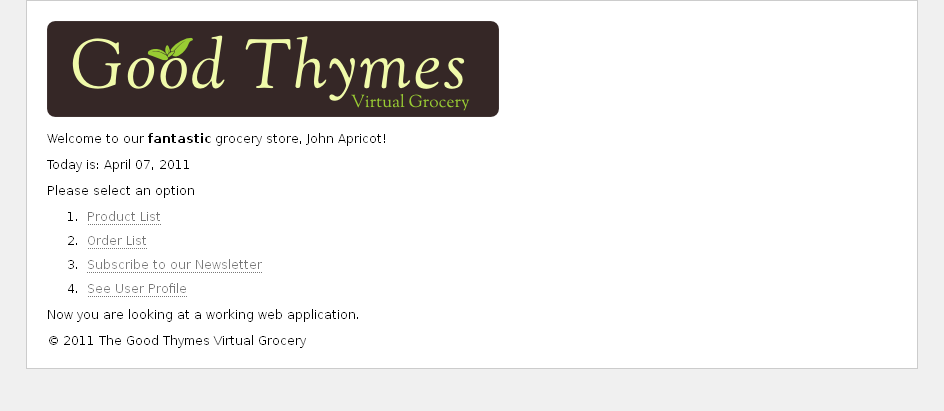

1 Introducing Thymeleaf
=======================


1.1 What is Thymeleaf?
----------------------

Thymeleaf is a Java library. It is a server-side Java template engine for 
HTML, XML, JavaScript, CSS and even plain text. 

It is best suited for serving web content in web applications (Servlet-based 
or not), but it can process template files offline too in applications that
are not web-based.

The main goal of Thymeleaf is to provide an elegant and highly-maintainable
way of creating templates. To achieve this, it builds on the concept
of *Natural Templates* in order to inject its logic into template files
in a way that doesn't affect the templates' capabilities to be used as
design prototypes. This improves communication of design and bridges the
gap between design and development teams.

Also, Thymeleaf has been designed from the beginning with Web Standards in 
mind --especially **HTML5**--, allowing you to create fully validating 
templates if that is a need for you.


1.2 What kind of templates can Thymeleaf process?
-------------------------------------------------

Out-of-the-box, Thymeleaf allows you to process six kinds of templates, each of
which is called a **Template Mode**:

 * HTML
 * XML
 * TEXT
 * JAVASCRIPT
 * CSS
 * RAW

There are two *markup* template modes (`HTML` and `XML`), three *textual* template 
modes (`TEXT`, `JAVASCRIPT` and `CSS`) and a *no-op* template mode (`RAW`).

The **`HTML`** template mode will allow any kind of HTML markup input, including 
HTML5, HTML 4 and XHTML. No markup validation of well-formedness check will be 
performed, and template markup code structure will be respected to the biggest 
possible extent in output.

The **`XML`** template mode will allow XML input. In this case, code is expected 
to be well-formed from the XML standpoint: no unclosed tags, no unquoted 
attributes, etc. and the parser will issue exceptions if well-formedness violations 
are found. Note however that no *validation* (DTD, XML Schema) will be performed.

The **`TEXT`** template mode will allow the use of a specific non-markup syntax 
in order to process templates that are not written in markup form. Examples of 
such templates might be text emails or templated documentation. Note that HTML 
or XML templates can be also processed as `TEXT`, in which case they will not 
be parsed as markup and every tag, DOCTYPE, comment, etc. will be treated as 
mere text.

The **`JAVASCRIPT`** template mode will allow the templated processing of JavaScript 
files involved in a thymeleaf-powered application. This will allow the use of model 
data inside those JavaScript files in the same way it can be done in HTML files, 
but with JavaScript-specific integrations such as specialized escaping or 
*natural scripting*. The `JAVASCRIPT` template mode is considered a *textual* mode 
and therefore uses the same non-markup processing syntax as the `TEXT` template mode.

The **`CSS`** template mode will allow the templated processing of CSS files involved 
in a thymeleaf-powered application. Similar to the `JAVASCRIPT` mode, the `CSS` 
template mode is also a *textual* mode and uses the non-markup processing syntax 
from the `TEXT` template mode.

The **`RAW`** template mode will simply not process the template at all. It is meant 
to be used mainly for inserting untouched resources (files, URL responses, etc.) 
into the templates being processed. For example, using this mode external, 
uncontrolled resources in HTML format could be included into application templates 
safely knowing that any thymeleaf code that these resources might include will not 
be executed.


1.3 Dialects: The Standard Dialect
----------------------------------

Thymeleaf is an extremely extensible template engine (in fact it should be
better called a _template engine framework_) that allows you to define and
customized the way your templates will be processed to a fine level of detail.

An object that applies some logic to a markup artifact (a tag, a text, a comment...
of a mere placeholder if templates are not markup) is called a _processor_, and a
set of these processors ---plus perhaps some extra artifacts--- is what normally
conforms a **dialect**, of which Thymeleaf's core library provides one 
out-of-the-box called the **Standard Dialect**,
which should be enough for the needs of a big percent of users. 

*Note dialects can actually have no processors and be entirely conformed of other 
kinds of artifacts, but processors is definitely the most usual.*

_The Standard Dialect is the dialect this tutorial covers_. Every attribute and
syntax feature you will learn about in the following pages is defined by this
dialect, even if that isn't explicitly mentioned.

Of course, users may create their own dialects (even extending the Standard one)
if they want to define their own processing logic while taking advantage of the
library's advanced features. A Template Engine can be configured several
dialects at a time.

> The official thymeleaf-spring3 and thymeleaf-spring4 integration packages 
> both define a dialect called the "SpringStandard Dialect", mostly equivalent 
> to the Standard Dialect but with small adaptations to make better use of some 
> features in Spring Framework (for example, by using Spring Expression Language 
> or SpringEL instead of the default OGNL). So if you are a Spring MVC user you are 
> not wasting your time, as almost everything you learn here will be of use in 
> your Spring applications.

Most of the processors of the Standard Dialect are _attribute processors_. This
allows browsers to correctly display HTML template files even before
being processed, because they will simply ignore the additional attributes. For
example, while a JSP using tag libraries could include a fragment of code not
directly displayable by a browser like:

```html
<form:inputText name="userName" value="${user.name}" />
```

...the Thymeleaf Standard Dialect would allow us to achieve the same
functionality with:

```html
<input type="text" name="userName" value="James Carrot" th:value="${user.name}" />
```

Which not only will be correctly displayed by browsers, but also allow us to
(optionally) specify a value attribute in it ("James Carrot", in this case) that
will be displayed when the prototype is statically opened in a browser, and that
will be substituted by the value resulting from the evaluation of `${user.name}`
during Thymeleaf processing of the template.

If needed, this will allow your designer and developer to work on the very same
template file and reduce the effort required to transform a static prototype
into a working template file. The ability to do this is a feature called
_Natural Templating_.


2 The Good Thymes Virtual Grocery
=================================

The source code for the examples shown in this and future chapters of this guide
can be found in the [Good Thymes Virtual Grocery GitHub repository](https://github.com/thymeleaf/thymeleafexamples-gtvg).


2.1 A website for a grocery
---------------------------

In order to better explain the concepts involved in processing templates with
Thymeleaf, this tutorial will use a demo application you can download from the
project's web site.

This application represents the web site of an imaginary virtual grocery, and
will provide us with the adequate scenarios to exemplify diverse Thymeleaf
features.

We will need a quite simple set of model entities for our application: `Products`
which are sold to `Customers` by creating `Orders`. We will also be managing `Comments`
about those `Products`:


Our small application will also have a very simple service layer, composed by `Service`
objects containing methods like:


```java
public class ProductService {

    ...

    public List<Product> findAll() {
        return ProductRepository.getInstance().findAll();
    }

    public Product findById(Integer id) {
        return ProductRepository.getInstance().findById(id);
    }
    
}
```

At the web layer our application will have a filter that will delegate
execution to Thymeleaf-enabled commands depending on the request URL:

```java
private boolean process(HttpServletRequest request, HttpServletResponse response)
        throws ServletException {
    
    try {

        // This prevents triggering engine executions for resource URLs
        if (request.getRequestURI().startsWith("/css") ||
                request.getRequestURI().startsWith("/images") ||
                request.getRequestURI().startsWith("/favicon")) {
            return false;
        }

        
        /*
         * Query controller/URL mapping and obtain the controller
         * that will process the request. If no controller is available,
         * return false and let other filters/servlets process the request.
         */
        IGTVGController controller = this.application.resolveControllerForRequest(request);
        if (controller == null) {
            return false;
        }

        /*
         * Obtain the TemplateEngine instance.
         */
        ITemplateEngine templateEngine = this.application.getTemplateEngine();

        /*
         * Write the response headers
         */
        response.setContentType("text/html;charset=UTF-8");
        response.setHeader("Pragma", "no-cache");
        response.setHeader("Cache-Control", "no-cache");
        response.setDateHeader("Expires", 0);

        /*
         * Execute the controller and process view template,
         * writing the results to the response writer. 
         */
        controller.process(
                request, response, this.servletContext, templateEngine);
        
        return true;
        
    } catch (Exception e) {
        try {
            response.sendError(HttpServletResponse.SC_INTERNAL_SERVER_ERROR);
        } catch (final IOException ignored) {
            // Just ignore this
        }
        throw new ServletException(e);
    }
    
}
```

This is our `IGTVGController` interface:

```java
public interface IGTVGController {

    public void process(
            HttpServletRequest request, HttpServletResponse response,
            ServletContext servletContext, ITemplateEngine templateEngine);    
    
}
```

All we have to do now is create implementations of the `IGTVGController`
interface, retrieving data from the services and processing templates using the
`ITemplateEngine` object.

In the end, it will look like this:



But first let's see how that template engine is initialized.


2.2 Creating and configuring the Template Engine
------------------------------------------------

The _process(...)_ method in our filter contained this sentence:

```java
ITemplateEngine templateEngine = this.application.getTemplateEngine();
```

Which means that the _GTVGApplication_ class is in charge of creating and
configuring one of the most important objects in a Thymeleaf-enabled
application: The `TemplateEngine` instance (implementation of the
`ITemplateEngine` interface).

Our `org.thymeleaf.TemplateEngine` object is initialized like this:

```java
public class GTVGApplication {
  
    
    ...
    private static TemplateEngine templateEngine;
    ...
    
    
    public GTVGApplication(final ServletContext servletContext) {

        super();

        ServletContextTemplateResolver templateResolver = 
                new ServletContextTemplateResolver(servletContext);
        
        // HTML is the default mode, but we set it anyway for better understanding of code
        templateResolver.setTemplateMode(TemplateMode.HTML);
        // This will convert "home" to "/WEB-INF/templates/home.html"
        templateResolver.setPrefix("/WEB-INF/templates/");
        templateResolver.setSuffix(".html");
        // Template cache TTL=1h. If not set, entries would be cached until expelled by LRU
        templateResolver.setCacheTTLMs(Long.valueOf(3600000L));
        
        // Cache is set to true by default. Set to false if you want templates to
        // be automatically updated when modified.
        templateResolver.setCacheable(true);
        
        this.templateEngine = new TemplateEngine();
        this.templateEngine.setTemplateResolver(templateResolver);
        
        ...

    }

}
```

Of course there are many ways of configuring a `TemplateEngine` object, but for
now these few lines of code will teach us enough about the steps needed.


### The Template Resolver

Let's start with the Template Resolver:

```java
ServletContextTemplateResolver templateResolver = 
        new ServletContextTemplateResolver(servletContext);
```

Template Resolvers are objects that implement an interface from the Thymeleaf
API called `org.thymeleaf.templateresolver.ITemplateResolver`: 

```java
public interface ITemplateResolver {

    ...
  
    /*
     * Templates are resolved by their name (or content) and also (optionally) their 
     * owner template in case we are trying to resolve a fragment for another template.
     * Will return null if template cannot be handled by this template resolver.
     */
    public TemplateResolution resolveTemplate(
            final IEngineConfiguration configuration,
            final String ownerTemplate, final String template,
            final Map<String, Object> templateResolutionAttributes);
}
```

These objects are in charge of determining how our templates will be accessed,
and in this GTVG application, the `org.thymeleaf.templateresolver.ServletContextTemplateResolver`
implementation that we are using specifies that we are going to retrieve our
template files as resources from the _Servlet Context_: an application-wide `javax.servlet.ServletContext`
object that exists in every Java web application, and that resolves resources
considering the web application root as the root for resource paths.

But that's not all we can say about the template resolver, because we can set
some configuration parameters on it. First, the template mode:

```java
templateResolver.setTemplateMode(TemplateMode.HTML);
```

HTML is the default template mode for `ServletContextTemplateResolver`, but it
is good practice to establish it anyway so that our code documents clearly what
is going on.

```java
templateResolver.setPrefix("/WEB-INF/templates/");
templateResolver.setSuffix(".html");
```

These _prefix_ and _suffix_ do exactly what it looks like: modify the template
names that we will be passing to the engine for obtaining the real resource
names to be used.

Using this configuration, the template name _"product/list"_ would correspond to:

```java
servletContext.getResourceAsStream("/WEB-INF/templates/product/list.html")
```

Optionally, the amount of time that a parsed template living in cache will be
considered valid can be configured at the Template Resolver by means of the _cacheTTLMs_
property:

```java
templateResolver.setCacheTTLMs(3600000L);
```

Of course, a template can be expelled from cache before that TTL is reached if
the max cache size is reached and it is the oldest entry currently cached.

> Cache behaviour and sizes can be defined by the user by implementing the `ICacheManager`
> interface or simply modifying the `StandardCacheManager` object set to manage
> caches by default.

We will learn more about template resolvers later. Now let's have a look at the
creation of our Template Engine object.


### The Template Engine

Template Engine objects are implementations of the `org.thymeleaf.ITemplateEngine`
interface. One of these implementations is offered by the Thymeleaf core:
`org.thymeleaf.TemplateEngine`, and we create an instance of it here:

```java
templateEngine = new TemplateEngine();
templateEngine.setTemplateResolver(templateResolver);
```

Rather simple, isn't it? All we need is to create an instance and set the
Template Resolver to it.

A template resolver is the only *required* parameter a `TemplateEngine` needs,
although of course there are many others that will be covered later (message
resolvers, cache sizes, etc). For now, this is all we need.

Our Template Engine is now ready and we can start creating our pages using
Thymeleaf.


3 Using Texts
=============


3.1 A multi-language welcome
----------------------------

Our first task will be to create a home page for our grocery site.

The first version we will write of this page will be extremely simple: just a
title and a welcome message. This is our `/WEB-INF/templates/home.html` file:

```html
<!DOCTYPE html>

<html xmlns:th="http://www.thymeleaf.org">

  <head>
    <title>Good Thymes Virtual Grocery</title>
    <meta http-equiv="Content-Type" content="text/html; charset=UTF-8" />
    <link rel="stylesheet" type="text/css" media="all" 
          href="../../css/gtvg.css" th:href="@{/css/gtvg.css}" />
  </head>

  <body>
  
    <p th:text="#{home.welcome}">Welcome to our grocery store!</p>
  
  </body>

</html>
```

The first thing you will notice here is that this file is HTML5 that can be
correctly displayed by any browser, because it does not include any non-HTML
tags (and browsers ignore all attributes they don't understand, like `th:text`).

But you may also notice that this template is not really a _valid_ HTML5 document, because 
these non-standard attributes we are using in the `th:*` form are not allowed 
by the HTML5 specification. In fact, we are even adding an `xmlns:th` 
attribute to our `<html>` tag, something absolutely non-HTML5-ish:

```html
<html xmlns:th="http://www.thymeleaf.org">
```

...which has no influence at all in template processing, but works as an
*incantation* that prevents our IDE to complain about the lack of a namespace
definition for all those `th:*` attributes.

So what if we wanted to make this template **HTML5-valid**? That would be easy:
all we would need to do is switch to Thymeleaf's fully-HTML5-valid syntax, based
on applying the `data-` prefix to attribute names and using hyphen (`-`)
separators instead of semi-colon (`:`):

```html
<!DOCTYPE html>

<html>

  <head>
    <title>Good Thymes Virtual Grocery</title>
    <meta http-equiv="Content-Type" content="text/html; charset=UTF-8" />
    <link rel="stylesheet" type="text/css" media="all" 
          href="../../css/gtvg.css" data-th-href="@{/css/gtvg.css}" />
  </head>

  <body>
  
    <p data-th-text="#{home.welcome}">Welcome to our grocery store!</p>
  
  </body>

</html>
```

Custom `data-` prefixed attributes are allowed by the HTML5 specification so,
with this code above, our template would be a *valid HTML5 document*.

> Both notations are completely equivalent and interchangeable, but note 
> that for the sake of simplicity and compactness of the code samples, 
> throughout this tutorial we will use the *namespaced notation* (`th:*`). Also,
> the `th:*` notation is more general and allowed in every Thymeleaf template
> mode (`XML`, `TEXT`...) whereas the `data-` notation is only
> allowed in `HTML` mode.


### Using th:text and externalizing text

Externalizing text is extracting fragments of template code out of template
files so that they can be kept in specific separate files (typically `.properties`
files) and that they can be easily replaced with equivalent texts written in
other languages (a process called internationalization or simply _i18n_).
Externalized fragments of text are usually called *"messages"*.

Messages always have a key that identifies them, and Thymeleaf allows you to
specify that a text should correspond to a specific message with the `#{...}`
syntax:

```html
<p th:text="#{home.welcome}">Welcome to our grocery store!</p>
```

What we can see here are in fact two different features of the Thymeleaf
Standard Dialect:

 * The `th:text` attribute, which evaluates its value expression and sets the
   result of this evaluation as the body of the host tag, effectively
   replacing that "Welcome to our grocery store!" text we see in the code.
 * The `#{home.welcome}` expression, specified in the _Standard Expression Syntax_,
   instructing that the text to be used by the `th:text` attribute should be the
   message with the `home.welcome` key corresponding to whichever locale we are
   processing the template with.

Now, where is this externalized text?

The location of externalized text in Thymeleaf is fully configurable, and it
will depend on the specific `org.thymeleaf.messageresolver.IMessageResolver`
implementation being used. Normally, an implementation based on `.properties`
files will be used, but we could create our own implementations if we wanted,
for example, to obtain messages from a database.

However, we have not specified a message resolver to our Template Engine during
initialization, and that means that our application is using the _Standard Message Resolver_,
implemented by class `org.thymeleaf.messageresolver.StandardMessageResolver`.

This standard message resolver expects to find messages for `/WEB-INF/templates/home.html`
in .properties files in the same folder and with the same name as the template,
like:

 * `/WEB-INF/templates/home_en.properties` for English texts.
 * `/WEB-INF/templates/home_es.properties` for Spanish language texts.
 * `/WEB-INF/templates/home_pt_BR.properties` for Portuguese (Brazil) language
   texts.
 * `/WEB-INF/templates/home.properties` for default texts (if locale is not
   matched).

Let's have a look at our `home_es.properties` file:

```
home.welcome=¡Bienvenido a nuestra tienda de comestibles!
```

This is all we need for making Thymeleaf process our template. Let's create our
Home controller then.


### Contexts

In order to process our template, we will create a `HomeController` class
implementing the `IGTVGController` interface we saw before:

```java
public class HomeController implements IGTVGController {

    public void process(
            final HttpServletRequest request, final HttpServletResponse response,
            final ServletContext servletContext, final ITemplateEngine templateEngine)
            throws Exception {
        
        WebContext ctx = 
                new WebContext(request, response, servletContext, request.getLocale());
        
        templateEngine.process("home", ctx, response.getWriter());
        
    }

}
```

The first thing we can see here is the creation of a context. A Thymeleaf
*context* is an object implementing the `org.thymeleaf.context.IContext` interface.
Contexts should contain all the data required for an execution of the Template
Engine in a variables map, and also reference the Locale that must be used for
externalized messages.

```java
public interface IContext {

    public Locale getLocale();
    public boolean containsVariable(final String name);
    public Set<String> getVariableNames();
    public Object getVariable(final String name);
    
}
```

There is a specialized extension of this interface, `org.thymeleaf.context.IWebContext`,
meant to be used in ServletAPI-based web applications (like e.g. SpringMVC).

```java
public interface IWebContext extends IContext {
    
    public HttpServletRequest getRequest();
    public HttpServletResponse getResponse();
    public HttpSession getSession();
    public ServletContext getServletContext();
    
}
```

The Thymeleaf core library offers an implementation of each of these interfaces:

 * `org.thymeleaf.context.Context` implements `IContext`
 * `org.thymeleaf.context.WebContext` implements `IWebContext`

And as you can see in the controller code, `WebContext` is the one we will use.
In fact we have to, because the use of a `ServletContextTemplateResolver`
requires that we use a context implementing `IWebContext`.

```java
WebContext ctx = new WebContext(request, response, servletContext, request.getLocale());
```

Only three of those four constructor arguments are required, because the default
locale for the system will be used if none is specified (although you should
never let this happen in real applications).

From the interface definition we can tell that `WebContext` will offer
specialized methods for obtaining the request parameters and request, session
and application attributes, which we will be able to easily integrate into
our application's expressions. For example:

  * `${x}` will return a variable `x` stored into the Thymeleaf or as a *request attribute*.
  * `${param.x}` will return a *request parameter* called `x` (which might be multivalued).
  * `${session.x}` will return a *session attribute* called `x`.
  * `${application.x}` will return a *servlet context attribute* called `x`.


### Executing the template engine

With our context object ready, all we need is executing the template engine
specifying the template name and the context, and passing on the response writer
so that the response can be written to it:

```java
templateEngine.process("home", ctx, response.getWriter());
```

Let's see the results of this using the Spanish locale:

```html
<!DOCTYPE html>

<html>

  <head>
    <title>Good Thymes Virtual Grocery</title>
    <meta content="text/html; charset=UTF-8" http-equiv="Content-Type"/>
    <link rel="stylesheet" type="text/css" media="all" href="/gtvg/css/gtvg.css" />
  </head>

  <body>
  
    <p>¡Bienvenido a nuestra tienda de comestibles!</p>

  </body>

</html>
```


3.2 More on texts and variables
-------------------------------


### Unescaped Text

The simplest version of our Home page seems to be ready now, but there is
something we have not thought about... what if we had a message like this?

```java
home.welcome=Welcome to our <b>fantastic</b> grocery store!
```

If we execute this template like before, we will obtain:

```html
<p>Welcome to our &lt;b&gt;fantastic&lt;/b&gt; grocery store!</p>
```

Which is not exactly what we expected, because our `<b>` tag has been escaped
and therefore it will be displayed at the browser.

This is the default behaviour of the th:text attribute. If we want Thymeleaf to
respect our HTML tags and not escape them, we will have to use a different
attribute: `th:utext` (for "unescaped text"):

```html
<p th:utext="#{home.welcome}">Welcome to our grocery store!</p>
```

This will output our message just like we wanted it:

```html
<p>Welcome to our <b>fantastic</b> grocery store!</p>
```


### Using and displaying variables

Now let's add some more contents to our home page. For example, we could want to
display the date below our welcome message, like this:

```
Welcome to our fantastic grocery store!

Today is: 12 july 2010
```

First of all, we will have to modify our controller so that we add that date as
a context variable:

```java
public void process(
            final HttpServletRequest request, final HttpServletResponse response,
            final ServletContext servletContext, final ITemplateEngine templateEngine)
            throws Exception {
        
    SimpleDateFormat dateFormat = new SimpleDateFormat("dd MMMM yyyy");
    Calendar cal = Calendar.getInstance();
        
    WebContext ctx = 
            new WebContext(request, response, servletContext, request.getLocale());
    ctx.setVariable("today", dateFormat.format(cal.getTime()));
        
    templateEngine.process("home", ctx, response.getWriter());
        
}
```

We have added a `String` today variable to our context, and now we can display
it in our template:

```html
<body>

  <p th:utext="#{home.welcome}">Welcome to our grocery store!</p>

  <p>Today is: <span th:text="${today}">13 February 2011</span></p>
  
</body>
```

As you can see, we are still using the `th:text` attribute for the job (and
that's correct, because we want to replace the tag's body), but the syntax is
a little bit different this time and instead of a `#{...}` expression value, we
are using a `${...}` one. This is a **variable expression** value, and it contains
an expression in a language called _OGNL (Object-Graph Navigation Language)_
that will be executed on the context variables map we talked about before.

The `${today}` expression simply means "get the variable called today", but
these expressions could be more complex (like `${user.name}` for "get the
variable called user, and call its `getName()` method").

There are quite a lot of possibilities in attribute values: messages, variable
expressions... and quite a lot more. Next chapter will show us what all these
possibilities are.


4 Standard Expression Syntax
============================

We will make a small break in the development of our grocery virtual store to
learn about one of the most important parts of the Thymeleaf Standard Dialect:
the Thymeleaf Standard Expression syntax.

We have already seen two types of valid attribute values expressed in this
syntax: message and variable expressions:

```html
<p th:utext="#{home.welcome}">Welcome to our grocery store!</p>

<p>Today is: <span th:text="${today}">13 february 2011</span></p>
```

But there are more types of value we don't know yet, and more interesting detail
to know about the ones we already know. First, let's see a quick summary of the
Standard Expression features:

 * Simple expressions:
    * Variable Expressions: `${...}`
    * Selection Variable Expressions: `*{...}`
    * Message Expressions: `#{...}`
    * Link URL Expressions: `@{...}`
    * Fragment Expressions: `~{...}`
 * Literals
    * Text literals: `'one text'`, `'Another one!'`,...
    * Number literals: `0`, `34`, `3.0`, `12.3`,...
    * Boolean literals: `true`, `false`
    * Null literal: `null`
    * Literal tokens: `one`, `sometext`, `main`,...
 * Text operations: 
    * String concatenation: `+`
    * Literal substitutions: `|The name is ${name}|`
 * Arithmetic operations:
    * Binary operators: `+`, `-`, `*`, `/`, `%`
    * Minus sign (unary operator): `-`
 * Boolean operations:
    * Binary operators: `and`, `or`
    * Boolean negation (unary operator): `!`, `not`
 * Comparisons and equality:
    * Comparators: `>`, `<`, `>=`, `<=` (`gt`, `lt`, `ge`, `le`)
    * Equality operators: `==`, `!=` (`eq`, `ne`)
 * Conditional operators:
    * If-then: `(if) ? (then)`
    * If-then-else: `(if) ? (then) : (else)`
    * Default: `(value) ?: (defaultvalue)`
 * Special tokens:
    * No-Operation: `_`

All these features can be combined and nested:

```html
'User is of type ' + (${user.isAdmin()} ? 'Administrator' : (${user.type} ?: 'Unknown'))
```


4.1 Messages
------------

As we already know, `#{...}` message expressions allow us to link this:

```html
<p th:utext="#{home.welcome}">Welcome to our grocery store!</p>
```

...to this:

```html
home.welcome=¡Bienvenido a nuestra tienda de comestibles!
```

But there's one aspect we still haven't thought of: what happens if the message
text is not completely static? What if, for example, our application knew who is
the user visiting the site at any moment and we wanted to greet him/her by name?

```html
<p>¡Bienvenido a nuestra tienda de comestibles, John Apricot!</p>
```

This means we would need to add a parameter to our message. Just like this:

```html
home.welcome=¡Bienvenido a nuestra tienda de comestibles, {0}!
```

Parameters are specified according to the `java.text.MessageFormat` standard
syntax, which means you could add format to numbers and dates as specified in
the API docs for that class.

In order to specify a value for our parameter, and given an HTTP session
attribute called `user`, we would have:

```html
<p th:utext="#{home.welcome(${session.user.name})}">
  Welcome to our grocery store, Sebastian Pepper!
</p>
```

If needed, several parameters could be specified, separated by commas. In fact,
the message key itself could come from a variable:

```html
<p th:utext="#{${welcomeMsgKey}(${session.user.name})}">
  Welcome to our grocery store, Sebastian Pepper!
</p>
```


4.2 Variables
-------------

We already mentioned that `${...}` expressions are in fact OGNL (Object-Graph
Navigation Language) expressions executed on the map of variables contained in
the context.

> For detailed info about OGNL syntax and features, you should read the 
> [OGNL Language Guide](http://commons.apache.org/ognl/)
>
> Also note that in Spring MVC-enabled applications OGNL will be replaced with **SpringEL**,
> but its syntax is very similar to that of OGNL (actually, exactly the same for
> most common cases).

From OGNL's syntax, we know that this:

```html
<p>Today is: <span th:text="${today}">13 february 2011</span>.</p>
```

...is in fact equivalent to this:

```java
ctx.getVariable("today");
```

But OGNL allows us to create quite more powerful expressions, and that's how
this:

```html
<p th:utext="#{home.welcome(${session.user.name})}">
  Welcome to our grocery store, Sebastian Pepper!
</p>
```

...does in fact obtain the user name by executing:

```java
((User) ctx.getVariable("session").get("user")).getName();
```

But getter method navigation is just one of OGNL's features. Let's see some more:

```java
/*
 * Access to properties using the point (.). Equivalent to calling property getters.
 */
${person.father.name}

/*
 * Access to properties can also be made by using brackets ([]) and writing 
 * the name of the property as a variable or between single quotes.
 */
${person['father']['name']}

/*
 * If the object is a map, both dot and bracket syntax will be equivalent to 
 * executing a call on its get(...) method.
 */
${countriesByCode.ES}
${personsByName['Stephen Zucchini'].age}

/*
 * Indexed access to arrays or collections is also performed with brackets, 
 * writing the index without quotes.
 */
${personsArray[0].name}

/*
 * Methods can be called, even with arguments.
 */
${person.createCompleteName()}
${person.createCompleteNameWithSeparator('-')}
```


### Expression Basic Objects

When evaluating OGNL expressions on the context variables, some objects are made
available to expressions for higher flexibility. These objects will be
referenced (per OGNL standard) starting with the `#` symbol:

 * `#ctx`: the context object.
 * `#vars:` the context variables.
 * `#locale`: the context locale.
 * `#request`: (only in Web Contexts) the `HttpServletRequest` object.
 * `#response`: (only in Web Contexts) the `HttpServletResponse` object.
 * `#session`: (only in Web Contexts) the `HttpSession` object.
 * `#servletContext`: (only in Web Contexts) the `ServletContext` object.

So we can do this:

```html
Established locale country: <span th:text="${#locale.country}">US</span>.
```

You can read the full reference of these objects in the
[Appendix A](#appendix-a-expression-basic-objects).


### Expression Utility Objects

Besides these basic objects, Thymeleaf will offer us a set of utility objects
that will help us perform common tasks in our expressions.

 * `#execInfo`: utility information about the template being processed.
 * `#messages`: utility methods for obtaining externalized messages inside
   variables expressions, in the same way as they would be obtained using #{...} syntax.
 * `#uris`: utility methods for escaping parts of URLs/URIs
 * `#conversions`: utility methods for executing the configured *conversion service* (if any).
 * `#dates`: utility methods for `java.util.Date` objects: formatting, component
   extraction, etc.
 * `#calendars`: analogous to `#dates`, but for `java.util.Calendar` objects.
 * `#numbers`: utility methods for formatting numeric objects.
 * `#strings`: utility methods for `String` objects: contains, startsWith,
   prepending/appending, etc.
 * `#objects`: utility methods for objects in general.
 * `#bools`: utility methods for boolean evaluation.
 * `#arrays`: utility methods for arrays.
 * `#lists`: utility methods for lists.
 * `#sets`: utility methods for sets.
 * `#maps`: utility methods for maps.
 * `#aggregates`: utility methods for creating aggregates on arrays or
   collections.
 * `#ids`: utility methods for dealing with id attributes that might be repeated
   (for example, as a result of an iteration).

You can check what functions are offered by each of these utility objects in the
[Appendix B](#appendix-b-expression-utility-objects).


### Reformatting dates in our home page

Now we know about these utility objects, we could use them to change the way in
which we show the date in our home page. Instead of doing this in our `HomeController`:

```java
SimpleDateFormat dateFormat = new SimpleDateFormat("dd MMMM yyyy");
Calendar cal = Calendar.getInstance();

WebContext ctx = new WebContext(request, servletContext, request.getLocale());
ctx.setVariable("today", dateFormat.format(cal.getTime()));

templateEngine.process("home", ctx, response.getWriter());
```

...we can do just this:

```java
WebContext ctx = 
    new WebContext(request, response, servletContext, request.getLocale());
ctx.setVariable("today", Calendar.getInstance());

templateEngine.process("home", ctx, response.getWriter());
```

...and then perform date formatting in the view layer itself:

```html
<p>
  Today is: <span th:text="${#calendars.format(today,'dd MMMM yyyy')}">13 May 2011</span>
</p>
```


4.3 Expressions on selections (asterisk syntax)
-----------------------------------------------

Variable expressions not only can be written in `${...}` expressions, but also
in `*{...}` ones.

There is an important difference, though: the asterisk syntax evaluates
expressions on selected objects rather than on the whole context variables map.
This is: as long as there is no selected object, the dollar and the asterisk 
syntaxes do exactly the same.

And what is that object selection thing? A `th:object` attribute. Let's use it
in our user profile (`userprofile.html`) page:

```html
  <div th:object="${session.user}">
    <p>Name: <span th:text="*{firstName}">Sebastian</span>.</p>
    <p>Surname: <span th:text="*{lastName}">Pepper</span>.</p>
    <p>Nationality: <span th:text="*{nationality}">Saturn</span>.</p>
  </div>
```

Which is exactly equivalent to:

```html
<div>
  <p>Name: <span th:text="${session.user.firstName}">Sebastian</span>.</p>
  <p>Surname: <span th:text="${session.user.lastName}">Pepper</span>.</p>
  <p>Nationality: <span th:text="${session.user.nationality}">Saturn</span>.</p>
</div>
```

Of course, dollar and asterisk syntax can be mixed:

```html
<div th:object="${session.user}">
  <p>Name: <span th:text="*{firstName}">Sebastian</span>.</p>
  <p>Surname: <span th:text="${session.user.lastName}">Pepper</span>.</p>
  <p>Nationality: <span th:text="*{nationality}">Saturn</span>.</p>
</div>
```

When an object selection is in place, the selected object will be also available
to dollar expressions as the `#object` expression variable:

```html
<div th:object="${session.user}">
  <p>Name: <span th:text="${#object.firstName}">Sebastian</span>.</p>
  <p>Surname: <span th:text="${session.user.lastName}">Pepper</span>.</p>
  <p>Nationality: <span th:text="*{nationality}">Saturn</span>.</p>
</div>
```

As said, if no object selection has been performed, dollar and asterisk syntaxes
are exactly equivalent.

```html
<div>
  <p>Name: <span th:text="*{session.user.name}">Sebastian</span>.</p>
  <p>Surname: <span th:text="*{session.user.surname}">Pepper</span>.</p>
  <p>Nationality: <span th:text="*{session.user.nationality}">Saturn</span>.</p>
</div>
```


4.4 Link URLs
-------------

Because of their importance, URLs are first-class citizens in web application
templates, and the _Thymeleaf Standard Dialect_ has a special syntax for them,
the `@` syntax: `@{...}`

There are different types of URLs:

 * Absolute URLs, like `http://www.thymeleaf.org`
 * Relative URLs, which can be:
    * Page-relative, like `user/login.html`
    * Context-relative, like `/itemdetails?id=3` (context name in server will be
      added automatically)
    * Server-relative, like `~/billing/processInvoice` (allows calling URLs in
      another context (= application) in the same server.
    * Protocol-relative URLs, like `//code.jquery.com/jquery-2.0.3.min.js`

The real processing of these expressions and their conversion to the URLs that will
be actually output will be done by implementations of the 
`org.thymeleaf.linkbuilder.ILinkBuilder` interface that are registered into the 
`ITemplateEngine` object being used.

By default, a single implementation of this interface is registered of class
`org.thymeleaf.linkbuilder.StandardLinkBuilder`, which is enough for both offline
(non-web) and also web scenarios based on the Servlet API. Other scenarios (like integration
with non-ServletAPI web frameworks) might need specific implementations of the link
builder interface.

Let's use this new syntax. Meet the `th:href` attribute:

```html
<!-- Will produce 'http://localhost:8080/gtvg/order/details?orderId=3' (plus rewriting) -->
<a href="details.html" 
   th:href="@{http://localhost:8080/gtvg/order/details(orderId=${o.id})}">view</a>

<!-- Will produce '/gtvg/order/details?orderId=3' (plus rewriting) -->
<a href="details.html" th:href="@{/order/details(orderId=${o.id})}">view</a>

<!-- Will produce '/gtvg/order/3/details' (plus rewriting) -->
<a href="details.html" th:href="@{/order/{orderId}/details(orderId=${o.id})}">view</a>
```

Some things to note here:

 * `th:href` is an attribute modifier attribute: once processed, it will compute
   the link URL to be used and set the value of the href attribute of the `<a>` tag 
   to this URL.
 * We are allowed to use expressions for URL parameters (as you can see in `orderId=${o.id}`).
   The required URL-parameter-encoding operations will also be automatically performed.
 * If several parameters are needed, these will be separated by commas like `@{/order/process(execId=${execId},execType='FAST')}`
 * Variable templates are also allowed in URL paths, like `@{/order/{orderId}/details(orderId=${orderId})}`
 * Relative URLs starting with `/` (like `/order/details`) will be automatically
   prefixed the application context name.
 * If cookies are not enabled or this is not yet known, a `";jsessionid=..."`
   suffix might be added to relative URLs so that session is preserved. This is called _URL Rewriting_,
   and Thymeleaf allows you to plug in your own rewriting filters by using the `response.encodeURL(...)`
   mechanism from the Servlet API for every URL.
 * The `th:href` tag allowed us to (optionally) have a working static `href`
   attribute in our template, so that our template links remained navigable by a
   browser when opened directly for prototyping purposes.

As was the case with the message syntax (`#{...}`), URL bases can also be the
result of evaluating another expression:

```html
<a th:href="@{${url}(orderId=${o.id})}">view</a>
<a th:href="@{'/details/'+${user.login}(orderId=${o.id})}">view</a>
```


### A menu for our home page

Now we know how to create link URLs, what about adding a small menu in our home
for some of the other pages in the site?

```html
<p>Please select an option</p>
<ol>
  <li><a href="product/list.html" th:href="@{/product/list}">Product List</a></li>
  <li><a href="order/list.html" th:href="@{/order/list}">Order List</a></li>
  <li><a href="subscribe.html" th:href="@{/subscribe}">Subscribe to our Newsletter</a></li>
  <li><a href="userprofile.html" th:href="@{/userprofile}">See User Profile</a></li>
</ol>
```


### Server root relative URLs

An additional syntax can be used to create server-root-relative (instead of context-root-relative)
URLs in order to link to different contexts in the same server. These URLs will be specified like
`@{~/path/to/something}`


4.5 Fragments
-------------

Fragment expressions are an easy way to represent fragments of markup and move them around templates. This
allows us to replicate them, pass them to other templates as arguments, etc.

The most common use is for fragment insertion using `th:insert` or `th:replace` (more on these in
a later section):

```html
<div th:insert="~{commons :: main}">...</div>
```

But they can be used anywhere, just as any other variable:

```html
<div th:with="frag=~{footer :: #main/text()}">
  <p th:insert="${frag}">
</div>
```

Later in this tutorial there is an entire section devoted to Template Layout, including
deeper explanation of fragment expressions.


4.6 Literals
------------

###Text literals

Text literals are just character strings specified between single quotes. They can include any character, but you should escape any single quotes inside them as `\'`.

```html
<p>
  Now you are looking at a <span th:text="'working web application'">template file</span>.
</p>
```

###Number literals

Numeric literals look exactly like what they are: numbers.

```html
<p>The year is <span th:text="2013">1492</span>.</p>
<p>In two years, it will be <span th:text="2013 + 2">1494</span>.</p>
```


###Boolean literals

The boolean literals are `true` and `false`. For example:

```html
<div th:if="${user.isAdmin()} == false"> ...
```

Note that in the above example, the `== false` is written outside the braces, and thus
it is Thymeleaf itself who takes care of it. If it were written inside the braces, it would
be the responsibility of the OGNL/SpringEL engines:

```html
<div th:if="${user.isAdmin() == false}"> ...
```


###The null literal

The `null` literal can be also used:

```html
<div th:if="${variable.something} == null"> ...
```


###Literal tokens

Numeric, boolean and null literals are in fact a particular case of _literal tokens_.

These tokens allow a little bit of simplification in Standard Expressions. They work exactly the same as text literals (`'...'`), but they only allow letters (`A-Z` and `a-z`),
numbers (`0-9`), brackets (`[` and `]`), dots (`.`), hyphens (`-`) and underscores (`_`).
So no whitespaces, no commas, etc.

The nice part? Tokens don't need any quotes surrounding them. So we can do this:

```html
<div th:class="content">...</div>
```

instead of:

```html
<div th:class="'content'">...</div>
```


4.7 Appending texts
-------------------

Texts, no matter whether they are literals or the result of evaluating variable or message expressions, can be easily appended using the `+` operator:

```html
<span th:text="'The name of the user is ' + ${user.name}">
```


4.8 Literal substitutions
-------------------------

Literal substitutions allow the easy formatting of strings containing values from variables without the need to append literals with `'...' + '...'`.

These substitutions must be surrounded by vertical bars (`|`), like:

```html
<span th:text="|Welcome to our application, ${user.name}!|">
```

Which is actually equivalent to:

```html
<span th:text="'Welcome to our application, ' + ${user.name} + '!'">
```

Literal substitutions can be combined with other types of expressions:

```html
<span th:text="${onevar} + ' ' + |${twovar}, ${threevar}|">
```

**Note:** only variable expressions (`${...}`) are allowed inside `|...|` literal substitutions. No other literals (`'...'`), boolean/numeric tokens, conditional expressions etc. are. 


4.9 Arithmetic operations
-------------------------

Some arithmetic operations are also available: `+`, `-`, `*`, `/` and `%`.

```html
<div th:with="isEven=(${prodStat.count} % 2 == 0)">
```

Note that these operators can also be applied inside OGNL variable expressions
themselves (and in that case will be executed by OGNL instead of the Thymeleaf
Standard Expression engine):

```html
<div th:with="isEven=${prodStat.count % 2 == 0}">
```

Note that textual aliases exist for some of these operators: `div` (`/`), `mod` (`%`).


4.10 Comparators and Equality
-----------------------------

Values in expressions can be compared with the `>`, `<`, `>=` and `<=` symbols,
as usual, and also the `==` and `!=` operators can be used to check equality (or
the lack of it). Note that XML establishes that the `<` and `>` symbols should
not be used in attribute values, and so they should be substituted by `&lt;` and
`&gt;`.

```html
<div th:if="${prodStat.count} &gt; 1">
<span th:text="'Execution mode is ' + ( (${execMode} == 'dev')? 'Development' : 'Production')">
```

Note that textual aliases exist for some of these operators: `gt` (`>`), `lt` (`<`), `ge`
(`>=`), `le` (`<=`), `not` (`!`). Also `eq` (`==`), `neq`/`ne` (`!=`).


4.11 Conditional expressions
---------------------------

_Conditional expressions_ are meant to evaluate only one of two expressions
depending on the result of evaluating a condition (which is itself another
expression).

Let's have a look at an example fragment (introducing another _attribute modifier_,
this time `th:class`):

```html
<tr th:class="${row.even}? 'even' : 'odd'">
  ...
</tr>
```

All three parts of a conditional expression (`condition`, `then` and `else`) are
themselves  expressions, which means that they can be variables (`${...}`, `*{...}`),
messages (`#{...}`), URLs (`@{...}`) or literals (`'...'`).

Conditional expressions can also be nested using parentheses:

```html
<tr th:class="${row.even}? (${row.first}? 'first' : 'even') : 'odd'">
  ...
</tr>
```

Else expressions can also be omitted, in which case a null value is returned if
the condition is false:

```html
<tr th:class="${row.even}? 'alt'">
  ...
</tr>
```


4.12 Default expressions (Elvis operator)
-----------------------------------------

A _default expression_ is a special kind of conditional value without a _then_
part. It is equivalent to the _Elvis operator_ present in some languages like
Groovy, and allows to specify two  expressions, being the second one evaluated
only in the case of the first one returning null.

Let's see it in action in our user profile page:

```html
<div th:object="${session.user}">
  ...
  <p>Age: <span th:text="*{age}?: '(no age specified)'">27</span>.</p>
</div>
```

As you can see, the operator is `?:`, and we use it here to specify a default
value for a name (a literal value, in this case) only if the result of
evaluating `*{age}` is null. This is therefore equivalent to:

```html
<p>Age: <span th:text="*{age != null}? *{age} : '(no age specified)'">27</span>.</p>
```

As with conditional values, they can contain nested expressions between
parentheses:

```html
<p>
  Name: 
  <span th:text="*{firstName}?: (*{admin}? 'Admin' : #{default.username})">Sebastian</span>
</p>
```


4.13 The No-Operation token
---------------------------

The No-Operation token is represented by an underscore symbol (`_`).

The idea behind this token is to specify that the desired result for an expression is 
to actually *do nothing*, i.e. do exactly as if the processable attribute (e.g. `th:text`) was not 
there at all.

Among other possibilities, this allows developers to use prototyping text as default values. For 
example, instead of:

```html
<span th:text="${user.name} ?: 'no user authenticated'">...</span>
```

...we can directly use *'no user authenticated'* as a prototyping text, which results in code that 
is both more concise and versatile from a design standpoint:

```html
<span th:text="${user.name} ?: _">no user authenticated</span>
```


4.14 Preprocessing
------------------

In addition to all these features for expression processing, Thymeleaf offers to
us the possibility of _preprocessing_ expressions.

And what is that preprocessing thing? It is an execution of the expressions done
before the normal one, that allows the modification of the actual expression
that will be eventually executed.

Preprocessed expressions are exactly like normal ones, but appear surrounded by
a double underscore symbol (like `__${expression}__`).

Let's imagine we have an i18n `Messages_fr.properties` entry containing an OGNL
expression calling a language-specific static method, like:

```java
article.text=@myapp.translator.Translator@translateToFrench({0})
```

...and a `Messages_es.properties equivalent`:

```java
article.text=@myapp.translator.Translator@translateToSpanish({0})
```

We can create a fragment of markup that evaluates one expression or the other
depending on the locale. For this, we will first select the expression (by
preprocessing) and then let Thymeleaf execute it:

```html
<p th:text="${__#{article.text('textVar')}__}">Some text here...</p>
```

Note that the preprocessing step for a French locale will be creating the
following equivalent:

```html
<p th:text="${@myapp.translator.Translator@translateToFrench(textVar)}">Some text here...</p>
```

The preprocessing String `__` can be escaped in attributes using `\_\_`.


5 Setting Attribute Values
==========================

This chapter will explain the way in which we can set (or modify) values of
attributes in our markup tags, possibly the next most basic feature we will need
after setting the tag body content.


5.1 Setting the value of any attribute
--------------------------------------

Say our website publishes a newsletter, and we want our users to be able to
subscribe to it, so we create a `/WEB-INF/templates/subscribe.html` template
with a form:

```html
<form action="subscribe.html">
  <fieldset>
    <input type="text" name="email" />
    <input type="submit" value="Subscribe me!" />
  </fieldset>
</form>
```

It looks quite OK, but the fact is that this file looks more like a static HTML
page than a template for a web application. First, the `action` attribute in our
form statically links to the template file itself, so that there is no place
for useful URL rewriting. Second, the `value` attribute in the submit button makes
it display a text in English, but we'd like it to be internationalized.

Enter then the `th:attr` attribute, and its ability to change the value of
attributes of the tags it is set in:

```html
<form action="subscribe.html" th:attr="action=@{/subscribe}">
  <fieldset>
    <input type="text" name="email" />
    <input type="submit" value="Subscribe me!" th:attr="value=#{subscribe.submit}"/>
  </fieldset>
</form>
```

The concept is quite straightforward: `th:attr` simply takes an expression that
assigns a value to an attribute. Having created the corresponding controller and
messages files, the result of processing this file will be as expected:

```html
<form action="/gtvg/subscribe">
  <fieldset>
    <input type="text" name="email" />
    <input type="submit" value="¡Suscríbeme!"/>
  </fieldset>
</form>
```

Besides the new attribute values, you can also see that the applicacion context
name has been automatically prefixed to the URL base in `/gtvg/subscribe`, as
explained in the previous chapter.

But what if we wanted to set more than one attribute at a time? XML rules do not
allow you to set an attribute twice in a tag, so `th:attr` will take a
comma-separated list of assignments, like:

```html

```

Given the required messages files, this will output:

```html

```


5.2 Setting value to specific attributes
----------------------------------------

By now, you might be thinking that something like:

```html
<input type="submit" value="Subscribe me!" th:attr="value=#{subscribe.submit}"/>
```

...is quite an ugly piece of markup. Specifying an assignment inside an
attribute's value can be very practical, but it is not the most elegant way of
creating templates if you have to do it all the time.

Thymeleaf agrees with you. And that's why in fact `th:attr` is scarcely used in
templates. Normally, you will be using other `th:*` attributes whose task is
setting specific tag attributes (and not just any attribute like `th:attr`).

And which attribute does the Standard Dialect offer us for setting the `value`
attribute of our button? Well, in a rather obvious manner, it's `th:value`. Let's
have a look:

```html
<input type="submit" value="Subscribe me!" th:value="#{subscribe.submit}"/>
```

This looks much better!. Let's try and do the same to the `action` attribute in
the `form` tag:

```html
<form action="subscribe.html" th:action="@{/subscribe}">
```

And do you remember those `th:href` we put in our `home.html` before? They are
exactly this same kind of attributes:

```html
<li><a href="product/list.html" th:href="@{/product/list}">Product List</a></li>
```

There are quite a lot of attributes like these, each of them targeting a
specific HTML5 attribute:

<div class="table-scroller">
---------------------- ---------------------- ----------------------
`th:abbr`              `th:accept`            `th:accept-charset`    
`th:accesskey`         `th:action`            `th:align`             
`th:alt`               `th:archive`           `th:audio`             
`th:autocomplete`      `th:axis`              `th:background`        
`th:bgcolor`           `th:border`            `th:cellpadding`       
`th:cellspacing`       `th:challenge`         `th:charset`           
`th:cite`              `th:class`             `th:classid`           
`th:codebase`          `th:codetype`          `th:cols`              
`th:colspan`           `th:compact`           `th:content`           
`th:contenteditable`   `th:contextmenu`       `th:data`              
`th:datetime`          `th:dir`               `th:draggable`         
`th:dropzone`          `th:enctype`           `th:for`               
`th:form`              `th:formaction`        `th:formenctype`       
`th:formmethod`        `th:formtarget`        `th:fragment`          
`th:frame`             `th:frameborder`       `th:headers`           
`th:height`            `th:high`              `th:href`              
`th:hreflang`          `th:hspace`            `th:http-equiv`        
`th:icon`              `th:id`                `th:inline`            
`th:keytype`           `th:kind`              `th:label`             
`th:lang`              `th:list`              `th:longdesc`          
`th:low`               `th:manifest`          `th:marginheight`      
`th:marginwidth`       `th:max`               `th:maxlength`         
`th:media`             `th:method`            `th:min`               
`th:name`              `th:onabort`           `th:onafterprint`      
`th:onbeforeprint`     `th:onbeforeunload`    `th:onblur`            
`th:oncanplay`         `th:oncanplaythrough`  `th:onchange`          
`th:onclick`           `th:oncontextmenu`     `th:ondblclick`        
`th:ondrag`            `th:ondragend`         `th:ondragenter`       
`th:ondragleave`       `th:ondragover`        `th:ondragstart`       
`th:ondrop`            `th:ondurationchange`  `th:onemptied`         
`th:onended`           `th:onerror`           `th:onfocus`           
`th:onformchange`      `th:onforminput`       `th:onhashchange`      
`th:oninput`           `th:oninvalid`         `th:onkeydown`         
`th:onkeypress`        `th:onkeyup`           `th:onload`            
`th:onloadeddata`      `th:onloadedmetadata`  `th:onloadstart`       
`th:onmessage`         `th:onmousedown`       `th:onmousemove`       
`th:onmouseout`        `th:onmouseover`       `th:onmouseup`         
`th:onmousewheel`      `th:onoffline`         `th:ononline`          
`th:onpause`           `th:onplay`            `th:onplaying`         
`th:onpopstate`        `th:onprogress`        `th:onratechange`      
`th:onreadystatechange``th:onredo`            `th:onreset`           
`th:onresize`          `th:onscroll`          `th:onseeked`          
`th:onseeking`         `th:onselect`          `th:onshow`            
`th:onstalled`         `th:onstorage`         `th:onsubmit`          
`th:onsuspend`         `th:ontimeupdate`      `th:onundo`            
`th:onunload`          `th:onvolumechange`    `th:onwaiting`         
`th:optimum`           `th:pattern`           `th:placeholder`       
`th:poster`            `th:preload`           `th:radiogroup`        
`th:rel`               `th:rev`               `th:rows`              
`th:rowspan`           `th:rules`             `th:sandbox`           
`th:scheme`            `th:scope`             `th:scrolling`         
`th:size`              `th:sizes`             `th:span`              
`th:spellcheck`        `th:src`               `th:srclang`           
`th:standby`           `th:start`             `th:step`              
`th:style`             `th:summary`           `th:tabindex`          
`th:target`            `th:title`             `th:type`              
`th:usemap`            `th:value`             `th:valuetype`         
`th:vspace`            `th:width`             `th:wrap`              
`th:xmlbase`           `th:xmllang`           `th:xmlspace`          
---------------------- ---------------------- ----------------------
</div>


5.3 Setting more than one value at a time
-----------------------------------------

There are two rather special attributes called `th:alt-title` and `th:lang-xmllang`
which can be used for setting two attributes to the same value at the same time.
Specifically:

 * `th:alt-title` will set `alt` and `title`. 
 * `th:lang-xmllang` will set `lang` and `xml:lang`.

For our GTVG home page, this will allow us to substitute this:

```html

```

...or this, which is equivalent:

```html

```

...by this:

```html

```


5.4 Appending and prepending
----------------------------

Working in an equivalent way to `th:attr`, Thymeleaf offers the `th:attrappend`
and `th:attrprepend` attributes, which append (suffix) or prepend (prefix) the
result of their evaluation to the existing attribute values.

For example, you might want to store the name of a CSS class to be added (not
set, just added) to one of your buttons in a context variable, because the
specific CSS class to be used would depend on something that the user did before.
Easy:

```html
<input type="button" value="Do it!" class="btn" th:attrappend="class=${' ' + cssStyle}" />
```

If you process this template with the `cssStyle` variable set to `"warning"`,
you will get:

```html
<input type="button" value="Do it!" class="btn warning" />
```

There are also two specific _appending attributes_ in the Standard Dialect: the `th:classappend`
and `th:styleappend` attributes, which are used for adding a CSS class or a fragment of _style_ to an element without
overwriting the existing ones:

```html
<tr th:each="prod : ${prods}" class="row" th:classappend="${prodStat.odd}? 'odd'">
```

(Don't worry about that `th:each` attribute. It is an _iterating attribute_ and
we will talk about it later.)


5.5 Fixed-value boolean attributes
----------------------------------

Some XHTML/HTML5 attributes are special in that, either they are present in
their elements with a specific and fixed value, or they are not present at all.

For example, `checked`:

```html
<input type="checkbox" name="option1" checked="checked" />
<input type="checkbox" name="option2" />
```

No other value than `"checked"` is allowed according to the XHTML standards for
the `checked` attribute (HTML5 rules are a little more relaxed on that). And the
same happens with `disabled`, `multiple`, `readonly` and `selected`.

The Standard Dialect includes attributes that allow you to set these attributes
by evaluating a condition, so that if evaluated to true, the attribute will be
set to its fixed value, and if evaluated to false, the attribute will not be set:

```html
<input type="checkbox" name="active" th:checked="${user.active}" />
```

The following fixed-value boolean attributes exist in the Standard Dialect:

<div class="table-scroller">
------------------- ------------------ ------------------
`th:async`          `th:autofocus`     `th:autoplay`      
`th:checked`        `th:controls`      `th:declare`       
`th:default`        `th:defer`         `th:disabled`      
`th:formnovalidate` `th:hidden`        `th:ismap`         
`th:loop`           `th:multiple`      `th:novalidate`    
`th:nowrap`         `th:open`          `th:pubdate`       
`th:readonly`       `th:required`      `th:reversed`      
`th:scoped`         `th:seamless`      `th:selected`      
------------------- ------------------ ------------------
</div>


5.6 Setting the value of any attribute (default attribute processor)
--------------------------------------------------------------------

Besides everything we have just seen about ways of setting attribute with specific
processors such as `th:value`, `th:disabled` etc. Thymeleaf offers a *default
attribute processor* that allows us to set the value of *any* attribute even
if no specific `th:*` processor has been defined for it at the Standard Dialect.

So something like:

```html
<span th:whatever="${user.name}">...</span>
```

Will result in:

```html
<span whatever="John Apricot">...</span>
```


5.7 Support for HTML5-friendly attribute and element names
----------------------------------------------------------

It is also possible to use a completely different syntax to apply processors to your templates, more HTML5-friendly.

```html	
<table>
    <tr data-th-each="user : ${users}">
        <td data-th-text="${user.login}">...</td>
        <td data-th-text="${user.name}">...</td>
    </tr>
</table>
```

The `data-{prefix}-{name}` syntax is the standard way to write custom attributes in HTML5, without requiring developers to use any namespaced names like `th:*`. Thymeleaf makes this syntax automatically available to all your dialects (not only the Standard ones).

There is also a syntax to specify custom tags: `{prefix}-{name}`, which follows the _W3C Custom Elements specification_ (a part of the larger _W3C Web Components spec_). This can be used, for example, for the `th:block` element (or also `th-block`), which will be explained in a later section. 

**Important:** this syntax is an addition to the namespaced `th:*` one, it does not replace it. There is no intention at all to deprecate the namespaced syntax in the future. 


6 Iteration
===========

So far we have created a home page, a user profile page and also a page for
letting users subscribe to our newsletter... but what about our products?
Shouldn't we build a product list to let visitors know what we sell? Well,
obviously yes. And there we go now.


6.1 Iteration basics
--------------------

For listing our products in our `/WEB-INF/templates/product/list.html` page we
will need a table. Each of our products will be displayed in a row (a `<tr>`
element), and so for our template we will need to create a _template row_ ---one
that will exemplify how we want each product to be displayed--- and then instruct
Thymeleaf to _iterate it_ once for each product.

The Standard Dialect offers us an attribute for exactly that: `th:each`.


### Using th:each

For our product list page, we will need a controller that retrieves the list of
products from the service layer and adds it to the template context:

```java
public void process(
        final HttpServletRequest request, final HttpServletResponse response,
        final ServletContext servletContext, final ITemplateEngine templateEngine)
        throws Exception {
    
    ProductService productService = new ProductService();
    List<Product> allProducts = productService.findAll(); 
    
    WebContext ctx = new WebContext(request, response, servletContext, request.getLocale());
    ctx.setVariable("prods", allProducts);
    
    templateEngine.process("product/list", ctx, response.getWriter());
    
}
```

And then we will use `th:each` in our template to iterate the list of products:

```html
<!DOCTYPE html>

<html xmlns:th="http://www.thymeleaf.org">

  <head>
    <title>Good Thymes Virtual Grocery</title>
    <meta http-equiv="Content-Type" content="text/html; charset=UTF-8" />
    <link rel="stylesheet" type="text/css" media="all" 
          href="../../../css/gtvg.css" th:href="@{/css/gtvg.css}" />
  </head>

  <body>

    <h1>Product list</h1>
  
    <table>
      <tr>
        <th>NAME</th>
        <th>PRICE</th>
        <th>IN STOCK</th>
      </tr>
      <tr th:each="prod : ${prods}">
        <td th:text="${prod.name}">Onions</td>
        <td th:text="${prod.price}">2.41</td>
        <td th:text="${prod.inStock}? #{true} : #{false}">yes</td>
      </tr>
    </table>
  
    <p>
      <a href="../home.html" th:href="@{/}">Return to home</a>
    </p>

  </body>

</html>
```

That `prod : ${prods}` attribute value you see above means "for each element in
the result of evaluating `${prods}`, repeat this fragment of template setting
that element into a variable called prod". Let's give a name each of the things
we see:

 * We will call `${prods}` the _iterated expression_ or _iterated variable_.
 * We will call `prod` the _iteration variable_ or simply _iter variable_.

Note that the `prod` iter variable will only be available inside the `<tr>`
element (including inner tags like `<td>`).


### Iterable values

Not only `java.util.List` objects can be used for iteration in Thymeleaf. In
fact, there is a quite complete set of objects that are considered _iterable_
by a `th:each` attribute:

 * Any object implementing `java.util.Iterable`
 * Any object implementing `java.util.Enumeration`.
 * Any object implementing `java.util.Iterator`, which values will be used as
   they are returned by the iterator, without the need to cache all values in memory.
 * Any object implementing `java.util.Map`. When iterating maps, iter variables
   will be of class `java.util.Map.Entry`.
 * Any array.
 * Any other object will be treated as if it were a single-valued list
   containing the object itself.


6.2 Keeping iteration status
----------------------------

When using `th:each`, Thymeleaf offers a mechanism useful for keeping track of
the status of your iteration: the _status variable_.

Status variables are defined within a `th:each` attribute and contain the
following data:

 * The current _iteration index_, starting with 0. This is the `index` property.
 * The current _iteration index_, starting with 1. This is the `count` property.
 * The total amount of elements in the iterated variable. This is the `size`
   property.
 * The _iter variable_ for each iteration. This is the `current` property.
 * Whether the current iteration is even or odd. These are the `even/odd` boolean
   properties.
 * Whether the current iteration is the first one. This is the `first` boolean
   property.
 * Whether the current iteration is the last one. This is the `last` boolean
   property.

Let's see how we could use it within the previous example:

```html
<table>
  <tr>
    <th>NAME</th>
    <th>PRICE</th>
    <th>IN STOCK</th>
  </tr>
  <tr th:each="prod,iterStat : ${prods}" th:class="${iterStat.odd}? 'odd'">
    <td th:text="${prod.name}">Onions</td>
    <td th:text="${prod.price}">2.41</td>
    <td th:text="${prod.inStock}? #{true} : #{false}">yes</td>
  </tr>
</table>
```

As you can see, the status variable (`iterStat` in this example) is defined in
the `th:each` attribute by writing its name after the iter variable itself,
separated by a comma. As happens to the iter variable, the status variable will
only be available inside the fragment of code defined by the tag holding the `th:each`
attribute.

Let's have a look at the result of processing our template:

```html
<!DOCTYPE html>

<html>

  <head>
    <title>Good Thymes Virtual Grocery</title>
    <meta content="text/html; charset=UTF-8" http-equiv="Content-Type"/>
    <link rel="stylesheet" type="text/css" media="all" href="/gtvg/css/gtvg.css" />
  </head>

  <body>

    <h1>Product list</h1>
  
    <table>
      <tr>
        <th>NAME</th>
        <th>PRICE</th>
        <th>IN STOCK</th>
      </tr>
      <tr class="odd">
        <td>Fresh Sweet Basil</td>
        <td>4.99</td>
        <td>yes</td>
      </tr>
      <tr>
        <td>Italian Tomato</td>
        <td>1.25</td>
        <td>no</td>
      </tr>
      <tr class="odd">
        <td>Yellow Bell Pepper</td>
        <td>2.50</td>
        <td>yes</td>
      </tr>
      <tr>
        <td>Old Cheddar</td>
        <td>18.75</td>
        <td>yes</td>
      </tr>
    </table>
  
    <p>
      <a href="/gtvg/" shape="rect">Return to home</a>
    </p>

  </body>
  
</html>
```

Note that our iteration status variable has worked perfectly, establishing the
`odd` CSS class only to odd rows.

If you don't explicitly set a status variable, Thymeleaf will always create one
for you by suffixing `Stat` to the name of the iteration variable:

```html
<table>
  <tr>
    <th>NAME</th>
    <th>PRICE</th>
    <th>IN STOCK</th>
  </tr>
  <tr th:each="prod : ${prods}" th:class="${prodStat.odd}? 'odd'">
    <td th:text="${prod.name}">Onions</td>
    <td th:text="${prod.price}">2.41</td>
    <td th:text="${prod.inStock}? #{true} : #{false}">yes</td>
  </tr>
</table>
```


6.3 Optimizing through lazy retrieval of data
---------------------------------------------

Sometimes we might want to optimize the retrieval of collections of data (e.g. from a database)
so that these collections are only retrieved if they are really going to be used. 

> Actually, this is something that can be applied to *any* piece of data, but given the size
> that in-memory collections might have, retrieving collections that are meant to be iterated
> is the most common case for this scenario.

In order to support this, Thymeleaf offers a mechanism to *lazily load context variables*.
Context variables that implement the `ILazyContextVariable` interface --most probably by
extending its `LazyContextVariable` default implementation-- will be resolved in 
the moment of being executed. For example:

```java
context.setVariable(
     "users",
     new LazyContextVariable<List<User>>() {
         @Override
         protected List<User> loadValue() {
             return databaseRepository.findAllUsers();
         }
     });
```
This variable can be used without noticing its *lazyness*, in code such as:
```html
<ul>
  <li th:each="u : ${users}" th:text="${u.name}">user name</li>
</ul>
```
But at the same time, will never be initialized (its `loadValue()` method will never be called) 
if `condition` evaluates to `false` in code such as:

```html
<ul th:if="${condition}">
  <li th:each="u : ${users}" th:text="${u.name}">user name</li>
</ul>
```


7 Conditional Evaluation
========================


7.1 Simple conditionals: "if" and "unless"
------------------------------------------

Sometimes you will need a fragment of your template to only appear in the result
if a certain condition is met. 

For example, imagine we want to show in our product table a column with the
number of comments that exist for each product and, if there are any comments, a
link to the comment detail page for that product.

In order to do this, we would use the `th:if` attribute:

```html
<table>
  <tr>
    <th>NAME</th>
    <th>PRICE</th>
    <th>IN STOCK</th>
    <th>COMMENTS</th>
  </tr>
  <tr th:each="prod : ${prods}" th:class="${prodStat.odd}? 'odd'">
    <td th:text="${prod.name}">Onions</td>
    <td th:text="${prod.price}">2.41</td>
    <td th:text="${prod.inStock}? #{true} : #{false}">yes</td>
    <td>
      <span th:text="${#lists.size(prod.comments)}">2</span> comment/s
      <a href="comments.html" 
         th:href="@{/product/comments(prodId=${prod.id})}" 
         th:if="${not #lists.isEmpty(prod.comments)}">view</a>
    </td>
  </tr>
</table>
```

Quite a lot of things to see here, so let's focus on the important line:

```html
<a href="comments.html"
   th:href="@{/product/comments(prodId=${prod.id})}" 
   th:if="${not #lists.isEmpty(prod.comments)}">view</a>
```

There is little to explain from this code, in fact: We will be creating a link
to the comments page (with URL `/product/comments`) with a `prodId` parameter
set to the `id` of the product, but only if the product has any comments.

Let's have a look at the resulting markup:

```html
<table>
  <tr>
    <th>NAME</th>
    <th>PRICE</th>
    <th>IN STOCK</th>
    <th>COMMENTS</th>
  </tr>
  <tr>
    <td>Fresh Sweet Basil</td>
    <td>4.99</td>
    <td>yes</td>
    <td>
      <span>0</span> comment/s
    </td>
  </tr>
  <tr class="odd">
    <td>Italian Tomato</td>
    <td>1.25</td>
    <td>no</td>
    <td>
      <span>2</span> comment/s
      <a href="/gtvg/product/comments?prodId=2">view</a>
    </td>
  </tr>
  <tr>
    <td>Yellow Bell Pepper</td>
    <td>2.50</td>
    <td>yes</td>
    <td>
      <span>0</span> comment/s
    </td>
  </tr>
  <tr class="odd">
    <td>Old Cheddar</td>
    <td>18.75</td>
    <td>yes</td>
    <td>
      <span>1</span> comment/s
      <a href="/gtvg/product/comments?prodId=4">view</a>
    </td>
  </tr>
</table>
```

Perfect! That's exactly what we wanted.

Note that the `th:if` attribute will not only evaluate _boolean_ conditions.
Its capabilities go a little beyond that, and it will evaluate the specified
expression as `true` following these rules:

 * If value is not null:
    * If value is a boolean and is `true`.
    * If value is a number and is non-zero
    * If value is a character and is non-zero
    * If value is a String and is not "false", "off" or "no"
    * If value is not a boolean, a number, a character or a String.
 * (If value is null, th:if will evaluate to false).

Also, `th:if` has an inverse counterpart, `th:unless`, which we could have used
in the previous example instead of using a `not` inside the OGNL expression:

```html
<a href="comments.html"
   th:href="@{/comments(prodId=${prod.id})}" 
   th:unless="${#lists.isEmpty(prod.comments)}">view</a>
```


7.2 Switch statements
---------------------

There is also a way to display content conditionally using the equivalent of a
_switch_ structure in Java: the `th:switch` / `th:case` attribute set.

They work exactly as you would expect:

```html
<div th:switch="${user.role}">
  <p th:case="'admin'">User is an administrator</p>
  <p th:case="#{roles.manager}">User is a manager</p>
</div>
```

Note that as soon as one `th:case` attribute is evaluated as `true`, every other
`th:case` attribute in the same switch context is evaluated as `false`.

The default option is specified as `th:case="*"`:

```html
<div th:switch="${user.role}">
  <p th:case="'admin'">User is an administrator</p>
  <p th:case="#{roles.manager}">User is a manager</p>
  <p th:case="*">User is some other thing</p>
</div>
```


8 Template Layout
=================


8.1 Including template fragments
--------------------------------

### Defining and referencing fragments

We will often want to include in our templates fragments from other templates.
Common uses for this are footers, headers, menus...

In order to do this, Thymeleaf needs us to define the fragments available for
inclusion, which we can do by using the `th:fragment` attribute. 

Now let's say we want to add a standard copyright footer to all our grocery
pages, and for that we define a `/WEB-INF/templates/footer.html` file containing
this code:

```html
<!DOCTYPE html>

<html xmlns:th="http://www.thymeleaf.org">

  <body>
  
    <div th:fragment="copy">
      &copy; 2011 The Good Thymes Virtual Grocery
    </div>
  
  </body>
  
</html>
```

The code above defines a fragment called `copy` that we can easily include in
our home page using one of the `th:insert` or `th:replace` attributes (and also
`th:include`, though its use is no longer recommended since Thymeleaf 3.0):

```html
<body>

  ...

  <div th:insert="~{footer :: copy}"></div>
  
</body>
```

Note that `th:insert` expects a *fragment expression* (`~{...}`), or more specifically
*an expression that results in a fragment*. But in the former case (a non-complex
*fragment expression*) like the code above, the (`~{`,`}`) enclosing is completely optional, so 
the code above would be equivalent to:

```html
<body>

  ...

  <div th:insert="footer :: copy></div>
  
</body>
```


### Fragment specification syntax

The syntax of fragment expressions is quite straightforward. There are three different formats:

 * `"templatename::selector"` Includes the fragment resulting from applying the specified Markup Selector on the template named `templatename`.
    * Note that `selector` can be a mere fragment name, so you could specify something as simple as `templatename::fragmentname` like in the `footer :: copy` above. More on the syntax of markup selectors below.

   > Markup Selector syntax is defined by the underlying AttoParser parsing library, and is similar to 
   > XPath expressions or CSS selectors, see the [Appendix C](#appendix-c-markup-selector-syntax) for more info.

 * `"templatename"` Includes the complete template named `templatename`.

   > Note that the template name you use in `th:insert`/`th:replace` tags
   > will have to be resolvable by the Template Resolver currently being used by
   > the Template Engine.

 * `::selector"` or `"this::selector"` Includes a fragment from the same template.

Both `templatename` and `selector` in the above examples
can be fully-featured expressions (even conditionals!) like:

```html
<div th:insert="footer :: (${user.isAdmin}? #{footer.admin} : #{footer.normaluser})"></div>
```

Fragments can include any `th:*` attributes. These attributes will be evaluated
once the fragment is included into the target template (the one with the `th:insert`/`th:replace`
attribute), and they will be able to reference any context variables defined in
this target template.

> A big advantage of this approach to fragments is that you can write your
> fragments' code in pages that are perfectly displayable by a browser, with a
> complete and even *valid* markup structure, while still retaining the
> ability to make Thymeleaf include them into other templates.


### Referencing fragments without `th:fragment`

Thanks to the power of Markup Selectors, we can include fragments that do not use any 
`th:fragment` attributes. It can even be markup code coming from a different application 
with no knowledge of Thymeleaf at all:

```html
...
<div id="copy-section">
  &copy; 2011 The Good Thymes Virtual Grocery
</div>
...
```

We can use the fragment above simply referencing it by its `id` attribute, in a similar way to a CSS selector:

```html
<body>

  ...

  <div th:insert="~{footer :: #copy-section}"></div>
  
</body>
```


### Difference between `th:insert` and `th:replace` (and `th:include`)

And what is the difference between `th:insert`, `th:replace` and `th:include` (not
recommended since 3.0)? 

  * `th:insert` is the simplest: it will simply insert the specified fragment as the body
  of its host tag.

  * `th:replace` actually *replaces* its host tag with the specified fragment.

  * `th:include` is similar to `th:insert`, but instead of inserting the fragment it only 
  inserts the *contents*

So that an HTML fragment like this:

```html
<footer th:fragment="copy">
  &copy; 2011 The Good Thymes Virtual Grocery
</footer>
```

...included three times in host `<div>` tags, like this:

```html
<body>

  ...

  <div th:insert="footer :: copy"></div>

  <div th:replace="footer :: copy"></div>

  <div th:include="footer :: copy"></div>
  
</body>
```

...will result in:

```html
<body>

  ...

  <div>
    <footer>
      &copy; 2011 The Good Thymes Virtual Grocery
    </footer>
  </div>

  <footer>
    &copy; 2011 The Good Thymes Virtual Grocery
  </footer>

  <div>
    &copy; 2011 The Good Thymes Virtual Grocery
  </div>
  
</body>
```


8.2 Parameterizable fragment signatures
---------------------------------------

In order to create a more _function-like_ mechanism for the use of template fragments,
fragments defined with `th:fragment` can specify a set of parameters:
	
```html
<div th:fragment="frag (onevar,twovar)">
    <p th:text="${onevar} + ' - ' + ${twovar}">...</p>
</div>
```

This requires the use of one of these two syntaxes to call the fragment from `th:include`, 
`th:replace`:

```html
<div th:replace="::frag (${value1},${value2})">...</div>
<div th:replace="::frag (onevar=${value1},twovar=${value2})">...</div>
```

Note that order is not important in the last option:

```html
<div th:replace="::frag (twovar=${value2},onevar=${value1})">...</div>
```

###Fragment local variables without fragment arguments

Even if fragments are defined without arguments, like this:

```html	
<div th:fragment="frag">
    ...
</div>
```

We could use the second syntax specified above to call them (and only the second one):

```html	
<div th:replace="::frag (onevar=${value1},twovar=${value2})">
```

This would be, in fact, equivalent to a combination of `th:replace` and `th:with`:

```html	
<div th:replace="::frag" th:with="onevar=${value1},twovar=${value2}">
```

**Note** that this specification of local variables for a fragment ---no matter whether it 
has an argument signature or not--- does not cause the context to emptied previously to its 
execution. Fragments will still be able to access every context variable being used at the 
calling template like they currently are. 


###th:assert for in-template assertions

The `th:assert` attribute can specify a comma-separated list of expressions which should be
evaluated and produce true for every evaluation, raising an exception if not.

```html
<div th:assert="${onevar},(${twovar} != 43)">...</div>
```

This comes in handy for validating parameters at a fragment signature:

```html
<header th:fragment="contentheader(title)" th:assert="${!#strings.isEmpty(title)}">...</header>
```


8.3 Flexible layouts: beyond mere fragment insertion
----------------------------------------------------

Thanks to *fragment expressions*, we can specify parameters for fragments that are not texts,
numbers, bean objects... but instead fragments of markup.

This allows us to create our fragments in a way such that they can be *enriched* wich markup
coming from the calling templates, resulting in a very flexible **template layout mechanism**. 

Note the use of the `title` and `links` variables in the fragment below:

```html
<head th:fragment="common_header(title,links)">

  <title th:replace="${title}">The awesome application</title>

  <!-- Common styles and scripts -->
  <link rel="stylesheet" type="text/css" media="all" th:href="@{/css/awesomeapp.css}">
  <link rel="shortcut icon" th:href="@{/images/favicon.ico}">
  <script type="text/javascript" th:src="@{/sh/scripts/codebase.js}"></script>

  <!--/* Per-page placeholder for additional links */-->
  <th:block th:replace="${links}" />

</head>
```

We can now call this fragment like:

```html
...
<head th:replace="base :: common_header(~{::title},~{::link})">

  <title>Awesome - Main</title>

  <link rel="stylesheet" th:href="@{/css/bootstrap.min.css}">
  <link rel="stylesheet" th:href="@{/themes/smoothness/jquery-ui.css}">

</head>
...
```

...and the result will use the actual `<title>` and `<link>` tags from our calling
template as the values of the `title` and `links` variables, resulting in
our fragment being customized during insertion:

```html
...
<head>

  <title>Awesome - Main</title>

  <!-- Common styles and scripts -->
  <link rel="stylesheet" type="text/css" media="all" href="/awe/css/awesomeapp.css">
  <link rel="shortcut icon" href="/awe/images/favicon.ico">
  <script type="text/javascript" src="/awe/sh/scripts/codebase.js"></script>

  <link rel="stylesheet" href="/awe/css/bootstrap.min.css">
  <link rel="stylesheet" href="/awe/themes/smoothness/jquery-ui.css">

</head>
...
```


### Using the empty fragment 

A special fragment expression, the *empty fragment* (`~{}`), can be used for
specifying *no markup*. Using the previous example:

```html
<head th:replace="base :: common_header(~{::title},~{})">

  <title>Awesome - Main</title>

</head>
...
```

Note how the second parameter of the fragment (`links`) is set to the *empty
fragment* and therefore nothing is written for the `<th:block th:replace="${links}" />`
block:

```html
...
<head>

  <title>Awesome - Main</title>

  <!-- Common styles and scripts -->
  <link rel="stylesheet" type="text/css" media="all" href="/awe/css/awesomeapp.css">
  <link rel="shortcut icon" href="/awe/images/favicon.ico">
  <script type="text/javascript" src="/awe/sh/scripts/codebase.js"></script>

</head>
...
```


### Using the no-operation token

The no-op can be also used as a parameter to a fragment, if we just want to let our fragment use 
its current markup as a default value. Again, using the `common_header` example:

```html
...
<head th:replace="base :: common_header(_,~{::link})">

  <title>Awesome - Main</title>

  <link rel="stylesheet" th:href="@{/css/bootstrap.min.css}">
  <link rel="stylesheet" th:href="@{/themes/smoothness/jquery-ui.css}">

</head>
...
```

See how the `title` argument (first argument of the `common_header` fragment) is set to *no-op* (`_`),
which results in this part of the fragment not being executed at all (`title` = *no-operation*):

```html
  <title th:replace="${title}">The awesome application</title>
```

So the result is:

```html
...
<head>

  <title>The awesome application</title>

  <!-- Common styles and scripts -->
  <link rel="stylesheet" type="text/css" media="all" href="/awe/css/awesomeapp.css">
  <link rel="shortcut icon" href="/awe/images/favicon.ico">
  <script type="text/javascript" src="/awe/sh/scripts/codebase.js"></script>

  <link rel="stylesheet" href="/awe/css/bootstrap.min.css">
  <link rel="stylesheet" href="/awe/themes/smoothness/jquery-ui.css">

</head>
...
```


8.4 Removing template fragments
-------------------------------

Back to the example application, let's revisit the last version of our product list template:

```html
<table>
  <tr>
    <th>NAME</th>
    <th>PRICE</th>
    <th>IN STOCK</th>
    <th>COMMENTS</th>
  </tr>
  <tr th:each="prod : ${prods}" th:class="${prodStat.odd}? 'odd'">
    <td th:text="${prod.name}">Onions</td>
    <td th:text="${prod.price}">2.41</td>
    <td th:text="${prod.inStock}? #{true} : #{false}">yes</td>
    <td>
      <span th:text="${#lists.size(prod.comments)}">2</span> comment/s
      <a href="comments.html" 
         th:href="@{/product/comments(prodId=${prod.id})}" 
         th:unless="${#lists.isEmpty(prod.comments)}">view</a>
    </td>
  </tr>
</table>
```

This code is just fine as a template, but as a static page (when directly open
by a browser without Thymeleaf processing it) it would not make a nice prototype. 

Why? Because although perfectly displayable by browsers, that table only has a
row, and this row has mock data. As a prototype, it simply wouldn't look
realistic enough... we should have more than one product, _we need more rows_.

So let's add some:

```html
<table>
  <tr>
    <th>NAME</th>
    <th>PRICE</th>
    <th>IN STOCK</th>
    <th>COMMENTS</th>
  </tr>
  <tr th:each="prod : ${prods}" th:class="${prodStat.odd}? 'odd'">
    <td th:text="${prod.name}">Onions</td>
    <td th:text="${prod.price}">2.41</td>
    <td th:text="${prod.inStock}? #{true} : #{false}">yes</td>
    <td>
      <span th:text="${#lists.size(prod.comments)}">2</span> comment/s
      <a href="comments.html" 
         th:href="@{/product/comments(prodId=${prod.id})}" 
         th:unless="${#lists.isEmpty(prod.comments)}">view</a>
    </td>
  </tr>
  <tr class="odd">
    <td>Blue Lettuce</td>
    <td>9.55</td>
    <td>no</td>
    <td>
      <span>0</span> comment/s
    </td>
  </tr>
  <tr>
    <td>Mild Cinnamon</td>
    <td>1.99</td>
    <td>yes</td>
    <td>
      <span>3</span> comment/s
      <a href="comments.html">view</a>
    </td>
  </tr>
</table>
```

Ok, now we have three, definitely better for a prototype. But... what will
happen when we process it with Thymeleaf?:

```html
<table>
  <tr>
    <th>NAME</th>
    <th>PRICE</th>
    <th>IN STOCK</th>
    <th>COMMENTS</th>
  </tr>
  <tr>
    <td>Fresh Sweet Basil</td>
    <td>4.99</td>
    <td>yes</td>
    <td>
      <span>0</span> comment/s
    </td>
  </tr>
  <tr class="odd">
    <td>Italian Tomato</td>
    <td>1.25</td>
    <td>no</td>
    <td>
      <span>2</span> comment/s
      <a href="/gtvg/product/comments?prodId=2">view</a>
    </td>
  </tr>
  <tr>
    <td>Yellow Bell Pepper</td>
    <td>2.50</td>
    <td>yes</td>
    <td>
      <span>0</span> comment/s
    </td>
  </tr>
  <tr class="odd">
    <td>Old Cheddar</td>
    <td>18.75</td>
    <td>yes</td>
    <td>
      <span>1</span> comment/s
      <a href="/gtvg/product/comments?prodId=4">view</a>
    </td>
  </tr>
  <tr class="odd">
    <td>Blue Lettuce</td>
    <td>9.55</td>
    <td>no</td>
    <td>
      <span>0</span> comment/s
    </td>
  </tr>
  <tr>
    <td>Mild Cinnamon</td>
    <td>1.99</td>
    <td>yes</td>
    <td>
      <span>3</span> comment/s
      <a href="comments.html">view</a>
    </td>
  </tr>
</table>
```

The last two rows are mock rows! Well, of course they are: iteration was only
applied to the first row, so there is no reason why Thymeleaf should have
removed the other two.

We need a way to remove those two rows during template processing. Let's use the
`th:remove` attribute on the second and third `<tr>` tags:

```html
<table>
  <tr>
    <th>NAME</th>
    <th>PRICE</th>
    <th>IN STOCK</th>
    <th>COMMENTS</th>
  </tr>
  <tr th:each="prod : ${prods}" th:class="${prodStat.odd}? 'odd'">
    <td th:text="${prod.name}">Onions</td>
    <td th:text="${prod.price}">2.41</td>
    <td th:text="${prod.inStock}? #{true} : #{false}">yes</td>
    <td>
      <span th:text="${#lists.size(prod.comments)}">2</span> comment/s
      <a href="comments.html" 
         th:href="@{/product/comments(prodId=${prod.id})}" 
         th:unless="${#lists.isEmpty(prod.comments)}">view</a>
    </td>
  </tr>
  <tr class="odd" th:remove="all">
    <td>Blue Lettuce</td>
    <td>9.55</td>
    <td>no</td>
    <td>
      <span>0</span> comment/s
    </td>
  </tr>
  <tr th:remove="all">
    <td>Mild Cinnamon</td>
    <td>1.99</td>
    <td>yes</td>
    <td>
      <span>3</span> comment/s
      <a href="comments.html">view</a>
    </td>
  </tr>
</table>
```

Once processed, everything will look again as it should:

```html
<table>
  <tr>
    <th>NAME</th>
    <th>PRICE</th>
    <th>IN STOCK</th>
    <th>COMMENTS</th>
  </tr>
  <tr>
    <td>Fresh Sweet Basil</td>
    <td>4.99</td>
    <td>yes</td>
    <td>
      <span>0</span> comment/s
    </td>
  </tr>
  <tr class="odd">
    <td>Italian Tomato</td>
    <td>1.25</td>
    <td>no</td>
    <td>
      <span>2</span> comment/s
      <a href="/gtvg/product/comments?prodId=2">view</a>
    </td>
  </tr>
  <tr>
    <td>Yellow Bell Pepper</td>
    <td>2.50</td>
    <td>yes</td>
    <td>
      <span>0</span> comment/s
    </td>
  </tr>
  <tr class="odd">
    <td>Old Cheddar</td>
    <td>18.75</td>
    <td>yes</td>
    <td>
      <span>1</span> comment/s
      <a href="/gtvg/product/comments?prodId=4">view</a>
    </td>
  </tr>
</table>
```

And what about that `all` value in the attribute, what does it mean? Well, in fact
`th:remove` can behave in five different ways, depending on its value:

 * `all`: Remove both the containing tag and all its children.
 * `body`: Do not remove the containing tag, but remove all its children.
 * `tag`: Remove the containing tag, but do not remove its children.
 * `all-but-first`: Remove all children of the containing tag except the first one.
 * `none` : Do nothing. This value is useful for dynamic evaluation.

What can that `all-but-first` value be useful for? It will let us save some `th:remove="all"`
when prototyping:

```html
<table>
  <thead>
    <tr>
      <th>NAME</th>
      <th>PRICE</th>
      <th>IN STOCK</th>
      <th>COMMENTS</th>
    </tr>
  </thead>
  <tbody th:remove="all-but-first">
    <tr th:each="prod : ${prods}" th:class="${prodStat.odd}? 'odd'">
      <td th:text="${prod.name}">Onions</td>
      <td th:text="${prod.price}">2.41</td>
      <td th:text="${prod.inStock}? #{true} : #{false}">yes</td>
      <td>
        <span th:text="${#lists.size(prod.comments)}">2</span> comment/s
        <a href="comments.html" 
           th:href="@{/product/comments(prodId=${prod.id})}" 
           th:unless="${#lists.isEmpty(prod.comments)}">view</a>
      </td>
    </tr>
    <tr class="odd">
      <td>Blue Lettuce</td>
      <td>9.55</td>
      <td>no</td>
      <td>
        <span>0</span> comment/s
      </td>
    </tr>
    <tr>
      <td>Mild Cinnamon</td>
      <td>1.99</td>
      <td>yes</td>
      <td>
        <span>3</span> comment/s
        <a href="comments.html">view</a>
      </td>
    </tr>
  </tbody>
</table>
```

The `th:remove` attribute can take any _Thymeleaf Standard Expression_, as long as it returns one 
of the allowed String values (`all`, `tag`, `body`, `all-but-first` or `none`).

This means removals could be conditional, like:

```html
<a href="/something" th:remove="${condition}? tag : none">Link text not to be removed</a>
```

Also note that `th:remove` considers `null` a synonym to `none`, so that the following works
exactly as the example above:

```html
<a href="/something" th:remove="${condition}? tag">Link text not to be removed</a>
```

In this case, if `${condition}` is false, `null` will be returned, and thus no removal will be performed. 


9 Local Variables
=================

Thymeleaf calls _local variables_ those variables that are defined for a
specific fragment of a template, and are only available for evaluation inside
that fragment.

An example we have already seen is the `prod` iter variable in our product list
page:

```html
<tr th:each="prod : ${prods}">
    ...
</tr>
```

That `prod` variable will be available only within the bonds of the `<tr>` tag.
Specifically:

 * It will be available for any other `th:*` attributes executing in that tag
   with less _precedence_ than `th:each` (which means they will execute after `th:each`).
 * It will be available for any child element of the `<tr>` tag, such as any `<td>`
   elements.

Thymeleaf offers you a way to declare local variables without iteration. It is
the `th:with` attribute, and its syntax is like that of attribute value
assignments:

```html
<div th:with="firstPer=${persons[0]}">
  <p>
    The name of the first person is <span th:text="${firstPer.name}">Julius Caesar</span>.
  </p>
</div>
```

When `th:with` is processed, that `firstPer` variable is created as a local
variable and added to the variables map coming from the context, so that it is
as available for evaluation as any other variables declared in the context from
the beginning, but only within the bounds of the containing `<div>` tag.

You can define several variables at the same time using the usual multiple
assignment syntax:

```html
<div th:with="firstPer=${persons[0]},secondPer=${persons[1]}">
  <p>
    The name of the first person is <span th:text="${firstPer.name}">Julius Caesar</span>.
  </p>
  <p>
    But the name of the second person is 
    <span th:text="${secondPer.name}">Marcus Antonius</span>.
  </p>
</div>
```

The `th:with` attribute allows reusing variables defined in the same attribute:

```html
<div th:with="company=${user.company + ' Co.'},account=${accounts[company]}">...</div>
```

Let's use this in our Grocery's home page! Remember the code we wrote for
outputting a formatted date?

```html
<p>
  Today is: 
  <span th:text="${#calendars.format(today,'dd MMMM yyyy')}">13 february 2011</span>
</p>
```

Well, what if we wanted that `"dd MMMM yyyy"` to actually depend on the locale?
For example, we might want to add the following message to our `home_en.properties`:

```
date.format=MMMM dd'','' yyyy
```

...and an equivalent one to our `home_es.properties`:


```
date.format=dd ''de'' MMMM'','' yyyy
```

Now, let's use `th:with` to get the localized date format into a variable, and
then use it in our `th:text` expression:

```html
<p th:with="df=#{date.format}">
  Today is: <span th:text="${#calendars.format(today,df)}">13 February 2011</span>
</p>
```

That was clean and easy. In fact, given the fact that `th:with` has a higher
`precedence` than `th:text`, we could have solved this all in the `span` tag:

```html
<p>
  Today is: 
  <span th:with="df=#{date.format}" 
        th:text="${#calendars.format(today,df)}">13 February 2011</span>
</p>
```

You might be thinking: Precedence? We haven't talked about that yet! Well, don't
worry because that is exactly what the next chapter is about.


10 Attribute Precedence
=======================

What happens when you write more than one `th:*` attribute in the same tag? For
example:

```html
<ul>
  <li th:each="item : ${items}" th:text="${item.description}">Item description here...</li>
</ul>
```

Of course, we would expect that `th:each` attribute to execute before the `th:text`
so that we get the results we want, but given the fact that the HTML or XML standards 
do not give any kind of meaning to the order in which the attributes in a tag are 
written, a _precedence_ mechanism has to be established in the attributes themselves 
in order to be sure that this will work as expected.

So, all Thymeleaf attributes define a numeric precedence, which establishes the
order in which they are executed in the tag. This order is:

<div class="table-scroller">
-----------------------------------------------------------------
Order   Feature                            Attributes
------- ---------------------------------- ----------------------
      1 Fragment inclusion                 `th:insert`\
                                           `th:replace`

      2 Fragment iteration                 `th:each`

      3 Conditional evaluation             `th:if`\
                                           `th:unless`\
                                           `th:switch`\
                                           `th:case`

      4 Local variable definition          `th:object`\
                                           `th:with`

      5 General attribute modification     `th:attr`\
                                           `th:attrprepend`\
                                           `th:attrappend`

      6 Specific attribute modification    `th:value`\
                                           `th:href`\
                                           `th:src`\
                                           `...`

      7 Text (tag body modification)       `th:text`\
                                           `th:utext`

      8 Fragment specification             `th:fragment`

      9 Fragment removal                   `th:remove`
-----------------------------------------------------------------
</div>

This precedence mechanism means that the above iteration fragment will give
exactly the same results if the attribute position is inverted (although it would be
slightly less readable):

```html
<ul>
  <li th:text="${item.description}" th:each="item : ${items}">Item description here...</li>
</ul>
```


11. Comments and Blocks
=======================

11.1. Standard HTML/XML comments
--------------------------------

Standard HTML/XML comments `<!-- ... -->` can be used anywhere in thymeleaf templates. Anything inside these comments won't be processed by neither Thymeleaf nor the browser, and will be just copied verbatim to the result:

```html
<!-- User info follows -->
<div th:text="${...}">
  ...
</div>
```


11.2. Thymeleaf parser-level comment blocks
-------------------------------------------

Parser-level comment blocks are code that will be simply removed from the template when thymeleaf parses it. They look like this:

```html
<!--/* This code will be removed at thymeleaf parsing time! */-->
``` 

Thymeleaf will remove absolutely everything between `<!--/*` and `*/-->`, so these comment blocks can also be used for displaying code when a template is statically open, knowing that it will be removed when thymeleaf processes it:

```html
<!--/*--> 
  <div>
     you can see me only before thymeleaf processes me!
  </div>
<!--*/-->
```

This might come very handy for prototyping tables with a lot of `<tr>`'s, for example:

```html
<table>
   <tr th:each="x : ${xs}">
     ...
   </tr>
   <!--/*-->
   <tr>
     ...
   </tr>
   <tr>
     ...
   </tr>
   <!--*/-->
</table>
```


11.3. Thymeleaf prototype-only comment blocks
---------------------------------------------

Thymeleaf allows the definition of special comment blocks marked to be comments when the template is open statically (i.e. as a prototype), but considered normal markup by Thymeleaf when executing the template.

```html
<span>hello!</span>
<!--/*/
  <div th:text="${...}">
    ...
  </div>
/*/-->
<span>goodbye!</span>
```

Thymeleaf's parsing system will simply remove the `<!--/*/` and `/*/-->` markers, but not its contents, which will be left therefore uncommented. So when executing the template, Thymeleaf will actually see this:

```html
<span>hello!</span>
 
  <div th:text="${...}">
    ...
  </div>
 
<span>goodbye!</span>
```

As happens with parser-level comment blocks, note that this feature is dialect-independent.


11.4. Synthetic `th:block` tag
------------------------------

Thymeleaf's only element processor (not an attribute) included in the Standard Dialects is `th:block`.

`th:block` is a mere attribute container that allows template developers to specify whichever attributes they want. Thymeleaf will execute these attributes and then simply make the block dissapear without a trace.

So it could be useful, for example, when creating iterated tables that require more than one `<tr>` for each element:

```html
<table>
  <th:block th:each="user : ${users}">
    <tr>
        <td th:text="${user.login}">...</td>
        <td th:text="${user.name}">...</td>
    </tr>
    <tr>
        <td colspan="2" th:text="${user.address}">...</td>
    </tr>
  </th:block>
</table>
```

And especially useful when used in combination with prototype-only comment blocks:

```html
<table>
    <!--/*/ <th:block th:each="user : ${users}"> /*/-->
    <tr>
        <td th:text="${user.login}">...</td>
        <td th:text="${user.name}">...</td>
    </tr>
    <tr>
        <td colspan="2" th:text="${user.address}">...</td>
    </tr>
    <!--/*/ </th:block> /*/-->
</table>
```

Note how this solution allows templates to be valid HTML (no need to add forbidden `<div>` blocks inside `<table>`), and still works OK when open statically in browsers as prototypes! 


12 Inlining
===========


12.1 Expression inlining
------------------------

Although the Standard Dialect allows us to do almost everything we might need by
using tag attributes, there are situations in which we could prefer writing
expressions directly into our HTML texts. For example, we could prefer writing
this:

```html
<p>Hello, [[${session.user.name}]]!</p>
```

...instead of this:

```html
<p>Hello, <span th:text="${session.user.name}">Sebastian</span>!</p>
```

Expressions between `[[...]]` or `[(...)]` are considered **inlined expressions** in Thymeleaf,
and in them we can use any kind of expression that would also be valid in a
`th:text` or `th:utext` attribute.

Note that, while `[[...]]` corresponds to `th:text` (i.e. result will be *HTML-escaped*), 
`[(...)]` corresponds to `th:utext` and will not perform any HTML-escaping at all. So
with a variable such as `msg = 'This is <b>great!</b>'`, given this fragment:

```html
<p>The message is "[(${msg})]"</p>
```

The result will have those `<b>` tags unescaped, so:

```html
<p>The message is "This is <b>great!</b>"</p>
```

Whereas if escaped like:

```html
<p>The message is "[[${msg}]]"</p>
```

The result will be HTML-escaped:

```html
<p>The message is "This is &lt;b&gt;great!&lt;/b&gt;"</p>
```

Note that **text inlining is active by default** in the body of every tag in our markup –not the tags
themselves–, there is nothing we need to do to to enable it.


###Inlining vs natural templates

So now, especially if you come from other template engines in which this way of
outputting text is the usual thing, you might be asking: _Why aren't we doing 
this from the beginning? It's less code than all those_ `th:text` _attributes!_ 

Well, be careful there, because although you might find inlining quite 
interesting, you should always remember that inlined expressions will be 
displayed verbatim in your HTML files when you open them statically, so you 
probably won't be able to use them as prototypes anymore!

The difference between how a browser would statically display our fragment of
code without using inlining...

```html
Hello, Sebastian!
```

...and using it...

```html
Hello, [[${session.user.name}]]!
```

...is quite clear.


###Disabling inlining

This mechanism can be disabled though, because there might actually be occasions in
which we do want to output the `[[...]]` or  `[()]` sequences without its contents
being processed as an expression. For that, we will use `th:inline="none"`:

```html
<p th:inline="none">A double array looks like this: [[1, 2, 3], [4, 5]]!</p>
```

This will result in:

```html
<p>A double array looks like this: [[1, 2, 3], [4, 5]]!</p>
```


12.2 Text inlining
------------------

We have to note that there is a possible `text` value for `th:inline`, which not
only enables the same *inlined expressions* as we saw before, but in fact processes tag bodies
as if they were templates processed in the `TEXT` template mode (more about this in the
next chapter about the *textual template modes*).


12.3 JavaScript inlining
------------------------

JavaScript inlining allows for a better integration of Thymeleaf output expressions
into JavaScript scripts in templates being processed in the `HTML` template mode.

As happens with *text inlining*, this is actually equivalent to processing the
scripts' contents as if they were templates in the `JAVASCRIPT` template mode. Note
however that JavaScript inlining is more *intelligent* than text inlining, and will
perform more operations than mere text output (see below).

This mode has to be explicitly enabled using `th:inline="javascript"`:

```html
<script th:inline="javascript">
    ...
    var username = [[${session.user.name}]];
    ...
</script>
```

This will result in:

```html
<script th:inline="javascript">
    ...
    var username = 'Sebastian O\'Connor';
    ...
</script>
```

Two important things to note in the code above: 

*First*, that JavaScript inlining will not only output the required text, but 
also surround it with single quotes and JavaScript-escape its contents, so 
that the expression results are output as a well-formed JavaScript literal.

*Second, that this is happening because we are outputting the
`${session.user.name}` expression as **escaped**, i.e. using a double-bracket
expression: `[[${session.user.name}]]`. If instead we used *unescaped* like:

```html
<script th:inline="javascript">
    ...
    var username = [(${session.user.name})];
    ...
</script>
```

The result would look like:

```html
<script th:inline="javascript">
    ...
    var username = Sebastian O'Connor;
    ...
</script>
```

...which is malformed JavaScript code. But outputting something
unescaped might be actually what we need if we are building parts of our
script by means of inlined expressions, so it's good to have this tool
at hand.


###JavaScript natural templates

The mentioned *intelligence* of the JavaScript inlining mechanism goes much
further than just applying JavaScript-specific escaping and outputting
expression results as valid literals.

For example, we can wrap our (escaped) inlined expressions in a JavaScript
comment like:

```html
<script th:inline="javascript">
    ...
    var username = /*[[${session.user.name}]]*/ 'Gertrud Kiwifruit';
    ...
</script>
```

And Thymeleaf will ignore everything we have written *after the comment and
before the semicolon* (in this case ` 'Gertrud Kiwifruit'`), so the result 
of executing this will look exactly like when we were not using the 
wrapping comments:

```html
<script th:inline="javascript">
    ...
    var username = 'Sebastian O\'Connor';
    ...
</script>
```

But have another careful look at the original template code:


```html
<script th:inline="javascript">
    ...
    var username = /*[[${session.user.name}]]*/ 'Gertrud Kiwifruit';
    ...
</script>
```

Note how this is **valid JavaScript** code. And it will perfectly execute when
you open your template file in a static manner (without executing it at a server).

So what we have here is a way to do **JavaScript natural templates**!


### Advanced inlined expression evaluation

An important thing to note regarding JavaScript inlining is that this 
expression evaluation is intelligent and not limited to Strings. Thymeleaf
will correctly write in Javascript syntax the following kinds of objects:

 * Strings
 * Numbers
 * Booleans
 * Arrays
 * Collections
 * Maps
 * Beans (objects with _getter_ and _setter_ methods)

For example, if we had the following code:

```html
<script th:inline="javascript">
    ...
    var user = /*[[${session.user}]]*/ null;
    ...
</script>
```

That `${session.user}` expression will evaluate to a `User` object, and
Thymeleaf will correctly convert it to Javascript syntax:

```html
<script th:inline="javascript">
    ...
    var user = {'age':null,'firstName':'John','lastName':'Apricot',
                'name':'John Apricot','nationality':'Antarctica'};
    ...
</script>
```


### Adding code

An additional feature when using JavaScript inlining is the ability to include
code between a special comment syntax `/*[+...+]*/` so that Thymeleaf will
automatically uncomment that code when processing the template:

```javascript
var x = 23;

/*[+

var msg  = 'This is a working application';

+]*/

var f = function() {
    ...
```

Will be executed as:

```javascript
var x = 23;

var msg  = 'This is a working application';

var f = function() {
...
```

You can include expressions inside these comments, and they will be evaluated:

```javascript
var x = 23;

/*[+

var msg  = 'Hello, ' + [[${session.user.name}]];

+]*/

var f = function() {
...
```


### Removing code

It is also possible to make Thymeleaf remove code between special `/*[- */` and `/* -]*/`
comments, like this:

```javascript
var x = 23;

/*[- */

var msg  = 'This is a non-working template';

/* -]*/

var f = function() {
...
```


12.4 CSS inlining
-----------------

Thymeleaf also allows the use of inlining in CSS `<style>` tags, such as:

```html
<style th:inline="css">
  ...
</style>
```

For example, say we have two variables set to two different `String` values:

```
classname = 'main elems'
align = 'center'
```

We could use them just like:

```html
<style th:inline="css">
    .[[${classname}]] {
      text-align: [[${align}]];
    }
</style>
```

And the result would be:

```html
<style th:inline="css">
    .main\ elems {
      text-align: center;
    }
</style>
```

Note how CSS inlining also bears some *intelligence*, just like JavaScript's. Specifically,
expressions output via *escaped* expressions like `[[${classname}]]` will be escaped as
**CSS identifiers**. That is why our `classname = 'main elems'` has turned into `main\ elems`
in the fragment of code above.


### Advanced features: CSS natural templates, etc.

In an equivalent way to what was explained before for JavaScript, CSS inlining also 
allows for our `<style>` tags to work both statically and dynamically, i.e. to work
as **CSS natural templates** by means of wrapping inlined expressions in comments. See:

```html
<style th:inline="css">
    .main\ elems {
      text-align: /*[[${align}]]*/ left;
    }
</style>
```

All other variants can also be applied: adding/removing code, etc.


13 Textual template modes
=========================

XXXXXXXXXXXXXXXXXXXXXX


14 Some more Pages for our Grocery
==================================

Now we know a lot about using Thymeleaf, we can add some new pages to our
website for order management.

Note that we will focus on XHTML code, but you can have a look at the bundled
source code if you want to see the corresponding controllers.


14.1 Order List
---------------

Let's start by creating an order list page, `/WEB-INF/templates/order/list.html`:

```html
<!DOCTYPE html SYSTEM "http://www.thymeleaf.org/dtd/xhtml1-strict-thymeleaf-4.dtd">

<html xmlns="http://www.w3.org/1999/xhtml"
      xmlns:th="http://www.thymeleaf.org">

  <head>

    <title>Good Thymes Virtual Grocery</title>
    <meta http-equiv="Content-Type" content="text/html; charset=UTF-8" />
    <link rel="stylesheet" type="text/css" media="all" 
          href="../../../css/gtvg.css" th:href="@{/css/gtvg.css}" />
  </head>

  <body>

    <h1>Order list</h1>
  
    <table>
      <tr>
        <th>DATE</th>
        <th>CUSTOMER</th>
        <th>TOTAL</th>
        <th></th>
      </tr>
      <tr th:each="o : ${orders}" th:class="${oStat.odd}? 'odd'">
        <td th:text="${#calendars.format(o.date,'dd/MMM/yyyy')}">13 jan 2011</td>
        <td th:text="${o.customer.name}">Frederic Tomato</td>
        <td th:text="${#aggregates.sum(o.orderLines.{purchasePrice * amount})}">23.32</td>
        <td>
          <a href="details.html" th:href="@{/order/details(orderId=${o.id})}">view</a>
        </td>
      </tr>
    </table>
  
    <p>
      <a href="../home.html" th:href="@{/}">Return to home</a>
    </p>
    
  </body>
  
</html>
```

There's nothing here that should surprise us, except for this little bit of OGNL
magic:

```html
<td th:text="${#aggregates.sum(o.orderLines.{purchasePrice * amount})}">23.32</td>
```

What that does is, for each order line (`OrderLine` object) in the order,
multiply its `purchasePrice` and `amount` properties (by calling the
corresponding `getPurchasePrice()` and `getAmount()` methods) and return the
result into a list of numbers, later aggregated by the `#aggregates.sum(...)`
function in order to obtain the order total price.

You've got to love the power of OGNL.


14.2 Order Details
------------------

Now for the order details page, in which we will make a heavy use of asterisk
syntax:

```html
<!DOCTYPE html SYSTEM "http://www.thymeleaf.org/dtd/xhtml1-strict-thymeleaf-4.dtd">

<html xmlns="http://www.w3.org/1999/xhtml"
      xmlns:th="http://www.thymeleaf.org">

  <head>
    <title>Good Thymes Virtual Grocery</title>
    <meta http-equiv="Content-Type" content="text/html; charset=UTF-8" />
    <link rel="stylesheet" type="text/css" media="all" 
          href="../../../css/gtvg.css" th:href="@{/css/gtvg.css}" />
  </head>

  <body th:object="${order}">

    <h1>Order details</h1>

    <div>
      <p><b>Code:</b> <span th:text="*{id}">99</span></p>
      <p>
        <b>Date:</b>
        <span th:text="*{#calendars.format(date,'dd MMM yyyy')}">13 jan 2011</span>
      </p>
    </div>

    <h2>Customer</h2>

    <div th:object="*{customer}">
      <p><b>Name:</b> <span th:text="*{name}">Frederic Tomato</span></p>
      <p>
        <b>Since:</b>
        <span th:text="*{#calendars.format(customerSince,'dd MMM yyyy')}">1 jan 2011</span>
      </p>
    </div>
  
    <h2>Products</h2>
  
    <table>
      <tr>
        <th>PRODUCT</th>
        <th>AMOUNT</th>
        <th>PURCHASE PRICE</th>
      </tr>
      <tr th:each="ol,row : *{orderLines}" th:class="${row.odd}? 'odd'">
        <td th:text="${ol.product.name}">Strawberries</td>
        <td th:text="${ol.amount}" class="number">3</td>
        <td th:text="${ol.purchasePrice}" class="number">23.32</td>
      </tr>
    </table>

    <div>
      <b>TOTAL:</b>
      <span th:text="*{#aggregates.sum(orderLines.{purchasePrice * amount})}">35.23</span>
    </div>
  
    <p>
      <a href="list.html" th:href="@{/order/list}">Return to order list</a>
    </p>

  </body>
  
</html>
```

Not much really new here, except for this nested object selection:

```html
<body th:object="${order}">

  ...

  <div th:object="*{customer}">
    <p><b>Name:</b> <span th:text="*{name}">Frederic Tomato</span></p>
    ...
  </div>

  ...
</body>
```

...which makes that `*{name}` in fact equivalent to:


```html
<p><b>Name:</b> <span th:text="${order.customer.name}">Frederic Tomato</span></p>
```


15 More on Configuration
========================


15.1 Template Resolvers
-----------------------

For our Good Thymes Virtual Grocery, we chose an `ITemplateResolver`
implementation called `ServletContextTemplateResolver` that allowed us to obtain
templates as resources from the Servlet Context.

Besides giving you the ability to create your own template resolver by
implementing `ITemplateResolver,` Thymeleaf includes three other implementations
out of the box:

 * `org.thymeleaf.templateresolver.ClassLoaderTemplateResolver`, which resolves
   templates as classloader resources, like:

    ```java
    return Thread.currentThread().getContextClassLoader().getResourceAsStream(templateName);
    ```

 * `org.thymeleaf.templateresolver.FileTemplateResolver`, which resolves
   templates as files from the file system, like:

    ```java
    return new FileInputStream(new File(templateName));
    ```

 * `org.thymeleaf.templateresolver.UrlTemplateResolver`, which resolves
   templates as URLs (even non-local ones), like:

    ```java
    return (new URL(templateName)).openStream();
    ```

All of the pre-bundled implementations of `ITemplateResolver` allow the same set
of configuration parameters, which include:

 * Prefix and suffix (as already seen):

    ```java
    templateResolver.setPrefix("/WEB-INF/templates/");
    templateResolver.setSuffix(".html");
    ```

 * Template aliases that allow the use of template names that do not directly
   correspond to file names. If both suffix/prefix and alias exist, alias will
   be applied before prefix/suffix:

    ```java
    templateResolver.addTemplateAlias("adminHome","profiles/admin/home");
    templateResolver.setTemplateAliases(aliasesMap);
    ```

 * Encoding to be applied when reading templates:

    ```java
    templateResolver.setEncoding("UTF-8");
    ```

 * Default template mode, and patterns for defining other modes for specific
   templates:

    ```java
    // Default is TemplateMode.XHTML
    templateResolver.setTemplateMode("HTML5");
    templateResolver.getXhtmlTemplateModePatternSpec().addPattern("*.xhtml");
    ```

 * Default mode for template cache, and patterns for defining whether specific
   templates are cacheable or not:

    ```java
    // Default is true
    templateResolver.setCacheable(false);
    templateResolver.getCacheablePatternSpec().addPattern("/users/*");
    ```

 * TTL in milliseconds for parsed template cache entries originated in this
   template resolver. If not set, the only way to remove an entry from the cache
   will be LRU (cache max size exceeded and the entry is the oldest).

    ```java
    // Default is no TTL (only LRU would remove entries)
    templateResolver.setCacheTTLMs(60000L);
    ```

Also, a Template Engine can be specified several template resolvers, in which case an
order can be established between them for template resolution so that, if the
first one is not able to resolve the template, the second one is asked, and so
on:

```java
ClassLoaderTemplateResolver classLoaderTemplateResolver = new ClassLoaderTemplateResolver();
classLoaderTemplateResolver.setOrder(Integer.valueOf(1));

ServletContextTemplateResolver servletContextTemplateResolver = new ServletContextTemplateResolver();
servletContextTemplateResolver.setOrder(Integer.valueOf(2));

templateEngine.addTemplateResolver(classLoaderTemplateResolver);
templateEngine.addTemplateResolver(servletContextTemplateResolver);
```

When several template resolvers are applied, it is recommended to specify
patterns for each template resolver so that Thymeleaf can quickly discard those
template resolvers that are not meant to resolve the template, enhancing
performance. Doing this is not a requirement, but an optimization:

```java
ClassLoaderTemplateResolver classLoaderTemplateResolver = new ClassLoaderTemplateResolver();
classLoaderTemplateResolver.setOrder(Integer.valueOf(1));
// This classloader will not be even asked for any templates not matching these patterns 
classLoaderTemplateResolver.getResolvablePatternSpec().addPattern("/layout/*.html");
classLoaderTemplateResolver.getResolvablePatternSpec().addPattern("/menu/*.html");

ServletContextTemplateResolver servletContextTemplateResolver = new ServletContextTemplateResolver();
servletContextTemplateResolver.setOrder(Integer.valueOf(2));
```


15.2 Message Resolvers
----------------------

We did not explicitly specify a Message Resolver implementation for our Grocery
application, and as it was explained before, this meant that the implementation
being used was an `org.thymeleaf.messageresolver.StandardMessageResolver` object.

This `StandardMessageResolver,` which looks for messages files with the same
name as the template in the way already explained, is in fact the only message
resolver implementation offered by Thymeleaf core out of the box, although of
course you can create your own by just implementing the `org.thymeleaf.messageresolver.IMessageResolver`
interface.

> The Thymeleaf + Spring integration packages offer an `IMessageResolver`
> implementation which uses the standard Spring way of retrieving externalized
> messages, by using `MessageSource` objects.

What if you wanted to add a message resolver (or more) to the Template Engine?
Easy:

```java
// For setting only one
templateEngine.setMessageResolver(messageResolver);

// For setting more than one
templateEngine.addMessageResolver(messageResolver);
```

And why would you want to have more than one message resolver? for the same
reason as template resolvers: message resolvers are ordered and if the first one
cannot resolve a specific message, the second one will be asked, then the third,
etc.


15.3 Logging
------------

Thymeleaf pays quite a lot of attention to logging, and always tries to offer
the maximum amount of useful information through its logging interface.

The logging library used is `slf4j,` which in fact acts as a bridge to whichever
logging implementation you might want to use in your application (for example, `log4j`).

Thymeleaf classes will log `TRACE`, `DEBUG` and `INFO`-level information,
depending on the level of detail you desire, and besides general logging it will
use three special loggers associated with the TemplateEngine class which you can
configure separately for different purposes:

 * `org.thymeleaf.TemplateEngine.CONFIG` will output detailed configuration of
   the library during initialization.
 * `org.thymeleaf.TemplateEngine.TIMER` will output information about the amount
   of time taken to process each template (useful for benchmarking!)
 * `org.thymeleaf.TemplateEngine.cache` is the prefix for a set of loggers that
   output specific information about the caches. Although the names of the cache
   loggers are configurable by the user and thus could change, by default they
   are:
    * `org.thymeleaf.TemplateEngine.cache.TEMPLATE_CACHE`
    * `org.thymeleaf.TemplateEngine.cache.FRAGMENT_CACHE`
    * `org.thymeleaf.TemplateEngine.cache.MESSAGE_CACHE`
    * `org.thymeleaf.TemplateEngine.cache.EXPRESSION_CACHE`

An example configuration for Thymeleaf's logging infrastructure, using `log4j`,
could be:

```
log4j.logger.org.thymeleaf=DEBUG
log4j.logger.org.thymeleaf.TemplateEngine.CONFIG=TRACE
log4j.logger.org.thymeleaf.TemplateEngine.TIMER=TRACE
log4j.logger.org.thymeleaf.TemplateEngine.cache.TEMPLATE_CACHE=TRACE
```


16 Template Cache
=================

Thymeleaf works thanks to a DOM processing engine and a series of processors
---one for each type of node that needs to apply logic--- that modify the document's
DOM tree in order to create the results you expect by combining this tree with
your data.

It also includes ---by default--- a cache that stores parsed templates, this is, the
DOM trees resulting from reading and parsing template files before processing
them. This is especially useful when working in a web application, and builds on
the following concepts:

 * Input/Output is almost always the slowest part of any application. In-memory
   process is extremely quick compared to it.
 * Cloning an existing in-memory DOM-tree is always much quicker than reading a
   template file, parsing it and creating a new DOM object tree for it.
 * Web applications usually only have a few dozen templates.
 * Template files are small-to-medium size, and they are not modified while the
   application is running.

This all leads to the idea that caching the most used templates in a web
application is feasible without wasting big amounts of memory, and also that it
will save a lot of time that would be spent on input/output operations on a
small set of files that, in fact, never change.

And how can we take control of this cache? First, we've learned before that we
can enable or disable it at the Template Resolver, even acting only on specific
templates:

```java
// Default is true
templateResolver.setCacheable(false);
templateResolver.getCacheablePatternSpec().addPattern("/users/*");
```

Also, we could modify its configuration by establishing our own _Cache Manager_
object, which could be an instance of the default `StandardCacheManager`
implementation:

```java
// Default is 50
StandardCacheManager cacheManager = new StandardCacheManager();
cacheManager.setTemplateCacheMaxSize(100);
...
templateEngine.setCacheManager(cacheManager);
```

Refer to the javadoc API of `org.thymeleaf.cache.StandardCacheManager` for more
info on configuring the caches.

Entries can be manually removed from the template cache:

```java
// Clear the cache completely
templateEngine.clearTemplateCache();

// Clear a specific template from the cache
templateEngine.clearTemplateCacheFor("/users/userList");
```


17 Appendix A: Expression Basic Objects
=======================================

Some objects and variable maps are always available to be invoked at variable expressions (executed by OGNL or SpringEL). Let's see them:

### Base objects

 * **\#ctx** : the context object. It will be an implementation of `org.thymeleaf.context.IContext`, 
   `org.thymeleaf.context.IWebContext` depending on our environment (standalone or web). If we are
   using the _Spring integration module_, it will be an instance of 
   `org.thymeleaf.spring[3|4].context.SpringWebContext`.

```java
/*
 * ======================================================================
 * See javadoc API for class org.thymeleaf.context.IContext
 * ======================================================================
 */

${#ctx.locale}
${#ctx.variables}

/*
 * ======================================================================
 * See javadoc API for class org.thymeleaf.context.IWebContext
 * ======================================================================
 */

${#ctx.applicationAttributes}
${#ctx.httpServletRequest}
${#ctx.httpServletResponse}
${#ctx.httpSession}
${#ctx.requestAttributes}
${#ctx.requestParameters}
${#ctx.servletContext}
${#ctx.sessionAttributes}
```

 * **\#locale** : direct access to the `java.util.Locale` associated with current request.

```java
${#locale}
```

 * **\#vars** : an instance of `org.thymeleaf.context.VariablesMap` with all the variables in the Context
    (usually the variables contained in `#ctx.variables` plus local ones).

    Unqualified expressions are evaluated against this object. In fact, `${something}` is completely equivalent
    to (but more beautiful than) `${#vars.something}`.

    `#root` is a synomyn for the same object.

```java
/*
 * ======================================================================
 * See javadoc API for class org.thymeleaf.context.VariablesMap
 * ======================================================================
 */

${#vars.get('foo')}
${#vars.containsKey('foo')}
${#vars.size()}
...
```

### Web context namespaces for request/session attributes, etc.

When using Thymeleaf in a web environment, we can use a series of shortcuts for accessing request parameters, session attributes and application attributes:

   > Note these are not *context objects*, but maps added to the context as variables, so we access them without `#`. In some way, therefore, they act as *namespaces*.

 * **param** : for retrieving request parameters. `${param.foo}` is a
   `String[]` with the values of the `foo` request parameter, so `${param.foo[0]}` will normally be used for getting the first value.

```java
/*
 * ============================================================================
 * See javadoc API for class org.thymeleaf.context.WebRequestParamsVariablesMap
 * ============================================================================
 */

${param.foo}              // Retrieves a String[] with the values of request parameter 'foo'
${param.size()}
${param.isEmpty()}
${param.containsKey('foo')}
...
```

 * **session** : for retrieving session attributes.

```java
/*
 * ======================================================================
 * See javadoc API for class org.thymeleaf.context.WebSessionVariablesMap
 * ======================================================================
 */

${session.foo}                 // Retrieves the session atttribute 'foo'
${session.size()}
${session.isEmpty()}
${session.containsKey('foo')}
...
```

 * **application** : for retrieving application/servlet context attributes.

```java
/*
 * =============================================================================
 * See javadoc API for class org.thymeleaf.context.WebServletContextVariablesMap
 * =============================================================================
 */

${application.foo}              // Retrieves the ServletContext atttribute 'foo'
${application.size()}
${application.isEmpty()}
${application.containsKey('foo')}
...
```

Note there is **no need to specify a namespace for accessing request attributes** (as opposed to *request parameters*) because all request attributes are automatically added to the context as variables in the context root:

```java
${myRequestAttribute}
```

### Web context objects

Inside a web environment there is also direct access to the following objects (note these are objects, not maps/namespaces):

 * **\#httpServletRequest** : direct access to the `javax.servlet.http.HttpServletRequest` object associated with the current request.

```java
${#httpServletRequest.getAttribute('foo')}
${#httpServletRequest.getParameter('foo')}
${#httpServletRequest.getContextPath()}
${#httpServletRequest.getRequestName()}
...
```
 * **\#httpSession** : direct access to the `javax.servlet.http.HttpSession` object associated with the current request.

```java
${#httpSession.getAttribute('foo')}
${#httpSession.id}
${#httpSession.lastAccessedTime}
...
```

### Spring context objects

If you are using Thymeleaf from Spring, you can also access these objects:

 * **\#themes** : provides the same features as the Spring `spring:theme` JSP tag.

```java
${#themes.code('foo')}
```

### Spring beans

Thymeleaf also allows accessing beans registered at your Spring Application Context in the standard way defined  by Spring EL, which is using the syntax `@beanName`, for example:

```html
<div th:text="${@authService.getUserName()}">...</div>
```


18 Appendix B: Expression Utility Objects
=========================================

**TODO**: Add #execInfo and maybe some other new ones


### Dates

 * **\#dates** : utility methods for `java.util.Date` objects:

```java
/*
 * ======================================================================
 * See javadoc API for class org.thymeleaf.expression.Dates
 * ======================================================================
 */

/*
 * Format date with the standard locale format
 * Also works with arrays, lists or sets
 */
${#dates.format(date)}
${#dates.arrayFormat(datesArray)}
${#dates.listFormat(datesList)}
${#dates.setFormat(datesSet)}

/*
 * Format date with the ISO8601 format
 * Also works with arrays, lists or sets
 */
${#dates.formatISO(date)}
${#dates.arrayFormatISO(datesArray)}
${#dates.listFormatISO(datesList)}
${#dates.setFormatISO(datesSet)}

/*
 * Format date with the specified pattern
 * Also works with arrays, lists or sets
 */
${#dates.format(date, 'dd/MMM/yyyy HH:mm')}
${#dates.arrayFormat(datesArray, 'dd/MMM/yyyy HH:mm')}
${#dates.listFormat(datesList, 'dd/MMM/yyyy HH:mm')}
${#dates.setFormat(datesSet, 'dd/MMM/yyyy HH:mm')}

/*
 * Obtain date properties
 * Also works with arrays, lists or sets
 */
${#dates.day(date)}                    // also arrayDay(...), listDay(...), etc.
${#dates.month(date)}                  // also arrayMonth(...), listMonth(...), etc.
${#dates.monthName(date)}              // also arrayMonthName(...), listMonthName(...), etc.
${#dates.monthNameShort(date)}         // also arrayMonthNameShort(...), listMonthNameShort(...), etc.
${#dates.year(date)}                   // also arrayYear(...), listYear(...), etc.
${#dates.dayOfWeek(date)}              // also arrayDayOfWeek(...), listDayOfWeek(...), etc.
${#dates.dayOfWeekName(date)}          // also arrayDayOfWeekName(...), listDayOfWeekName(...), etc.
${#dates.dayOfWeekNameShort(date)}     // also arrayDayOfWeekNameShort(...), listDayOfWeekNameShort(...), etc.
${#dates.hour(date)}                   // also arrayHour(...), listHour(...), etc.
${#dates.minute(date)}                 // also arrayMinute(...), listMinute(...), etc.
${#dates.second(date)}                 // also arraySecond(...), listSecond(...), etc.
${#dates.millisecond(date)}            // also arrayMillisecond(...), listMillisecond(...), etc.

/*
 * Create date (java.util.Date) objects from its components
 */
${#dates.create(year,month,day)}
${#dates.create(year,month,day,hour,minute)}
${#dates.create(year,month,day,hour,minute,second)}
${#dates.create(year,month,day,hour,minute,second,millisecond)}

/*
 * Create a date (java.util.Date) object for the current date and time
 */
${#dates.createNow()}

/*
 * Create a date (java.util.Date) object for the current date (time set to 00:00)
 */
${#dates.createToday()}
```


### Calendars

 * **\#calendars** : analogous to `#dates`, but for `java.util.Calendar` objects:

```java
/*
 * ======================================================================
 * See javadoc API for class org.thymeleaf.expression.Calendars
 * ======================================================================
 */

/*
 * Format calendar with the standard locale format
 * Also works with arrays, lists or sets
 */
${#calendars.format(cal)}
${#calendars.arrayFormat(calArray)}
${#calendars.listFormat(calList)}
${#calendars.setFormat(calSet)}

/*
 * Format calendar with the ISO8601 format
 * Also works with arrays, lists or sets
 */
${#calendars.formatISO(cal)}
${#calendars.arrayFormatISO(calArray)}
${#calendars.listFormatISO(calList)}
${#calendars.setFormatISO(calSet)}

/*
 * Format calendar with the specified pattern
 * Also works with arrays, lists or sets
 */
${#calendars.format(cal, 'dd/MMM/yyyy HH:mm')}
${#calendars.arrayFormat(calArray, 'dd/MMM/yyyy HH:mm')}
${#calendars.listFormat(calList, 'dd/MMM/yyyy HH:mm')}
${#calendars.setFormat(calSet, 'dd/MMM/yyyy HH:mm')}

/*
 * Obtain calendar properties
 * Also works with arrays, lists or sets
 */
${#calendars.day(date)}                // also arrayDay(...), listDay(...), etc.
${#calendars.month(date)}              // also arrayMonth(...), listMonth(...), etc.
${#calendars.monthName(date)}          // also arrayMonthName(...), listMonthName(...), etc.
${#calendars.monthNameShort(date)}     // also arrayMonthNameShort(...), listMonthNameShort(...), etc.
${#calendars.year(date)}               // also arrayYear(...), listYear(...), etc.
${#calendars.dayOfWeek(date)}          // also arrayDayOfWeek(...), listDayOfWeek(...), etc.
${#calendars.dayOfWeekName(date)}      // also arrayDayOfWeekName(...), listDayOfWeekName(...), etc.
${#calendars.dayOfWeekNameShort(date)} // also arrayDayOfWeekNameShort(...), listDayOfWeekNameShort(...), etc.
${#calendars.hour(date)}               // also arrayHour(...), listHour(...), etc.
${#calendars.minute(date)}             // also arrayMinute(...), listMinute(...), etc.
${#calendars.second(date)}             // also arraySecond(...), listSecond(...), etc.
${#calendars.millisecond(date)}        // also arrayMillisecond(...), listMillisecond(...), etc.

/*
 * Create calendar (java.util.Calendar) objects from its components
 */
${#calendars.create(year,month,day)}
${#calendars.create(year,month,day,hour,minute)}
${#calendars.create(year,month,day,hour,minute,second)}
${#calendars.create(year,month,day,hour,minute,second,millisecond)}

/*
 * Create a calendar (java.util.Calendar) object for the current date and time
 */
${#calendars.createNow()}

/*
 * Create a calendar (java.util.Calendar) object for the current date (time set to 00:00)
 */
${#calendars.createToday()}
```


### Numbers

 * **\#numbers** : utility methods for number objects:

```java
/*
 * ======================================================================
 * See javadoc API for class org.thymeleaf.expression.Numbers
 * ======================================================================
 */

/*
 * ==========================
 * Formatting integer numbers
 * ==========================
 */

/* 
 * Set minimum integer digits.
 * Also works with arrays, lists or sets
 */
${#numbers.formatInteger(num,3)}
${#numbers.arrayFormatInteger(numArray,3)}
${#numbers.listFormatInteger(numList,3)}
${#numbers.setFormatInteger(numSet,3)}


/* 
 * Set minimum integer digits and thousands separator: 
 * 'POINT', 'COMMA', 'WHITESPACE', 'NONE' or 'DEFAULT' (by locale).
 * Also works with arrays, lists or sets
 */
${#numbers.formatInteger(num,3,'POINT')}
${#numbers.arrayFormatInteger(numArray,3,'POINT')}
${#numbers.listFormatInteger(numList,3,'POINT')}
${#numbers.setFormatInteger(numSet,3,'POINT')}


/*
 * ==========================
 * Formatting decimal numbers
 * ==========================
 */

/*
 * Set minimum integer digits and (exact) decimal digits.
 * Also works with arrays, lists or sets
 */
${#numbers.formatDecimal(num,3,2)}
${#numbers.arrayFormatDecimal(numArray,3,2)}
${#numbers.listFormatDecimal(numList,3,2)}
${#numbers.setFormatDecimal(numSet,3,2)}

/*
 * Set minimum integer digits and (exact) decimal digits, and also decimal separator.
 * Also works with arrays, lists or sets
 */
${#numbers.formatDecimal(num,3,2,'COMMA')}
${#numbers.arrayFormatDecimal(numArray,3,2,'COMMA')}
${#numbers.listFormatDecimal(numList,3,2,'COMMA')}
${#numbers.setFormatDecimal(numSet,3,2,'COMMA')}

/*
 * Set minimum integer digits and (exact) decimal digits, and also thousands and 
 * decimal separator.
 * Also works with arrays, lists or sets
 */
${#numbers.formatDecimal(num,3,'POINT',2,'COMMA')}
${#numbers.arrayFormatDecimal(numArray,3,'POINT',2,'COMMA')}
${#numbers.listFormatDecimal(numList,3,'POINT',2,'COMMA')}
${#numbers.setFormatDecimal(numSet,3,'POINT',2,'COMMA')}


/*
 * ==========================
 * Utility methods
 * ==========================
 */

/*
 * Create a sequence (array) of integer numbers going
 * from x to y
 */
${#numbers.sequence(from,to)}
${#numbers.sequence(from,to,step)}
```


### Strings

 * **\#strings** : utility methods for `String` objects:

```java
/*
 * ======================================================================
 * See javadoc API for class org.thymeleaf.expression.Strings
 * ======================================================================
 */

/*
 * Null-safe toString()
 */
${#strings.toString(obj)}                           // also array*, list* and set*

/*
 * Check whether a String is empty (or null). Performs a trim() operation before check
 * Also works with arrays, lists or sets
 */
${#strings.isEmpty(name)}
${#strings.arrayIsEmpty(nameArr)}
${#strings.listIsEmpty(nameList)}
${#strings.setIsEmpty(nameSet)}

/*
 * Perform an 'isEmpty()' check on a string and return it if false, defaulting to
 * another specified string if true.
 * Also works with arrays, lists or sets
 */
${#strings.defaultString(text,default)}
${#strings.arrayDefaultString(textArr,default)}
${#strings.listDefaultString(textList,default)}
${#strings.setDefaultString(textSet,default)}

/*
 * Check whether a fragment is contained in a String
 * Also works with arrays, lists or sets
 */
${#strings.contains(name,'ez')}                     // also array*, list* and set*
${#strings.containsIgnoreCase(name,'ez')}           // also array*, list* and set*

/*
 * Check whether a String starts or ends with a fragment
 * Also works with arrays, lists or sets
 */
${#strings.startsWith(name,'Don')}                  // also array*, list* and set*
${#strings.endsWith(name,endingFragment)}           // also array*, list* and set*

/*
 * Substring-related operations
 * Also works with arrays, lists or sets
 */
${#strings.indexOf(name,frag)}                      // also array*, list* and set*
${#strings.substring(name,3,5)}                     // also array*, list* and set*
${#strings.substringAfter(name,prefix)}             // also array*, list* and set*
${#strings.substringBefore(name,suffix)}            // also array*, list* and set*
${#strings.replace(name,'las','ler')}               // also array*, list* and set*

/*
 * Append and prepend
 * Also works with arrays, lists or sets
 */
${#strings.prepend(str,prefix)}                     // also array*, list* and set*
${#strings.append(str,suffix)}                      // also array*, list* and set*

/*
 * Change case
 * Also works with arrays, lists or sets
 */
${#strings.toUpperCase(name)}                       // also array*, list* and set*
${#strings.toLowerCase(name)}                       // also array*, list* and set*

/*
 * Split and join
 */
${#strings.arrayJoin(namesArray,',')}
${#strings.listJoin(namesList,',')}
${#strings.setJoin(namesSet,',')}
${#strings.arraySplit(namesStr,',')}                // returns String[]
${#strings.listSplit(namesStr,',')}                 // returns List<String>
${#strings.setSplit(namesStr,',')}                  // returns Set<String>

/*
 * Trim
 * Also works with arrays, lists or sets
 */
${#strings.trim(str)}                               // also array*, list* and set*

/*
 * Compute length
 * Also works with arrays, lists or sets
 */
${#strings.length(str)}                             // also array*, list* and set*

/*
 * Abbreviate text making it have a maximum size of n. If text is bigger, it
 * will be clipped and finished in "..."
 * Also works with arrays, lists or sets
 */
${#strings.abbreviate(str,10)}                      // also array*, list* and set*

/*
 * Convert the first character to upper-case (and vice-versa)
 */
${#strings.capitalize(str)}                         // also array*, list* and set*
${#strings.unCapitalize(str)}                       // also array*, list* and set*

/*
 * Convert the first character of every word to upper-case
 */
${#strings.capitalizeWords(str)}                    // also array*, list* and set*
${#strings.capitalizeWords(str,delimiters)}         // also array*, list* and set*

/*
 * Escape the string
 */
${#strings.escapeXml(str)}                          // also array*, list* and set*
${#strings.escapeJava(str)}                         // also array*, list* and set*
${#strings.escapeJavaScript(str)}                   // also array*, list* and set*
${#strings.unescapeJava(str)}                       // also array*, list* and set*
${#strings.unescapeJavaScript(str)}                 // also array*, list* and set*

/*
 * Null-safe comparison and concatenation
 */
${#strings.equals(first, second)}
${#strings.equalsIgnoreCase(first, second)}
${#strings.concat(values...)}
${#strings.concatReplaceNulls(nullValue, values...)}

/*
 * Random
 */
${#strings.randomAlphanumeric(count)}
```


### Objects

 * **\#objects** : utility methods for objects in general

```java
/*
 * ======================================================================
 * See javadoc API for class org.thymeleaf.expression.Objects
 * ======================================================================
 */

/*
 * Return obj if it is not null, and default otherwise
 * Also works with arrays, lists or sets
 */
${#objects.nullSafe(obj,default)}
${#objects.arrayNullSafe(objArray,default)}
${#objects.listNullSafe(objList,default)}
${#objects.setNullSafe(objSet,default)}
```


### Booleans

 * **\#bools** : utility methods for boolean evaluation

```java
/*
 * ======================================================================
 * See javadoc API for class org.thymeleaf.expression.Bools
 * ======================================================================
 */

/*
 * Evaluate a condition in the same way that it would be evaluated in a th:if tag
 * (see conditional evaluation chapter afterwards).
 * Also works with arrays, lists or sets
 */
${#bools.isTrue(obj)}
${#bools.arrayIsTrue(objArray)}
${#bools.listIsTrue(objList)}
${#bools.setIsTrue(objSet)}

/*
 * Evaluate with negation
 * Also works with arrays, lists or sets
 */
${#bools.isFalse(cond)}
${#bools.arrayIsFalse(condArray)}
${#bools.listIsFalse(condList)}
${#bools.setIsFalse(condSet)}

/*
 * Evaluate and apply AND operator
 * Receive an array, a list or a set as parameter
 */
${#bools.arrayAnd(condArray)}
${#bools.listAnd(condList)}
${#bools.setAnd(condSet)}

/*
 * Evaluate and apply OR operator
 * Receive an array, a list or a set as parameter
 */
${#bools.arrayOr(condArray)}
${#bools.listOr(condList)}
${#bools.setOr(condSet)}
```


### Arrays

 * **\#arrays** : utility methods for arrays

```java
/*
 * ======================================================================
 * See javadoc API for class org.thymeleaf.expression.Arrays
 * ======================================================================
 */

/*
 * Converts to array, trying to infer array component class.
 * Note that if resulting array is empty, or if the elements
 * of the target object are not all of the same class,
 * this method will return Object[].
 */
${#arrays.toArray(object)}

/*
 * Convert to arrays of the specified component class.
 */
${#arrays.toStringArray(object)}
${#arrays.toIntegerArray(object)}
${#arrays.toLongArray(object)}
${#arrays.toDoubleArray(object)}
${#arrays.toFloatArray(object)}
${#arrays.toBooleanArray(object)}

/*
 * Compute length
 */
${#arrays.length(array)}

/*
 * Check whether array is empty
 */
${#arrays.isEmpty(array)}

/*
 * Check if element or elements are contained in array
 */
${#arrays.contains(array, element)}
${#arrays.containsAll(array, elements)}
```


### Lists

 * **\#lists** : utility methods for lists

```java
/*
 * ======================================================================
 * See javadoc API for class org.thymeleaf.expression.Lists
 * ======================================================================
 */

/*
 * Converts to list
 */
${#lists.toList(object)}

/*
 * Compute size
 */
${#lists.size(list)}

/*
 * Check whether list is empty
 */
${#lists.isEmpty(list)}

/*
 * Check if element or elements are contained in list
 */
${#lists.contains(list, element)}
${#lists.containsAll(list, elements)}

/*
 * Sort a copy of the given list. The members of the list must implement
 * comparable or you must define a comparator.
 */
${#lists.sort(list)}
${#lists.sort(list, comparator)}
```


### Sets

 * **\#sets** : utility methods for sets

```java
/*
 * ======================================================================
 * See javadoc API for class org.thymeleaf.expression.Sets
 * ======================================================================
 */

/*
 * Converts to set
 */
${#sets.toSet(object)}

/*
 * Compute size
 */
${#sets.size(set)}

/*
 * Check whether set is empty
 */
${#sets.isEmpty(set)}

/*
 * Check if element or elements are contained in set
 */
${#sets.contains(set, element)}
${#sets.containsAll(set, elements)}
```


### Maps

 * **\#maps** : utility methods for maps

```java
/*
 * ======================================================================
 * See javadoc API for class org.thymeleaf.expression.Maps
 * ======================================================================
 */

/*
 * Compute size
 */
${#maps.size(map)}

/*
 * Check whether map is empty
 */
${#maps.isEmpty(map)}

/*
 * Check if key/s or value/s are contained in maps
 */
${#maps.containsKey(map, key)}
${#maps.containsAllKeys(map, keys)}
${#maps.containsValue(map, value)}
${#maps.containsAllValues(map, value)}
```


### Aggregates

 * **\#aggregates** : utility methods for creating aggregates on arrays or
   collections

```java
/*
 * ======================================================================
 * See javadoc API for class org.thymeleaf.expression.Aggregates
 * ======================================================================
 */

/*
 * Compute sum. Returns null if array or collection is empty
 */
${#aggregates.sum(array)}
${#aggregates.sum(collection)}

/*
 * Compute average. Returns null if array or collection is empty
 */
${#aggregates.avg(array)}
${#aggregates.avg(collection)}
```


### Messages

 * **\#messages** : utility methods for obtaining externalized messages inside
   variables expressions, in the same way as they would be obtained using `#{...}`
   syntax.

```java
/*
 * ======================================================================
 * See javadoc API for class org.thymeleaf.expression.Messages
 * ======================================================================
 */

/*
 * Obtain externalized messages. Can receive a single key, a key plus arguments,
 * or an array/list/set of keys (in which case it will return an array/list/set of 
 * externalized messages).
 * If a message is not found, a default message (like '??msgKey??') is returned.
 */
${#messages.msg('msgKey')}
${#messages.msg('msgKey', param1)}
${#messages.msg('msgKey', param1, param2)}
${#messages.msg('msgKey', param1, param2, param3)}
${#messages.msgWithParams('msgKey', new Object[] {param1, param2, param3, param4})}
${#messages.arrayMsg(messageKeyArray)}
${#messages.listMsg(messageKeyList)}
${#messages.setMsg(messageKeySet)}

/*
 * Obtain externalized messages or null. Null is returned instead of a default
 * message if a message for the specified key is not found.
 */
${#messages.msgOrNull('msgKey')}
${#messages.msgOrNull('msgKey', param1)}
${#messages.msgOrNull('msgKey', param1, param2)}
${#messages.msgOrNull('msgKey', param1, param2, param3)}
${#messages.msgOrNullWithParams('msgKey', new Object[] {param1, param2, param3, param4})}
${#messages.arrayMsgOrNull(messageKeyArray)}
${#messages.listMsgOrNull(messageKeyList)}
${#messages.setMsgOrNull(messageKeySet)}
```


### IDs

 * **\#ids** : utility methods for dealing with `id` attributes that might be
   repeated (for example, as a result of an iteration).

```java
/*
 * ======================================================================
 * See javadoc API for class org.thymeleaf.expression.Ids
 * ======================================================================
 */

/*
 * Normally used in th:id attributes, for appending a counter to the id attribute value
 * so that it remains unique even when involved in an iteration process.
 */
${#ids.seq('someId')}

/*
 * Normally used in th:for attributes in <label> tags, so that these labels can refer to Ids
 * generated by means if the #ids.seq(...) function.
 *
 * Depending on whether the <label> goes before or after the element with the #ids.seq(...)
 * function, the "next" (label goes before "seq") or the "prev" function (label goes after 
 * "seq") function should be called.
 */
${#ids.next('someId')}
${#ids.prev('someId')}
```


19 Appendix C: Markup Selector syntax
=====================================

DOM Selectors borrow syntax features from XPATH, CSS and jQuery, in order to provide a powerful and easy to use way to specify template fragments.

For example, the following selector will select every `<div>` with the class `content`, in every position inside the markup:

```html
<div th:include="mytemplate :: [//div[@class='content']]">...</div>
```

The basic syntax inspired from XPath includes:

 * `/x` means direct children of the current node with name x.

 * `//x` means children of the current node with name x, at any depth.

 * `x[@z="v"]` means elements with name x and an attribute called z with value "v".

 * `x[@z1="v1" and @z2="v2"]` means elements with name x and attributes z1 and z2 with values "v1" and "v2", respectively.

 * `x[i]` means element with name x positioned in number i among its siblings.

 * `x[@z="v"][i]` means elements with name x, attribute z with value "v" and positioned in number i among its siblings that also match this condition.

But more concise syntax can also be used:

 * `x` is exactly equivalent to `//x` (search an element with name or reference `x` at any depth level).

 * Selectors are also allowed without element name/reference, as long as they include a specification of arguments. So `[@class='oneclass']` is a valid selector that looks for any elements (tags) with a class attribute with value "oneclass".

Advanced attribute selection features:

 * Besides `=` (equal), other comparison operators are also valid: `!=` (not equal), `^=` (starts with) and `$=` (ends with). For example: `x[@class^='section']` means elements with name `x` and a value for attribute `class` that starts with `section`.

 * Attributes can be specified both starting with `@` (XPath-style) and without (jQuery-style). So `x[z='v']` is equivalent to `x[@z='v']`.
 
 * Multiple-attribute modifiers can be joined both with `and` (XPath-style) and also by chaining multiple modifiers (jQuery-style). So `x[@z1='v1' and @z2='v2']` is actually equivalent to `x[@z1='v1'][@z2='v2']` (and also to `x[z1='v1'][z2='v2']`).

Direct _jQuery-like_ selectors:

 * `x.oneclass` is equivalent to `x[class='oneclass']`.

 * `.oneclass` is equivalent to `[class='oneclass']`.

 * `x#oneid` is equivalent to `x[id='oneid']`.

 * `#oneid` is equivalent to `[id='oneid']`.

 * `x%oneref` means nodes -not just elements- with name x that match reference _oneref_ according to a specified `DOMSelector.INodeReferenceChecker` implementation.

 * `%oneref` means nodes -not just elements- with any name that match reference _oneref_ according to a specified `DOMSelector.INodeReferenceChecker` implementation. Note this is actually equivalent to simply `oneref` because references can be used instead of element names.

 * Direct selectors and attribute selectors can be mixed: `a.external[@href^='https']`.

The above DOM Selector expression:

```html
<div th:include="mytemplate :: [//div[@class='content']]">...</div>
```
could be written as:

```html
<div th:include="mytemplate :: [div.content]">...</div>
```

###Multivalued class matching

DOM Selectors understand the class attribute to be **multivalued**, and therefore allow the application of selectors on this attribute even if the element has several class values.

For example, `div[class='two']` will match `<div class="one two three" />`

###Optional brackets

The syntax of the fragment inclusion attributes converts every fragment selection into a DOM selection, so brackets `[...]` are not needed (though allowed).

So the following, with no brackets, is equivalent to the bracketed selector seen above:

```html
<div th:include="mytemplate :: div.content">...</div>
```

So, summarizing, this:

```html
<div th:replace="mytemplate :: myfrag">...</div>
```

Will look for a `th:fragment="myfrag"` fragment signature. But would also look for tags with name `myfrag` if they existed (which they don't, in HTML). Note the difference with:

```html
<div th:replace="mytemplate :: .myfrag">...</div>
```

which will actually look for any elements with `class="myfrag"`, without caring about `th:fragment` signatures. 
