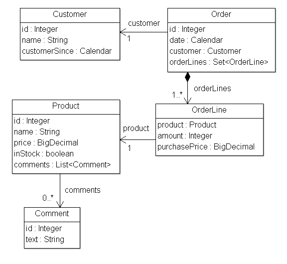

1 Thymeleafの紹介
=======================


1.1 Thymeleafって何？
----------------------

Thymeleafは、ウェブとスタンドアローンどちらの環境でも利用できる、モダンなサーバーサイドJavaテンプレートエンジンです。HTML、XML、JavaScript、CSS、さらにプレーンテキストも処理することができます。

Thymeleafの主な目的は、テンプレートの作成に対して優雅で保守性の高い方法を提供することです。それを実現するために、Thymeleafは*ナチュラルテンプレート*というコンセプトを採用しており、デザインプロトタイプとして使用されるテンプレートファイルに影響を与えることなくロジックを注入することができます。これによって、デザインに対するコミュニケーションが改善され、デザインチームと開発チームの隙間が埋められます。

また、Thymeleafは初めからウェブ標準 -- 特に**HTML5** -- を念頭に置いて設計されているので、必要に応じて完全にバリデーションされたテンプレートを作成することも可能です。


1.2 Thymeleafはどんな種類のテンプレートを処理できるの？
-------------------------------------------------

すぐに使える機能として、Thymeleafは6種類のテンプレート処理機能を備えています。これを**テンプレートモード**と呼びます：

 * HTML
 * XML
 * TEXT
 * JAVASCRIPT
 * CSS
 * RAW

2種類の*マークアップ形式の*テンプレートモード（`HTML`と`XML`）、3種類の*テキスト形式の*テンプレートモード（`TEXT`、`JAVASCRIPT`、`CSS`）、そして*処理なしの*テンプレートモード（`RAW`）があります。

**`HTML`**テンプレートモードはHTML5、HTML 4、そしてXHTMLを含む全ての種類のHTML入力を受け付けます。バリデーションや整形式チェックは行われず、テンプレートのコードや構造は可能な限り出力に反映されます。

**`XML`**テンプレートモードはXML入力を受け付けます。この場合、コードは整形式であること -- 閉じられていないタグがないこと、クォートされていない属性がないことなど -- が期待され、整形式違反が見つかった場合はパーサーが例外を投げます。（DTDやXMLスキーマに対する）*バリデーション*は実行されないことに注意してください。

**`TEXT`**テンプレートモードでは、非マークアップ形式のテンプレートに対して特別な構文を使用することができます。そのようなテンプレートの例としては、テキストメールやテンプレート化されたドキュメントなどがあるでしょう。HTMLやXMLのテンプレートを`TEXT`として処理することも可能です。この場合、全てのタグやDOCTYPE、コメントなどは、マークアップとしてパースされるのではなく、単なるテキストとして扱われます。

**`JAVASCRIPT`**テンプレートモードでは、Thymeleafアプリケーション内のJavaScriptファイルを処理することができます。つまりHTMLファイルと同様にJavaScriptファイル内でもモデルデータを使用することができます。また、特別なエスケープや*ナチュラルスクリプティング*のようなJavaScript固有の機能も存在します。`JAVASCRIPT`テンプレートモードは*テキスト形式の*モードとして扱われるので、`TEXT`テンプレートモードと同様の特別な構文を使用します。

**`CSS`**テンプレートモードでは、Thymeleafアプリケーションに含まれているCSSファイルを処理することができます。`JAVASCRIPT`モードと同様に`CSS`テンプレートモードも*テキスト形式の*モードなので、`TEXT`テンプレートモードの特別な構文を使用します。

**`RAW`**テンプレートモードは単純にテンプレートに対して何も処理をしません。これは処理中のテンプレートに対してリソース（ファイルやURLレスポンスなど）を変更せずにそのまま挿入する際に使用されます。例えば、自分達の管理下にない外部のHTMLリソースをアプリケーションのテンプレートにインクルードする場合を考えます。この時、外部リソースにThymeleafのコードが含まれていたとしても、そのコードは実行されないことが分かっているので安心です。


1.3 ダイアレクト：スタンダードダイアレクト
----------------------------------

Thymeleafは非常に拡張性の高いテンプレートエンジンです（実際のところ*テンプレートエンジンフレームワーク*と呼んでも良いかもしれません）。Thymeleafでは、テンプレートをどのように処理するかという定義やカスタマイズを細かいレベルで行うことができます。

マークアップの生成物（タグやテキストやコメント、またはマークアップ形式以外のテンプレートの場合はプレースホルダー）にロジックを適用するものを*プロセッサー*と呼びます。**ダイアレクト**は通常、一式のプロセッサー -- と、おそらくいくつかの特別な生成物 -- によって構成されます。Thymeleafのコアライブラリーは、すぐに使える**スタンダードダイアレクト**というダイアレクトを提供していて、大半のユーザーにとってはこれで十分でしょう。

> 実際のところ、ダイアレクトにプロセッサーを含めずに他の生成物だけで構成することも可能なのですが、通常はプロセッサーを使用します。

*このチュートリアルではスタンダードダイアレクトを取り上げます*。これ以降のページで学ぶ全ての属性や文法は、特に明記していなくても、このダイアレクトに定義してあります。

ライブラリーの高度な機能を利用する一方で、独自の処理ロジックを定義したい場合にはもちろん（スタンダードダイアレクトを拡張することも含めて）独自のダイアレクトを作成することができます。Thymeleafでは複数のダイアレクトを同時に使用することも可能です。

> 公式のthymeleaf-spring3とthymeleaf-spring4連携パッケージはどちらも「Springスタンダードダイアレクト」と呼ばれるダイアレクトを定義しています。これは、ほぼスタンダードダイアレクトと同じで、そこにSpring Framework用の便利な機能を少しだけ適用しています（例えば、OGNLの代わりにSpring式言語やSpringELを使用するなど）。ですので、Spring MVCユーザーにとっても、時間の無駄にはなりません。ここで学ぶほとんどのことはSpringアプリケーションを作成する際にも役立つでしょう。

スタンダードダイアレクトの大半のプロセッサーは*属性プロセッサー*です。属性プロセッサーを使用すると、HTMLテンプレートファイルは処理前であってもブラウザーで正しく表示することができます。単純にその属性が無視されるからです。例えば、タグライブラリーを使用したJSPだとブラウザで直接表示できないコードを含む場合がありますが：

```html
<form:inputText name="userName" value="${user.name}" />
```

...Thymeleafスタンダードダイアレクトでは同様の機能を次のように実現することができます：

```html
<input type="text" name="userName" value="James Carrot" th:value="${user.name}" />
```

ブラウザーで正しく表示できるだけでなく、（任意ですが）value属性を指定することもできます（この場合の"James Carrot"の部分です）。プロトタイプを静的にブラウザーで開いた場合にはこの値が表示され、テンプレートとして処理した場合には`${user.name}`の評価結果値で置き換えられます。

このおかげで、デザイナーとデベロッパーが全く同じファイルを触ることができ、静的なプロトタイプをテンプレートに変換する労力を削減することができます。こういったことを実現する機能のことを*ナチュラルテンプレーティング*と呼びます。


2 The Good Thymes Virtual Grocery（グッドタイムス仮想食料品店）
=================================

この章以降で使用しているサンプルのソースコードは*Good Thymes Virtual Grocery (GTVG)*サンプルアプリにあります。このアプリには2つの（同じ）バージョンがあります：

   * `javax.*`ベース： [gtvg-javax](https://github.com/thymeleaf/thymeleaf/tree/3.1-master/examples/core/thymeleaf-examples-gtvg-javax).
   * `jakarta.*`ベース： [gtvg-jakarta](https://github.com/thymeleaf/thymeleaf/tree/3.1-master/examples/core/thymeleaf-examples-gtvg-jakarta).

2.1 食料品店用のウェブサイト
---------------------------

Thymeleafのテンプレート処理のコンセプトを分かりやすく説明するために、このチュートリアルではデモアプリケーションを使用します。デモアプリケーションはプロジェクトのウェブサイトからダウンロードすることができます。

このアプリケーションは架空の仮想食料品店のウェブサイトです。これから様々なシナリオでThymeleafの機能を紹介していきます。

まずはじめに、このアプリケーションにはシンプルなモデルエンティティが必要です：`Products`は、`Orders`を作成することによって`Customers`に販売されます。`Products`に対する`Comments`も管理しましょう：



とてもシンプルなサービスレイヤーも作りましょう。次のようなメソッドを持つ`Service`オブジェクトです：


```java
public class ProductService {

    ...

    public List<Product> findAll() {
        return ProductRepository.getInstance().findAll();
    }

    public Product findById(Integer id) {
        return ProductRepository.getInstance().findById(id);
    }

}
```

リクエストURLに応じて、Thymeleaf用のコントローラーに処理を渡すフィルターをウェブレイヤーに作成しましょう：

```java

/*
 * 最初にアプリケーションオブジェクト（IWebApplicationの実装）を宣言する必要があります。
 * この場合は、Jakartaベースのバージョンが使用されます。
 */
public void init(final FilterConfig filterConfig) throws ServletException {
    this.application =
            JakartaServletWebApplication.buildApplication(
                filterConfig.getServletContext());
    // テンプレートエンジンオブジェクトの生成と設定については、後ほど見ていきます
    this.templateEngine = buildTemplateEngine(this.application);
}

/*
 * 各リクエストに対して、エクスチェンジオブジェクト（リクエスト、そのレスポンス、および処理に必要な全てのデータを表す）
 * を生成して、対応するコントローラーを呼び出します。
 */
private boolean process(HttpServletRequest request, HttpServletResponse response)
        throws ServletException {

    try {

        final IWebExchange webExchange =
            this.application.buildExchange(request, response);
        final IWebRequest webRequest = webExchange.getRequest();

        // リソースURLに対してはエンジンを実行しないようにします
        if (request.getRequestURI().startsWith("/css") ||
                request.getRequestURI().startsWith("/images") ||
                request.getRequestURI().startsWith("/favicon")) {
            return false;
        }

        /*
         * コントローラー/URLマッピングに問い合わせて、リクエストを
         * 処理するためのコントローラーを取得します。利用可能な
         * コントローラーが見つからなかった場合はfalseを返して、
         * 他のフィルター/サーブレットに処理を渡します。
         */
        final IGTVGController controller =
            ControllerMappings.resolveControllerForRequest(webRequest);
        if (controller == null) {
            return false;
        }

        /*
         * レスポンスヘッダーを書き込みます。
         */
        response.setContentType("text/html;charset=UTF-8");
        response.setHeader("Pragma", "no-cache");
        response.setHeader("Cache-Control", "no-cache");
        response.setDateHeader("Expires", 0);

        /*
         * レスポンスライターを取得します。
         */
        final Writer writer = response.getWriter();
        
        /*
         * コントローラーを実行してビューテンプレートを処理し
         * レスポンスライターに結果を書き込みます。
         */
        controller.process(webExchange, this.templateEngine, writer);

        return true;

    } catch (Exception e) {
        try {
            response.sendError(HttpServletResponse.SC_INTERNAL_SERVER_ERROR);
        } catch (final IOException ignored) {
            // 無視します
        }
        throw new ServletException(e);
    }

}
```

`IGTVGController`インターフェースは次のようになります：

```java
public interface IGTVGController {

    public void process(
            final IWebExchange webExchange,
            final ITemplateEngine templateEngine,
            final Writer writer)
            throws Exception;

}
```

あとは`IGTVGController`インターフェースの実装を作成するだけです。データをサービスから受け取り、`ITemplateEngine`オブジェクトを使用してテンプレートを処理します。

最終的にはこのようになります：


でも、まずはテンプレートエンジンの初期化について見てみましょう。


2.2 テンプレートエンジンの作成と設定
------------------------------------------------

フィルターの*init(...)*メソッドの中に次のような行があります：

```java
this.templateEngine = buildTemplateEngine(this.application);
```

`org.thymeleaf.TemplateEngine`がどのように初期化されるかを見てみましょう：

```java
private static ITemplateEngine buildTemplateEngine(final IWebApplication application) {

    // テンプレートはアプリケーション（ServletContext）リソースとして解釈されます
    final WebApplicationTemplateResolver templateResolver = 
            new WebApplicationTemplateResolver(application);

    // HTMLはデフォルトのモードなのですが、コードを理解しやすくするために
    // 設定しておきます
    templateResolver.setTemplateMode(TemplateMode.HTML);
    // "home"を"/WEB-INF/templates/home.html"に変換します
    templateResolver.setPrefix("/WEB-INF/templates/");
    templateResolver.setSuffix(".html");
    // テンプレートキャッシュのTTLを1時間に設定します。
    // 未設定の場合、エントリーはLRUで追い出されるまで保持されます
    templateResolver.setCacheTTLMs(Long.valueOf(3600000L));

    // キャッシュはデフォルトでtrueにセットされています。
    // テンプレートの変更を自動的に反映したい場合はfalseにセットします。
    templateResolver.setCacheable(true);

    final TemplateEngine templateEngine = new TemplateEngine();
    templateEngine.setTemplateResolver(templateResolver);

    return templateEngine;

}
```

`TemplateEngine`オブジェクトを初期化する方法は色々ありますが、今のところは、この数行のコードで十分に必要な手順を学ぶことができます。


### テンプレートリゾルバー

テンプレートリゾルバーから始めましょう：

```java
final WebApplicationTemplateResolver templateResolver =
        new WebApplicationTemplateResolver(application);
```

テンプレートリゾルバーはThymeleafのAPIである`org.thymeleaf.templateresolver.ITemplateResolver`インターフェースを実装したオブジェクトです：

```java
public interface ITemplateResolver {

    ...

    /*
     * テンプレートはテンプレート名（または内容）によって解決されます。
     * また、別のテンプレートに対するフラグメントを解決しようとしている場合は
     * そのオーナーテンプレートによって解決されます。
     * このテンプレートリゾルバーで解決できない場合はnullを返します。
     */
    public TemplateResolution resolveTemplate(
            final IEngineConfiguration configuration,
            final String ownerTemplate, final String template,
            final Map<String, Object> templateResolutionAttributes);
}
```

テンプレートリゾルバーは、どのようにテンプレートにアクセスするかを決める役割を担っています。GTVGアプリケーションでは`org.thymeleaf.templateresolver.WebApplicationTemplateResolver`を使用しているので*IWebApplication*オブジェクトからテンプレートファイルをリソースとして取得する、ということになります：*IWebApplication*はThymeleafが抽象化したもので、ウェブアプリケーションルートからリソースを解決します。サーブレットベースのアプリケーションの場合は、基本的にはサーブレットAPIの`[javax|jakarta].servlet.ServletContext`オブジェクトをラップしたものになります。

でも、それだけではありません。テンプレートリゾルバーには設定パラメーターがあります。まずは、テンプレートモード：

```java
templateResolver.setTemplateMode(TemplateMode.HTML);
```

HTMLは`WebApplicationTemplateResolver`のデフォルトテンプレートモードなのですが、それでも指定しておくことでコードを見れば何が起こるのかが分かるのでおすすめです。

```java
templateResolver.setPrefix("/WEB-INF/templates/");
templateResolver.setSuffix(".html");
```

*prefix*と*suffix*は、エンジンに渡されたテンプレート名から実際に利用するリソース名を作り出すために使用されます。

この設定を使用すると*"product/list"*というテンプレート名は次の内容と同じになります：

```java
servletContext.getResourceAsStream("/WEB-INF/templates/product/list.html")
```

任意ですが、テンプレートリゾルバーの*cacheTTLMs*プロパティーで、パースされたテンプレートをキャッシュする時間を指定することができます：

```java
templateResolver.setCacheTTLMs(3600000L);
```

TTL以内であってもキャッシュのサイズが最大値に達した場合は古いエントリーから追い出されます。

> キャッシュの振る舞いやサイズは`ICacheManager`インターフェースの実装によって定義することができます。または、デフォルトキャッシュ用の`StandardCacheManager`を修正することでも定義可能です。

テンプレートリゾルバーについて学ぶことはまだまだありますが、今はテンプレートエンジンオブジェクトの作成に進みましょう。


### テンプレートエンジン

テンプレートエンジンオブジェクトとは`org.thymeleaf.ITemplateEngine`の実装のことです。その実装の1つとして、Thymeleafのコアライブラリーは`org.thymeleaf.TemplateEngine`を提供していますので、ここではそのインスタンスを作成します：

```java
templateEngine = new TemplateEngine();
templateEngine.setTemplateResolver(templateResolver);
```

かなりシンプルですよね。インスタンスを作成してテンプレートリゾルバーをセットするだけです。

`TemplateEngine`に*必須*のパラメーターはテンプレートリゾルバーだけです。他にも色々な設定がありますが（メッセージリゾルバーやキャッシュサイズなど）、それについては後ほど説明します。今はこれだけで十分です。

これでテンプレートエンジンの準備ができました。では、Thymeleafを使用したページの作成に進みましょう。


3 テキストの使用
=============


3.1 複数言語でウェルカム
----------------------------

私たちの食料品店サイトのための最初のタスクはホームページの作成です。

最初のバージョンは非常にシンプルです：タイトルとウェルカムメッセージだけです。`/WEB-INF/templates/home.html`は以下のようになります：

```html
<!DOCTYPE html>

<html xmlns:th="http://www.thymeleaf.org">

  <head>
    <title>Good Thymes Virtual Grocery</title>
    <meta http-equiv="Content-Type" content="text/html; charset=UTF-8" />
    <link rel="stylesheet" type="text/css" media="all"
          href="../../css/gtvg.css" th:href="@{/css/gtvg.css}" />
  </head>

  <body>

    <p th:text="#{home.welcome}">Welcome to our grocery store!</p>

  </body>

</html>
```

まず気づくのは、このファイルがどんなブラウザでも正しく表示できるHTML5だということでしょう。HTMLタグではないタグを含んでいませんからね（そしてブラウザは`th:text`のような理解できない属性は全て無視します）。

でもそれと同時に、このテンプレートが本当の意味での*有効な*HTML5ではないことに気づくかもしれません。`th:*`形式で標準外の属性を使用していますが、これはHTML5の仕様では許可されていないからです。実際、`<html>`タグに`xmlns:th`を追加していますが、これは全然HTML5っぽくありません：

```html
<html xmlns:th="http://www.thymeleaf.org">
```

...これは、テンプレート処理に対しては何の影響もないのですが、IDEが`th:*`属性の名前空間定義がないことについて文句を言ってくるのを防ぐための*おまじない*です。

では、**HTML5として有効な**テンプレートにしたい場合はどうしましょうか？簡単なのは、Thymeleafのデータ属性構文に切り替えることです。属性名に`data-`接頭辞をつけて、セミコロン（`:`）の代わりにハイフン（`-`）セパレータを使用します：

```html
<!DOCTYPE html>

<html>

  <head>
    <title>Good Thymes Virtual Grocery</title>
    <meta http-equiv="Content-Type" content="text/html; charset=UTF-8" />
    <link rel="stylesheet" type="text/css" media="all"
          href="../../css/gtvg.css" data-th-href="@{/css/gtvg.css}" />
  </head>

  <body>

    <p data-th-text="#{home.welcome}">Welcome to our grocery store!</p>

  </body>

</html>
```

独自の`data-`接頭辞付きの属性はHTML5仕様で許可されているので、上記のテンプレートは*有効なHTML5ドキュメント*になります。

> どちらの記法も完全に同等で互換性があるのですが、コードサンプルのシンプルさとコンパクトさを考えて、このチュートリアルでは*名前空間記法*（`th:*`）を使用します。また、`th:*`記法はより一般的で、すべてのThymeleafテンプレートモード（`XML`、`TEXT`...）で利用できますが、`data-`記法は`HTML`モードのみになります。


### th:textの使用とテキストの外部化

テキストの外部化とは、テンプレートコードのフラグメントをテンプレートファイルの外に取り出すことです。それによって、テンプレートとは別のファイル（通常は`.properties`ファイル）の中でそのフラグメントを管理することができ、簡単に他の言語で書かれた文字列に置き換えることができます（このことを多言語対応、または*i18n*と呼びます）。外部化されたテキストのフラグメントのことを通常は*「メッセージ」*と呼びます。

メッセージには常にそのメッセージを識別するためのキーがあります。Thymeleafでは`#{...}`構文を使用してテキストとメッセージの紐付けを行います：

```html
<p th:text="#{home.welcome}">Welcome to our grocery store!</p>
```

ここでは実際にThymeleafスタンダードダイアレクトの2つの異なる機能を使用しています：

 * `th:text`属性：値式の評価結果をタグのボディに設定することで、コード内の"Welcome to our grocery store!"というテキストを置換します。
 * `#{home.welcome}`式：*スタンダード式構文*に規定されています。どのロケールでテンプレートを処理しても`home.welcome`キーに対応するメッセージを取得して`th:text`属性で使用するという意味になります。

では、外部化されたテキストはどこにあるのでしょうか？

Thymeleafでは`org.thymeleaf.messageresolver.IMessageResolver`を実装することで外部化テキストの置き場所を自由に設定できます。通常は`.properties`ファイルを使用する実装になっていますが、必要に応じて独自の実装を作成することも可能で、例えばメッセージをデータベースから取得することも可能です。

ところで、私たちはテンプレートエンジンの初期化時にメッセージリゾルバーを指定していません。この場合は`org.thymeleaf.messageresolver.StandardMessageResolver`クラスによって実装された*スタンダードメッセージリゾルバー*が使用されます。

スタンダードメッセージリゾルバーは`/WEB-INF/templates/home.html`というテンプレートに対してテンプレートと同じフォルダー内で同じ名前のプロパティーファイルの中からメッセージを探します：

 * `/WEB-INF/templates/home_en.properties`が英語用
 * `/WEB-INF/templates/home_es.properties`がスペイン語用
 * `/WEB-INF/templates/home_pt_BR.properties`がポルトガル語（ブラジル）用
 * `/WEB-INF/templates/home.properties`がデフォルト用（ロケールが一致しない場合）

`home_es.properties`ファイルを見てみましょう：

```
home.welcome=¡Bienvenido a nuestra tienda de comestibles!
```

以上がThymeleafのテンプレート処理に必要なことの全てです。ではホームコントローラーを作成しましょう。


### コンテキスト

テンプレートを処理するための`HomeController`クラスを作成します。前述の`IGTVGController`インターフェースを実装します：

```java
public class HomeController implements IGTVGController {

    public void process(
            final IWebExchange webExchange,
            final ITemplateEngine templateEngine,
            final Writer writer)
            throws Exception {

        WebContext ctx = new WebContext(webExchange, webExchange.getLocale());

        templateEngine.process("home", ctx, writer);

    }

}
```

まずは*コンテキスト*の作成について見てみましょう。Thymeleafのコンテキストは`org.thymeleaf.context.IContext`インターフェースを実装したオブジェクトです。コンテキストはテンプレートエンジンの実行に必要な全てのデータ変数のマップと、外部化メッセージで使用されるロケールの参照を持っています。

```java
public interface IContext {

    public Locale getLocale();
    public boolean containsVariable(final String name);
    public Set<String> getVariableNames();
    public Object getVariable(final String name);

}
```

このインターフェースの特別な拡張として、ウェブアプリケーションで使用されることを想定して作られた`org.thymeleaf.context.IWebContext`があります：

```java
public interface IWebContext extends IContext {

    public IWebExchange getExchange();

}
```

Thymeleafのコアライブラリーはそれぞれのインターフェースに対する実装を提供しています：

 * `org.thymeleaf.context.Context` implements `IContext`
 * `org.thymeleaf.context.WebContext` implements `IWebContext`

コントローラーのコードを見ていただければ分かるように、ここでは`WebContext`を使用しています。というか、そうしなければなりません。`WebApplicationTemplateResolver`を利用するためには`IWebContext`を実装したコンテキストが必要となるためです。

```java
WebContext ctx = new WebContext(webExchange, webExchange.getLocale());
```

`WebContext`コンストラクタは、`IWebExchange`抽象オブジェクトに含まれる情報を必要とします。`IWebExchange`抽象オブジェクトはウェブベースの通信（すなわちリクエストとレスポンス）を表しており、フィルターで生成されています。ロケールに何も指定しなければシステムのデフォルトロケールが使用されます（実際のアプリケーションでは絶対に指定した方が良いですが）。

テンプレート内で`WebContext`からリクエストパラメーターやリクエスト属性、セッション属性、アプリケーション属性を取得する際には特別な式を使用することができます。例えば：

 * `${x}`はThymeleafのコンテキストや*エクスチェンジ属性*に保持されている変数`x`を返します（サーブレット用語では*リクエスト属性*）。
 * `${param.x}`は`x`という名前の*リクエストパラメーター*（多値の場合もあります）を返します。
 * `${session.x}`は`x`という名前の*セッション属性*を返します。
 * `${application.x}`は`x`という名前の*アプリケーション属性*を返します（サーブレット用語では*サーブレットコンテキスト属性*）。


### テンプレートエンジンの実行

コンテキストオブジェクトの準備ができたので、テンプレートエンジンに処理してもらうことができるようになりました。コンテキストを使用して（テンプレート名から取得した）テンプレートを処理し、それをレスポンスライターに渡してレスポンスへ書き込みます：

```java
templateEngine.process("home", ctx, writer);
```

スペイン語ロケールを使用して結果を見てみましょう：

```html
<!DOCTYPE html>

<html>

  <head>
    <title>Good Thymes Virtual Grocery</title>
    <meta content="text/html; charset=UTF-8" http-equiv="Content-Type"/>
    <link rel="stylesheet" type="text/css" media="all" href="/gtvg/css/gtvg.css" />
  </head>

  <body>

    <p>¡Bienvenido a nuestra tienda de comestibles!</p>

  </body>

</html>
```


3.2 テキストと変数についてもっと
-------------------------------


### 非エスケープテキスト

私たちのホームページの最もシンプルなバージョンは準備できたと思いますが、まだ考えていないことがあります…。もし、次のようなメッセージがある場合はどうしましょう？

```java
home.welcome=Welcome to our <b>fantastic</b> grocery store!
```

これまでと同じやり方でテンプレートを実行するとこのようになります：

```html
<p>Welcome to our &lt;b&gt;fantastic&lt;/b&gt; grocery store!</p>
```

これは本当に欲しい結果ではありませんね。`<b>`タグがエスケープされてブラウザに表示されてしまっています。

これは`th:text`属性のデフォルト動作です。ThymeleafでHTMLタグをエスケープせずに表示したい場合には、これとは別の属性を使用しなければなりません。（「非エスケープテキスト」用の）`th:utext`です：

```html
<p th:utext="#{home.welcome}">Welcome to our grocery store!</p>
```

これで欲しかったメッセージが出力されるようになります：

```html
<p>Welcome to our <b>fantastic</b> grocery store!</p>
```


### 変数の使用と表示

さて、私たちのホームページにもう少しコンテンツを追加しましょう。例えば、ウェルカムメッセージの下にこんな風に日付を表示してみると良いかもしれません：

```
Welcome to our fantastic grocery store!

Today is: 12 july 2010
```

まずはじめに、コントローラーを修正してコンテキスト変数に日付を追加します：

```java
public void process(
        final IWebExchange webExchange,
        final ITemplateEngine templateEngine,
        final Writer writer)
        throws Exception {

    SimpleDateFormat dateFormat = new SimpleDateFormat("dd MMMM yyyy");
    Calendar cal = Calendar.getInstance();

    WebContext ctx = new WebContext(webExchange, webExchange.getLocale());
    ctx.setVariable("today", dateFormat.format(cal.getTime()));

    templateEngine.process("home", ctx, writer);

}
```

`String`型の`today`変数をコンテキストに追加したので、テンプレートで表示することができるようになりました：

```html
<body>

  <p th:utext="#{home.welcome}">Welcome to our grocery store!</p>

  <p>Today is: <span th:text="${today}">13 February 2011</span></p>

</body>
```

ご覧の通りここでも`th:text`属性を使用しています（タグのボディを置換したいので、これで合ってます）。ですが今回は構文が少し違いますね。`#{...}`式ではなく`${...}`式を使っています。これが**変数式**です。*OGNL(Object-Graph Navigation Language)*と呼ばれる言語の式を使用して前述のコンテキスト変数マップに対する処理を行います。

この`${today}`式は単純で「todayという名前の変数を取得する」という意味ですが、もっと複雑なこともできます（例えば`${user.name}`は「user変数を取得してその`getName()`メソッドを呼び出す」という意味になります）。

属性には非常にたくさんの値を設定することができます：メッセージ、変数式...などなど。次の章では、どのようなものが指定できるかを全て見ていきましょう。


4 スタンダード式構文
============================

仮想食料品店の開発を少し休憩して、Thymeleafスタンダードダイアレクトの中でもっとも重要なものの一つについて学んでいきましょう：Thymeleafスタンダード式構文です。

既に、この構文を使った2つのタイプの有効な属性値を見てきました：メッセージ式と変数式です：

```html
<p th:utext="#{home.welcome}">Welcome to our grocery store!</p>

<p>Today is: <span th:text="${today}">13 february 2011</span></p>
```

ですが、他にも色々なタイプの式があります。また、既に知っている式にもまだまだ面白い部分があります。まずは、スタンダード式の機能概要を見てみましょう：

 * 単純式：
    * 変数式：`${...}`
    * 選択変数式：`*{...}`
    * メッセージ式：`#{...}`
    * リンクURL式：`@{...}`
    * フラグメント式： `~{...}`
 * リテラル
    * テキストリテラル：`'one text'`, `'Another one!'`,...
    * 数値リテラル：`0`, `34`, `3.0`, `12.3`,...
    * 真偽値リテラル：`true`, `false`
    * Nullリテラル：`null`
    * リテラルトークン：`one`, `sometext`, `main`,...
 * テキスト演算：
    * 文字列結合：`+`
    * リテラル置換：`|The name is ${name}|`
 * 算術演算：
    * 二項演算子：`+`, `-`, `*`, `/`, `%`
    * マイナス符号（単項演算子）：`-`
 * 論理演算：
    * 二項演算子：`and`, `or`
    * 論理否定演算子（単項演算子）：`!`, `not`
 * 比較と等価：
    * 比較演算子：`>`, `<`, `>=`, `<=` (`gt`, `lt`, `ge`, `le`)
    * 等価演算子：`==`, `!=` (`eq`, `ne`)
 * 条件演算子：
    * If-then：`(if) ? (then)`
    * If-then-else：`(if) ? (then) : (else)`
    * デフォルト：`(value) ?: (defaultvalue)`
 * 特別なトークン：
    * 処理なし：`_`

これら全ての機能は、結合したり入れ子にしたりすることができます：

```html
'User is of type ' + (${user.isAdmin()} ? 'Administrator' : (${user.type} ?: 'Unknown'))
```


4.1 メッセージ
------------

ここまでに見てきたように`#{...}`メッセージ式は次のように書いて：

```html
<p th:utext="#{home.welcome}">Welcome to our grocery store!</p>
```

...この内容とリンクすることができます：

```html
home.welcome=¡Bienvenido a nuestra tienda de comestibles!
```

でも、まだ考えていないことが一つあります：メッセージテキストが完全に静的ではない場合はどうしましょう？例えば、アプリケーションは誰がサイトに訪れているかをいつでも知っているとして、その人の名前を呼んで挨拶をしたい場合にはどのようにすればいいのでしょう？

```html
<p>¡Bienvenido a nuestra tienda de comestibles, John Apricot!</p>
```

つまり、メッセージにパラメーターを持たせたいということです。こんなふうに：

```html
home.welcome=¡Bienvenido a nuestra tienda de comestibles, {0}!
```

パラメーターは[`java.text.MessageFormat`](https://docs.oracle.com/javase/10/docs/api/java/text/MessageFormat.html)の標準的な構文に従って指定します。つまり、`java.text.*`パッケージ内のクラスのAPIドキュメントに書かれているように、数値や日付にフォーマットすることも可能ということです。

HTTPセッションに保持している`user`という属性をパラメーターとして指定するには次のように記述します：

```html
<p th:utext="#{home.welcome(${session.user.name})}">
  Welcome to our grocery store, Sebastian Pepper!
</p>
```

> `th:utext`を使用しているので、フォーマットされたメッセージがエスケープされないことに注意して下さい。この例では`user.name`が既にエスケープされている想定です。

複数のパラメーターをカンマ区切りで指定することも可能です。

メッセージキー自体は変数で指定することができます：

```html
<p th:utext="#{${welcomeMsgKey}(${session.user.name})}">
  Welcome to our grocery store, Sebastian Pepper!
</p>
```


4.2 変数
-------------

既に述べたように`${...}`式は、実際にはコンテキスト内の変数マップに対して実行されるOGNL(Object-Graph Navigation Language)式です。

> OGNLの構文と機能の詳細については、[OGNL言語ガイド](http://commons.apache.org/ognl/)を参照してください。
>
> Spring MVCを使用したアプリケーションでは、OGNLは**SpringEL**によって置き換えられますが、その構文はOGNLの構文と非常によく似ています（実際、ほとんどの一般的なケースで全く同じです）。

OGNL構文から次のようなことが分かります。ここに含まれている式は：

```html
<p>Today is: <span th:text="${today}">13 february 2011</span>.</p>
```

...実際には次の内容と同等です：

```java
ctx.getVariable("today");
```

ですが、OGNLではもっとパワフルな表現が可能です。こんな風に：

```html
<p th:utext="#{home.welcome(${session.user.name})}">
  Welcome to our grocery store, Sebastian Pepper!
</p>
```

...これは、実際には次の処理を実行してユーザー名を取得します：

```java
((User) ctx.getVariable("session").get("user")).getName();
```

ですが、ゲッターメソッドのナビゲーションはOGNLの機能の1つにすぎません。他の機能もいくつか見てみましょう：

```java
/*
 * ポイント（.）を使用したプロパティーへのアクセス。
 * プロパティーのゲッターを呼び出すのと同じ。
 */
${person.father.name}

/*
 * 角括弧（[]）の中に変数またはシングルクォートで囲まれた文字列によって
 * プロパティー名を指定することでもアクセスできる。
 */
${person['father']['name']}

/*
 * オブジェクトがマップの場合はドット構文も角括弧構文も
 * get(...)メソッドを呼び出すのと同じ。
 */
${countriesByCode.ES}
${personsByName['Stephen Zucchini'].age}

/*
 * 配列やコレクションに対するインデックスを使用したアクセスも同様に角括弧を使用。
 * インデックスはクォートなしで書く。
 */
${personsArray[0].name}

/*
 * メソッド呼び出し。引数指定も可。
 */
${person.createCompleteName()}
${person.createCompleteNameWithSeparator('-')}
```


### 式基本オブジェクト

コンテキスト変数に対してOGNL式で評価をする際に、より柔軟な記述ができるように、いくつかのオブジェクトを用意しています。これらのオブジェクトの参照は（OGNL標準に従って）`#`シンボルで始まります：

 * `#ctx`：コンテキストオブジェクト。
 * `#vars`：コンテキスト変数。
 * `#locale`：コンテキストロケール。

次のように利用できます：

```html
Established locale country: <span th:text="${#locale.country}">US</span>.
```

詳細は[Appendix A](#appendix-a式基本オブジェクト)を参照して下さい。


### 式ユーティリティーオブジェクト

基本オブジェクト以外にも、式の中で一般的なタスクを実行するのを助けてくれるユーティリティーオブジェクトというものがあります。

 * `#execInfo`：処理しているテンプレートに関する情報。
 * `#messages`：#{...}構文と同様に変数式内で外部化メッセージを取得するためのメソッド群。
 * `#uris`：URL/URIの一部をエスケープするためのメソッド群
 * `#conversions`：設定された*コンバージョンサービス*を実行するためのメソッド群（存在する場合）。
 * `#dates`：`java.util.Date`オブジェクト用のメソッド群：フォーマット、コンポーネントの抽出など。
 * `#temporals`: JDK8以上の`java.time`APIを利用して日付や時間を処理します。
 * `#calendars`：`#dates`と似ているが`java.util.Calendar`オブジェクト用。
 * `#numbers`：数値オブジェクトをフォーマットするためのメソッド群。
 * `#strings`：`String`オブジェクト用のメソッド群：contains、startsWith、prepending/appendingなど。
 * `#objects`：オブジェクト一般のメソッド群。
 * `#bools`：真偽値評価用のメソッド群。
 * `#arrays`：配列用のメソッド群。
 * `#lists`：リスト用のメソッド群。
 * `#sets`：セット用のメソッド群。
 * `#maps`：マップ用のメソッド群。
 * `#aggregates`：配列やコレクションに対して集約を作成するためのメソッド群。
 * `#ids`：（例えば、イテレーションの結果として）繰り返される処理の中でid属性を取り扱うためのメソッド群。

それぞれのユーティリティーオブジェクトにどんな機能があるのかは[Appendix B](#appendix-b式ユーティリティーオブジェクト)を参照してください。


### 私たちのホームページ内の日付を再フォーマット

ユーティリティーオブジェクトについて学んだので、それを使用して私たちのホームページ内の日付表示の方法を変更することができます。次のように`HomeController`で処理する代わりに：

```java
SimpleDateFormat dateFormat = new SimpleDateFormat("dd MMMM yyyy");
Calendar cal = Calendar.getInstance();

WebContext ctx = new WebContext(webExchange, webExchange.getLocale());
ctx.setVariable("today", dateFormat.format(cal.getTime()));

templateEngine.process("home", ctx, writer);
```

...次のように書いて：

```java
WebContext ctx = new WebContext(webExchange, webExchange.getLocale());
ctx.setVariable("today", Calendar.getInstance());

templateEngine.process("home", ctx, writer);
```

...ビューレイヤー側で日付のフォーマットを実行します：

```html
<p>
  Today is: <span th:text="${#calendars.format(today,'dd MMMM yyyy')}">13 May 2011</span>
</p>
```


4.3 選択に対する式（アスタリスク構文）
-----------------------------------------------

変数式は`${...}`以外に`*{...}`と書くこともできます。

重要な違いは、アスタリスク構文はコンテキスト全体に対してではなく、*選択されたオブジェクト*に対して式を評価するということです。ですので、選択されたオブジェクトがなければ、ダラー構文もアスタリスク構文も全く同じになります。

選択されたオブジェクトとは何でしょうか？それは`th:object`属性を使用した式の結果のことです。では、ユーザープロフィールページ（`userprofile.html`）で使ってみましょう：

```html
  <div th:object="${session.user}">
    <p>Name: <span th:text="*{firstName}">Sebastian</span>.</p>
    <p>Surname: <span th:text="*{lastName}">Pepper</span>.</p>
    <p>Nationality: <span th:text="*{nationality}">Saturn</span>.</p>
  </div>
```

これは次のように書くのと全く同じです：

```html
<div>
  <p>Name: <span th:text="${session.user.firstName}">Sebastian</span>.</p>
  <p>Surname: <span th:text="${session.user.lastName}">Pepper</span>.</p>
  <p>Nationality: <span th:text="${session.user.nationality}">Saturn</span>.</p>
</div>
```

もちろん、ダラー構文とアスタリスク構文は一緒に使うことができます：

```html
<div th:object="${session.user}">
  <p>Name: <span th:text="*{firstName}">Sebastian</span>.</p>
  <p>Surname: <span th:text="${session.user.lastName}">Pepper</span>.</p>
  <p>Nationality: <span th:text="*{nationality}">Saturn</span>.</p>
</div>
```

ダラー構文内で`#object`式変数を使用して選択されているオブジェクトを参照することもできます：

```html
<div th:object="${session.user}">
  <p>Name: <span th:text="${#object.firstName}">Sebastian</span>.</p>
  <p>Surname: <span th:text="${session.user.lastName}">Pepper</span>.</p>
  <p>Nationality: <span th:text="*{nationality}">Saturn</span>.</p>
</div>
```

繰り返しになりますが、オブジェクトが選択されていない場合はダラー構文とアスタリスク構文は全く同じ意味になります。

```html
<div>
  <p>Name: <span th:text="*{session.user.name}">Sebastian</span>.</p>
  <p>Surname: <span th:text="*{session.user.surname}">Pepper</span>.</p>
  <p>Nationality: <span th:text="*{session.user.nationality}">Saturn</span>.</p>
</div>
```


4.4 リンクURL
-------------

その重要性から、URLはウェブアプリケーションテンプレートにおけるファーストクラスオブジェクトですが、*Thymeleafスタンダードダイアレクト*にも特別な構文が用意されています。`@`構文です：`@{...}`

URLにはいくつかのタイプがあります：

 * 絶対URL：`http://www.thymeleaf.org`
 * 相対URL：
    * ページ相対URL：`user/login.html`
    * コンテキスト相対URL：`/itemdetails?id=3`（サーバー内のコンテキスト名は自動的に付与されます）
    * サーバー相対URL：`~/billing/processInvoice`（同じサーバー内の別のコンテキスト（= application）のURLを呼び出すことができます）
    * プロトコル相対URL：`//code.jquery.com/jquery-2.0.3.min.js`

これらの式の実際の処理と出力されるURLへの変換は、`ITemplateEngine`オブジェクトに登録されている`org.thymeleaf.linkbuilder.ILinkBuilder`インターフェースの実装によって行われます。

デフォルトでは、このインターフェースの1つの実装として`org.thymeleaf.linkbuilder.StandardLinkBuilder`が登録されていて、オフライン（非ウェブ）とサーブレットAPIベースのウェブシナリオの両方にとって十分なものとなっています。他のシナリオ（サーブレットAPIベースではないものとの連携など）では独自のリンクビルダーインターフェース実装が必要になるかもしれません。

では、この新しい構文を`th:href`属性で使用してみましょう：

```html
<!-- 'http://localhost:8080/gtvg/order/details?orderId=3'になります -->
<!-- （そして属性を書き換えます） -->
<a href="details.html"
   th:href="@{http://localhost:8080/gtvg/order/details(orderId=${o.id})}">view</a>

<!-- '/gtvg/order/details?orderId=3'になります（と属性書き換え） -->
<a href="details.html" th:href="@{/order/details(orderId=${o.id})}">view</a>

<!-- '/gtvg/order/3/details'になります（と属性書き換え） -->
<a href="details.html" th:href="@{/order/{orderId}/details(orderId=${o.id})}">view</a>
```

いくつか注意点：

 * `th:href`は属性変更用の属性です：リンクURLを生成し、その値を`<a>`タグのhref属性にセットします。
 * URLパラメーターを指定することもできます（`orderId=${o.id}`の部分です）。自動的に必要なURLパラメーターエンコーディングが実行されます。
 * カンマ区切りで複数のパラメーターを渡すことができます：`@{/order/process(execId=${execId},execType='FAST')}`
 * URLパス内でも変数テンプレートは使用可能です：`@{/order/{orderId}/details(orderId=${orderId})}`
 * `/`で始まる相対URL（例：`/order/details`）の前には、自動的にアプリケーションコンテキスト名が付与されます。
 * クッキーが利用できない場合、またはまだ利用できるかどうか分からない場合は`";jsessionid=..."`を相対URLの最後につけてセッションをキープできるようにすることがあります。これは*URLリライティング*と呼ばれていますが、Thymeleafでは全てのURLに対してサーブレットAPIの`response.encodeURL(...)`のメカニズムを使用して独自リライトフィルターをプラグインできます。
 * `th:href`属性を使用する場合は（任意ですが）静的な`href`属性をテンプレートに同時に指定することができます。そうすることでプロトタイプ用途などで直接テンプレートをブラウザで開いた場合でもリンクを有効にすることができます。

メッセージ構文（`#{...}`）と同様に、URL構文でも他の式の評価結果を使用することができます。

```html
<a th:href="@{${url}(orderId=${o.id})}">view</a>
<a th:href="@{'/details/'+${user.login}(orderId=${o.id})}">view</a>
```


### 私たちのホームページ用のメニュー

リンクURLの作成方法がわかったので、ホームページにサイト内の他のページへの小さなメニューを加えてみましょう。

```html
<p>Please select an option</p>
<ol>
  <li><a href="product/list.html" th:href="@{/product/list}">Product List</a></li>
  <li><a href="order/list.html" th:href="@{/order/list}">Order List</a></li>
  <li><a href="subscribe.html" th:href="@{/subscribe}">Subscribe to our Newsletter</a></li>
  <li><a href="userprofile.html" th:href="@{/userprofile}">See User Profile</a></li>
</ol>
```


### サーバールート相対URL

別の構文を使用して、（コンテキストルート相対URLの代わりに）サーバールート相対URLを作成することができます。`@{~/path/to/something}`のように指定することで、同じサーバーの異なるコンテキストへのリンクを作成することができます。


4.5 フラグメント
-------------

フラグメント式を使用すると、簡単にマークアップのフラグメントを指定したり、テンプレート内でフラグメントを移動したりすることができます。これによって、フラグメントを複製したり、他のテンプレートに引数として渡したりすることができるようになります。

最も一般的な使い方は、`th:insert`または`th:replace`を使ったフラグメントの挿入です（これらについては後のセクションで詳しく説明します）：

```html
<div th:insert="~{commons :: main}">...</div>
```

他の変数同様、どこでも利用できます：

```html
<div th:with="frag=~{footer :: #main/text()}">
  <p th:insert="${frag}">
</div>
```

このチュートリアルの後半には、テンプレートレイアウトのことを取り扱うセクションがあり、そこにフラグメント式の詳細な説明も含まれています。


4.6 リテラル
------------

### テキストリテラル

テキストリテラルはシングルクォートで囲まれた文字列です。どんな文字でも大丈夫ですが、シングルクォート自体は`\'`のようにエスケープしてください。

```html
<p>
  Now you are looking at a <span th:text="'working web application'">template file</span>.
</p>
```

### 数値リテラル

数値リテラルは数字そのままです。

```html
<p>The year is <span th:text="2013">1492</span>.</p>
<p>In two years, it will be <span th:text="2013 + 2">1494</span>.</p>
```


### 真偽値リテラル

真偽値リテラルは`true`と`false`です。例えば：

```html
<div th:if="${user.isAdmin()} == false"> ...
```

この例では、`== false`が括弧の外側にあるのでThymeleafによって処理されます。括弧の中にある場合は、OGNL/SpringELエンジンによって処理されます。

```html
<div th:if="${user.isAdmin() == false}"> ...
```


### nullリテラル

`null`リテラルも使用できます：

```html
<div th:if="${variable.something} == null"> ...
```


### リテラルトークン

数値、真偽値、nullリテラルは実は*リテラルトークン*の特定のケースなのです。

リテラルトークンはスタンダード式を少しだけシンプルにしてくれます。テキストリテラル（`'...'`）と全く同様の動きをしますが次の文字しか使用できません：文字（`A-Z`と`a-z`）、数字（`0-9`）、括弧（`[`と`]`）、ドット（`.`）、ハイフン（`-`）そしてアンダースコア（`_`）。空白文字やカンマ等は使用できません。

メリットは何でしょうか？それはトークンはクォートで囲む必要がないという点です。ですので、このように書く代わりに：

```html
<div th:class="'content'">...</div>
```

こんな風に書くことができます：

```html
<div th:class="content">...</div>
```


4.7 テキストの結合
-------------------

テキストは`+`演算子で結合できます。文字列リテラルでも値やメッセージ式の評価結果でも問題ありません：

```html
<span th:text="'The name of the user is ' + ${user.name}">
```


4.8 リテラル置換
-------------------------

リテラル置換を使用すると複数の変数から文字列を作成するフォーマットが簡単になります。`'...' + '...'`のようにリテラルを追加する必要がありません。

リテラル置換を使用する場合は、縦棒（`|`）で囲みます：

```html
<span th:text="|Welcome to our application, ${user.name}!|">
```

これは以下の内容と同じです：

```html
<span th:text="'Welcome to our application, ' + ${user.name} + '!'">
```

リテラル置換は他の式と組み合わせて使用することができます：

```html
<span th:text="${onevar} + ' ' + |${twovar}, ${threevar}|">
```

> リテラル置換（`|...|`）内で使用可能なのは、変数/メッセージ式（`${...}`、`*{...}`、`#{...}`）だけです。他のリテラル（`'...'`）や真偽値/数値トークンや条件式などは使用できません。


4.9 算術演算子
-------------------------

いくつかの算術演算子も使用できます：`+`、`-`、`*`、`/`、`%`

```html
<div th:with="isEven=(${prodStat.count} % 2 == 0)">
```

この演算子はOGNL変数式の中でも使用可能なことに注意して下さい（その場合はThymeleafスタンダード式エンジンの代わりにOGNLによって実行されます）：

```html
<div th:with="isEven=${prodStat.count % 2 == 0}">
```

文字列エイリアスが用意されている演算子もあります：`div`（`/`）、`mod`（`%`）


4.10 比較演算子と等価演算子
----------------------------

式の中の値は `>`、`<`、`>=`、`<=`シンボルで比較でき、`==`と`!=`演算子で等価性（または不等価性）を確認することができます。ただし、XMLの属性値には`<`と`>`を使用すべきではないと策定されていますので、代わりに`&lt;`と`&gt;`を使用すべきです。

```html
<div th:if="${prodStat.count} &gt; 1">
<span th:text="'Execution mode is ' + ( (${execMode} == 'dev')? 'Development' : 'Production')">
```

演算子の文字列エイリアスを利用する方がシンプルになるかもしれません：`gt`（`>`）、`lt`（`<`）、`ge`（`>=`）、`le`（`<=`）、`not`（`!`）、それから`eq`（`==`）、`neq`/`ne`（`!=`）。


4.11 条件式
---------------------------

*条件式*は条件を評価した結果によって、2つのうちのどちらかの式を評価することを意味します（条件自体もまた別の式になります）。

例を見てみましょう（今回は`th:class`という*属性変更子*を使用します）：

```html
<tr th:class="${row.even}? 'even' : 'odd'">
  ...
</tr>
```

条件式の3つのパーツ全て（`condition`、`then`そして`else`）がそれぞれ式になっています。つまり、変数（`${...}`、`*{...}`）やメッセージ（`#{...}`）や、URL（`@{...}`）やリテラル（`'...'`）を使うことができるということです。

条件式は括弧で囲むことで入れ子にすることが可能です：

```html
<tr th:class="${row.even}? (${row.first}? 'first' : 'even') : 'odd'">
  ...
</tr>
```

else式は省略可能です。その場合、条件がfalseのときにはnull値が返されます：

```html
<tr th:class="${row.even}? 'alt'">
  ...
</tr>
```


4.12 デフォルト式（エルビス演算子）
-----------------------------------------

*デフォルト式*は*then*のない特別な条件式です。Groovyなどの*エルビス演算子*と同じです。2つの式を指定して最初の式の結果がnull以外の場合にはその値を、nullの場合には2番目の式の結果が使用されます。

実際に私たちのユーザープロフィールページを見てみましょう：

```html
<div th:object="${session.user}">
  ...
  <p>Age: <span th:text="*{age}?: '(no age specified)'">27</span>.</p>
</div>
```

ご覧の通り演算子は`?:`です。`*{age}`がnullの場合にのみデフォルト値（今回はリテラル値）を表示します。つまり、以下の内容と同じです：

```html
<p>Age: <span th:text="*{age != null}? *{age} : '(no age specified)'">27</span>.</p>
```

括弧で囲むことで条件を入れ子にすることが可能です：

```html
<p>
  Name:
  <span th:text="*{firstName}?: (*{admin}? 'Admin' : #{default.username})">Sebastian</span>
</p>
```


4.13 処理なしトークン
------------------

処理なしトークンはアンダースコアシンボル（`_`）で表現されます。

このトークンは、式が*何もしない*という結果が必要な場合に利用します。つまり、処理を行う属性（例えば`th:text`）があたかもそこになかったかのように振る舞います。

特に、これによってデベロッパーはプロトタイプテキストをデフォルト値のように使用することができます。たとえば、次のように書く代わりに：

```html
<span th:text="${user.name} ?: 'no user authenticated'">...</span>
```

...*'no user authenticated'*をプロトタイプテキストとして直接使用することができるということです。デザインの観点から見ると、より簡潔で幅広い用途のコードを書くことができるようになります。

```html
<span th:text="${user.name} ?: _">no user authenticated</span>
```


4.14 データ変換/フォーマット
---------------------------------

Thymeleafの変数式（`${...}`）と選択式（`*{...}`）には*二重括弧*構文があり、*コンバージョンサービス*を使用した*データ変換*を適用することができます。

基本的にはこんな感じです：

```html
<td th:text="${{user.lastAccessDate}}">...</td>
```

二重括弧に気づきましたか？：`${{...}}`。Thymeleafは`user.lastAccessDate`式の結果を*コンバージョンサービス*に渡して、**フォーマット演算**（`String`への変換）を実行してから結果を書き出します。

`user.lastAccessDate`が`java.util.Calendar`型だったとしましょう。もし*コンバージョンサービス*（`IStandardConversionService`の実装）が登録されていて、`Calendar -> String`に対する有効な変換が含まれている場合は、それが適用されます。

`IStandardConversionService`のデフォルト実装（`StandardConversionService`クラス）は、単純にどんなオブジェクトに対しても`.toString()`を実行して`String`に変換します。独自*コンバージョンサービス*実装をどのように登録するかについてのより詳細な情報は[設定についてもっと](#設定についてもっと)のセクションを参照してください。

> 公式のthymeleaf-spring3とthymeleaf-spring4連携パッケージでは、Thymeleafのコンバージョンサービスのメカニズムと、Spring自身の*Conversion Service*の仕組みを透過的に連携させています。それによって、Springの設定で宣言されたコンバージョンサービスとフォーマッターが自動的に`${{...}}`式と`*{{...}}`式で利用可能になっています。


4.15 プリプロセッシング
------------------

ここまで見てきた式に加えて、Thymeleafには*プリプロセッシング*式があります。

プリプロセッシングとは、通常の式よりも先に評価されるということです。それによって、最終的に実行される実際の式を変更することができます。

プリプロセッシング式は普通の式と全く同じように書くことができますが、二重のアンダースコアシンボルで囲まれています（`__${expression}__`）。

i18nの`Messages_fr.properties`のエントリーに言語特有のスタティックメソッドを呼び出すようなOGNL式が含まれているとしましょう：

```java
article.text=@myapp.translator.Translator@translateToFrench({0})
```

...`Messages_es.properties`の場合はこうなっています：

```java
article.text=@myapp.translator.Translator@translateToSpanish({0})
```

ロケールに応じた式を評価してマークアップを作成する必要があるので、まずは（プリプロセッシングで）式を選択して、その次にThymeleafにそれを実行させます：

```html
<p th:text="${__#{article.text('textVar')}__}">Some text here...</p>
```

フランス語ロケールの場合のプリプロセッシングは次のように書くのと同等です：

```html
<p th:text="${@myapp.translator.Translator@translateToFrench(textVar)}">Some text here...</p>
```

プリプロセッシング用文字列`__`を属性の中で使用する場合は`\_\_`とエスケープします。


5 属性値の設定
==========================

この章ではマークアップ内の属性値を設定（または変更）する方法を説明します。


5.1 任意の属性に値を設定
--------------------------------------

私たちのウェブサイトでニュースレターを発行することにしましょう。ユーザーが購読できるようにしたいので`/WEB-INF/templates/subscribe.html`テンプレートにフォームを設置します：

```html
<form action="subscribe.html">
  <fieldset>
    <input type="text" name="email" />
    <input type="submit" value="Subscribe!" />
  </fieldset>
</form>
```

Thymeleafでは、ウェブアプリケーションのテンプレートというよりは静的なプロトタイプに近いものから始めます。まず、`action`属性がこのテンプレートファイル自身への静的リンクになっているので、有効なURLに書き換える方法がありません。次に、サブミットボタンの`value`属性は英語で表示されますが多言語対応したいと考えています。

ということで`th:attr`属性を使いましょう。これで、タグの中の属性値を変更することができます：

```html
<form action="subscribe.html" th:attr="action=@{/subscribe}">
  <fieldset>
    <input type="text" name="email" />
    <input type="submit" value="Subscribe!" th:attr="value=#{subscribe.submit}"/>
  </fieldset>
</form>
```

この概念はとても直感的です：`th:attr`には単純に属性に値を代入する式を指定します。対応するコントローラーやメッセージファイルを作成することによって、処理結果はこのようになります：

```html
<form action="/gtvg/subscribe">
  <fieldset>
    <input type="text" name="email" />
    <input type="submit" value="¡Suscríbe!"/>
  </fieldset>
</form>
```

新しい属性の値が使用されていることに加えて`/gtvg/subscribe`のURLには、以前の章で説明したようにアプリケーションコンテキスト名が自動的に付け加えられています。

でも、同時に複数の属性に値を設定したい場合はどうしたらよいでしょうか？XMLでは1つのタグの中に同じ属性を2つ以上書くことができないので`th:attr`にはカンマ区切りのリストを指定することができるようになっています：

```html

```

必要なメッセージファイルを用意してあげると、このような出力になります：

```html

```


5.2 特定の属性に値を設定
----------------------------------------

ここまで見てきて、次のような書き方はすごく汚いなぁと思っているかもしれませんね：

```html
<input type="submit" value="Subscribe!" th:attr="value=#{subscribe.submit}"/>
```

属性の中で値を設定するというのはとても実用的ではありますが、常にそうしないといけないというのはエレガントではありません。

Thymeleafもそう思います。なので実際のところ`th:attr`属性がテンプレート内で使用されることはほとんどありません。通常は`th:*`属性を使用します。この属性を使用すると（`th:attr`のような任意の属性ではなく）特定のタグ属性に値を設定することができます。

例えば、`value`属性に値を設定するときには`th:value`を使用します：

```html
<input type="submit" value="Subscribe!" th:value="#{subscribe.submit}"/>
```

この方が全然良いですよね！同様に`form`タグの`action`属性も見てみましょう：

```html
<form action="subscribe.html" th:action="@{/subscribe}">
```

以前に`th:href`属性を`home.html`で使用したのを覚えていますか？それも全く同じ種類の属性です：

```html
<li><a href="product/list.html" th:href="@{/product/list}">Product List</a></li>
```

Thymeleafには、このような属性が非常にたくさん用意されていて、それぞれが特定のHTML5属性に対応しています：

<div class="table-scroller">
---------------------- ---------------------- ----------------------
`th:abbr`              `th:accept`            `th:accept-charset`
`th:accesskey`         `th:action`            `th:align`
`th:alt`               `th:archive`           `th:audio`
`th:autocomplete`      `th:axis`              `th:background`
`th:bgcolor`           `th:border`            `th:cellpadding`
`th:cellspacing`       `th:challenge`         `th:charset`
`th:cite`              `th:class`             `th:classid`
`th:codebase`          `th:codetype`          `th:cols`
`th:colspan`           `th:compact`           `th:content`
`th:contenteditable`   `th:contextmenu`       `th:data`
`th:datetime`          `th:dir`               `th:draggable`
`th:dropzone`          `th:enctype`           `th:for`
`th:form`              `th:formaction`        `th:formenctype`
`th:formmethod`        `th:formtarget`        `th:fragment`
`th:frame`             `th:frameborder`       `th:headers`
`th:height`            `th:high`              `th:href`
`th:hreflang`          `th:hspace`            `th:http-equiv`
`th:icon`              `th:id`                `th:inline`
`th:keytype`           `th:kind`              `th:label`
`th:lang`              `th:list`              `th:longdesc`
`th:low`               `th:manifest`          `th:marginheight`
`th:marginwidth`       `th:max`               `th:maxlength`
`th:media`             `th:method`            `th:min`
`th:name`              `th:onabort`           `th:onafterprint`
`th:onbeforeprint`     `th:onbeforeunload`    `th:onblur`
`th:oncanplay`         `th:oncanplaythrough`  `th:onchange`
`th:onclick`           `th:oncontextmenu`     `th:ondblclick`
`th:ondrag`            `th:ondragend`         `th:ondragenter`
`th:ondragleave`       `th:ondragover`        `th:ondragstart`
`th:ondrop`            `th:ondurationchange`  `th:onemptied`
`th:onended`           `th:onerror`           `th:onfocus`
`th:onformchange`      `th:onforminput`       `th:onhashchange`
`th:oninput`           `th:oninvalid`         `th:onkeydown`
`th:onkeypress`        `th:onkeyup`           `th:onload`
`th:onloadeddata`      `th:onloadedmetadata`  `th:onloadstart`
`th:onmessage`         `th:onmousedown`       `th:onmousemove`
`th:onmouseout`        `th:onmouseover`       `th:onmouseup`
`th:onmousewheel`      `th:onoffline`         `th:ononline`
`th:onpause`           `th:onplay`            `th:onplaying`
`th:onpopstate`        `th:onprogress`        `th:onratechange`
`th:onreadystatechange``th:onredo`            `th:onreset`
`th:onresize`          `th:onscroll`          `th:onseeked`
`th:onseeking`         `th:onselect`          `th:onshow`
`th:onstalled`         `th:onstorage`         `th:onsubmit`
`th:onsuspend`         `th:ontimeupdate`      `th:onundo`
`th:onunload`          `th:onvolumechange`    `th:onwaiting`
`th:optimum`           `th:pattern`           `th:placeholder`
`th:poster`            `th:preload`           `th:radiogroup`
`th:rel`               `th:rev`               `th:rows`
`th:rowspan`           `th:rules`             `th:sandbox`
`th:scheme`            `th:scope`             `th:scrolling`
`th:size`              `th:sizes`             `th:span`
`th:spellcheck`        `th:src`               `th:srclang`
`th:standby`           `th:start`             `th:step`
`th:style`             `th:summary`           `th:tabindex`
`th:target`            `th:title`             `th:type`
`th:usemap`            `th:value`             `th:valuetype`
`th:vspace`            `th:width`             `th:wrap`
`th:xmlbase`           `th:xmllang`           `th:xmlspace`
---------------------- ---------------------- ----------------------
</div>


5.3 複数の値を同時に設定
-----------------------------------------

2つのちょっと特別な属性を紹介します。`th:alt-title`と`th:lang-xmllang`です。これを使うと、2つの属性に同じ値を同時に指定することができます。具体的には：

 * `th:alt-title`は`alt`と`title`を設定します。
 * `th:lang-xmllang`は`lang`と`xml:lang`を設定します。

私たちのGTVGホームページで次のように書いている部分は：

```html

```

このように書くこともできますし：

```html

```

このように書くこともできます：

```html

```


5.4 前後に追加
----------------------------

Thymeleafにはさらに`th:attrappend`と`th:attrprepend`属性があります。既存の属性値の前や後ろに評価結果を付け加えるための属性です。

例えば、CSSクラス名をコンテキスト変数に保存して、あるボタンに対して追加（設定ではなく追加）したい場合が考えられます。ユーザーが何をしたかによって特定のCSSクラスを使用したい場合などです：

```html
<input type="button" value="Do it!" class="btn" th:attrappend="class=${' ' + cssStyle}" />
```

`cssStyle`変数に`"warning"`という値を設定してテンプレートを処理すると次の結果が得られます：

```html
<input type="button" value="Do it!" class="btn warning" />
```

スタンダードダイアレクトには2つの特別な*追加用属性*があります：`th:classappend`と`th:styleappend`です。既存のCSSクラスや*style*を上書きせずに追加してくれます：

```html
<tr th:each="prod : ${prods}" class="row" th:classappend="${prodStat.odd}? 'odd'">
```

（`th:each`属性のことは心配しないでください。*繰り返し用の属性*として後ほど説明します。）


5.5 固定値の真偽値属性
----------------------------------

HTMLには*真偽値属性*という概念があります。その属性は値を持たず、その属性が存在するだけで"true"であることを意味します。XHTMLでは、これらの属性が取り得る値は1つだけで、その属性名自身です。

例えば`checked`です：

```html
<input type="checkbox" name="option2" checked /> <!-- HTML -->
<input type="checkbox" name="option1" checked="checked" /> <!-- XHTML -->
```

スタンダードダイアレクトでは、これらの属性に対して条件の結果によって値を設定するための属性を提供しています。条件の評価結果がtrueの場合はその固定値が設定され、falseの場合は属性自体が設定されません：

```html
<input type="checkbox" name="active" th:checked="${user.active}" />
```

スタンダードダイアレクトには次のような固定値真偽値属性があります：

<div class="table-scroller">
------------------- ------------------ ------------------
`th:async`          `th:autofocus`     `th:autoplay`
`th:checked`        `th:controls`      `th:declare`
`th:default`        `th:defer`         `th:disabled`
`th:formnovalidate` `th:hidden`        `th:ismap`
`th:loop`           `th:multiple`      `th:novalidate`
`th:nowrap`         `th:open`          `th:pubdate`
`th:readonly`       `th:required`      `th:reversed`
`th:scoped`         `th:seamless`      `th:selected`
------------------- ------------------ ------------------
</div>


5.6 任意の属性に値を設定（デフォルト属性プロセッサー）
--------------------------------------------------------------------

Thymeleafには*デフォルト属性プロセッサー*があり、*どんな*属性の値でも設定できます。その属性がスタンダードダイアレクトの`th:*`プロセッサーに定義されていなくても大丈夫なのです。

こんな風に書くと：

```html
<span th:whatever="${user.name}">...</span>
```

このような結果になります：

```html
<span whatever="John Apricot">...</span>
```


5.7 HTML5フレンドリーな属性や要素名のサポート
----------------------------------------------------------

よりHTML5フレンドリーな書き方もできます。これは全く異なる構文になります。

```html
<table>
    <tr data-th-each="user : ${users}">
        <td data-th-text="${user.login}">...</td>
        <td data-th-text="${user.name}">...</td>
    </tr>
</table>
```

`data-{prefix}-{name}`構文は、`th:*`などの名前空間を使用せずに独自属性を書くためのHTML5での標準的な方法です。Thymeleafでは、（スタンダードダイアレクトだけでなく）全てのダイアレクトでこの構文を使用することができます。

`{prefix}-{name}`という形式で独自タグを指定するための構文もあります。これは*W3C Custom Elements specification*（より大きな*W3C Web Components spec*の一部です）に準拠しています。例えば`th:block`要素（または`th-block`）で使用することができますが、これについては後半のセクションで説明します。

**重要:** この構文は名前空間を使用した`th:*`に加えて提供されている機能であって、取って代えるものではありません。将来的に名前空間構文を非推奨にする予定は全くありません。


6 繰り返し処理
===========

ここまでで、ホームページ、ユーザープロフィールページ、そしてニュースレター購読ページを作ってきました。ですが、商品についてはどうでしょう？商品ページを作成するには、コレクションの中の商品を繰り返し処理する手段が必要です。


6.1 繰り返し処理の基礎
--------------------

`/WEB-INF/templates/product/list.html`ページに商品一覧を掲載するためにテーブルを使いましょう。1行（`<tr>`要素）に1商品ずつ表示したいので、テンプレートの中に*テンプレート行* -- 各商品がどのように表示されるかを示す行 -- を作って、それをThymeleafで商品ごとに繰り返します。

スタンダードダイアレクトにはそのための属性があります。`th:each`です。


### th:eachの使用

商品一覧ページには、サービスレイヤーから商品一覧を取得してテンプレートコンテキストにそれを追加するコントローラーが必要になります：

```java
public void process(
        final IWebExchange webExchange,
        final ITemplateEngine templateEngine,
        final Writer writer)
        throws Exception {

    final ProductService productService = new ProductService();
    final List<Product> allProducts = productService.findAll();

    final WebContext ctx = new WebContext(webExchange, webExchange.getLocale());
    ctx.setVariable("prods", allProducts);

    templateEngine.process("product/list", ctx, writer);

}
```

では商品リストを繰り返し処理するために`th:each`を使いましょう：

```html
<!DOCTYPE html>

<html xmlns:th="http://www.thymeleaf.org">

  <head>
    <title>Good Thymes Virtual Grocery</title>
    <meta http-equiv="Content-Type" content="text/html; charset=UTF-8" />
    <link rel="stylesheet" type="text/css" media="all"
          href="../../../css/gtvg.css" th:href="@{/css/gtvg.css}" />
  </head>

  <body>

    <h1>Product list</h1>

    <table>
      <tr>
        <th>NAME</th>
        <th>PRICE</th>
        <th>IN STOCK</th>
      </tr>
      <tr th:each="prod : ${prods}">
        <td th:text="${prod.name}">Onions</td>
        <td th:text="${prod.price}">2.41</td>
        <td th:text="${prod.inStock}? #{true} : #{false}">yes</td>
      </tr>
    </table>

    <p>
      <a href="../home.html" th:href="@{/}">Return to home</a>
    </p>

  </body>

</html>
```

上記の`prod : ${prods}`属性値は「`${prods}`の評価結果の各要素に対して、現在の要素をprodという変数に詰めて、このテンプレートのフラグメントを繰り返し処理する」という意味になります。呼び名を決めておきましょう：

 * ここでは`${prods}`のことを*被反復式*または*被反復変数*と呼びます。
 * ここでは`prod`のことを*反復変数*と呼びます。

反復変数`prod`のスコープは`<tr>`要素内です。つまり`<td>`のような内部のタグでも使用可能です。


### 繰り返し処理が可能な値

Thymeleafの繰り返し処理で使用可能なのは`java.util.List`だけではありません。実際に`th:each`属性では、ほぼすべてのオブジェクトが*繰り返し可能*として扱われます：

 * `java.util.Iterable`を実装しているオブジェクト
 * `java.util.Enumeration`を実装しているオブジェクト
 * `java.util.Iterator`を実装しているオブジェクト。その値はイテレーターから返されているものとして使われますが、メモリ上に全ての値をキャッシュしている必要はありません。
 * `java.util.Map`を実装しているオブジェクト。マップを繰り返し処理するときの反復変数は`java.util.Map.Entry`クラスになります。
 * `java.util.stream.Stream`を実装しているオブジェクト。
 * 配列。
 * その他のオブジェクトは、それ自身だけを要素として持った、単一値のリストのように扱われます。


6.2 繰り返しステータスの保持
----------------------------

Thymeleafには`th:each`の中で繰り返し処理のステータスを知るための便利なメカニズムがあります：*ステータス変数*です。

ステータス変数は`th:each`属性の中で定義され、次のデータを保持しています：

 * `index`プロパティー：0から始まる現在の*反復インデックス*
 * `count`プロパティー：1から始まる現在の*反復インデックス*
 * `size`プロパティー：被反復変数の要素数
 * `current`プロパティー：各繰り返し処理に対する*反復変数*
 * `even/odd`真偽値プロパティー：現在の繰り返し処理が、偶数か奇数か
 * `first`真偽値プロパティー：現在の繰り返し処理が最初かどうか
 * `last`真偽値プロパティー：現在の繰り返し処理が最後かどうか

では、どのように使用するのかを以前の例で見てみましょう：

```html
<table>
  <tr>
    <th>NAME</th>
    <th>PRICE</th>
    <th>IN STOCK</th>
  </tr>
  <tr th:each="prod,iterStat : ${prods}" th:class="${iterStat.odd}? 'odd'">
    <td th:text="${prod.name}">Onions</td>
    <td th:text="${prod.price}">2.41</td>
    <td th:text="${prod.inStock}? #{true} : #{false}">yes</td>
  </tr>
</table>
```

`th:each`属性の中で、反復変数の後ろにカンマで区切って名前を書くことでステータス変数（この例では`iterStat`）を定義します。反復変数と同様にステータス変数も`th:each`属性を持っているタグによって定義されたフラグメントの内部で使用可能です。

それでは、テンプレートの処理結果を見てみましょう：

```html
<!DOCTYPE html>

<html>

  <head>
    <title>Good Thymes Virtual Grocery</title>
    <meta content="text/html; charset=UTF-8" http-equiv="Content-Type"/>
    <link rel="stylesheet" type="text/css" media="all" href="/gtvg/css/gtvg.css" />
  </head>

  <body>

    <h1>Product list</h1>

    <table>
      <tr>
        <th>NAME</th>
        <th>PRICE</th>
        <th>IN STOCK</th>
      </tr>
      <tr class="odd">
        <td>Fresh Sweet Basil</td>
        <td>4.99</td>
        <td>yes</td>
      </tr>
      <tr>
        <td>Italian Tomato</td>
        <td>1.25</td>
        <td>no</td>
      </tr>
      <tr class="odd">
        <td>Yellow Bell Pepper</td>
        <td>2.50</td>
        <td>yes</td>
      </tr>
      <tr>
        <td>Old Cheddar</td>
        <td>18.75</td>
        <td>yes</td>
      </tr>
    </table>

    <p>
      <a href="/gtvg/" shape="rect">Return to home</a>
    </p>

  </body>

</html>
```

反復ステータス変数はちゃんと動いていますね。そして、`odd`CSSクラスは奇数行のみに適用されています。

ステータス変数を明示的に指定しない場合は、Thymeleafは繰り返し変数の後ろに`Stat`をつけた変数名を常に作成します：

```html
<table>
  <tr>
    <th>NAME</th>
    <th>PRICE</th>
    <th>IN STOCK</th>
  </tr>
  <tr th:each="prod : ${prods}" th:class="${prodStat.odd}? 'odd'">
    <td th:text="${prod.name}">Onions</td>
    <td th:text="${prod.price}">2.41</td>
    <td th:text="${prod.inStock}? #{true} : #{false}">yes</td>
  </tr>
</table>
```


6.3 データの遅延取得による最適化
---------------------------------------------

本当に利用される場合にだけデータのコレクションを取得する（例：データベースから）ように最適化したい場合があります。

> 実際のところこの最適化は*どんな*データに対しても適用できるのですが、インメモリコレクションが確保しうるメモリサイズを考慮すると、繰り返し処理用のコレクションの取得というシナリオが、この機能に対する最も一般的なケースだと考えられます。

そのため、Thymeleafには*遅延ロードコンテキスト変数*というメカニズムがあります。`ILazyContextVariable`を実装したコンテキスト変数 -- ほとんどがデフォルト実装の`LazyContextVariable`を継承したものになるでしょう -- は実行する瞬間に取得されます。例えば：

```java
context.setVariable(
     "users",
     new LazyContextVariable<List<User>>() {
         @Override
         protected List<User> loadValue() {
             return databaseRepository.findAllUsers();
         }
     });
```

この変数は*遅延ロード*ということを気にせずに使うことができます。こんな風に：

```html
<ul>
  <li th:each="u : ${users}" th:text="${u.name}">user name</li>
</ul>
```

それと同時に、次のようなコードで、もし`condition`が`false`の場合は、初期化されることはありません（`loadValue()`メソッドが呼ばれることはありません）：

```html
<ul th:if="${condition}">
  <li th:each="u : ${users}" th:text="${u.name}">user name</li>
</ul>
```


7 条件の評価
========================


7.1 単純な条件："if"と"unless"
------------------------------------------

テンプレートのフラグメントを、特定の条件が満たされる場合にのみ結果に表示したい場合があります。

例えば、商品テーブルの各商品に対してコメント数を表示するカラムを用意する場合を想像してみてください。もしコメントがあれば、その商品のコメント詳細ページへのリンクを貼りたいと考えています。

このような場合には`th:if`属性を使用します：

```html
<table>
  <tr>
    <th>NAME</th>
    <th>PRICE</th>
    <th>IN STOCK</th>
    <th>COMMENTS</th>
  </tr>
  <tr th:each="prod : ${prods}" th:class="${prodStat.odd}? 'odd'">
    <td th:text="${prod.name}">Onions</td>
    <td th:text="${prod.price}">2.41</td>
    <td th:text="${prod.inStock}? #{true} : #{false}">yes</td>
    <td>
      <span th:text="${#lists.size(prod.comments)}">2</span> comment/s
      <a href="comments.html"
         th:href="@{/product/comments(prodId=${prod.id})}"
         th:if="${not #lists.isEmpty(prod.comments)}">view</a>
    </td>
  </tr>
</table>
```

結構たくさんのことをやっているので、重要な行にフォーカスしましょう：

```html
<a href="comments.html"
   th:href="@{/product/comments(prodId=${prod.id})}"
   th:if="${not #lists.isEmpty(prod.comments)}">view</a>
```

商品の`id`を`prodId`パラメーターに設定してコメントページ（`/product/comments`というURL）へのリンクを作成します。でもそれは商品にコメントがついている場合だけです。

では、結果のマークアップを見てみましょう：

```html
<table>
  <tr>
    <th>NAME</th>
    <th>PRICE</th>
    <th>IN STOCK</th>
    <th>COMMENTS</th>
  </tr>
  <tr>
    <td>Fresh Sweet Basil</td>
    <td>4.99</td>
    <td>yes</td>
    <td>
      <span>0</span> comment/s
    </td>
  </tr>
  <tr class="odd">
    <td>Italian Tomato</td>
    <td>1.25</td>
    <td>no</td>
    <td>
      <span>2</span> comment/s
      <a href="/gtvg/product/comments?prodId=2">view</a>
    </td>
  </tr>
  <tr>
    <td>Yellow Bell Pepper</td>
    <td>2.50</td>
    <td>yes</td>
    <td>
      <span>0</span> comment/s
    </td>
  </tr>
  <tr class="odd">
    <td>Old Cheddar</td>
    <td>18.75</td>
    <td>yes</td>
    <td>
      <span>1</span> comment/s
      <a href="/gtvg/product/comments?prodId=4">view</a>
    </td>
  </tr>
</table>
```

完璧ですね！まさに欲しかったものです。

`th:if`属性は*真偽値*条件のみを評価するわけではないことに注意して下さい。もう少し幅広いのです。次のようなルールに従って指定された式を`true`と評価します：

 * 値がnullではない場合：
    * booleanの`true`
    * 0以外の数値
    * 0以外の文字
    * "false"でも"off"でも"no"でもない文字列
    * 真偽値でも、数値でも、文字でも文字列でもない場合
 * （値がnullの場合はth:ifはfalseと評価します）

また、`th:if`には反対の意味で対になっている属性があります。`th:unless`です。先ほどの例でOGNL式の`not`を使用する代わりに、こちらを使用することもできます。

```html
<a href="comments.html"
   th:href="@{/comments(prodId=${prod.id})}"
   th:unless="${#lists.isEmpty(prod.comments)}">view</a>
```


7.2 スイッチ文
---------------------

Javaにおける*switch*構造と同じように使用して、コンテンツを条件毎に表示する方法もあります：`th:switch`/`th:case`属性のセットです。

```html
<div th:switch="${user.role}">
  <p th:case="'admin'">User is an administrator</p>
  <p th:case="#{roles.manager}">User is a manager</p>
</div>
```

一つの`th:case`属性が`true`と評価されるとすぐに、同じスイッチコンテキスト内の他の全ての`th:case`属性は`false`と評価されることに注意してください。

デフォルトオプションは`th:case="*"`で指定します：

```html
<div th:switch="${user.role}">
  <p th:case="'admin'">User is an administrator</p>
  <p th:case="#{roles.manager}">User is a manager</p>
  <p th:case="*">User is some other thing</p>
</div>
```


8 テンプレートレイアウト
=================


8.1 テンプレートフラグメントのインクルード
--------------------------------

### フラグメントの定義と参照

他のテンプレートのフラグメントを別のテンプレートにインクルードしたいという場合がよくあります。フッターやヘッダー、メニューなどです。

これを実現するために、インクルード可能な「フラグメント」をThymeleafに定義する必要があります。その定義には`th:fragment`属性を使用します。

私たちの食料品店の全てのページに標準的なコピーライトフッターを追加したいとしましょう。`/WEB-INF/templates/footer.html`ファイルにこのようなコードを定義します：

```html
<!DOCTYPE html>

<html xmlns:th="http://www.thymeleaf.org">

  <body>

    <div th:fragment="copy">
      &copy; 2011 The Good Thymes Virtual Grocery
    </div>

  </body>

</html>
```

このコードは`copy`と呼ばれるフラグメントを定義しており、私たちのホームページで`th:insert`または`th:replace`属性のどちらかを使用して簡単にインクルードすることができます：

```html
<body>

  ...

  <div th:insert="~{footer :: copy}"></div>

</body>
```

`th:insert`には*フラグメントを結果として返す式*である*フラグメント式*（`~{...} `）を指定します。

### フラグメント仕様構文

*フラグメント式*の構文はとても直感的です。3種類のフォーマットがあります：

 * `"~{templatename::selector}"`：`templatename`という名前のテンプレートからマークアップセレクターで指定されたフラグメントをインクルードします。`selector`は単なるフラグメント名でも良いので、上記の`~{footer :: copy}`のように`~{templatename::fragmentname}`としてシンプルに指定することもできます。

   > マークアップセレクターの構文は、内部で使用しているAttoParserというパース用ライブラリーで定義されており、XPath式やCSSセレクターに似たものになっています。詳細はこちらを参照してください： [Appendix C](#appendix-cマークアップセレクター構文)

 * `"~{templatename}"`：`templatename`という名前のテンプレート全体をインクルードします。

   > `th:insert`/`th:replace`タグで使用するテンプレート名は、現在テンプレートエンジンによって使用されているテンプレートリゾルバーで解決可能でなければならないことに注意してください。

 * `~{::selector}"`または`"~{this::selector}"`：同じテンプレート内で`selector`に一致するフラグメントを挿入します。もし、フラグメント式が定義されているのと同じテンプレート内に見つからなかった場合は、`selector`が見つかるまでテンプレート（挿入）呼び出しのスタックを元のテンプレート（*root*）までさかのぼって探します。

上記の例の`templatename`と`selector`には式を指定することができます（条件式でも大丈夫です！）：

```html
<div th:insert="~{ footer :: (${user.isAdmin}? #{footer.admin} : #{footer.normaluser}) }"></div>
```

フラグメントにはどんな`th:*`属性でも含めることができます。これらの属性は対象テンプレート（`th:insert`/`th:replace`属性が書かれたテンプレート）にそのフラグメントがインクルードされるときに評価され、対象テンプレート内のコンテキスト変数を参照することができます。

> フラグメントに対するこのアプローチの大きな利点は、完全で*有効な*マークアップ構造を使ってブラウザで完璧に表示できるフラグメントを書くことができるという点です。Thymeleafを使って他のテンプレートにインクルードすることができるのに、です。


### `th:fragment`を使用せずにフラグメントを参照

マークアップセレクターのおかげで、`th:fragment`属性を使わずにフラグメントをインクルードすることもできます。Thymeleafのことを全然知らない別のアプリケーションのマークアップコードであってもインクルードすることができます。

```html
...
<div id="copy-section">
  &copy; 2011 The Good Thymes Virtual Grocery
</div>
...
```

このフラグメントを単に`id`属性によってCSSセレクターに似た方法で参照することができます：

```html
<body>

  ...

  <div th:insert="~{footer :: #copy-section}"></div>

</body>
```


### `th:insert`と`th:replace`の違い

`th:insert`と`th:replace`の違いは何でしょうか？

 * `th:insert`は指定されたフラグメントを単純にホストタグのボディとして挿入します。

 * `th:replace`は指定されたフラグメントでホストタグを実際に*置換*します。

ですので、このようなHTMLフラグメントが：

```html
<footer th:fragment="copy">
  &copy; 2011 The Good Thymes Virtual Grocery
</footer>
```

...ホストの`<div>`タグでこのように2回インクルードされると：

```html
<body>

  ...

  <div th:insert="~{footer :: copy}"></div>

  <div th:replace="~{footer :: copy}"></div>

</body>
```

...このようになります：

```html
<body>

  ...

  <div>
    <footer>
      &copy; 2011 The Good Thymes Virtual Grocery
    </footer>
  </div>

  <footer>
    &copy; 2011 The Good Thymes Virtual Grocery
  </footer>

</body>
```


8.2 パラメーター化可能なフラグメントシグネチャー
---------------------------------------

テンプレートフラグメントを、より*関数のような*メカニズムで作成するため、`th:fragment`で定義されたフラグメントはパラメーターを指定することができます：

```html
<div th:fragment="frag (onevar,twovar)">
    <p th:text="${onevar} + ' - ' + ${twovar}">...</p>
</div>
```

`th:insert`や`th:replace`からこのフラグメントを呼び出す場合には、以下の2つのどちらかの構文を使用します：

```html
<div th:replace="~{ ::frag (${value1},${value2}) }">...</div>
<div th:replace="~{ ::frag (onevar=${value1},twovar=${value2}) }">...</div>
```

後者の場合は順番は重要ではありません：

```html
<div th:replace="~{ ::frag (twovar=${value2},onevar=${value1}) }">...</div>
```


### フラグメント引数なしでのフラグメントローカル変数

引数なしでフラグメントが定義されている場合でも：

```html
<div th:fragment="frag">
    ...
</div>
```

上記の後者の構文を使うことができます（後者の構文だけです）：

```html
<div th:replace="~{::frag (onevar=${value1},twovar=${value2})}">
```

実際のところ、これは`th:replace`と`th:with`を組み合わせて使ったのと同じことです：

```html
<div th:replace="~{::frag}" th:with="onevar=${value1},twovar=${value2}">
```

**注意** フラグメントに対するローカル変数のこの仕様によって -- 引数シグネチャーの有無に関わらず -- コンテキストが実行前に空になることはありません。フラグメントは呼び出し元のテンプレートと同じように、全てのコンテキスト変数にアクセスすることができます。


### テンプレート内でのアサーションのためのth:assert

`th:assert`属性に対して、全ての評価がtrueになるべき式をカンマ区切りのリストで指定すると、そうなっていない場合には例外を投げます。

```html
<div th:assert="${onevar},(${twovar} != 43)">...</div>
```

これを使うと、フラグメントシグネチャーで簡単にパラメーターを検査することができます：

```html
<header th:fragment="contentheader(title)" th:assert="${!#strings.isEmpty(title)}">...</header>
```


8.3 柔軟なレイアウト：単なるフラグメントの挿入を超えて
----------------------------------------------------

*フラグメント式*のおかげで、文字列や数値やビーンオブジェクトではなく、マークアップのフラグメントをフラグメントのパラメーターとして渡すことができます。

テンプレート呼び出し時にマークアップを渡すことで*表現が豊かな*フラグメントを作ることができ、とても柔軟な**テンプレートレイアウトメカニズム**を実現することができます。

フラグメント内での`title`変数や`links`変数の利用方法を見てください：

```html
<head th:fragment="common_header(title,links)">

  <title th:replace="${title}">The awesome application</title>

  <!-- Common styles and scripts -->
  <link rel="stylesheet" type="text/css" media="all" th:href="@{/css/awesomeapp.css}">
  <link rel="shortcut icon" th:href="@{/images/favicon.ico}">
  <script type="text/javascript" th:src="@{/sh/scripts/codebase.js}"></script>

  <!--/* Per-page placeholder for additional links */-->
  <th:block th:replace="${links}" />

</head>
```

このフラグメントを次のように呼び出します：

```html
...
<head th:replace="~{ base :: common_header(~{::title},~{::link}) }">

  <title>Awesome - Main</title>

  <link rel="stylesheet" th:href="@{/css/bootstrap.min.css}">
  <link rel="stylesheet" th:href="@{/themes/smoothness/jquery-ui.css}">

</head>
...
```

...呼び出し側にある実際の`<title>`と`<link>`タグが`title`変数、`links`変数として渡され、それを使用してフラグメントがカスタマイズされ挿入されます：

```html
...
<head>

  <title>Awesome - Main</title>

  <!-- Common styles and scripts -->
  <link rel="stylesheet" type="text/css" media="all" href="/awe/css/awesomeapp.css">
  <link rel="shortcut icon" href="/awe/images/favicon.ico">
  <script type="text/javascript" src="/awe/sh/scripts/codebase.js"></script>

  <link rel="stylesheet" href="/awe/css/bootstrap.min.css">
  <link rel="stylesheet" href="/awe/themes/smoothness/jquery-ui.css">

</head>
...
```


### 空フラグメントの使用

特別なフラグメント式である*空フラグメント*(`~{}`)は、*マークアップなし*ということを示すために使用できます。前回の例を使用すると：

```html
<head th:replace="~{ base :: common_header(~{::title},~{}) }">

  <title>Awesome - Main</title>

</head>
...
```

2番目のフラグメントパラメーター（`links`）に*空フラグメント*を渡しているので、`<th:block th:replace="${links}" />`の部分には何も出力されません：

```html
...
<head>

  <title>Awesome - Main</title>

  <!-- Common styles and scripts -->
  <link rel="stylesheet" type="text/css" media="all" href="/awe/css/awesomeapp.css">
  <link rel="shortcut icon" href="/awe/images/favicon.ico">
  <script type="text/javascript" src="/awe/sh/scripts/codebase.js"></script>

</head>
...
```


### 処理なしトークンの使用

フラグメントに現在のマークアップをデフォルト値として使用してもらいたい場合には、処理なしトークンをフラグメントのパラメーターとして使用することができます。もう一度`common_header`の例を使用します：

```html
...
<head th:replace="~{base :: common_header(_,~{::link})}">

  <title>Awesome - Main</title>

  <link rel="stylesheet" th:href="@{/css/bootstrap.min.css}">
  <link rel="stylesheet" th:href="@{/themes/smoothness/jquery-ui.css}">

</head>
...
```

`title`引数（`common_header`フラグメントの最初の引数）が*処理なしトークン*（`_`）になっていることに注目してください。そのため、フラグメントのこの部分は全く実行されません（`title` = *処理なし*）:

```html
  <title th:replace="${title}">The awesome application</title>
```

その結果こうなります：

```html
...
<head>

  <title>The awesome application</title>

  <!-- Common styles and scripts -->
  <link rel="stylesheet" type="text/css" media="all" href="/awe/css/awesomeapp.css">
  <link rel="shortcut icon" href="/awe/images/favicon.ico">
  <script type="text/javascript" src="/awe/sh/scripts/codebase.js"></script>

  <link rel="stylesheet" href="/awe/css/bootstrap.min.css">
  <link rel="stylesheet" href="/awe/themes/smoothness/jquery-ui.css">

</head>
...
```


### フラグメントの高度な条件インサート

*空フラグメント*と*処理なしトークン*を利用すると、とても簡単かつエレガントにフラグメントの条件インサートを実行することができます：

例えば、ユーザーが管理者の場合*だけ*`common :: adminhead`フラグメントを挿入し、それ以外の場合は何も挿入しない（空フラグメント）ようにしたい場合はこのようにできます：

```html
...
<div th:insert="${user.isAdmin()} ? ~{common :: adminhead} : ~{}">...</div>
...
```

また、特定の条件が満たされた場合だけフラグメントを挿入したいが、満たされない場合はマークアップを変更したくない、という場合には*処理なしトークン*を使用することができます：

```html
...
<div th:insert="${user.isAdmin()} ? ~{common :: adminhead} : _">
    Welcome [[${user.name}]], click <a th:href="@{/support}">here</a> for help-desk support.
</div>
...
```

さらに、テンプレートリソースの*存在チェック*をするようにテンプレートリゾルバーを設定している場合 -- `checkExistence` フラグを使用することで可能です -- には、フラグメント自体の存在を*デフォルト*処理の条件として利用できます：

```html
...
<!-- "common :: salutation"フラグメントが存在しないか空の場合には -->
<!-- <div>のボディが使用されます。 -->
<div th:insert="~{common :: salutation} ?: _">
    Welcome [[${user.name}]], click <a th:href="@{/support}">here</a> for help-desk support.
</div>
...
```


8.4 テンプレートフラグメントの削除
-------------------------------

私たちのサンプルアプリケーションに戻って、商品リストテンプレートの最新バージョンをもう一度見てみましょう：

```html
<table>
  <tr>
    <th>NAME</th>
    <th>PRICE</th>
    <th>IN STOCK</th>
    <th>COMMENTS</th>
  </tr>
  <tr th:each="prod : ${prods}" th:class="${prodStat.odd}? 'odd'">
    <td th:text="${prod.name}">Onions</td>
    <td th:text="${prod.price}">2.41</td>
    <td th:text="${prod.inStock}? #{true} : #{false}">yes</td>
    <td>
      <span th:text="${#lists.size(prod.comments)}">2</span> comment/s
      <a href="comments.html"
         th:href="@{/product/comments(prodId=${prod.id})}"
         th:unless="${#lists.isEmpty(prod.comments)}">view</a>
    </td>
  </tr>
</table>
```

このコードはテンプレートとしては全然問題ありませんが、静的ページ（Thymeleafで処理をせずに直接ブラウザで開いた場合）としては良いプロトタイプにはならなさそうです。

なぜでしょうか？ブラウザで完全に表示できはしますが、テーブルにはモックデータの1行しかないからです。プロトタイプとして単純にリアルさが足りません...。商品を2つ以上表示するほうが良さそうです。*もっと行数が必要だということですね*。

ということで、追加しましょう：

```html
<table>
  <tr>
    <th>NAME</th>
    <th>PRICE</th>
    <th>IN STOCK</th>
    <th>COMMENTS</th>
  </tr>
  <tr th:each="prod : ${prods}" th:class="${prodStat.odd}? 'odd'">
    <td th:text="${prod.name}">Onions</td>
    <td th:text="${prod.price}">2.41</td>
    <td th:text="${prod.inStock}? #{true} : #{false}">yes</td>
    <td>
      <span th:text="${#lists.size(prod.comments)}">2</span> comment/s
      <a href="comments.html"
         th:href="@{/product/comments(prodId=${prod.id})}"
         th:unless="${#lists.isEmpty(prod.comments)}">view</a>
    </td>
  </tr>
  <tr class="odd">
    <td>Blue Lettuce</td>
    <td>9.55</td>
    <td>no</td>
    <td>
      <span>0</span> comment/s
    </td>
  </tr>
  <tr>
    <td>Mild Cinnamon</td>
    <td>1.99</td>
    <td>yes</td>
    <td>
      <span>3</span> comment/s
      <a href="comments.html">view</a>
    </td>
  </tr>
</table>
```

よし、これで3商品になりました。プロトタイプとしてはこのほうが全然良いです。でも...Thymeleafで処理したらどうなるでしょうか？：

```html
<table>
  <tr>
    <th>NAME</th>
    <th>PRICE</th>
    <th>IN STOCK</th>
    <th>COMMENTS</th>
  </tr>
  <tr>
    <td>Fresh Sweet Basil</td>
    <td>4.99</td>
    <td>yes</td>
    <td>
      <span>0</span> comment/s
    </td>
  </tr>
  <tr class="odd">
    <td>Italian Tomato</td>
    <td>1.25</td>
    <td>no</td>
    <td>
      <span>2</span> comment/s
      <a href="/gtvg/product/comments?prodId=2">view</a>
    </td>
  </tr>
  <tr>
    <td>Yellow Bell Pepper</td>
    <td>2.50</td>
    <td>yes</td>
    <td>
      <span>0</span> comment/s
    </td>
  </tr>
  <tr class="odd">
    <td>Old Cheddar</td>
    <td>18.75</td>
    <td>yes</td>
    <td>
      <span>1</span> comment/s
      <a href="/gtvg/product/comments?prodId=4">view</a>
    </td>
  </tr>
  <tr class="odd">
    <td>Blue Lettuce</td>
    <td>9.55</td>
    <td>no</td>
    <td>
      <span>0</span> comment/s
    </td>
  </tr>
  <tr>
    <td>Mild Cinnamon</td>
    <td>1.99</td>
    <td>yes</td>
    <td>
      <span>3</span> comment/s
      <a href="comments.html">view</a>
    </td>
  </tr>
</table>
```

最後の2行がモック行です！あぁ、そりゃそうです：繰り返し処理は最初の行にしか適用されませんので、Thymeleafが他の2行を削除するわけがありません。

テンプレート処理をする際にこの2行を削除するための手段が必要です。`th:remove`属性を2つ目と、3つ目の`<tr>`に使用しましょう：

```html
<table>
  <tr>
    <th>NAME</th>
    <th>PRICE</th>
    <th>IN STOCK</th>
    <th>COMMENTS</th>
  </tr>
  <tr th:each="prod : ${prods}" th:class="${prodStat.odd}? 'odd'">
    <td th:text="${prod.name}">Onions</td>
    <td th:text="${prod.price}">2.41</td>
    <td th:text="${prod.inStock}? #{true} : #{false}">yes</td>
    <td>
      <span th:text="${#lists.size(prod.comments)}">2</span> comment/s
      <a href="comments.html"
         th:href="@{/product/comments(prodId=${prod.id})}"
         th:unless="${#lists.isEmpty(prod.comments)}">view</a>
    </td>
  </tr>
  <tr class="odd" th:remove="all">
    <td>Blue Lettuce</td>
    <td>9.55</td>
    <td>no</td>
    <td>
      <span>0</span> comment/s
    </td>
  </tr>
  <tr th:remove="all">
    <td>Mild Cinnamon</td>
    <td>1.99</td>
    <td>yes</td>
    <td>
      <span>3</span> comment/s
      <a href="comments.html">view</a>
    </td>
  </tr>
</table>
```

テンプレートを処理すると、また正しく動くようになりました：

```html
<table>
  <tr>
    <th>NAME</th>
    <th>PRICE</th>
    <th>IN STOCK</th>
    <th>COMMENTS</th>
  </tr>
  <tr>
    <td>Fresh Sweet Basil</td>
    <td>4.99</td>
    <td>yes</td>
    <td>
      <span>0</span> comment/s
    </td>
  </tr>
  <tr class="odd">
    <td>Italian Tomato</td>
    <td>1.25</td>
    <td>no</td>
    <td>
      <span>2</span> comment/s
      <a href="/gtvg/product/comments?prodId=2">view</a>
    </td>
  </tr>
  <tr>
    <td>Yellow Bell Pepper</td>
    <td>2.50</td>
    <td>yes</td>
    <td>
      <span>0</span> comment/s
    </td>
  </tr>
  <tr class="odd">
    <td>Old Cheddar</td>
    <td>18.75</td>
    <td>yes</td>
    <td>
      <span>1</span> comment/s
      <a href="/gtvg/product/comments?prodId=4">view</a>
    </td>
  </tr>
</table>
```

この属性の`all`という値はどういう意味なのでしょう？`th:remove` は値によって5つの異なる振る舞いをします：

 * `all`：この属性を含んでいるタグとその全ての子を削除します。
 * `body`：この属性を含んでいるタグは削除せずに、全ての子を削除します。
 * `tag`：この属性を含んでいるタグは削除しますが、子は削除しません。
 * `all-but-first`：最初の子以外の全ての子を削除します。
 * `none`：何もしません。この値は、動的な評価を行う場合に有用です。

`all-but-first`値は何の役に立つのでしょう？プロトタイプに`th:remove="all"`と書く手間を省いてくれます：

```html
<table>
  <thead>
    <tr>
      <th>NAME</th>
      <th>PRICE</th>
      <th>IN STOCK</th>
      <th>COMMENTS</th>
    </tr>
  </thead>
  <tbody th:remove="all-but-first">
    <tr th:each="prod : ${prods}" th:class="${prodStat.odd}? 'odd'">
      <td th:text="${prod.name}">Onions</td>
      <td th:text="${prod.price}">2.41</td>
      <td th:text="${prod.inStock}? #{true} : #{false}">yes</td>
      <td>
        <span th:text="${#lists.size(prod.comments)}">2</span> comment/s
        <a href="comments.html"
           th:href="@{/product/comments(prodId=${prod.id})}"
           th:unless="${#lists.isEmpty(prod.comments)}">view</a>
      </td>
    </tr>
    <tr class="odd">
      <td>Blue Lettuce</td>
      <td>9.55</td>
      <td>no</td>
      <td>
        <span>0</span> comment/s
      </td>
    </tr>
    <tr>
      <td>Mild Cinnamon</td>
      <td>1.99</td>
      <td>yes</td>
      <td>
        <span>3</span> comment/s
        <a href="comments.html">view</a>
      </td>
    </tr>
  </tbody>
</table>
```

`th:remove`属性は許可された文字列値（`all`、`tag`、`body`、`all-but-first`または`none`）を返すのであればどんな*Thymeleafスタンダード式*でも指定できます。

つまり、削除に条件を適用することもできるということです：

```html
<a href="/something" th:remove="${condition}? tag : none">Link text not to be removed</a>
```

また`th:remove`は`null`を`none`と同義の別名とみなすため、次のような場合は上記の例と全く同じ動きをします：

```html
<a href="/something" th:remove="${condition}? tag">Link text not to be removed</a>
```

`${condition}`がfalseの場合は、`null`が返されるので何も削除されません。


8.5 レイアウトの継承
----------------------

フラグメントを使うと、1つのファイルをレイアウトとして利用できます。次の例は`title`と`content`を持つシンプルなレイアウトです。`th:fragment`と`th:replace`を使用しています：

```html
<!DOCTYPE html>
<html th:fragment="layout (title, content)" xmlns:th="http://www.thymeleaf.org">
<head>
    <title th:replace="${title}">Layout Title</title>
</head>
<body>
    <h1>Layout H1</h1>
    <div th:replace="${content}">
        <p>Layout content</p>
    </div>
    <footer>
        Layout footer
    </footer>
</body>
</html>
```

この例では、**layout**というフラグメントを宣言しており、*title*と*content*をパラメーターとして受け取ります。次の例では、継承先ページのフラグメント式によって、両方とも置き換えられます。

```html
<!DOCTYPE html>
<html th:replace="~{layoutFile :: layout(~{::title}, ~{::section})}">
<head>
    <title>Page Title</title>
</head>
<body>
<section>
    <p>Page content</p>
    <div>Included on page</div>
</section>
</body>
</html>
```

このファイルでは`html`タグは*layout*によって置き換えられます。しかし、レイアウト内の`title`と`content`はそれぞれ`title`と`content`ブロックに置き換えられます。

必要であれば、*header*や*footer*のようなフラグメントをいくつか組み合わせたレイアウトも作成できます。


9 ローカル変数
=================

Thymeleafではテンプレートの特定のフラグメントに対して定義され、そのフラグメント内でのみ評価可能な変数のことを*ローカル変数*と呼びます。

既に見たことのある例を挙げると、商品リストページの反復変数`prod`がそれにあたります：

```html
<tr th:each="prod : ${prods}">
    ...
</tr>
```

`prod`変数は`<tr>`タグの中だけで有効です。具体的には：

 * そのタグの中で`th:each`より*優先順位*が下の`th:*`属性全てで使用することができます（優先順位が下の属性とは`th:each`より後に実行される属性という意味です）。
 * `<td>`要素のような`<tr>`タグの子要素全てで使用可能です。

Thymeleafには、繰り返し処理以外でもローカル変数を定義する方法があります。`th:with`属性です。その構文は属性値を代入する構文に似ています：

```html
<div th:with="firstPer=${persons[0]}">
  <p>
    The name of the first person is <span th:text="${firstPer.name}">Julius Caesar</span>.
  </p>
</div>
```

`th:with`が処理されると、`firstPer`変数がローカル変数として作成されコンテキストの変数マップに追加されます。そして、コンテキスト内で最初から定義されている他の変数と同様に評価可能になります。ただし、利用可能なのは`<div>`タグの中だけです。

複数の変数を同時に設定したい場合は、普通に複数代入の構文を使用できます：

```html
<div th:with="firstPer=${persons[0]},secondPer=${persons[1]}">
  <p>
    The name of the first person is <span th:text="${firstPer.name}">Julius Caesar</span>.
  </p>
  <p>
    But the name of the second person is
    <span th:text="${secondPer.name}">Marcus Antonius</span>.
  </p>
</div>
```

`th:with`属性ではその属性内で定義された変数の再利用ができます：

```html
<div th:with="company=${user.company + ' Co.'},account=${accounts[company]}">...</div>
```

それでは私たちの食料品店のホームページで使ってみましょう！日付をフォーマットしているコードを覚えていますか？

```html
<p>
  Today is:
  <span th:text="${#calendars.format(today,'dd MMMM yyyy')}">13 february 2011</span>
</p>
```

では、実際にこの`"dd MMMM yyyy"`をロケールに合わせたい場合はどうしましょうか？例えば`home_en.properties`に次のようなメッセージを追加したいかもしれません：

```
date.format=MMMM dd'','' yyyy
```

そして、同様に`home_es.properties`には次のように：

```
date.format=dd ''de'' MMMM'','' yyyy
```

では`th:with`を使ってローカライズされた日付フォーマットを変数に入れ、それを`th:text`式で使ってみましょう：

```html
<p th:with="df=#{date.format}">
  Today is: <span th:text="${#calendars.format(today,df)}">13 February 2011</span>
</p>
```

綺麗で簡単ですね。実は、`th:with`は`th:text`よりも高い`優先順位`を持っていますので全てを`span`タグに書くことも可能です：

```html
<p>
  Today is:
  <span th:with="df=#{date.format}"
        th:text="${#calendars.format(today,df)}">13 February 2011</span>
</p>
```

優先順位？それまだ知らない！と思ったかもしれませんね。心配しないでください、次はちょうどそのことについての章です。


10 属性の優先順位
=======================

同じタグの中に複数の`th:*`属性を書いた場合には何が起こるのでしょうか？例えば：

```html
<ul>
  <li th:each="item : ${items}" th:text="${item.description}">Item description here...</li>
</ul>
```

期待した結果を得るためには`th:each`属性が`th:text`より先に実行されて欲しいですよね。ですが、HTML/XML標準ではタグの中の属性が書かれている順番には特に意味を持たせていないので、私たちの想定通りに動作することを保証するためには、属性自身に*優先順位*というメカニズムを持たせなければなりません。

ですので、Thymeleafの全ての属性には数値の優先順位が定義されています。その値によってタグの中で実行される順番が決まります。この順番は次の通りです：

<div class="table-scroller">
-----------------------------------------------------------------
順番    機能                               属性
------- ---------------------------------- ----------------------
      1 フラグメントのインクルード         `th:insert`\
                                           `th:replace`

      2 フラグメントの繰り返し             `th:each`

      3 条件の評価                         `th:if`\
                                           `th:unless`\
                                           `th:switch`\
                                           `th:case`

      4 ローカル変数の定義                 `th:object`\
                                           `th:with`

      5 一般的な属性の変更                 `th:attr`\
                                           `th:attrprepend`\
                                           `th:attrappend`

      6 特定の属性の変更                   `th:value`\
                                           `th:href`\
                                           `th:src`\
                                           `...`

      7 テキスト（タグボディの変更）       `th:text`\
                                           `th:utext`

      8 フラグメント仕様                   `th:fragment`

      9 フラグメントの削除                 `th:remove`
-----------------------------------------------------------------
</div>

この優先順位のメカニズムがあるので、上記の繰り返しのフラグメントで属性の位置を入れ替えても全く同じ結果を得ることができます（少し読みにくくなりますけどね）：

```html
<ul>
  <li th:text="${item.description}" th:each="item : ${items}">Item description here...</li>
</ul>
```


11 コメントとブロック
=======================


11.1. 標準的なHTML/XMLコメント
--------------------------------

標準的なHTML/XMLコメント`<!-- ... -->`はThymeleafテンプレート内のどこでも使用することができます。このコメントの中にあるものは全てThymeleafにもブラウザにも処理されずに、一字一句そのまま単純に結果にコピーされます：

```html
<!-- ユーザー情報 -->
<div th:text="${...}">
  ...
</div>
```


11.2. Thymeleafパーサーレベルのコメントブロック
-------------------------------------------

パーサーレベルのコメントブロックはThymeleafがそれをパースする際にテンプレートから削除されます。こんな感じです：

```html
<!--/* このコードはThymeleafによって削除されます！ */-->
```

Thymeleafは`<!--/*`と`*/-->`の間にあるもの全てを完全に削除するので、このコメントブロックはテンプレートが静的に開かれた場合にだけ内容を表示する、という用途のために使用することもできます。Thymeleafで処理すると削除されるのです：

```html
<!--/*-->
  <div>
     静的に開いたときだけ表示されます！
  </div>
<!--*/-->
```

これは、例えばたくさんの`<tr>`を持ったテーブルのプロトタイプを作成する際にとても便利かもしれません：

```html
<table>
   <tr th:each="x : ${xs}">
     ...
   </tr>
   <!--/*-->
   <tr>
     ...
   </tr>
   <tr>
     ...
   </tr>
   <!--*/-->
</table>
```


11.3. Thymeleafプロトタイプのみのコメントブロック
---------------------------------------------

Thymeleafには、テンプレートが静的に（例えばプロトタイプとして）開かれた場合にはコメントになり、テンプレートとして実行された場合には通常のマークアップとして扱われる特別なコメントブロックもあります。

```html
<span>hello!</span>
<!--/*/
  <div th:text="${...}">
    ...
  </div>
/*/-->
<span>goodbye!</span>
```

Thymeleafのパースシステムは単純に`<!--/*/`と`/*/-->`のマーカーを削除しますが、コンテンツは削除しないので、そのコンテンツがアンコメントされて残ります。ですので、テンプレートを実行するときにはThymeleafからは実際このように見えます：

```html
<span>hello!</span>

  <div th:text="${...}">
    ...
  </div>

<span>goodbye!</span>
```

パーサーレベルコメントブロックと同様、この機能はダイアレクトからは独立した機能です。


11.4. 擬似的な`th:block`タグ
------------------------------

`th:block`は、Thymeleafのスタンダードダイアレクトに含まれている唯一の要素プロセッサー（属性プロセッサーではなく）です。

`th:block`は、テンプレートのデベロッパーが好きな属性を指定することができるという、ただの属性コンテナにすぎません。Thymeleafは属性を実行したら、単純にそのブロックを消します。内側のコンテンツは残したままです。

ですので例えば、繰り返しを使用したテーブルで各要素に対して1つ以上の`<tr>`が必要な場合に有用でしょう：

```html
<table>
  <th:block th:each="user : ${users}">
    <tr>
        <td th:text="${user.login}">...</td>
        <td th:text="${user.name}">...</td>
    </tr>
    <tr>
        <td colspan="2" th:text="${user.address}">...</td>
    </tr>
  </th:block>
</table>
```

そしてプロトタイプのみのコメントと組み合わせると特に有用です：

```html
<table>
    <!--/*/ <th:block th:each="user : ${users}"> /*/-->
    <tr>
        <td th:text="${user.login}">...</td>
        <td th:text="${user.name}">...</td>
    </tr>
    <tr>
        <td colspan="2" th:text="${user.address}">...</td>
    </tr>
    <!--/*/ </th:block> /*/-->
</table>
```

この解決策によって、テンプレートが（`<table>`内で禁止されている`<div>`ブロックを書く必要がなく）有効なHTMLになっていることに注目してください。また、プロトタイプとしてブラウザで静的に開かれても問題ありません！


12 インライン処理
===========


12.1 式のインライン処理
------------------

必要なことはほぼ全てスタンダードダイアレクトのタグ属性で実現できるのですが、HTMLテキストの中に直接式を書きたいというシチュエーションもあります。例えばこのように書く代わりに：

```html
<p>Hello, <span th:text="${session.user.name}">Sebastian</span>!</p>
```

...次のように書きたいときがあるかもしれません：

```html
<p>Hello, [[${session.user.name}]]!</p>
```

`[[...]]`や`[(...)]`の中の式はThymeleafでは**インライン式**と見なされ、`th:text`や`th:utext`属性で使用可能な式ならどんな種類のものでも使用できます。

`[[...]]`は`th:text`に対応していて（つまり結果が*HTMLエスケープされます*）、`[(...)]`は`th:utext`に対応していてHTMLエスケープされないことに注意してください。ですので、`msg = 'This is <b>great!</b>'`のような変数をフラグメントに渡すと：

```html
<p>The message is "[(${msg})]"</p>
```

この結果は`<b>`がエスケープされないのでこうなります：

```html
<p>The message is "This is <b>great!</b>"</p>
```

一方エスケープされる方は：

```html
<p>The message is "[[${msg}]]"</p>
```

HTMLエスケープされるのでこうなります：

```html
<p>The message is "This is &lt;b&gt;great!&lt;/b&gt;"</p>
```

マークアップ内の全てのタグのボディ -- タグ自体ではなく -- で**テキストインライン処理はデフォルトで有効になっている**ということを覚えておいてください。そのため、この機能を有効にするために何かをする必要はありません。


### インライン処理 vs ナチュラルテンプレート

もしあなたが、このようにテキストを出力することが標準である他のテンプレートエンジンを使ってきた場合、こんな風に思っているかもしれません：*どうして最初からこうしないの？この方が*`th:text`*属性を使うよりコードが少ないじゃない！*

ええと、気をつけてください。インライン処理はとても面白いのですが、静的にHTMLファイルを開いたときにはそのまま表示されます。つまり、その場合はもうデザインプロトタイプとしてはおそらく利用できないでしょう！

ブラウザで静的に開いた場合のコードフラグメントの表示は、インライン処理を使用しない場合は...

```
Hello, Sebastian!
```

...使用した場合は...

```
Hello, [[${session.user.name}]]!
```

...デザインの有用性の観点から見ると、違いが明らかです。


### インライン処理の無効化

このメカニズムは無効化することができます。`[[...]]`や`[(...)]`を式として処理せずにそのまま表示したいという場合が実際にあるかもしれません。その場合には、`th:inline="none"`を使用します:

```html
<p th:inline="none">A double array looks like this: [[1, 2, 3], [4, 5]]!</p>
```

これは次のような結果になります：

```html
<p>A double array looks like this: [[1, 2, 3], [4, 5]]!</p>
```


12.2 テキストインライン処理
------------------------------------------

*テキストインライン処理*は、今見てきた*式のインライン処理*機能ととてもよく似ていますが、より強力になっています。明示的に`th:inline="text"`を指定することで有効になります。

テキストインライン処理は、これまで見てきた*インライン式*を利用できるだけでなく、*タグのボディ*をまるでテンプレートモードが`TEXT`に指定されているかのようにして処理するので、テキスト形式のテンプレートロジックを（式の出力以外も）実行することができます。

このことについては、次の章で*テキストテンプレートモード*として詳しく見ていきます。


12.3 JavaScriptインライン処理
------------------------

JavaScriptインライン処理は、`HTML`テンプレートモードで処理しているテンプレートの中にある`<script>`ブロックのJavaScriptを処理するのに便利です。

*テキストインライン処理*と同様、これも実際にはスクリプトのコンテンツを`JAVASCRIPT`テンプレートモードが指定されたテンプレート内で処理しているのと同様の処理になります。そのため、（次章の）*テキストテンプレートモード*の全機能が手元で利用できるということになります。このセクションではThymeleaf式の出力をJavaScriptブロックでどのように利用することができるのかということにフォーカスして見てみましょう。

このモードは`th:inline="javascript"`を明示的に指定することで有効になります：

```html
<script th:inline="javascript">
    ...
    var username = [[${session.user.name}]];
    ...
</script>
```

次のような結果になります:

```html
<script th:inline="javascript">
    ...
    var username = "Sebastian \"Fruity\" Applejuice";
    ...
</script>
```

このコードには2つの重要なポイントがあります：

*1つ目*：JavaScriptインライン処理は、必要な文字列を出力するだけでなく、内容をクォートで囲んでJavaScriptエスケープしてくれるということです。それによって、式の結果は**整形式のJavaScriptリテラル**として出力されます。

*2つ目*：これは`${session.user.name}`式が**エスケープされて**出力されているために起こるということです。つまり二重括弧式`[[${session.user.name}]]`を使用しているからです。*エスケープなしの*処理を使用すると：

```html
<script th:inline="javascript">
    ...
    var username = [(${session.user.name})];
    ...
</script>
```

このような結果になります：

```html
<script th:inline="javascript">
    ...
    var username = Sebastian "Fruity" Applejuice;
    ...
</script>
```

...これは不正な形式のJavaScriptコードです。でも、インライン式を追加することでスクリプトの一部を作りたい場合には、エスケープせずに出力する機能が必要なので、この機能が利用できるようになっています。


### JavaScriptナチュラルテンプレート

前述のJavaScriptインライン処理メカニズムの*賢さ*は、単にJavaScript用のエスケープを適用して式の結果を有効なリテラルとして出力するだけに留まりません。

例えば、（エスケープ）インライン式をJavaScriptコメントでこのようにして囲むと：

```html
<script th:inline="javascript">
    ...
    var username = /*[[${session.user.name}]]*/ "Gertrud Kiwifruit";
    ...
</script>
```

Thymeleafは*コメント直後からセミコロンまで*に書かれた部分（この例では`'Gertrud Kiwifruit'`）を無視します。そのため、このコードの実行結果はコメントを使わずに書いた場合と全く同じものになります：

```html
<script th:inline="javascript">
    ...
    var username = "Sebastian \"Fruity\" Applejuice";
    ...
</script>
```

しかし、オリジナルのテンプレートコードをもう一度注意深く見てみると：


```html
<script th:inline="javascript">
    ...
    var username = /*[[${session.user.name}]]*/ "Gertrud Kiwifruit";
    ...
</script>
```

これが**有効なJavaScript**であることに気づくでしょう。（サーバーで実行することなく）静的にテンプレートファイルを開いた場合でも完全に動かすことができます。

つまり、私たちは**JavaScriptナチュラルテンプレート**を手に入れたということです！


### 高度なインライン評価とJavaScriptシリアライゼーション

JavaScriptインライン処理で重要なことは、この式の評価は賢くて文字列だけに制限されないということです。Thymeleafは次のような種類のオブジェクトをJavaScript構文の中に正しく書き込みます：

 * 文字列
 * 数値
 * 真偽値
 * 配列
 * コレクション
 * マップ
 * ビーン（*ゲッター*と*セッター*メソッドを持ったオブジェクト）

例えば、次のようなコードの場合：

```html
<script th:inline="javascript">
    ...
    var user = /*[[${session.user}]]*/ null;
    ...
</script>
```

`${session.user}`式が評価されて`User`オブジェクトになり、ThymeleafはそれをJavaScript構文に正しく変換します：

```html
<script th:inline="javascript">
    ...
    var user = {"age":null,"firstName":"John","lastName":"Apricot",
                "name":"John Apricot","nationality":"Antarctica"};
    ...
</script>
```

このJavaScriptのシリアライゼーションには、
`org.thymeleaf.standard.serializer.IStandardJavaScriptSerializer`の実装が使用されます。テンプレートエンジンで使用している`StandardDialect`インスタンスで設定することができます。

JSシリアライゼーションメカニズムのデフォルト実装は、クラスパスから[Jackson library](https://github.com/FasterXML/jackson)を探して、もし見つかればそれを使用します。見つからない場合は、ビルトインのシリアライゼーションメカニズムを使用しますが、多くのシナリオのニーズをカバーしていますし、似たような結果を生成します（柔軟性は少し低いですが）。


12.4 CSSインライン処理
-----------------

ThymeleafではCSS`<style>`タグ内でもインライン処理を利用することができます：

```html
<style th:inline="css">
  ...
</style>
```

例えば、2つの変数に2つの異なる`String`値が設定されているとしましょう：

```
classname = 'main elems'
align = 'center'
```

このように使用すると：

```html
<style th:inline="css">
    .[[${classname}]] {
      text-align: [[${align}]];
    }
</style>
```

このような結果になります：

```html
<style th:inline="css">
    .main\ elems {
      text-align: center;
    }
</style>
```

CSSインライン処理もJavaScriptインライン処理と同様に*賢さ*を持っています。具体的には、`[[${classname}]]`のような*エスケープ*式の出力は**CSS識別子**としてエスケープされます。そのため、上記のコードの`classname = 'main elems'`は`main\ elems`として出力されていたのです。


### 高度な機能：CSSナチュラルテンプレートなど

JavaScriptで説明したのと同じように、CSSインライン処理でも`<style>`タグが静的にも動的にも動くようにすることができます。つまり**CSSナチュラルテンプレート**として、インライン式をこんな風にコメントで囲みます：

```html
<style th:inline="css">
    .main\ elems {
      text-align: /*[[${align}]]*/ left;
    }
</style>
```


13 テキストテンプレートモード
=========================


13.1 テキスト構文
-------------------

Thymeleafの*テンプレートモード*の中の3つが**テキスト形式**です：`TEXT`、`JAVASCRIPT`、`CSS`。これらはマークアップ形式のテンプレート（`HTML`と`XML`）とは区別されます。

*テキスト形式の*テンプレートモードとマークアップ形式のテンプレートモードの最も大きな違いは、テキスト形式のテンプレートでは、属性を利用してロジックを挿入するためのタグがないということです。そのため、他のメカニズムを利用しなければなりません。

まず初めに、最も基本的なメカニズムは**インライン**です。以前の章で既に詳細を見てきましたが、インライン構文はテキスト形式のテンプレートモードで式の結果を出力するための最もシンプルな方法です。次の例はテキストメール用のテンプレートとして完全に有効です。

```
  Dear [(${name})],

  Please find attached the results of the report you requested
  with name "[(${report.name})]".

  Sincerely,
    The Reporter.
```

タグはありませんが、この例は`TEXT`テンプレートモードで実行できる完全で有効なThymeleafのテンプレートです。

しかし、単純に*式を出力する*よりも複雑な処理を含めたい場合には、タグベースではない新しい構文が必要です。

```
[# th:each="item : ${items}"]
  - [(${item})]
[/]
```

これは実際には*凝縮された*バージョンです。詳細に書くと次のようになります：

```
[#th:block th:each="item : ${items}"]
  - [#th:block th:utext="${item}" /]
[/th:block]
```

この新しい構文は、`<element ...>`の代わりに`[#element ...]`と宣言される要素（処理を実行できるタグ）を使用しています。その要素は`[#element ...]`のように開いて、`[/element]`のように閉じます。スタンドアローンのタグはXMLタグと同様に開始要素に`\`をつけることで宣言することができます：`[#element ... /]`。

スタンダードダイアレクトには今見た`th:block`プロセッサーだけが含まれていますが、普通にこれを拡張して新たな要素を作成することができます。また、`th:block`要素（`[#th:block ...] ... [/th:block]`）は省略して空文字列にすることができるので（`[# ...] ... [/]`）、上記のブロックは実際には次と同等になります：

```
[# th:each="item : ${items}"]
  - [# th:utext="${item}" /]
[/]
```

`[# th:utext="${item}" /]`の部分は*インラインアンエスケープ式*と同じなので、コードを短くするためにそちらを使用することができます。ということで最終的には、上で最初に見たフラグメントになります：

```
[# th:each="item : ${items}"]
  - [(${item})]
[/]
```

*テキスト形式の構文では閉じタグと属性のクォートが必須*であることに注意してください -- HTMLスタイルよりはXMLスタイルに近いですね。

`TEXT`テンプレートのより完全な例として、*プレーンテキストの*メールテンプレートを見てみましょう：

```
Dear [(${customer.name})],

This is the list of our products:

[# th:each="prod : ${products}"]
   - [(${prod.name})]. Price: [(${prod.price})] EUR/kg
[/]

Thanks,
  The Thymeleaf Shop
```

実行すると、このような結果になります：

```
Dear Mary Ann Blueberry,

This is the list of our products:

   - Apricots. Price: 1.12 EUR/kg
   - Bananas. Price: 1.78 EUR/kg
   - Apples. Price: 0.85 EUR/kg
   - Watermelon. Price: 1.91 EUR/kg

Thanks,
  The Thymeleaf Shop
```

もう一つの例として`JAVASCRIPT`テンプレートモードの`greeter.js`ファイルを見てみましょう。テキスト形式のテンプレートとして処理し、HTMLページから呼び出します。注意していただきたいのは、これはHTMLテンプレートの`<script>`ブロック*ではなく*、それ自身がテンプレートとして処理される`.js`ファイルであるということです：

```javascript
var greeter = function() {

    var username = [[${session.user.name}]];

    [# th:each="salut : ${salutations}"]
      alert([[${salut}]] + " " + username);
    [/]

};
```

実行すると、このような結果になります：

```javascript
var greeter = function() {

    var username = "Bertrand \"Crunchy\" Pear";

      alert("Hello" + " " + username);
      alert("Ol\u00E1" + " " + username);
      alert("Hola" + " " + username);

};
```


### エスケープされた要素属性

別のモードで実行されているテンプレートの一部として動作する際の干渉を避けるため（例えば、`HTML`テンプレート内で`text`モードをインラインで使う場合）、Thymeleaf 3.0 では*テキスト形式構文*の要素をエスケープしておくことができます：

 * `TEXT`テンプレートモード内の属性は*HTMLアンエスケープ*されます。
 * `JAVASCRIPT`テンプレートモードの属性は*JavaScriptアンエスケープ*されます。
 * `CSS`テンプレートモードの属性は*CSSアンエスケープ*されます。

ですので、次の例は`TEXT`モードのテンプレートとして完全にOKです（`&gt;`に注目）：
```
  [# th:if="${120&lt;user.age}"]
     Congratulations!
  [/]
```

もちろん`&lt;`は*本当のテキスト*テンプレートでは全く意味はありませんが、上記のコードをHTMLテンプレートの`th:inline="text"`ブロックで処理していて、そのファイルをプロトタイプとして静的に開いた際にブラウザが`<user.age`を開始タグの名前として認識しないことを確実にしておきたい場合には良い考えです。


13.2 拡張性
------------------

この構文の利点の一つは、*マークアップ*構文と同様、拡張できるということです。デベロッパーは独自の要素や属性を持った独自のダイアレクトを定義して、（任意ですが）それらに対してプレフィックスを適用して、テキスト形式テンプレートモードで利用することができます：

```
  [#myorg:dosomething myorg:importantattr="211"]some text[/myorg:dosomething]
```


13.3 テキスト形式のプロトタイプオンリーコメントブロック：コードの追加
-------------------------------------------------------

`JAVASCRIPT`と`CSS`テンプレートモードでは、特別なコメント構文`/*[+...+]*/`でコードを挟むことで、Thymeleafがそのテンプレートを処理する際に自動的にその部分をアンコメントします（`TEXT`では利用できません）：

```javascript
var x = 23;

/*[+

var msg  = "This is a working application";

+]*/

var f = function() {
    ...
```

は、次のように処理されます：

```javascript
var x = 23;

var msg  = "This is a working application";

var f = function() {
...
```

このコメントの中には式を含めることができ、その式は評価されます：

```javascript
var x = 23;

/*[+

var msg  = "Hello, " + [[${session.user.name}]];

+]*/

var f = function() {
...
```


13.4 テキスト形式のパーサーレベルコメントブロック：コードの削除
-------------------------------------------------------

プロトタイプオンリーコメントブロックと似た方法で、3つ全てのテキスト形式テンプレートモード（`TEXT`、`JAVASCRIPT`、`CSS`）では、特別な`/*[- */`と`/* -]*/`マークの間にあるコードをThymeleafに削除してもらうことができます。次のようになります：

```javascript
var x = 23;

/*[- */

var msg  = "This is shown only when executed statically!";

/* -]*/

var f = function() {
...
```

もしくは、`TEXT`モードの場合は、次のようになります：

```
...
/*[- Note the user is obtained from the session, which must exist -]*/
Welcome [(${session.user.name})]!
...
```


13.5 JavaScriptとCSSのナチュラルテンプレート
-----------------------------------------

以前の章で見たように、JavaScriptとCSSのインライン処理では、JavaScript/CSSコメントの中に、次のようにしてインライン式を含むことができます：

```javascript
...
var username = /*[[${session.user.name}]]*/ "Sebastian Lychee";
...
```

...これは有効なJavaScriptですが、処理後は次のようになります：

```html
...
var username = "John Apricot";
...
```

インライン式をコメントで囲むのと同様の*トリック*は、実際のところテキスト形式モード構文全体で利用可能です：

```
  /*[# th:if="${user.admin}"]*/
     alert('Welcome admin');
  /*[/]*/
```

テンプレートを静的に開くと、このコード内のアラートが表示されます -- 100%有効なJavaScriptですから --、そしてユーザーが管理者の場合にテンプレートを実行してもアラートが表示されます。次のように書くのと同じになるからです：

```
  [# th:if="${user.admin}"]
     alert('Welcome admin');
  [/]
```

...実際に、元のバージョンのコードはテンプレートパース中に変換されてこのコードになります。

しかし、インライン出力式と違いコメント内の要素はその行の後ろ側（`;`が見つかるまで右側）を削除しないことに注意してください。この振る舞いはインライン出力式だけのために予約されています。

ということで、Thymeleaf 3.0によって**ナチュラルテンプレートの形式で、複雑なJavaScriptスクリプトやCSSスタイルシートを**開発することができ、それは*プロトタイプと動作可能なテンプレート*の両方として有効です。


14 食料品店用のページをいくつか追加
==================================

Thymeleafの使い方について、もうたくさん知っているので、注文管理のための新規ページをいくつか追加することができます。

HTMLコードにフォーカスしますが、対応するコントローラーを見てみたい場合は同梱されたソースコードをチェックしてください。


14.1 注文リスト
---------------

注文リストページを作成しましょう`/WEB-INF/templates/order/list.html`：

```html
<!DOCTYPE html>

<html xmlns:th="http://www.thymeleaf.org">

  <head>

    <title>Good Thymes Virtual Grocery</title>
    <meta http-equiv="Content-Type" content="text/html; charset=UTF-8" />
    <link rel="stylesheet" type="text/css" media="all"
          href="../../../css/gtvg.css" th:href="@{/css/gtvg.css}" />
  </head>

  <body>

    <h1>Order list</h1>

    <table>
      <tr>
        <th>DATE</th>
        <th>CUSTOMER</th>
        <th>TOTAL</th>
        <th></th>
      </tr>
      <tr th:each="o : ${orders}" th:class="${oStat.odd}? 'odd'">
        <td th:text="${#calendars.format(o.date,'dd/MMM/yyyy')}">13 jan 2011</td>
        <td th:text="${o.customer.name}">Frederic Tomato</td>
        <td th:text="${#aggregates.sum(o.orderLines.{purchasePrice * amount})}">23.32</td>
        <td>
          <a href="details.html" th:href="@{/order/details(orderId=${o.id})}">view</a>
        </td>
      </tr>
    </table>

    <p>
      <a href="../home.html" th:href="@{/}">Return to home</a>
    </p>

  </body>

</html>
```

驚くようなことは何もありません。ちょっとしたOGNLマジックくらいですね：

```html
<td th:text="${#aggregates.sum(o.orderLines.{purchasePrice * amount})}">23.32</td>
```

ここでやっているのは、注文の中の各注文行（`OrderLine`オブジェクト）で`purchasePrice`と`amount`プロパティーを（対応する`getPurchasePrice()`と`getAmount()`メソッドを呼び出して）掛けあわせて結果を数値のリストに返し、`#aggregates.sum(...)`関数で集計して注文の合計金額を取得するという処理です。

きっとOGNLのパワーが好きになったことでしょう。


14.2 注文詳細
------------------

次は、注文詳細ページです。アスタリスク構文を多用します：

```html
<!DOCTYPE html>

<html xmlns:th="http://www.thymeleaf.org">

  <head>
    <title>Good Thymes Virtual Grocery</title>
    <meta http-equiv="Content-Type" content="text/html; charset=UTF-8" />
    <link rel="stylesheet" type="text/css" media="all"
          href="../../../css/gtvg.css" th:href="@{/css/gtvg.css}" />
  </head>

  <body th:object="${order}">

    <h1>Order details</h1>

    <div>
      <p><b>Code:</b> <span th:text="*{id}">99</span></p>
      <p>
        <b>Date:</b>
        <span th:text="*{#calendars.format(date,'dd MMM yyyy')}">13 jan 2011</span>
      </p>
    </div>

    <h2>Customer</h2>

    <div th:object="*{customer}">
      <p><b>Name:</b> <span th:text="*{name}">Frederic Tomato</span></p>
      <p>
        <b>Since:</b>
        <span th:text="*{#calendars.format(customerSince,'dd MMM yyyy')}">1 jan 2011</span>
      </p>
    </div>

    <h2>Products</h2>

    <table>
      <tr>
        <th>PRODUCT</th>
        <th>AMOUNT</th>
        <th>PURCHASE PRICE</th>
      </tr>
      <tr th:each="ol,row : *{orderLines}" th:class="${row.odd}? 'odd'">
        <td th:text="${ol.product.name}">Strawberries</td>
        <td th:text="${ol.amount}" class="number">3</td>
        <td th:text="${ol.purchasePrice}" class="number">23.32</td>
      </tr>
    </table>

    <div>
      <b>TOTAL:</b>
      <span th:text="*{#aggregates.sum(orderLines.{purchasePrice * amount})}">35.23</span>
    </div>

    <p>
      <a href="list.html" th:href="@{/order/list}">Return to order list</a>
    </p>

  </body>

</html>
```

ここでも本当に新しいことはありません。この入れ子になったオブジェクト選択くらいですね：

```html
<body th:object="${order}">

  ...

  <div th:object="*{customer}">
    <p><b>Name:</b> <span th:text="*{name}">Frederic Tomato</span></p>
    ...
  </div>

  ...
</body>
```

この`*{name}`は実際には次と同等です：


```html
<p><b>Name:</b> <span th:text="${order.customer.name}">Frederic Tomato</span></p>
```


15 設定についてもっと
========================


15.1 テンプレートリゾルバー
-----------------------

グッドタイムス仮想食料品店では`ITemplateResolver`実装の`WebApplicationTemplateResolver`を選んだので、テンプレートをアプリケーションリソース（サーブレットベースのウェブアプリにおける*サーブレットコンテキスト*）からリソースとして取得しています。

`ITemplateResolver`を実装して独自のテンプレートリゾルバーを作成する以外にもThymeleafには最初から使用可能な実装が4つあります：

 * `org.thymeleaf.templateresolver.ClassLoaderTemplateResolver`はテンプレートをクラスローダーリソースとして解決します：

    ```java
    return Thread.currentThread().getContextClassLoader().getResourceAsStream(template);
    ```

 * `org.thymeleaf.templateresolver.FileTemplateResolver`はテンプレートをファイルシステムのファイルとして解決します：

    ```java
    return new FileInputStream(new File(template));
    ```

 * `org.thymeleaf.templateresolver.UrlTemplateResolver`はテンプレートをURL（ローカル以外でも大丈夫）として解決します：

    ```java
    return (new URL(template)).openStream();
    ```

 * `org.thymeleaf.templateresolver.StringTemplateResolver`は`template`として指定された`String`を直接テンプレートとして使用します（つまり*テンプレート名*をテンプレート自体として使用するのですが、明らかに名前以上のものになります）：

    ```java
    return new StringReader(templateName);
    ```

最初から同梱されている全ての`ITemplateResolver`実装は、同じ設定パラメーターを持っています。そのパラメーターには次のようなものがあります：

 * プレフィックスとサフィックス（もう見たことありますね）：

    ```java
    templateResolver.setPrefix("/WEB-INF/templates/");
    templateResolver.setSuffix(".html");
    ```

 * テンプレートエイリアス。ファイル名と直接対応しないテンプレート名を使用することができます。プレフィックス/サフィックスとエイリアスが両方指定されている場合はエイリアスが先に適用されます：

    ```java
    templateResolver.addTemplateAlias("adminHome","profiles/admin/home");
    templateResolver.setTemplateAliases(aliasesMap);
    ```

 * テンプレートを読み込む際のエンコーディング：

    ```java
    templateResolver.setCharacterEncoding("UTF-8");
    ```

 * 使用するテンプレートモード：

    ```java
    // デフォルトはHTML
    templateResolver.setTemplateMode("XML");
    ```

 * テンプレートキャッシュのデフォルトモードと、特定のテンプレートがキャッシュ可能かどうかを定義するためのパターン：

    ```java
    // デフォルトはtrue
    templateResolver.setCacheable(false);
    templateResolver.getCacheablePatternSpec().addPattern("/users/*");
    ```

 * このテンプレートリゾルバーでパースされたテンプレートキャッシュエントリーのTTLをミリ秒で設定。設定されていない場合は、キャッシュからエントリーが削除されるのはキャッシュの最大サイズを超えたとき（に一番古いキャッシュエントリーが削除される）のみになります。

    ```java
    // デフォルトはTTLなし（キャッシュサイズを超えた場合のみエントリーが削除される）
    templateResolver.setCacheTTLMs(60000L);
    ```

> Thymeleaf + Spring統合パッケージには、`SpringResourceTemplateResolver`実装が入っています。これは、全てのSpringの基盤を使用してアプリケーションのリソースへアクセスして読み込みます。Spring対応アプリケーションではこのテンプレートリゾルバーの利用が推奨されています。


### テンプレートリゾルバーチェーン


テンプレートエンジンには複数のテンプレートリゾルバーを指定することも可能です。その場合、テンプレートパースのための順番がつけられます。最初のテンプレートリゾルバーがテンプレートを解決できない場合には2番目のリゾルバーに尋ねるという流れになります：

```java
ClassLoaderTemplateResolver classLoaderTemplateResolver = new ClassLoaderTemplateResolver();
classLoaderTemplateResolver.setOrder(Integer.valueOf(1));

WebApplicationTemplateResolver webApplicationTemplateResolver =
new WebApplicationTemplateResolver(application);
webApplicationTemplateResolver.setOrder(Integer.valueOf(2));

templateEngine.addTemplateResolver(classLoaderTemplateResolver);
templateEngine.addTemplateResolver(webApplicationTemplateResolver);
```

複数のテンプレートリゾルバーを適用するときは、それぞれのテンプレートリゾルバーにパターンを指定することをおすすめします。そうすると、対象外のテンプレートをThymeleafがさくっとスルーできるのでパフォーマンスが良くなります。必須というわけではありませんが推奨します：

```java
ClassLoaderTemplateResolver classLoaderTemplateResolver = new ClassLoaderTemplateResolver();
classLoaderTemplateResolver.setOrder(Integer.valueOf(1));
// This classloader will not be even asked for any templates not matching these patterns
classLoaderTemplateResolver.getResolvablePatternSpec().addPattern("/layout/*.html");
classLoaderTemplateResolver.getResolvablePatternSpec().addPattern("/menu/*.html");

WebApplicationTemplateResolver webApplicationTemplateResolver =
        new WebApplicationTemplateResolver(application);
webApplicationTemplateResolver.setOrder(Integer.valueOf(2));
```

*解決可能パターン*が指定されていない場合は、利用している`ITemplateResolver`実装に依存することになります。全ての実装がテンプレートの存在を解決前に知ることができるわけではないことに注意してください。テンプレートを常に*解決可能*とみなしてリゾルバーチェーンを終わらせた後に（そのテンプレートを他のリゾルバーにチェックさせないようにした後に）、実際のリソースを読み込むことができないということになるかもしれません。

Thymeleafのコアに含まれている全ての`ITemplateResolver`実装は、テンプレートを*解決可能*と判断する前にそのリソースの存在を*実際にチェックする*ように設定することができます。`checkExistence`フラグです：

```java
ClassLoaderTemplateResolver classLoaderTemplateResolver = new ClassLoaderTemplateResolver();
classLoaderTemplateResolver.setOrder(Integer.valueOf(1));
classLoaderTempalteResolver.setCheckExistence(true);
```

この`checkExistence`フラグによってリゾルバーは、リソースの存在を解決フェーズで強制的に*実際にチェック*するようになります（そして、もし存在チェックがfalseを返したらチェーンの次のリゾルバーが呼び出されるようにします）。常にこれを実行すれば良いように見えますが、ほとんどのケースではリソースへの二重アクセスになってしまいます（まずは存在チェックをして、その後で実際に読み込む）。そして、それがパフォーマンスの問題につながる場合もあります。例えば、リモートURLベースのテンプレートリソースの場合です -- とはいえ潜在的なパフォーマンスの問題はテンプレートキャッシュを利用することで大幅に軽減できるかもしれません（テンプレートが*解決*されるのは最初にアクセスされたときだけになりますので）。


15.2 メッセージリゾルバー
----------------------

私たちの食料品店アプリケーションでは、明示的にメッセージリゾルバーの実装を指定していません。前述の通り、この場合は`org.thymeleaf.messageresolver.StandardMessageResolver`オブジェクトが使用されます。

`StandardMessageResolver`は、`IMessageResolver`の標準実装ですが、アプリケーションのニーズに合わせて、必要であれば独自のメッセージリゾルバーを作成することができます。

> Thymeleaf + Spring統合パッケージにはデフォルトで`IMessageResolver`実装が含まれていて、標準的なSpringのやり方で、外部化されたメッセージを取得します。そのリゾルバーはSpringアプリケーションコンテキストで宣言された`MessageSource`を使用しています。


### スタンダードメッセージリゾルバー

`StandardMessageResolver`はテンプレートに必要なメッセージをどのようにして探すのでしょうか？

テンプレート名が`home`で、`/WEB-INF/templates/home.html`に置いてあって`gl_ES`ロケールが要求された場合、このリゾルバーは次の順番でファイルを探します：

 * `/WEB-INF/templates/home_gl_ES.properties`
 * `/WEB-INF/templates/home_gl.properties`
 * `/WEB-INF/templates/home.properties`

メッセージ解決のメカニズムがどのように機能するかの完全な詳細については、`StandardMessageResolver`クラスのJavaDocドキュメントを参照してください。


### メッセージリゾルバーの設定

テンプレートエンジンにメッセージリゾルバーをもうひとつ（もしくはそれ以上）追加したくなった場合は、どうしましょう？簡単です：

```java
// 1つだけ設定する場合
templateEngine.setMessageResolver(messageResolver);

// 1つ以上設定する場合
templateEngine.addMessageResolver(messageResolver);
```

でもどういうときに複数のメッセージリゾルバーが必要になるのでしょうか？テンプレートリゾルバーと同様の理由です：もし最初のリゾルバーが特定のメッセージを見つけられない場合に、2番目の、そして3番目のリゾルバーが使用されます。


15.3 コンバージョンサービス
------------------------

*コンバージョンサービス*によって、*二重括弧*構文（`${{...}}`）を使用してデータの変換やフォーマットを行うことができます。この機能は、Thymeleafのテンプレートエンジン自体の機能ではなく、スタンダードダイアレクトの機能です。

ですのでこの機能の設定は、テンプレートエンジンに設定されている`StandardDialect`インスタンスに対して、独自の`IStandardConversionService`インターフェース実装を直接指定します。次のように：

```java
IStandardConversionService customConversionService = ...

StandardDialect dialect = new StandardDialect();
dialect.setConversionService(customConversionService);

templateEngine.setDialect(dialect);
```

> thymeleaf-spring3とthymeleaf-spring4パッケージには`SpringStandardDialect`が含まれており、このダイアレクトには既に`IStandardConversionService`の実装が事前に設定されていて、Spring自体の*Conversion Service*基盤とThymeleafが連携しています。


15.4 ロギング
------------

Thymeleafはロギングにもかなり気を使っていて、いつでもロギングインターフェースを通して最大限の有用な情報を提供しようとしています。

ロギングライブラリーには`slf4j`を使用しています。`slf4j`は実際にアプリケーションで使用しているどんなロギング実装（例えば`log4j`）に対してもブリッジとして振る舞います。

Thymeleafのクラスは、私たちが必要とする詳細レベルに合わせて`TRACE`と`DEBUG`と`INFO`レベルのログを出力します。そして一般的なロギングとは別に、TemplateEngineクラスに関連付けられた3つの特別なロガーがあり、目的に合わせて個別に設定をすることができます：

 * `org.thymeleaf.TemplateEngine.CONFIG`はライブラリーの初期化時に設定の詳細を出力します。
 * `org.thymeleaf.TemplateEngine.TIMER`は、それぞれのテンプレートを処理する際にかかった時間を出力します（ベンチマークに便利です！）。
 * `org.thymeleaf.TemplateEngine.cache`は、キャッシュに関する特定の情報を出力するロガーのプレフィックスになっています。ユーザーはキャッシュロガーの名前を設定することができるので名前は変わりうるのですがデフォルトでは：
    * `org.thymeleaf.TemplateEngine.cache.TEMPLATE_CACHE`
    * `org.thymeleaf.TemplateEngine.cache.EXPRESSION_CACHE`

Thymeleafのロギング基盤のための設定例は`log4j`を使用する場合、次のようになります：

```
log4j.logger.org.thymeleaf=DEBUG
log4j.logger.org.thymeleaf.TemplateEngine.CONFIG=TRACE
log4j.logger.org.thymeleaf.TemplateEngine.TIMER=TRACE
log4j.logger.org.thymeleaf.TemplateEngine.cache.TEMPLATE_CACHE=TRACE
```


16 テンプレートキャッシュ
=================

Thymeleafは -- マークアップやテキストに対する -- 一連のパーサーと -- 適用する振る舞いタイプごとの -- プロセッサーのおかげで動いています。パーサーは 、テンプレートを一連のイベント（開始タグ、テキスト、閉じタグ、コメント、など）にパースし、プロセッサーは、パースされた一連のイベントに変更を加えることで元々のテンプレートとデータを結びつけて期待した結果を生成します。

そして -- デフォルトで -- パースされたテンプレート（処理前にテンプレートを読み込んでパースした結果としての一連のイベント）を保持するキャッシュも含まれています。これは特にウェブアプリケーションの場合に有用で、次のようなコンセプトの元に作られています：

 * Input/Outputが、いつでもどんなアプリケーションにとっても最も遅い部分である。それに比べるとインメモリ処理の方が全然速い。
 * インメモリのイベントシーケンスをクローンする方が、テンプレートファイルを読み込んでパースして新しいイベントシーケンスを生成するよりもいつだって断然速い。
 * ウェブアプリケーションは通常数十個のテンプレートしか使わない。
 * テンプレートファイルは小-中程度のサイズであって、アプリケーションの実行中には変更されない。

このことから、ウェブアプリケーションで最も使用されているテンプレートをキャッシュすることで、大量のメモリを無駄に使うこともなくうまくいきそうですし、実際には決して変更されない少ないファイルのIO処理に費やされるたくさんの時間を節約することができると考えられます。

このキャッシュをどのようにコントロールするのでしょうか？まず、テンプレートリゾルバーで有効/無効の切り替えをすることができ、特定のテンプレートにだけ適用することもできるということは以前に学びましたね：

```java
// デフォルトはtrue
templateResolver.setCacheable(false);
templateResolver.getCacheablePatternSpec().addPattern("/users/*");
```

また、独自の*キャッシュマネージャー*を作成することで設定を変更することもできます。デフォルトの`StandardCacheManager`実装のインスタンスを使用することも可能です。

```java
// デフォルトは200
StandardCacheManager cacheManager = new StandardCacheManager();
cacheManager.setTemplateCacheMaxSize(100);
...
templateEngine.setCacheManager(cacheManager);
```

キャッシュの設定についてのより詳しい情報は`org.thymeleaf.cache.StandardCacheManager`のJavadoc APIを参照してください。

テンプレートキャッシュから手動でエントリーを削除することもできます：

```java
// キャッシュを完全にクリア
templateEngine.clearTemplateCache();

// 特定のテンプレートをキャッシュからクリア
templateEngine.clearTemplateCacheFor("/users/userList");
```


17 分離テンプレートロジック
===========================

17.1 分離ロジック：コンセプト
---------------------------------

これまでは、私たちの食料品店のために*通常の方法で*テンプレートを作成していました。属性の形式でロジックをテンプレートに挿入しています。

しかしThymeleafの`HTML`と`XML`テンプレートモードでは、**完全にロジックなしのマークアップテンプレート**を作成してテンプレートのマークアップをロジックから完全に*切り離す*こともできます。

メインの考えになっているのは、テンプレートロジックを別の*ロジックファイル*（より正確には、*ファイル*である必要はないため*ロジックリソース*）に定義するということです。デフォルトでは、そのロジックリソースはテンプレートファイルと同じ場所（例：フォルダ）にあって、名前が同じで拡張子が`.th.xml`のファイルになります。

```
/templates
+->/home.html
+->/home.th.xml
```

`home.html`ファイルは完全にロジックを持たないので、このようになります：

```html
<!DOCTYPE html>
<html>
  <body>
    <table id="usersTable">
      <tr>
        <td class="username">Jeremy Grapefruit</td>
        <td class="usertype">Normal User</td>
      </tr>
      <tr>
        <td class="username">Alice Watermelon</td>
        <td class="usertype">Administrator</td>
      </tr>
    </table>
  </body>
</html>
```

このファイルにはThymeleafのコードは全く含まれていません。このテンプレートは、Thymeleafやテンプレート処理の知識を全く持っていないデザイナーが作ったり編集したり理解したりしているものかもしれません。もしくは、Thymeleafが関与することができない外部システムから提供されたHTMLのフラグメントかもしれません。

それでは、`home.th.xml`ファイルを追加して`home.html`テンプレートをThymeleafのテンプレートにしてみましょう：

```xml
<?xml version="1.0"?>
<thlogic>
  <attr sel="#usersTable" th:remove="all-but-first">
    <attr sel="/tr[0]" th:each="user : ${users}">
      <attr sel="td.username" th:text="${user.name}" />
      <attr sel="td.usertype" th:text="#{|user.type.${user.type}|}" />
    </attr>
  </attr>
</thlogic>
```

たくさんの`<attr>`タグが`thlogic`ブロックの中にありますね。この`<attr>`タグは、`sel`属性を使用して選択された元々のテンプレートのノードに対して*属性の挿入*を行います。`sel`属性には、Thymeleaf*マークアップセレクター*（実際は*AttoParserマークアップセレクター*）が利用できます。

`<attr>`タグを入れ子にすることで、セレクターを*追加*することも可能です。例えば、上記の`sel="/tr[0]"`は`sel="#usersTable/tr[0]"`として処理されます。そしてユーザー名のセレクターである`<td>`は`sel="#usersTable/tr[0]//td.username"`として処理されます。


ですので、一旦マージされると次のようになります：

```html
<!DOCTYPE html>
<html>
  <body>
    <table id="usersTable" th:remove="all-but-first">
      <tr th:each="user : ${users}">
        <td class="username" th:text="${user.name}">Jeremy Grapefruit</td>
        <td class="usertype" th:text="#{|user.type.${user.type}|}">Normal User</td>
      </tr>
      <tr>
        <td class="username">Alice Watermelon</td>
        <td class="usertype">Administrator</td>
      </tr>
    </table>
  </body>
</html>
```

この方が見慣れてますし、別々のファイルを作るよりも本当に*簡潔*ですね。でも*分離テンプレート*の利点は、テンプレートがThymeleafに全く依存しなくなるので、デザインの立場から見ると、よりメンテナンスしやすいということです。

もちろん、それでもいくつかの*決まりごと*がデザイナーとデベロッパーの間で必要になります -- 例えば、ユーザー`<table>`には`id="usersTable"`が必要など -- しかし、多くのシナリオでは純粋なHTMLテンプレートというのは、デザインチームと開発チームの間のコミュニケーションをずっと良いものにしてくれることでしょう。


17.2 分離テンプレートの設定
------------------------------------

### 分離テンプレートの有効化

デフォルトで全てのテンプレートに対して分離ロジックが適用されるわけではありません。適用する場合には、具体的にどのテンプレートが*分離ロジックを使用する*のかを設定したテンプレートリゾルバー（`ITemplateResolver`の実装）を用意する必要があります。

最初から入っている`ITemplateResolver`実装の中で`StringTemplateResolver`以外の全ての実装には`useDecoupledLogic`というフラグがあります（`StringTemplateResolver`は分離ロジックを使用できません）。そのフラグが設定されたリゾルバーでは、解決される全てのテンプレートが、全体または一部のロジックを分離されたリソースに持つ可能性があるとみなされます：

```java
final WebApplicationTemplateResolver templateResolver =
        new WebApplicationTemplateResolver(application);
...
templateResolver.setUseDecoupledLogic(true);
```


### 結合ロジックと分離ロジックの混在

分離テンプレートロジックが有効になっている場合でも、存在が必須というわけではありません。有効になっていると、分離ロジックを持っているリソースをエンジンが*探して*、存在する場合はパースして元々のテンプレートとマージする、ということを意味します。分離ロジックリソースがなくても、エラーは投げられません。

また、一つのテンプレート内に*結合*ロジックと*分離*ロジックの両方を混ぜることも可能です。例えば、元々のテンプレートファイルにいくつかのThymeleaf属性を追加はするものの、他のものに関しては分離ロジックファイルに書いたまま、ということも可能です。最も一般的なケースは、（v3.0で）新しく追加された`th:ref`属性の利用でしょう。


17.3 th:ref属性
---------------------------

`th:ref`は唯一のマーカー属性です。処理という観点から見ると、何もしません。テンプレートが処理されると単純に消えます。ですが*マークアップリファレンス*として振る舞うというところに利点があります。つまり、*タグ名*や*フラグメント*（`th:fragment`）と同様、*マークアップセレクター*から名前によって解決することができるのです。

ですので、例えば次のようなセレクターがある場合：

```xml
  <attr sel="whatever" .../>
```

以下のタグがマッチします：

 * `<whatever>`タグ。
 * `th:fragment="whatever"`属性を持ったタグ。
 * `th:ref="whatever"`属性を持ったタグ。

例えば純粋なHTMLである`id`属性を使用することもできるのに、`th:ref`を利用するメリットは何でしょうか？それは単純に*ロジックの目印*として使用するためだけに`id`や`class`属性をタグに追加しない方が良いからです。それは最終的に出力を*汚してしまいます*。

では、`th:ref`のデメリットは何でしょうか？えぇ、明らかなことですが、Thymeleafのロジックを少しテンプレートに追加しているということです。

`th:ref`属性は**分離ロジックテンプレートファイルにのみ適用できるというわけではない**ということに注意してください：フラグメント式(`~{...}`)のような、他のシナリオでも同じように利用することができます。


17.4 分離テンプレートのパフォーマンスへの影響
----------------------------------------------

影響はとても小さいです。テンプレートが分離ロジックを使用するように指定されていて、でもキャッシュされていない場合、最初にテンプレートロジックリソースが解決され、パースされ、そして処理されて、メモリ上の一連の命令になります：基本的には、それぞれのマークアップセレクターに挿入される属性のリストになります。

ですが、必要な*追加ステップ*はこれだけです。この後は、実際のテンプレートがパースされるのですが、パーサーはパースを行いながらその場でこれらの属性を挿入していきます。これはノード選択に対するAttoParserの高度な機能のおかげです。ですので、パースされたノードは、まるで元のテンプレートファイルに属性が書き込まれていたかのように、パーサーから取り出されます。

このことに対する最も大きなメリットはなんでしょうか？テンプレートがキャッシュされるように設定されている場合、挿入された属性も含んだ状態でキャッシュされます。ですので、キャッシュ可能なテンプレートが一度キャッシュされたら*分離テンプレート*を使用するオーバーヘッドは全くの*ゼロ*になります。


17.5 分離ロジックの解決
----------------------------------

それぞれのテンプレートに対する分離ロジックリソースをThymeleafがどのように解決するかについては、設定可能です。拡張ポイント`org.thymeleaf.templateparser.markup.decoupled.IDecoupledTemplateLogicResolver`によって決定されますが、その*デフォルト実装*は：`StandardDecoupledTemplateLogicResolver`です。

標準実装は何をするのでしょうか？

 * まず最初に、`プレフィックス`と`サフィックス`をテンプレートリソースの*ベース名*（`ITemplateResource#getBaseName()`メソッドを使用して取得されます）に適用します。プレフィックスもサフィックスも指定可能ですが、デフォルトではプレフィックスは空で、サフィックスは`.th.xml`です。
 * 次に、テンプレートリソースにその名前で*相対リソース*を解決するよう依頼します。`ITemplateResource#relative(String relativeLocation)`メソッドを使用します。

利用する`IDecoupledTemplateLogicResolver`の具体的な実装は`TemplateEngine`で簡単に設定できます：

```java
final StandardDecoupledTemplateLogicResolver decoupledresolver =
        new StandardDecoupledTemplateLogicResolver();
decoupledResolver.setPrefix("../viewlogic/");
...
templateEngine.setDecoupledTemplateLogicResolver(decoupledResolver);
```


18 Appendix A：式基本オブジェクト
=======================================

常に利用可能なオブジェクトや変数マップがあります。それらを見てみましょう：


### 基本オブジェクト

 * **\#ctx**：コンテキストオブジェクト。環境（スタンドアローンかウェブか）によって`org.thymeleaf.context.IContext`または`org.thymeleaf.context.IWebContext`の実装になります。

   このオブジェクトの同意語として`#vars`と`#root`がありますが`#ctx`の利用を推奨しています。

```java
/*
 * ======================================================================
 * See javadoc API for class org.thymeleaf.context.IContext
 * ======================================================================
 */

${#ctx.locale}
${#ctx.variableNames}

/*
 * ======================================================================
 * See javadoc API for class org.thymeleaf.context.IWebContext
 * ======================================================================
 */

${#ctx.request}
${#ctx.response}
${#ctx.session}
${#ctx.servletContext}
```

 * **\#locale**：現在のリクエストに関連付けられている`java.util.Locale`への直接アクセス。

```java
${#locale}
```


### リクエスト/セッション属性などに対するウェブコンテキストネームスペース

ウェブ環境でThymeleafを使っている場合には、リクエストパラメーター、セッション属性、アプリケーション属性にアクセスするための一連のショートカットが用意されています。

> これらは*コンテキストオブジェクト*ではなく、コンテキストに対して変数として追加されたマップです。ですので`#`を使いません。ある意味で*名前空間*のように振る舞います。

 * **param**：リクエストパラメーターを取得するために使用します。`${param.foo}`は`foo`リクエストパラメーターの値を持つ`String[]`です。ですので、最初の値を取得するために普通は`${param.foo[0]}`を使用します。

```java
/*
 * ============================================================================
 * See javadoc API for class org.thymeleaf.context.WebRequestParamsVariablesMap
 * ============================================================================
 */

${param.foo}              // 'foo'リクエストパラメーターの値を持つString[]を取得
${param.size()}
${param.isEmpty()}
${param.containsKey('foo')}
...
```

 * **session**：セッション属性を取得。

```java
/*
 * ======================================================================
 * See javadoc API for class org.thymeleaf.context.WebSessionVariablesMap
 * ======================================================================
 */

${session.foo}                 // 'foo'セッション属性を取得
${session.size()}
${session.isEmpty()}
${session.containsKey('foo')}
...
```

 * **application**：アプリケーション/サーブレットコンテキスト属性を取得。

```java
/*
 * =============================================================================
 * See javadoc API for class org.thymeleaf.context.WebServletContextVariablesMap
 * =============================================================================
 */

${application.foo}              // 'foo'サーブレットコンテキスト属性を取得
${application.size()}
${application.isEmpty()}
${application.containsKey('foo')}
...
```

**リクエスト属性にアクセスする際には（リクエストパラメーターとは対照的に）名前空間を指定する必要がない** ことに注意してください。なぜなら、全てのリクエスト属性は自動的にコンテキストルートの変数としてコンテキストに追加されるからです：

```java
${myRequestAttribute}
```


19 Appendix B：式ユーティリティーオブジェクト
=========================================


### 実行情報

 * **\#execInfo**：Thymeleafスタンダード式内で処理されているテンプレートについての有用な情報を提供する式オブジェクト。

```java
/*
 * ======================================================================
 * See javadoc API for class org.thymeleaf.expression.ExecutionInfo
 * ======================================================================
 */

/*
 * 「葉」のテンプレートの名前とモードを返します。処理中のイベントがパースされた
 * テンプレートのことです。例えば、このコードがルートテンプレート"A"ではなく、
 * 別のテンプレート"B"から"A"に挿入されたフラグメント上にある場合、
 * "B"を名前として返し、Bのモードをテンプレートモードして返します。
 */
${#execInfo.templateName}
${#execInfo.templateMode}

/*
 * 「ルート」テンプレートの名前とモードを返します。テンプレートエンジンに渡した
 * 元々のテンプレートのことです。例えば、このコードがルートテンプレート"A"ではなく、
 * 別のテンプレート"B"から"A"に挿入されたフラグメント上にある場合、
 * "A"を名前として返し、Aのモードをテンプレートモードして返します。
 */
${#execInfo.processedTemplateName}
${#execInfo.processedTemplateMode}

/*
 * 処理中のテンプレートのスタック（実際はList<String>またはList<TemplateMode>）
 * を返します。最初の要素は'processedTemplate'（ルートテンプレート）、最後の要素は
 * 「葉」のテンプレートになり、その間はルートから葉に至るまでに入れ子になって挿入され
 * ている全てのフラグメントになります。
 */
${#execInfo.templateNames}
${#execInfo.templateModes}

/*
 * 処理中のテンプレートのスタックを'templateNames'や'templateModes'と
 * 同じような処理で（そして同じ順番で）返しますが、返す内容は
 * テンプレートのメタデータ全てを保持するList<TemplateData>になります。
 */
${#execInfo.templateStack}
```


### メッセージ

 * **\#messages** : 変数式の中で外部化メッセージを取得するためのユーティリティーメソッド群。`#{...}`構文を使用して取得するのと同じです。

```java
/*
 * ======================================================================
 * See javadoc API for class org.thymeleaf.expression.Messages
 * ======================================================================
 */

/*
 * 外部化メッセージを取得します。単一のキー、単一のキーと引数、キーの配列/リスト/セット
 * （この場合は外部化メッセージの配列/リスト/セットを返します）を渡すことができます。
 * メッセージが見つからない場合は、デフォルトメッセージ（'??msgKey??'など）を返します。
 */
${#messages.msg('msgKey')}
${#messages.msg('msgKey', param1)}
${#messages.msg('msgKey', param1, param2)}
${#messages.msg('msgKey', param1, param2, param3)}
${#messages.msgWithParams('msgKey', new Object[] {param1, param2, param3, param4})}
${#messages.arrayMsg(messageKeyArray)}
${#messages.listMsg(messageKeyList)}
${#messages.setMsg(messageKeySet)}

/*
 * 外部化メッセージまたはnullを取得します。指定されたキーに対するメッセージが
 * 見つからない場合はデフォルトメッセージの代わりにnullを返します。
 */
${#messages.msgOrNull('msgKey')}
${#messages.msgOrNull('msgKey', param1)}
${#messages.msgOrNull('msgKey', param1, param2)}
${#messages.msgOrNull('msgKey', param1, param2, param3)}
${#messages.msgOrNullWithParams('msgKey', new Object[] {param1, param2, param3, param4})}
${#messages.arrayMsgOrNull(messageKeyArray)}
${#messages.listMsgOrNull(messageKeyList)}
${#messages.setMsgOrNull(messageKeySet)}
```


### URI/URL

 * **\#uris**：Thymeleafスタンダード式内でURI/URLの操作（主に、エスケープ/アンエスケープ）を行うユーティリティーオブジェクトです。

```java
/*
 * ======================================================================
 * See javadoc API for class org.thymeleaf.expression.Uris
 * ======================================================================
 */

/*
 * URI/URLパスとしてエスケープ/アンエスケープします
 */
${#uris.escapePath(uri)}
${#uris.escapePath(uri, encoding)}
${#uris.unescapePath(uri)}
${#uris.unescapePath(uri, encoding)}

/*
 * URI/URLパスセグメント（'/'シンボルの間）としてエスケープ/アンエスケープします
 */
${#uris.escapePathSegment(uri)}
${#uris.escapePathSegment(uri, encoding)}
${#uris.unescapePathSegment(uri)}
${#uris.unescapePathSegment(uri, encoding)}

/*
 * フラグメント識別子（#frag）としてエスケープ/アンエスケープします
 */
${#uris.escapeFragmentId(uri)}
${#uris.escapeFragmentId(uri, encoding)}
${#uris.unescapeFragmentId(uri)}
${#uris.unescapeFragmentId(uri, encoding)}

/*
 * クエリパラメーター（?var=value）としてエスケープ/アンエスケープします
 */
${#uris.escapeQueryParam(uri)}
${#uris.escapeQueryParam(uri, encoding)}
${#uris.unescapeQueryParam(uri)}
${#uris.unescapeQueryParam(uri, encoding)}
```


### 変換

 * **\#conversions**：*コンバージョンサービス*をテンプレートのどこでも実行できるユーティリティーオブジェクト：

```java
/*
 * ======================================================================
 * See javadoc API for class org.thymeleaf.expression.Conversions
 * ======================================================================
 */

/*
 * 'object'値を指定されたクラスへ変換します。
 */
${#conversions.convert(object, 'java.util.TimeZone')}
${#conversions.convert(object, targetClass)}
```


### 日付

 * **\#dates**：`java.util.Date` オブジェクトに対するユーティリティーメソッド群：

```java
/*
 * ======================================================================
 * See javadoc API for class org.thymeleaf.expression.Dates
 * ======================================================================
 */

/*
 * 標準ロケールフォーマットで日付をフォーマットします
 * 配列・リスト・セットにも対応しています
 */
${#dates.format(date)}
${#dates.arrayFormat(datesArray)}
${#dates.listFormat(datesList)}
${#dates.setFormat(datesSet)}

/*
 * ISO8601フォーマットで日付をフォーマットします
 * 配列・リスト・セットにも対応しています
 */
${#dates.formatISO(date)}
${#dates.arrayFormatISO(datesArray)}
${#dates.listFormatISO(datesList)}
${#dates.setFormatISO(datesSet)}

/*
 * 指定されたパターンで日付をフォーマットします
 * 配列・リスト・セットにも対応しています
 */
${#dates.format(date, 'dd/MMM/yyyy HH:mm')}
${#dates.arrayFormat(datesArray, 'dd/MMM/yyyy HH:mm')}
${#dates.listFormat(datesList, 'dd/MMM/yyyy HH:mm')}
${#dates.setFormat(datesSet, 'dd/MMM/yyyy HH:mm')}

/*
 * 日付のプロパティーを取得します
 * 配列・リスト・セットにも対応しています
 */
${#dates.day(date)}                    // also arrayDay(...), listDay(...), etc.
${#dates.month(date)}                  // also arrayMonth(...), listMonth(...), etc.
${#dates.monthName(date)}              // also arrayMonthName(...), listMonthName(...), etc.
${#dates.monthNameShort(date)}         // also arrayMonthNameShort(...), listMonthNameShort(...), etc.
${#dates.year(date)}                   // also arrayYear(...), listYear(...), etc.
${#dates.dayOfWeek(date)}              // also arrayDayOfWeek(...), listDayOfWeek(...), etc.
${#dates.dayOfWeekName(date)}          // also arrayDayOfWeekName(...), listDayOfWeekName(...), etc.
${#dates.dayOfWeekNameShort(date)}     // also arrayDayOfWeekNameShort(...), listDayOfWeekNameShort(...), etc.
${#dates.hour(date)}                   // also arrayHour(...), listHour(...), etc.
${#dates.minute(date)}                 // also arrayMinute(...), listMinute(...), etc.
${#dates.second(date)}                 // also arraySecond(...), listSecond(...), etc.
${#dates.millisecond(date)}            // also arrayMillisecond(...), listMillisecond(...), etc.

/*
 * コンポーネントを指定して日付オブジェクト（java.util.Date）を作成します
 */
${#dates.create(year,month,day)}
${#dates.create(year,month,day,hour,minute)}
${#dates.create(year,month,day,hour,minute,second)}
${#dates.create(year,month,day,hour,minute,second,millisecond)}

/*
 * 現在日時の日付オブジェクト（java.util.Date）を作成します
 */
${#dates.createNow()}

${#dates.createNowForTimeZone()}

/*
 * 現在日の日付のオブジェクト（java.util.Date）を作成します
 * （時間は00:00に設定されます）
 */
${#dates.createToday()}

${#dates.createTodayForTimeZone()}
```


### カレンダー

 * **\#calendars**：`#dates` に似ていますが、 `java.util.Calendar` オブジェクト用です：

```java
/*
 * ======================================================================
 * See javadoc API for class org.thymeleaf.expression.Calendars
 * ======================================================================
 */

/*
 * 標準ロケールフォーマットでカレンダーをフォーマットします
 * 配列・リスト・セットにも対応しています
 */
${#calendars.format(cal)}
${#calendars.arrayFormat(calArray)}
${#calendars.listFormat(calList)}
${#calendars.setFormat(calSet)}

/*
 * ISO8601フォーマットでカレンダーをフォーマットします
 * 配列・リスト・セットにも対応しています
 */
${#calendars.formatISO(cal)}
${#calendars.arrayFormatISO(calArray)}
${#calendars.listFormatISO(calList)}
${#calendars.setFormatISO(calSet)}

/*
 * 指定されたパターンでカレンダーをフォーマットします
 * 配列・リスト・セットにも対応しています
 */
${#calendars.format(cal, 'dd/MMM/yyyy HH:mm')}
${#calendars.arrayFormat(calArray, 'dd/MMM/yyyy HH:mm')}
${#calendars.listFormat(calList, 'dd/MMM/yyyy HH:mm')}
${#calendars.setFormat(calSet, 'dd/MMM/yyyy HH:mm')}

/*
 * カレンダーのプロパティーを取得します
 * 配列・リスト・セットにも対応しています
 */
${#calendars.day(date)}                // also arrayDay(...), listDay(...), etc.
${#calendars.month(date)}              // also arrayMonth(...), listMonth(...), etc.
${#calendars.monthName(date)}          // also arrayMonthName(...), listMonthName(...), etc.
${#calendars.monthNameShort(date)}     // also arrayMonthNameShort(...), listMonthNameShort(...), etc.
${#calendars.year(date)}               // also arrayYear(...), listYear(...), etc.
${#calendars.dayOfWeek(date)}          // also arrayDayOfWeek(...), listDayOfWeek(...), etc.
${#calendars.dayOfWeekName(date)}      // also arrayDayOfWeekName(...), listDayOfWeekName(...), etc.
${#calendars.dayOfWeekNameShort(date)} // also arrayDayOfWeekNameShort(...), listDayOfWeekNameShort(...), etc.
${#calendars.hour(date)}               // also arrayHour(...), listHour(...), etc.
${#calendars.minute(date)}             // also arrayMinute(...), listMinute(...), etc.
${#calendars.second(date)}             // also arraySecond(...), listSecond(...), etc.
${#calendars.millisecond(date)}        // also arrayMillisecond(...), listMillisecond(...), etc.

/*
 * コンポーネントを指定してカレンダーオブジェクト（java.util.Calendar）を作成します
 */
${#calendars.create(year,month,day)}
${#calendars.create(year,month,day,hour,minute)}
${#calendars.create(year,month,day,hour,minute,second)}
${#calendars.create(year,month,day,hour,minute,second,millisecond)}

${#calendars.createForTimeZone(year,month,day,timeZone)}
${#calendars.createForTimeZone(year,month,day,hour,minute,timeZone)}
${#calendars.createForTimeZone(year,month,day,hour,minute,second,timeZone)}
${#calendars.createForTimeZone(year,month,day,hour,minute,second,millisecond,timeZone)}

/*
 * 現在日時のカレンダーオブジェクト（java.util.Calendar）を作成します
 */
${#calendars.createNow()}

${#calendars.createNowForTimeZone()}

/*
 * 現在日のカレンダーのオブジェクト（java.util.Calendar）を作成します
 * （時間は00:00に設定されます）
 */
${#calendars.createToday()}

${#calendars.createTodayForTimeZone()}
```

### Temporals (java.time)

* **\#temporals**：JDK8以上の`java.time`APIの日付/時間オブジェクトを扱います：

```java
/*
 * ======================================================================
 * See javadoc API for class org.thymeleaf.expression.Temporals
 * ======================================================================
 */

/*
 * 標準ロケールフォーマットで日付をフォーマットします
 * 配列・リスト・セットにも対応しています
 */
${#temporals.format(temporal)}
${#temporals.arrayFormat(temporalsArray)}
${#temporals.listFormat(temporalsList)}
${#temporals.setFormat(temporalsSet)}

/*
 * 指定されたロケールの標準フォーマットで日付をフォーマットします
 * 配列・リスト・セットにも対応しています
 */
${#temporals.format(temporal, locale)}
${#temporals.arrayFormat(temporalsArray, locale)}
${#temporals.listFormat(temporalsList, locale)}
${#temporals.setFormat(temporalsSet, locale)}

/*
 * 指定されたパターンで日付をフォーマットします
 * SHORT、MEDIUM、LONG、FULLを指定すると、java.time.format.FormatStyleのパターンが適用されます
 * 配列・リスト・セットにも対応しています
 */
${#temporals.format(temporal, 'dd/MMM/yyyy HH:mm')}
${#temporals.format(temporal, 'dd/MMM/yyyy HH:mm', 'Europe/Paris')}
${#temporals.arrayFormat(temporalsArray, 'dd/MMM/yyyy HH:mm')}
${#temporals.listFormat(temporalsList, 'dd/MMM/yyyy HH:mm')}
${#temporals.setFormat(temporalsSet, 'dd/MMM/yyyy HH:mm')}

/*
 * 指定されたパターンとロケールで日付をフォーマットします
 * 配列・リスト・セットにも対応しています
 */
${#temporals.format(temporal, 'dd/MMM/yyyy HH:mm', locale)}
${#temporals.arrayFormat(temporalsArray, 'dd/MMM/yyyy HH:mm', locale)}
${#temporals.listFormat(temporalsList, 'dd/MMM/yyyy HH:mm', locale)}
${#temporals.setFormat(temporalsSet, 'dd/MMM/yyyy HH:mm', locale)}

/*
 * ISO-8601フォーマットで日付をフォーマットします
 * 配列・リスト・セットにも対応しています
 */
${#temporals.formatISO(temporal)}
${#temporals.arrayFormatISO(temporalsArray)}
${#temporals.listFormatISO(temporalsList)}
${#temporals.setFormatISO(temporalsSet)}

/*
 * 日付のプロパティを取得します
 * 配列・リスト・セットにも対応しています
 */
${#temporals.day(temporal)}                    // also arrayDay(...), listDay(...), etc.
${#temporals.month(temporal)}                  // also arrayMonth(...), listMonth(...), etc.
${#temporals.monthName(temporal)}              // also arrayMonthName(...), listMonthName(...), etc.
${#temporals.monthNameShort(temporal)}         // also arrayMonthNameShort(...), listMonthNameShort(...), etc.
${#temporals.year(temporal)}                   // also arrayYear(...), listYear(...), etc.
${#temporals.dayOfWeek(temporal)}              // also arrayDayOfWeek(...), listDayOfWeek(...), etc.
${#temporals.dayOfWeekName(temporal)}          // also arrayDayOfWeekName(...), listDayOfWeekName(...), etc.
${#temporals.dayOfWeekNameShort(temporal)}     // also arrayDayOfWeekNameShort(...), listDayOfWeekNameShort(...), etc.
${#temporals.hour(temporal)}                   // also arrayHour(...), listHour(...), etc.
${#temporals.minute(temporal)}                 // also arrayMinute(...), listMinute(...), etc.
${#temporals.second(temporal)}                 // also arraySecond(...), listSecond(...), etc.
${#temporals.nanosecond(temporal)}             // also arrayNanosecond(...), listNanosecond(...), etc.

/*
 * 構成要素からtemporal（java.time.Temporal）オブジェクトを作成します
 */
${#temporals.create(year,month,day)}                                // return a instance of java.time.LocalDate
${#temporals.create(year,month,day,hour,minute)}                    // return a instance of java.time.LocalDateTime
${#temporals.create(year,month,day,hour,minute,second)}             // return a instance of java.time.LocalDateTime
${#temporals.create(year,month,day,hour,minute,second,nanosecond)}  // return a instance of java.time.LocalDateTime

/*
 * 現在日時からtemporal（java.time.Temporal）オブジェクトを作成します
 */
${#temporals.createNow()}                      // return a instance of java.time.LocalDateTime
${#temporals.createNowForTimeZone(zoneId)}     // return a instance of java.time.ZonedDateTime
${#temporals.createToday()}                    // return a instance of java.time.LocalDate
${#temporals.createTodayForTimeZone(zoneId)}   // return a instance of java.time.LocalDate

/*
 * 指定された日付からtemporal（java.time.Temporal）オブジェクトを作成します
 */
${#temporals.createDate(isoDate)}              // return a instance of java.time.LocalDate
${#temporals.createDateTime(isoDate)}          // return a instance of java.time.LocalDateTime
${#temporals.createDate(isoDate, pattern)}     // return a instance of java.time.LocalDate
${#temporals.createDateTime(isoDate, pattern)} // return a instance of java.time.LocalDateTime
```

### 数値

 * **\#numbers**：数値オブジェクトに対するユーティリティーメソッド群：

```java
/*
 * ======================================================================
 * See javadoc API for class org.thymeleaf.expression.Numbers
 * ======================================================================
 */

/*
 * ==========================
 * 整数値のフォーマット
 * ==========================
 */

/*
 * 整数の最小桁数を設定します。
 * 配列・リスト・セットにも対応しています
 */
${#numbers.formatInteger(num,3)}
${#numbers.arrayFormatInteger(numArray,3)}
${#numbers.listFormatInteger(numList,3)}
${#numbers.setFormatInteger(numSet,3)}


/*
 * 整数の最小桁数と千の位の区切り文字を設定します：
 * 'POINT'、'COMMA'、'WHITESPACE'、'NONE'または'DEFAULT'（ロケールに依存）。
 * 配列・リスト・セットにも対応しています
 */
${#numbers.formatInteger(num,3,'POINT')}
${#numbers.arrayFormatInteger(numArray,3,'POINT')}
${#numbers.listFormatInteger(numList,3,'POINT')}
${#numbers.setFormatInteger(numSet,3,'POINT')}


/*
 * ==========================
 * 小数値のフォーマット
 * ==========================
 */

/*
 * 整数部の最小桁数と、小数部の桁数（固定）を設定します。
 * 配列・リスト・セットにも対応しています
 */
${#numbers.formatDecimal(num,3,2)}
${#numbers.arrayFormatDecimal(numArray,3,2)}
${#numbers.listFormatDecimal(numList,3,2)}
${#numbers.setFormatDecimal(numSet,3,2)}

/*
 * 整数部の最小桁数と、小数部の桁数（固定）、小数点の文字を設定します。
 * 配列・リスト・セットにも対応しています
 */
${#numbers.formatDecimal(num,3,2,'COMMA')}
${#numbers.arrayFormatDecimal(numArray,3,2,'COMMA')}
${#numbers.listFormatDecimal(numList,3,2,'COMMA')}
${#numbers.setFormatDecimal(numSet,3,2,'COMMA')}

/*
 * 整数部の最小桁数と、小数部の桁数（固定）、小数点の文字、千の位の区切り文字を設定します。
 * 配列・リスト・セットにも対応しています
 */
${#numbers.formatDecimal(num,3,'POINT',2,'COMMA')}
${#numbers.arrayFormatDecimal(numArray,3,'POINT',2,'COMMA')}
${#numbers.listFormatDecimal(numList,3,'POINT',2,'COMMA')}
${#numbers.setFormatDecimal(numSet,3,'POINT',2,'COMMA')}


/*
 * =====================
 * 通貨のフォーマット
 * =====================
 */

${#numbers.formatCurrency(num)}
${#numbers.arrayFormatCurrency(numArray)}
${#numbers.listFormatCurrency(numList)}
${#numbers.setFormatCurrency(numSet)}


/*
 * ======================
 * パーセントのフォーマット
 * ======================
 */

${#numbers.formatPercent(num)}
${#numbers.arrayFormatPercent(numArray)}
${#numbers.listFormatPercent(numList)}
${#numbers.setFormatPercent(numSet)}

/*
 * 整数部の最小桁数と、小数部の桁数（固定）を設定します。
 */
${#numbers.formatPercent(num, 3, 2)}
${#numbers.arrayFormatPercent(numArray, 3, 2)}
${#numbers.listFormatPercent(numList, 3, 2)}
${#numbers.setFormatPercent(numSet, 3, 2)}


/*
 * ===============
 * ユーティリティーメソッド
 * ===============
 */

/*
 * xからyまでの整数のシーケンス（配列）を作成します
 */
${#numbers.sequence(from,to)}
${#numbers.sequence(from,to,step)}
```


### 文字列

 * **\#strings**：`String` オブジェクトに対するユーティリティーメソッド群：

```java
/*
 * ======================================================================
 * See javadoc API for class org.thymeleaf.expression.Strings
 * ======================================================================
 */

/*
 * null安全なtoString()
 */
${#strings.toString(obj)}                           // also array*, list* and set*

/*
 * 文字列が空（またはnull）かどうかをチェックします。チェック前にtrim()処理をします。
 * 配列・リスト・セットにも対応しています
 */
${#strings.isEmpty(name)}
${#strings.arrayIsEmpty(nameArr)}
${#strings.listIsEmpty(nameList)}
${#strings.setIsEmpty(nameSet)}

/*
 * 'isEmpty()'を実行してfalseの場合はその文字列を返し
 * trueの場合は指定されたデフォルト文字列を返します
 * 配列・リスト・セットにも対応しています
 */
${#strings.defaultString(text,default)}
${#strings.arrayDefaultString(textArr,default)}
${#strings.listDefaultString(textList,default)}
${#strings.setDefaultString(textSet,default)}

/*
 * 文字列にフラグメントが含まれているかどうかをチェックします
 * 配列・リスト・セットにも対応しています
 */
${#strings.contains(name,'ez')}                     // also array*, list* and set*
${#strings.containsIgnoreCase(name,'ez')}           // also array*, list* and set*

/*
 * 文字列が指定されたフラグメントで始まっているかどうかまたは
 * 終わっているかどうかをチェックします
 * 配列・リスト・セットにも対応しています
 */
${#strings.startsWith(name,'Don')}                  // also array*, list* and set*
${#strings.endsWith(name,endingFragment)}           // also array*, list* and set*

/*
 * 部分文字列関連の処理
 * 配列・リスト・セットにも対応しています
 */
${#strings.indexOf(name,frag)}                      // also array*, list* and set*
${#strings.substring(name,3,5)}                     // also array*, list* and set*
${#strings.substringAfter(name,prefix)}             // also array*, list* and set*
${#strings.substringBefore(name,suffix)}            // also array*, list* and set*
${#strings.replace(name,'las','ler')}               // also array*, list* and set*

/*
 * 先頭への追加と末尾への追加
 * 配列・リスト・セットにも対応しています
 */
${#strings.prepend(str,prefix)}                     // also array*, list* and set*
${#strings.append(str,suffix)}                      // also array*, list* and set*

/*
 * 大文字小文字変換
 * 配列・リスト・セットにも対応しています
 */
${#strings.toUpperCase(name)}                       // also array*, list* and set*
${#strings.toLowerCase(name)}                       // also array*, list* and set*

/*
 * 分割と結合
 */
${#strings.arrayJoin(namesArray,',')}
${#strings.listJoin(namesList,',')}
${#strings.setJoin(namesSet,',')}
${#strings.arraySplit(namesStr,',')}                // returns String[]
${#strings.listSplit(namesStr,',')}                 // returns List<String>
${#strings.setSplit(namesStr,',')}                  // returns Set<String>

/*
 * トリム
 * 配列・リスト・セットにも対応しています
 */
${#strings.trim(str)}                               // also array*, list* and set*

/*
 * 長さの計算
 * 配列・リスト・セットにも対応しています
 */
${#strings.length(str)}                             // also array*, list* and set*

/*
 * 与えられたテキストが最大サイズnになるよう省略処理をします。
 * もしテキストがそれよりも大きい場合は、切り取られて最後に"..."がつきます。
 * 配列・リスト・セットにも対応しています
 */
${#strings.abbreviate(str,10)}                      // also array*, list* and set*

/*
 * 最初の文字を大文字に変換（とその逆）
 */
${#strings.capitalize(str)}                         // also array*, list* and set*
${#strings.unCapitalize(str)}                       // also array*, list* and set*

/*
 * 単語の最初の文字を大文字に変換
 */
${#strings.capitalizeWords(str)}                    // also array*, list* and set*
${#strings.capitalizeWords(str,delimiters)}         // also array*, list* and set*

/*
 * 文字列のエスケープ
 */
${#strings.escapeXml(str)}                          // also array*, list* and set*
${#strings.escapeJava(str)}                         // also array*, list* and set*
${#strings.escapeJavaScript(str)}                   // also array*, list* and set*
${#strings.unescapeJava(str)}                       // also array*, list* and set*
${#strings.unescapeJavaScript(str)}                 // also array*, list* and set*

/*
 * null安全な比較と連結
 */
${#strings.equals(first, second)}
${#strings.equalsIgnoreCase(first, second)}
${#strings.concat(values...)}
${#strings.concatReplaceNulls(nullValue, values...)}

/*
 * random
 */
${#strings.randomAlphanumeric(count)}
```


### オブジェクト

 * **\#objects**：一般的なオブジェクトに対するユーティリティーメソッド群

```java
/*
 * ======================================================================
 * See javadoc API for class org.thymeleaf.expression.Objects
 * ======================================================================
 */

/*
 * nullでなければobjを、nullの場合は指定されたデフォルト値を返します
 * 配列・リスト・セットにも対応しています
 */
${#objects.nullSafe(obj,default)}
${#objects.arrayNullSafe(objArray,default)}
${#objects.listNullSafe(objList,default)}
${#objects.setNullSafe(objSet,default)}
```


### 真偽値

 * **\#bools**：真偽値評価に対するユーティリティーメソッド群

```java
/*
 * ======================================================================
 * See javadoc API for class org.thymeleaf.expression.Bools
 * ======================================================================
 */

/*
 * th:ifタグと同じように条件を評価します（条件の評価の章を後で参照してください）。
 * 配列・リスト・セットにも対応しています
 */
${#bools.isTrue(obj)}
${#bools.arrayIsTrue(objArray)}
${#bools.listIsTrue(objList)}
${#bools.setIsTrue(objSet)}

/*
 * 否定の評価
 * 配列・リスト・セットにも対応しています
 */
${#bools.isFalse(cond)}
${#bools.arrayIsFalse(condArray)}
${#bools.listIsFalse(condList)}
${#bools.setIsFalse(condSet)}

/*
 * 評価してAND演算子を適用
 * 配列・リスト・セットをパラメーターとして受け取ります
 */
${#bools.arrayAnd(condArray)}
${#bools.listAnd(condList)}
${#bools.setAnd(condSet)}

/*
 * 評価してOR演算子を適用
 * 配列・リスト・セットをパラメーターとして受け取ります
 */
${#bools.arrayOr(condArray)}
${#bools.listOr(condList)}
${#bools.setOr(condSet)}
```


### 配列

 * **\#arrays**：配列に対するユーティリティーメソッド群

```java
/*
 * ======================================================================
 * See javadoc API for class org.thymeleaf.expression.Arrays
 * ======================================================================
 */

/*
 * コンポーネントクラスを推測して配列に変換します。
 * 結果の配列が空もしくは、対象オブジェクトに複数のクラスが含まれる場合Object[]を返します。
 */
${#arrays.toArray(object)}

/*
 * コンポーネントクラスを指定して配列に変換
 */
${#arrays.toStringArray(object)}
${#arrays.toIntegerArray(object)}
${#arrays.toLongArray(object)}
${#arrays.toDoubleArray(object)}
${#arrays.toFloatArray(object)}
${#arrays.toBooleanArray(object)}

/*
 * 長さを計算
 */
${#arrays.length(array)}

/*
 * 配列が空かどうかをチェック
 */
${#arrays.isEmpty(array)}

/*
 * 1つまたは複数の要素が配列に含まれているかどうかをチェック
 */
${#arrays.contains(array, element)}
${#arrays.containsAll(array, elements)}
```


### リスト

 * **\#lists**：リストに対するユーティリティーメソッド群

```java
/*
 * ======================================================================
 * See javadoc API for class org.thymeleaf.expression.Lists
 * ======================================================================
 */

/*
 * リストに変換
 */
${#lists.toList(object)}

/*
 * サイズを計算
 */
${#lists.size(list)}

/*
 * リストが空かどうかをチェック
 */
${#lists.isEmpty(list)}

/*
 * 1つまたは複数の要素がリストに含まれているかどうかをチェック
 */
${#lists.contains(list, element)}
${#lists.containsAll(list, elements)}

/*
 * 与えられたリストのコピーをソート。リストのメンバーがcomparableを実装しているか
 * またはcomparatorが指定されている必要があります。
 */
${#lists.sort(list)}
${#lists.sort(list, comparator)}
```


### セット

 * **\#sets**：セットに対するユーティリティーメソッド群

```java
/*
 * ======================================================================
 * See javadoc API for class org.thymeleaf.expression.Sets
 * ======================================================================
 */

/*
 * セットに変換
 */
${#sets.toSet(object)}

/*
 * サイズを計算
 */
${#sets.size(set)}

/*
 * セットが空かどうかをチェック
 */
${#sets.isEmpty(set)}

/*
 * 1つまたは複数の要素がセットに含まれているかどうかをチェック
 */
${#sets.contains(set, element)}
${#sets.containsAll(set, elements)}
```


### マップ

 * **\#maps**：マップに対するユーティリティーメソッド群

```java
/*
 * ======================================================================
 * See javadoc API for class org.thymeleaf.expression.Maps
 * ======================================================================
 */

/*
 * サイズを計算
 */
${#maps.size(map)}

/*
 * マップが空かどうかをチェック
 */
${#maps.isEmpty(map)}

/*
 * キーや値がマップに含まれているかどうかをチェック
 */
${#maps.containsKey(map, key)}
${#maps.containsAllKeys(map, keys)}
${#maps.containsValue(map, value)}
${#maps.containsAllValues(map, value)}
```


### 集約

 * **\#aggregates**：配列やコレクションに対する集約を生成するユーティリティーメソッド群

```java
/*
 * ======================================================================
 * See javadoc API for class org.thymeleaf.expression.Aggregates
 * ======================================================================
 */

/*
 * 合計値を計算。配列またはコレクションが空の場合はnullを返します
 */
${#aggregates.sum(array)}
${#aggregates.sum(collection)}

/*
 * 平均を計算。配列またはコレクションが空の場合はnullを返します
 */
${#aggregates.avg(array)}
${#aggregates.avg(collection)}
```


### ID

 * **\#ids**：（繰り返し処理の中などで）繰り返し登場する`id`属性を扱うためのユーティリティーメソッド群

```java
/*
 * ======================================================================
 * See javadoc API for class org.thymeleaf.expression.Ids
 * ======================================================================
 */

/*
 * 通常は th:id属性に使用されます。
 * id属性値にカウンターの値を加えるので、繰り返し処理の中でもユニークな値を持つことができます。
 */
${#ids.seq('someId')}

/*
 * 通常は<label>タグの中のth:for属性に使用されます。
 * #ids.seq(...)関数で生成されたidをラベルから参照することができます。
 *
 * <label>が#ids.seq(...)関数を持った要素の前にあるか後ろにあるかによって、
 * "next"（ラベルが"seq"の前の場合）または"prev"（ラベルが"seq"の後の場合）関数を呼び出します。
 */
${#ids.next('someId')}
${#ids.prev('someId')}
```


20 Appendix C：マークアップセレクター構文
=====================================

Thymeleafはマークアップセレクターとして、Thymeleafのパーサーライブラリーである[AttoParser](http://attoparser.org)の機能を直接利用しています。

その構文はXPathやCSSやjQueryのセレクターにとても良く似ているため、多くのユーザーにとって使いやすいものになっています。完全なリファレンスはこちらで確認することができます：[AttoParser documentation](http://www.attoparser.org/apidocs/attoparser/2.0.0.RELEASE/org/attoparser/select/package-summary.html)

例えば、次のセレクターはマークアップの中で`content`クラスを持った`<div>`を全て取得します（読み進めると分かりますが、この書き方が最も簡潔というわけではありません）：

```html
<div th:insert="~{mytemplate :: //div[@class='content']}">...</div>
```

基本構文には次のようなものがあります：

 * `/x`：現在のノードの直接の子の中でxという名前を持つノード。

 * `//x`：現在のノードの子孫の中でxという名前を持つノード。

 * `x[@z="v"]`：xという名前の要素で、z属性の値が"v"のもの。

 * `x[@z1="v1" and @z2="v2"]`：xという名前の要素で、z1、z2属性の値がそれぞれ"v1"、"v2"のもの。

 * `x[i]`：xという名前の要素の兄弟の中でi番目のもの。

 * `x[@z="v"][i]`：xという名前の要素で、z属性の値が"v"の兄弟の中でi番目のもの。

ですが、もっと簡潔な構文を使うこともできます：

 * `x`は`//x`と全く同じ意味です（深さに関係なく`x`という名前または参照を持つ要素を探します。*参照*とは`th:ref`属性や`th:fragment`属性のことです）。

 * 引数の部分を持つ場合は、要素名や参照を指定しなくても大丈夫です。ですので`[@class='oneclass']`は、class属性の値が`"oneclass"`の要素（タグ）を探す、という意味の有効なセレクターになります。

高度な属性選択機能：

 * `=`（equal）の他にも比較演算子が使用できます：`!=`（not equal）、`^=`（starts with）そして`$=`（ends with）。例：`x[@class^='section']`は`x`という名前の要素で`class`属性の値が`section`で始まっているものを指します。

 * 属性の指定は`@`で始まっていても（XPathスタイル）、始まっていなくても（jQueryスタイル）大丈夫です。ですので、`x[z='v']`は`x[@z='v']`と同じ意味になります。

 * 複数属性を指定する場合は`and`でつないでも（XPathスタイル）、複数の修飾子をつないでも（jQueryスタイル）大丈夫です。ですので、`x[@z1='v1' and @z2='v2']`と`x[@z1='v1'][@z2='v2']`は同じ意味になります（`x[z1='v1'][z2='v2']`もです）。

*jQueryのような*ダイレクトセレクター：

 * `x.oneclass`は`x[class='oneclass']`と同等です。

 * `.oneclass`は`[class='oneclass']`と同等です。

 * `x#oneid`は`x[id='oneid']`と同等です。

 * `#oneid`は`[id='oneid']`と同等です。

 * `x%oneref`は`<x>`タグの中で`th:ref="oneref"`または`th:fragment="oneref"`属性を持つものを意味します。

 * `%oneref`は、タグの種類に関係なく`th:ref="oneref"`または`th:fragment="oneref"`属性を持つものを意味します。参照は要素名の代わりに使用することができるので、実際のところ単に`oneref`と記述するのと同等であることに注意してください。

 * ダイレクトセレクターと属性セレクターは混ぜることができます：`a.external[@href^='https']`

ということで、前述のマークアップセレクター式は：

```html
<div th:insert="~{mytemplate :: //div[@class='content']}">...</div>
```

このように書くことができます：

```html
<div th:insert="~{mytemplate :: div.content}">...</div>
```

別の例を見てみましょう：

```html
<div th:replace="~{mytemplate :: myfrag}">...</div>
```

これは`th:fragment="myfrag"`フラグメントシグネチャー（または`th:ref`参照）を探します。また、それと同時に`myfrag`という名前のタグがあるかどうかも探します（HTMLにはそんなタグは存在しませんが）。ですので、次の例との違いに留意してください：

```html
<div th:replace="~{mytemplate :: .myfrag}">...</div>
```

...こちらは実際に`class="myfrag"`の要素をすべての要素の中から探しますが、`th:fragment="myfrag"`フラグメントシグネチャー（または`th:ref`参照）は探しません。


### 複数の値を持つclassのマッチング

マークアップセレクターは**複数の値を持った**class属性に対応しているので、要素が複数のclass値を持っている場合でも、セレクターを適用することができます。

例えば`div.two`は`<div class="one two three" />`にマッチします。
